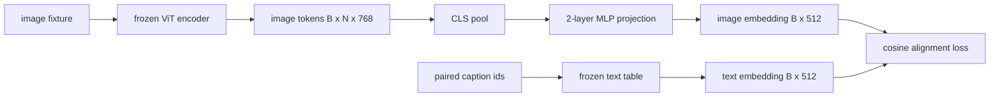

# 用模态对齐的投影层

> 视觉编码器生成图像代币――文本解码器消耗文本代币――两者生活在不同的向量空间中――一个小型的双层MLP将图像代币投影到文本嵌入空间中,并针对配对标题的余弦对齐损失使两个空间保持一致――这个投影是视觉语言模型中最小的部分,也是迁移最重要的部分――

**Type:** Build
**Languages:** Python
**Prerequisites:** 第19期第30-37课（B轨基础）
**Time:** ~90 分钟

## 学习目标

- 构建一个两层MLP投影,将图像特征映射到文本嵌入空间.
- 构建一个模拟文本嵌入表,没有预训练的分词器,没有真正的语料库.
- 计算投影图像代币和配对标题嵌入之间的余弦对齐损失──
- 使用结视觉编码器和结文本表单独训练投影.

## 问题

您有一个视觉编码器 (第58-59课),可生成维度`vision_hidden = 768`你有一个文本解码器,你想将嵌入尺寸固定在`text_hidden = 512`图像代码不是文字形的:它们存在于编码器在视觉预训期间学习的基础上,与解码器的词量没有关系.

两层MLP 投影 (线性、GELU、线性) 弥补了这一差距――它足够小了(大约`768 * 1024 + 1024 * 512 = 1.3M`参数),可以在几分钟内在单个GPU上进行训练,并且它是唯一需要在齐阶段学习的部分.视觉编码器保持结状态.文本嵌入表保持结状态.只有投影在移动.这是LLaVA在2023年推出的配方,BLIP-2将重建为Q-Former,此后每个开放重量的VLM都以某种形式采用.

## 概念



### 投影前池化

视觉编码器发行 197个代币――文本侧有单个标题级嵌入式――为了结合它们,每个样本需要一个图像级向量――CLS 池化是最简单的:从编码器中获取第一个代币并对其进行投影――对所有 197个代币进行平均池也是另一种选择,也是SigLIP使用的方法――要么将 197个向量合并为一个――

### 为什么是两层而不是一层

单线性投影可以旋转和重新缩小,但如果两个空间曲率不匹配,则无法固定基础. 两线性层之间的 GELU 为投影提供了一个非线性曲线,这在经验中足以将 CLIP 风格的特征和语言模型嵌入齐齐. 更深层次的投影 (LVA-NeXT 使用 GLU;Qwen-VL 使用一堆注意力层) 是扩展; 两层 MLP 是规范基线,也是 BLIP-2 的 Q-Former 投影头带的内容.

|层|形状|参数|
|-------|-------|------------|
| FC1 | `(vision_hidden, projection_hidden)` | `768 * 1024 + 1024` |
|激活|格鲁| 0 |
| FC2 | `(projection_hidden, text_hidden)` | `1024 * 512 + 512` |

一个`768 -> 1024 -> 512`头大约有1.3M个参数.

### 余弦对齐损失

没有什么意思`image_emb == text_emb`对齐意味着`image_emb`在关节空间中与`text_emb`指向同一个方向.`1 - cos_sim(image, text)`课程将其推向每对为零. 第62 课程概括为对比批次 (InfoNCE),其中每个图像必须比批次中的任何其他标题更接近自己的标题;本课程使用每对版本,因此动态可见.

### 结编码器是门

视觉编码器有86M参数――文本表还有几百万个――从模拟语料库中训练所有这些人是不可能的――结论两者意味着投影的1.3M参数是唯一的变化,并对合成的几百步就足以降低损失――这正是每个基于适应器的VLM的操作形状:重型部件保持结局状态,轻型桥梁列车――


```figure
ch-projection-bridge
```

## 构建它

`code/main.py`实现:

- `MLPProjector(in_dim, hidden_dim, out_dim)`具有性 激活的两层线性MLP.
- `MockTextEmbedding(vocab_size, dim)`具有来自种子的确定性初始化.
- `make_pair(seed, vocab_size)`标题是短 id 序列;标题嵌入是对代币嵌入进行平均值池化.
- `cosine_alignment_loss(image_emb, text_emb)`对于每个人`1 - cos_sim`镜子
- 一个训练循环,在32个合成对应的循环中运行了200个步骤的投影,视频编码器和文本表结,并每25个步骤打印一次损失.

运行它:

```bash
python3 code/main.py
```

输出:训练报告在200步内从初始损失约1.07下降到约0.80,表明仅靠投影就可以将图像标记拉向文本空间――再打印每对的最终余弦相似度――

## 使用它

每个开放权重VLM都会出现相同的模式:

- **LLaVA 1.5.**从Clip-ViT-L 隐藏到LLaMA 嵌入在我的两层 GELU MLP 投影──结视觉编码器,结LLM,仅训练投影然后在第二阶段解LLM)──
- **BLIP-2.**通过针对图像代币的交叉关注获取32个学习查询代币,然后投投到LLM 嵌入式.
- **MiniGPT-4.**从BLIP-2 Q-Former 输出到Vicuna 嵌入式单线性投影.
- **Qwen-VL.**具有多层的交叉注意力适配器,但最后一个块仍然是到LM 嵌入式投影.

形状不同,但作用是相同的:池图像代币、投影到文本嵌入式、单独训练──

## 测试

`code/test_main.py`涵盖:

- 投影仪输出形状与配置`out_dim`匹配
- 结文本嵌入表的`requires_grad`参数为零
- 余弦损失在相同向量上为零,在反平行向量上为2
- 一次向后传递后投影仪梯度流动
- 训练循环减少了步骤0和步骤200之间的损失

运行它们:

```bash
python3 -m unittest code/test_main.py
```

## 练习

1. 将CLS池化替换为196个补丁代币,并比较200步后的最终损失.平均池化通常在合成数据上训练得更快;CLS在自然图像上样本效率更高.

2. 习惯的标量温度增加到余弦损失 (`cos / tau`) 中,并观察当`tau`太小了,太大了,太大了,太大了,太大了.

3. 换成单线性层并量化损失差距.

4. 在投影仪权重上添加一个小的L2 惩罚,并观察它如何与余弦对齐交互.

5. 保存投影仪权重,然后重新加载并运行推理,无需视频编码器向后传输,仅需要投影仪在部署时验证.

## 关键术语

|术语 |这意味着什么 |
|------|---------------|
|模态对齐 |使图像和文本嵌入在一个共享空间中具有可比性的行为 |
|投影头|将一个空间映射到另一个空间的小模块，通常是 2 层 MLP |
|余弦相似度 |点积除以 L2 范数的乘积 |
|冻结编码器|视觉（或文本）模型的所有参数均带有 `requires_grad=False` |
|模拟语料库|使用合成对，因此训练不依赖于数据集下载 |

## 进一步阅读

- 根据LLaVA论文的两阶段训练,然后解LM)
- 作为可学习的投影替代方案.
- 技术报告将交叉注意力适配器使用作更深入的投影头.
