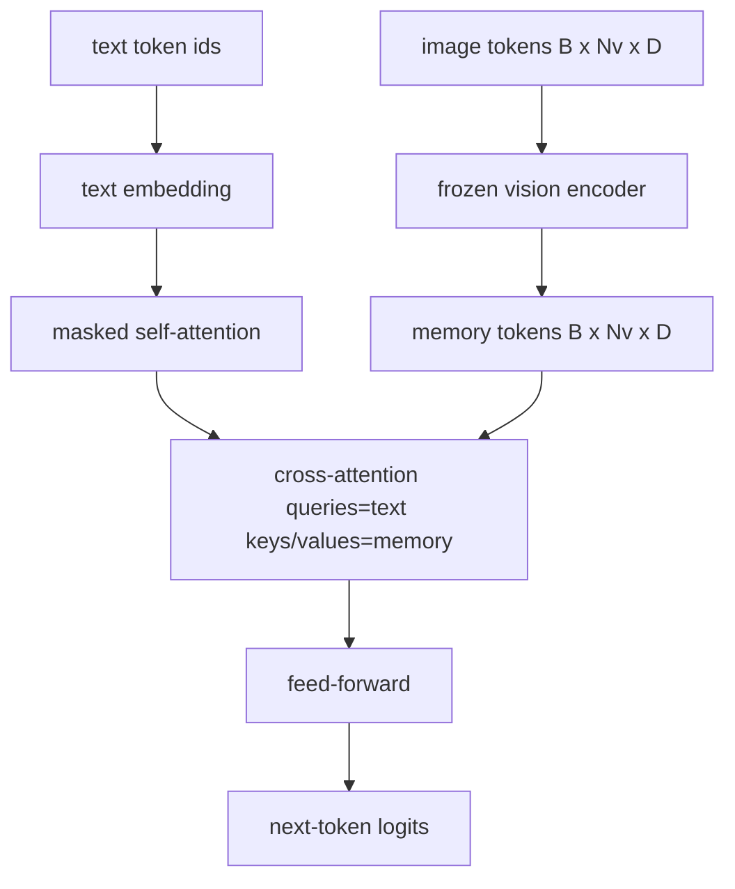
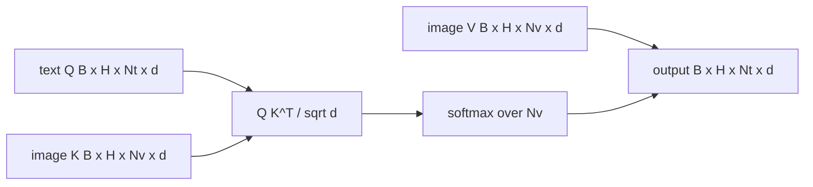

# 交叉注意力融合

> 投影层将一个图像向量与一个标题向量对齐.真正的视觉语言解码器需要每个文本代码都参与每个补丁代码,因此模型可以将每个单词放在一个区域中.交叉注意力就是这种接地发生的方式.文字查询;视觉关键和价值观给出答案.本课程构建交叉注意力块,因果文本自注意力以及保持两者合法的掩盖形状.

**Type:** Build
**Languages:** Python
**Prerequisites:** 第19期第30-37课（B轨基础）
**Time:** ~90 分钟

## 学习目标

- 实现多头交叉注意力,其中查询流是文本,键/值流是视觉.
- 组成解码器块:因果自注意力+交叉注意力+前──
- 获得正确的隐藏模拟:用于自注意的因果隐藏模拟,用于交叉注意力的无隐藏模拟.
- 使用批量文本代币和固定图像代币池运行前向传递。

## 问题

将图像代币和文本代币连接成一个序列是一种融合选项 (早期融合,Chameleon 和 Emu3 采用的路径) ――交叉注意力是另一个 (后期融合,Flamingo 引入的路径以及后期每个Flamingo 型解码器都复制的路径) ――在后期融合中,文本解码器在纯文本代币上运行,并通过每个层的交叉关注延伸到图像流程.

后期融合有两个优点――首先,文本流保持干净,模型保留纯文本功能――第二,图像流对每个图像计算一次,并在每个解码步骤中重复使用,因此即使对长标题,生成也很便宜――成本是每个块一个额外的注意力层――

## 概念





### 面具形状

解码器块内两个注意力需要不同的掩码:

|注意|查询长度 |密钥长度|面膜|为什么 |
|-----------|--------------|------------|------|-----|
|自我关注 | `Nt`（文本）| `Nt`（文本）|因果：下三角 `(Nt, Nt)` |自回归期间文本token可能不会向前看 |
|交叉注意力| `Nt`（文本）| `Nv`（愿景）|没有口罩|整个图像对每个文本位置都是可见的 |

本课程包括一个形状验证函数,因此将它们混合在一起.`ValueError`没有什么错误,而不是沉默破坏的损失曲线.

### 为什么交叉注意力没有掩盖模

在生成任何文本之前,先充分观察图像.`t`某些弗拉明戈变体在交错多个图像和文本段时添加每个样本的掩盖模式,但对于单个图像加上标题,交叉注意力可以看到一切.

### 键/值缓存

图像键和值在解码开始时计算一次并保持存储中――每个新文本代码都使用存储而无需重新计算――这就是推理时字幕快速运行的原因:重型ViT运行一次;交叉注意力在每一步中重复使用其键和值――本课程公开存储并测试存储中运行路径――

### 块组成

解码器块运行:预 LN -> 自注意力 -> 残差 -> 预 LN -> 交叉注意力 -> 残差 -> 预 LN -> 前 -> 残差──三个子层,每个子层都有自己的层Norm。 弗拉明戈论文添加了一个关于交叉注意力的学习门,因此模型可以在训练时稳定性以代价选择退出图像路径;规范基线(此处使用) 没有门──

```python
class DecoderBlock:
  def forward(self, text_tokens, image_tokens, text_mask, cross_mask):
      text_tokens = text_tokens + self.self_attn(self.ln1(text_tokens),
                                                 mask=text_mask)
      text_tokens = text_tokens + self.cross_attn(self.ln2(text_tokens),
                                                  image_tokens,
                                                  mask=cross_mask)
      text_tokens = text_tokens + self.ffn(self.ln3(text_tokens))
      return text_tokens
```


```figure
ch-crossattn-fan
```

## 构建它

`code/main.py`实现:

- `CrossAttention(hidden, heads)`具有单独的`q`和 `kv`投影的多头交叉注意力
- `CausalSelfAttention(hidden, heads)`通过标准解码器的屏蔽自注意力.
- `DecoderBlock`其他部分组成三个层.
- `VisionLanguageDecoder`通过模拟视觉编码器输出和小型文本嵌入表提供四层解码器.
- `causal_mask(length)`返回`(length, length)`现在,我们要做什么?
- 一个演示,它向一个长度为10的两个文本序列提供长度为197的图像内存,并打印出输出形状"",自注意隐藏形状和每个位置的交叉注意输出范数".""

运行它:

```bash
python3 code/main.py
```

输出:解码器产生 `(2, 10, text_vocab)`张量――面罩形状为`(10, 10)`△ KV 缓存重用检查确认缓存和未缓存路径之间的相同逻辑。

## 使用它

交叉注意力出现在两个生产系列中:

- **Flamingo 和 IDEFICS。**每个K个语言模型块插入一个交叉注意力层,并使用结结的LM──视觉语言适配器是交叉注意力块及其门──
- **BLIP-2.**问:前使用来自一组固定的32个查询代码的交叉注意力到图像特征中,然后将查询投影到LM嵌入空间中.

本课程中的块的形状直接映射到两者.

## 测试

`code/test_main.py`涵盖:

- 因果掩码是下三角的并与预期的布尔形状匹配
- 无论密钥长度如何,交叉注意力输出形状都是`(B, Nt, hidden)`
- 缓存路径与未缓存路径相匹配浮动容量差异
- 文本和图像流之间的形状不匹配引发了明显的`ValueError`
- 完整的解码器前向传递产生正确的批次和序列形状

运行它们:

```bash
python3 -m unittest code/test_main.py
```

## 练习

1. 将学习的门 门添加到交叉注意残差(Flamingo 技巧),并验证训练从接近零的初始门收──门从0开始;该模型在混合图像流之前恢复纯文本行为──

2. 实现交错注意力,其中同一解码器耗费多个图像和多个文本段.

3. 在`Nt=64, Nv=576`分析交叉注意力与自动注意力层――交叉注意力成本为`Nt * Nv`图像分辨率高的占据主导地位.

4. 在交叉注意力图上添加查询端落地,并测量演示中的标题多样性(标题样本方差与交叉图中的落地增加增加)

5. 将交叉注意力层替换为Q-Former风格的注意力块,其中确定的32个标记查询池每个层关注一个图像特征──

## 关键术语

|术语 |这意味着什么 |
|------|---------------|
|后期融合|文本和视觉位于不同的流中；交叉注意力在每个区块上架起了桥梁|
|交叉注意力| Q 来自一个流，K 和 V 来自另一个流 |
|因果面具|下三角布尔掩码，可防止在自回归过程中向前看 |
| KV缓存|图像键和值存储一次并在每个解码步骤中重复使用 |
|记忆token|解码器进入的冻结图像token |

## 进一步阅读

- 佛兰哥 (2022) 用以具有门控交叉注意力的规范后期融合设计.
- 问:前的BLIP-2 (2023),它是一个装扮成学习查询池的交叉注意力块.
- 果版 (2023) 用于果版的开放重量复制品
