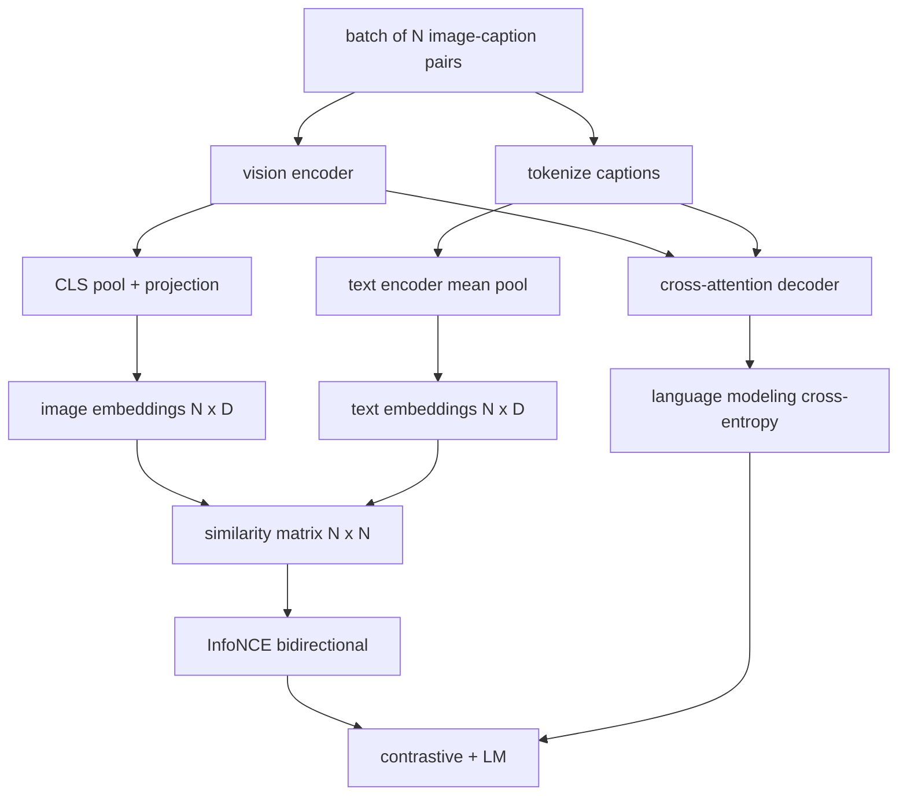

# 视觉语言预训练

> 编码器、投影和编码器已接线了──现在一起训练他们──两个目标驱动学习:对比图像文本损失(InfoNCE),将匹配在联合嵌入空间中拉拉到一起,以及语言建模损失,要求解码器为每个图像添加标题──结合起来,它们教会网络找到合适的图像作为标题并为图像编写标题──

**Type:** Build
**Languages:** Python
**Prerequisites:** 第19期第30-37课（B轨基础）
**Time:** ~90 分钟

## 学习目标

- 在一批图像标题中实现InfoNCE对比损失.
- 比损失与自归语言的组合
- 合成 200 对模拟图像字幕语料库,无需下载真正的数据集.
- 运行 50 步演示训练循环并观察损失的减少.

## 问题

视觉语言模型需要两种技能――它必须排名:给定标题,在众多图像中找到正确的图像――它必须生成:给定一个图像,写一个标题――只针对一个技能对模型进行预训就可以得到半系统――CLIP确定排名,但无法提供字幕――GPT-4V可以添加字幕,但使用单独的检索头进行排名――多个目标预训一次即可实现这两个目标――

对于一批N对,模型将N 匹配视为正例,将`N^2 - N`没有相匹配的视为负例,然后对生成的`(N, N)`相似度矩阵运行交叉损失――LM 损失处理产生的一半:以图像为条件的标准下一个代币预测――两种损失都是微分的,并且可以共享编码器、投影仪和编码器权重――

## 概念



### 关于"新浪"的信息

将N个图像嵌入堆叠为行,将N个文本嵌入堆叠为行.`N x N`矩阵`S = I T^T / tau`在其中`tau`是学习温度.对角线条目是匹配对;非对角线条目是负数.应用交叉,目标 `argmax`沿对角线运行:行 `i`应该在列表中`i`中具有最高条目──沿列对称地执行相同操作──总数是两者的平均值──这是八行中的CLIP损失──

### 温度很重要

温度`tau`控制软max的峰值程度──太小`tau = 0.01`梯度仅来自最难的负值,训练有噪音,太大,软max 会变平,梯度消失.`tau`作为参数,这里演示也做了同样的事情.

### 语言建模损失

解码器通过交叉注意力消耗图像内存代币,并预测每个位置的下一个文本代币. 损失与下一个位置目标的标准交叉──填充位置被隐藏在损失之外.

### 合并损失

`total = contrastive + lm_weight * lm`在其中`lm_weight`是标量 (通常为1.0);;这两个损失共享编码器和投影的梯度;只有解码器接收LM 损失梯度――这是CoCa、BLIP和SigLIP类型模型都使用的多任务配方,具有不同的权重――

|组件|损失面|影响|
|-----------|--------------|---------|
|信息NCE |联合空间中的配对排名 |编码器+投影+文字头|
| LM |以图像为条件的 token预测 |编码器+投影+解码器 |
|合并|多任务 |全栈|

### 为什么50步足够的演示?

模拟语料库是一个合成的200个组件,包含随机图像和随机标题ID. 在批量大小为16个50个 SGD 步骤后,即使绝对值保持在实际数据模型可以达到的水平上,两种损失也会显著下降.演示的目的是确认梯度管道端到端地工作,并增加LM 损失不会破坏对目标的稳定性.


```figure
ch-infonce-diagonal
```

## 构建它

`code/main.py`实现:

- `MultimodalModel`结合一个小型的VIT编码器、MLP投影仪、一个小型的文本侧编码器(嵌入式 id 上的平均值池) 以及第61课中的交叉注意解码器──
- `info_nce_loss(image_emb, text_emb, temperature)`双向CIP 式对比损失
- `lm_loss(logits, target_ids, padding_id)`屏蔽的下一个代码交叉.
- `make_mock_corpus(seed, n_pairs)`返回 200 个确定性图像 标题 标题 标题 标题 标题 标题 标题 标题 标题 标题 标题 标题 标题 标题 标题 标题 标题 标题 标题 标题 标题 标题 标题 标题 标题 标题 标题 标题 标题 标题 标题 标题 标题 标题 标题 标题 标题 标题 标题 标题 标题 标题 标题 标题 标题 标题 标题 标题 标题 标题 标题 标题 标题 标题 标题 标题 标题 标题 标题 标题 标题 标题 标题 标题 标题 标题 标题 标题 标题 标题 标题 标题 标题
- 训练循环运行50个步骤,批量大小为16个,亚当 优化器和学习对数温参数.

运行它:

```bash
python3 code/main.py
```

输出:对比损失大约`ln(16) = 2.77`降至2.4; 损失从`ln(512) ≈ 6.24`随机平均基线下降到4.7左右. 两次下降都证明了连接的梯度正确.

## 使用它

这就是同样的损失配方:

- **CLIP (2021)。**仅图像-文本对比,具有单独的编码器字幕探针.
- **CoCa (2022).**图像标题的图像图文与图像标题的图像图像的图像图像图像图像图像图像图像图像图像图像图像图像图像图像图像图像图像图像图像图像图像图像图像图像图像图像图像图像图像图像图像图像图像图像图像图像图像图像图像图像图像图像图像图像图像图像图像图像图像图像图像图像图像图像图像图像图像图像图像图像图像图像图像图像图像图像图像图像图像图像图像图像图像图像图像图像图像图像图像图像图像图像图像图像图像图像图像图像图像图像图像图像图像图像图像图像图像图像图像图像图像图像图像图像图像图图图图图图图图图图图图图图图图图图图图图图图图图图图图图图图图图图图图图图图图图图图图图图图图图图图图图图图图图图图图图图图图图图图图图图图图图图图图图图图图图图图图图图图图图图图图图图图图图图图图图图图图图图图图图图图图图图图图图图图图图图图图图图图图图图图图图图图图图图图图图图图图图图图图图图图图图图图图图图图图图图图图图图图图图图图图图图图图图图图图图图图图图图图图图图图图图图图图图图图图图图图图图图图图图图图图图图图图图图图图图图图图图图图图图图图图图图图图图图图图图图图图图图图图图图图图图图图图图图图图图图图图图图图图图图图图图图图图图图图
- **BLIP (2022) 和 BLIP-2.**对于加 LM 加图文匹配头.
- **SigLIP (2023).**将InfoNCE转换为sigmoid对损失;相同对比作用,不同的功能形式.
- **LLaVA 系列。**两阶段的训练,其中第一阶段是对齐 (结 LM 上余弦),第二阶段使用未结 LM 添加 LM 损失.

## 测试

`code/test_main.py`涵盖:

- 信息NCE 损失在图像/文本行之间是对称的
- 当相似度矩阵是大正数的完美对角线时,InfoNCE 损失返回0
- 损正确掩盖了填充位置
- 模型前向传递产生两种损失,没有错误
- 五步训练循环减少组合损失

运行它们:

```bash
python3 -m unittest code/test_main.py
```

## 练习

1. 将InfoNCE 换成SigLIP风格的损失标识,并模拟语料库上比较收收藏性.

2.加重硬负挖掘步骤:每批,从前一批中选择最难的非对角对并将其添加.

3. 在联合嵌入的顶部添加图像文本匹配的二进制头 (真/假:这些匹配吗?)作为第三损失,复制BLIP的三头设置.

4. 模拟语料库将被从马尔科夫链中提取的标题ID序列,该马尔科夫链的转换矩阵以图像哈希为条件.

5. 使用 `lm_weight = 0`训练相同的模型,然后使用`lm_weight = 1`排名目标: 排名目标: 排名目标: 排名目标: 排名目标: 排名目标: 排名目标: 排名目标: 排名目标: 排名目标: 排名目标: 排名目标: 排名目标: 排名目标: 排名目标: 排名目标: 排名目标: 排名目标: 排名目标: 排名目标: 排名目标: 排名目标: 排名目标: 排名目标: 排名目标: 排名目标: 排名目标: 排名目标: 排名目标: 排名目标: 排名目标: 排名目标: 排名目标: 排名目标: 排名目标: 排名

## 关键术语

|术语 |这意味着什么 |
|------|---------------|
|信息NCE |噪声对比估计：相似度矩阵上的交叉熵 |
|温度|控制对比 softmax 的峰值程度的标量 |
|硬阴性|模型发现的非对角线对令人困惑，但对于采样很有用 |
| LM 损失 |字幕侧的标准下一个token交叉熵 |
|联合嵌入空间|投影后图像和文本向量所在的共享空间 |

## 进一步阅读

- 用于原始的配方纸.
- 纸,用于模型中对字幕进行比较.
- 标志性论文介绍了标志性变体损失及其扩展性更好的原因.
