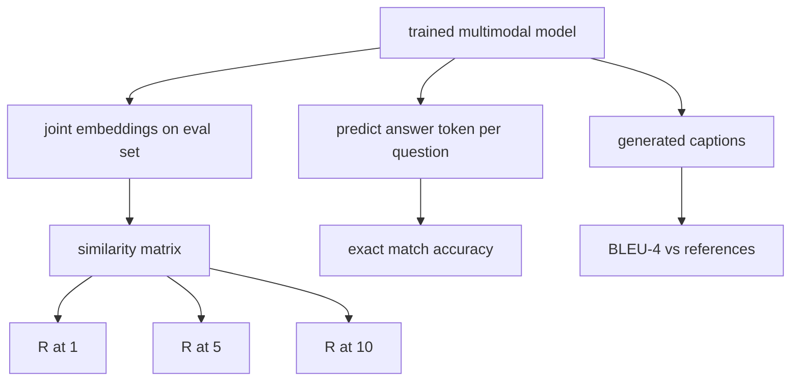

# 多模态评估

> 培训是循环的一半――另一半是测量――本课程从基元构建三个评估表面:图像标题检索报告为R@1、R@5、R@10;视觉问答报告为精确匹配准确性;图像字幕报告为BLEU-4──每个指标都是模型输出函数和运行在几秒内的综合评估套件──

**Type:** Build
**Languages:** Python
**Prerequisites:** 第19期第58-62课（Track E基础：编码器、Transformer、投影、交叉注意力融合、预训练）
**Time:** ~90 分钟

## 学习目标

- 根据图像和标题嵌入之间的相似性矩阵计算 Recall@K。
- 根据将将(图像、问题) 对映射到固定答案词汇的模型计算精确匹配的VQA准确度.
- 从生成和参考代码序列计算 BLEU-4,无需任何外部库.
- 针对构建第62课训练模型的综合套件运行所有三个评估.

## 问题

当训练损失趋于稳定时,我们很可能会宣布多模态模型已经完成了.训练损失量度适合训练分布;它不能衡量模型是否可以对保留批量进行排名,回答问题或编写人类接受的标题.

- **检索（R@1，R@5，R@10）。**为查询标题构建联合嵌入;按余弦对评估池中的每个图像进行排名;报告匹配图像是否位于前 1、前 5、前 10 名──对称(图像到文本) 形式的运行方式相同──
- **视觉问答（完全匹配）。**给定(图像,问题),模型输出一个答案标志――精确匹配是每个样本的一个:预测答案是否等于参考答案?评估集的平均值――
- **字幕 (BLEU-4)。**生成字幕──根据参考标题计算1克到4克精度的几何平均值,并牺牲简洁性──多重参考是标准形式(一张图像,多个参考标题)──

每个测量都是一个薄函数. 本课程将全部用代码构建,因此数学是具体的,并且表面仍然在您的控制下.

## 概念



### 从相似度矩阵中调用@K

构建图像和标题嵌入之间的`(N, N)`余弦相似度矩阵――对每一行,按相似度降低序列进行排序――Remall@K是对角列索引位于前K个位置内的行分数――对角列索引的对角列分数――对象式回忆@K(标题到图像) 是转置矩阵计算的――这些两个数字均已报告――对N=100的评估,R@1 =0.6意味着100个字幕中60个检索到了正确的图像作为最佳匹配――

### 精确匹配

对于每个图像,问题,答案),对图像进行编码,嵌入问题,通过解码器融合,并读出下一个代码.将预测的代码 id 与参考 id 进行比较.如果相等是正确的,则对评估集的平均值.

### 蓝色-4

```text
BLEU-4 = BP * exp(mean(log p1, log p2, log p3, log p4))
```

其中`p_n`是修改后的 n 元语法精度 ((现在任何参考文献中出现的 n 元语法剪切计数,除以生成的 n 元语法总数),`BP`是简洁性惩罚:

```text
BP = 1                if generated length > reference length
   = exp(1 - r/g)     otherwise, where r is reference length and g is generated
```

对于一些人`p_n`为了零的小样本,需要进行平滑. 实现使用陈和桃的方法 1(对于任何零计数,分子和分母加 1),这是低计数制度最安全的默认值.

### 综合评估套件

一个50个样本的评估套件是根据第62课中使用的相同模拟语料库模式在内存中构建的,并带有保留的种子.

- `pairs`图像,标题_id) 对用于检索
- `vqa`图像,问题,答案,答案,答案,答案,答案,答案,答案,答案,答案,答案,答案,答案,答案,答案,答案,答案,答案,答案,答案,答案,答案,答案,答案,答案,答案,答案,答案,答案,答案,答案,答案,答案,答案,答案,答案,答案,答案,答案,答案,答案,答案,答案,答案,答案,答案,答案,答案,答案,答案,答案,答案,答案,答案,答案,答案,答案,答案,答案,答案
- `caps`条目,每个图像最多3个引用.

套件从种子中确定并保留在训练语料库中,因此标标志是根据模型从未见过的数据计算的.

|指标|范围 |随机基线 (N=50) |
|--------|-------|------------------------|
| R@1 | 0 到 1 | 0.02（1/N）|
| R@5 | 0 到 1 | 0.10 |
| R@10 | 0 到 1 | 0.20 |
| VQA EM | 0 到 1 | 1 / 词汇 |
| BLEU-4 | 0 到 1 |小但非零 |

对于在合成数据上运行的50步训练,预测指标不会很高;它们预测高于随机基线,这是演示检查的内容.


```figure
ch-recall-window
```

## 构建它

`code/main.py`实现:

- `recall_at_k(sim_matrix, k)`两条路上回来`[0, 1]`中的浮点数.
- `vqa_exact_match(predictions, references)`返回`int`相等的平均值.
- `bleu4(generated, references, smoothing=True)`具有多种参考支持.
- `build_eval_suite(seed, n_samples, vocab_size, max_len)`返回三确定性评估列表
- `evaluate(model, suite)`运行所有三个指标并返回`dict`字数:
- 一个演示,加载第62课中新开始的多模态模型,对其进行评估,然后对其进行50步骤的训练并再次评估,印制前/后的指标.

运行它:

```bash
python3 code/main.py
```

输出:之前/后的测量表显示检索从近随机到模型学习信号的改进,VQA 改进高于随机,BLEU-4 改进(合成结构足以实现4克精度提升) ⋅

## 使用它

每个指标都直接映射到生产基准:

- **检索。**图像网 零样本都是同一相似性矩阵上的R@K 问题――将合成 eval 替换为真文件,函数签名保持不变――
- **VQA。** VQA v2、GQA、OK-VQA 使用相同的精确匹配形状,使用软 acc 而不是 VQA v2 的单个答案 EM) 
- **BLEU-4.**字幕,NoCaps,Flickr30K字幕均使用BLEU-4加 CIDER 和 METEOR──加 CIDER 是另一项功能──

对于真正的基准测试,请将`build_eval_suite`替换为真正的加载程序并保留函数体──数学与基准无关──

## 测试

`code/test_main.py`涵盖:

返回 1.0 在翻转矩阵上返回 0.0 ((k < N)
-回忆@k 尊重 `k <= N`上限
- 当生成的蓝色4 完全等于引用之一时,返回1.0.
- 蓝色4 在不相交词汇上返回 0.0
- 精确匹配等于相等对分数
- 返回预期对数、vqa 项和标题条例数

运行它们:

```bash
python3 -m unittest code/test_main.py
```

## 练习

1. 将CIDER 添加到字幕标志中. CIDER 在 n-gram 上使用TF-IDF加权,这将奖励信息丰富的标志.

2. 实施软精度VQA:每一个问题都有多个个人工业答案,如果有匹配,精度为`min(human_count / 3, 1)`◎复制 VQA v2──

3. 添加`bleu4`无的安全变体,可处理空空的生成序列不会崩.

4. 与R@K 一起计算平均倒数排名 (MRR) ⋅MRR对正确项目落在K的顶部之外的位置非常敏感;R@K对是否落在前 K 非常敏感──

5. 在训练期间,五个检查点对模型运行评估,并绘制学习曲线.

## 关键术语

|术语 |这意味着什么 |
|------|---------------|
| R@K |正确匹配出现在前 K 个结果中的查询比例 |
|精确匹配 |最简单的VQA评分：预测答案等于参考|
| BLEU-4 | 1 到 4 克精度的几何平均值，带有简洁性代价 |
|多参考|字幕指标接受每个图像的多个参考字幕 |
|保留 |评估集是从与训练语料库不相交的种子中采样的 |

## 进一步阅读

- 基于软精度公式和数据集统计的VQA v2论文.
- 用于TF-IDF加权 n-gram 字幕的CIDEr论文
- 蓝色原始版本 ((Papineni 等人,2002) 用于平滑变体.
- 根据规范参考实现的MS-COCO字幕评估脚本.
