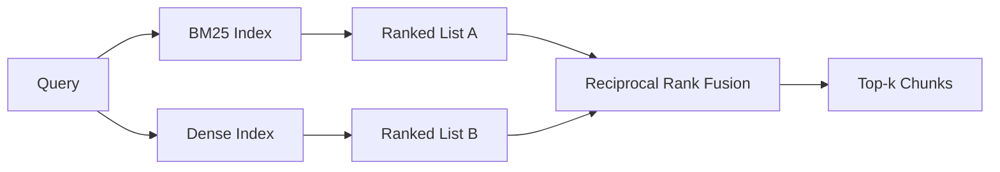

# 密集嵌入式混合检查

> 词汇和语义检索在相反的查询分布上失败了.

**Type:** Build
**Languages:** Python
**Prerequisites:** 第 11 阶段课程 04（嵌入）、06（RAG）；第 19 阶段 Track B 基础（第 20-29 课）；第 19 阶段第 64 课（分块策略）
**Time:** ~90 分钟

## 学习目标
- 根据罗伯逊和斯帕克·斯的公式,从头开始实施BM25,具有字段加权,文档长度标准化以及可调节 k1 和 b.
- 在确定性模拟嵌入上构建密集检查器,以便循环离线运行.
- 完全按照科尔麦克·克拉克和布埃特切尔在2009年发表的实现倒数等级融合,并解释为什么它占据了分数加权插值中的主导地位.
- 调整RRF k 常数和每种模态权重,并在小小的固定语料库上读取权衡──

## 问题

当查询带语料库逐字含有文字标识符时,词法搜索获胜.对`AbortMultipartOnFail`通过BM25以微秒的速度返回正确的Go函数. 嵌入式相同的查询位于三个相似性的边界,密集查询器将错误文件排名第一.

当查询被解释为远离语料库的文字代码时,密集搜索就会获胜.用户询问我们如何处理取消的上传时从未输入过堕胎或多部分一词. BM25 返回上传大文件的文档块,因为该页面包含单词上传.

两者之间的选择并不是一成不变的.查询分布是变量.生产RAG系统从同一端处理这两个类,因此查询必须同时处理这两个类.

## 概念



###         

通过查询文档求和,将逆文档频率因子乘以包含长度归结校正的和术语频率因子,对查询文档进行评分.`k1`控制词频和度;默认值1.5 是已发布的建议,你不应该在没有基准的情况下移动它.`b`控制文档长度的重要性;默认值0.75 表示较长文档会受到惩罚,但不是线性.

据报道,这项计划将在中国的军事发展中得到广泛的支持.`log((N - df + 0.5) / (df + 0.5) + 1)`,当某种术语出现超过一半的语料库中时,日志中的加一会使 IDF 保持正值.

字段加权可让你告诉 BM25,符号名称上的匹配比正文中的匹配更重要. 实施是索引过程中的术语计数的乘数,而不是评分时的术语计数.

### 一段中的密集检索

使用嵌入模型将每个块嵌入固定维度向量中. 在查询时,嵌入查询,根据相似性对每个块进行余弦排序,并返回前 k 个.模型是决定质量的变量.检索算法本身就是两行:点积和排序.

本课程使用基于哈希的确定性嵌入,因此您无需网络调用即可阅读融合数学.

### 倒数秩融合,已公布的公式

两排名榜――对于每位出现在任一排名榜中的候选人,将其倒数排名贡献相加―― 2009年论文使用`1 / (k + rank)`按总分排序,这是整个算法.

公布的常数 k = 60 不是任意的. 当 k = 60 时,排名 1 的贡献是 1/61,排名 10 的贡献是 1/70 ⋅ 贡献衰退缓慢,因此深度候选人仍然投票.较小的 k 使顶部结果占主导地位.

我们实现的两个可调整的实现.`k`常数――对每种模块的权重,这样当你有预先证据表明其中一个在你的语料库上更好时,你可以提高BM25或密度――将排名贡献乘以权重是最简单的原则实现;它保留了等级衰减形状并保持无标志性――

### 为什么融合优于分数加权插值

 BM25 分数不受限制,依赖语料库.余弦相似度在 -1 到 1 之间.`alpha * bm25 + (1 - alpha) * cosine`需要每一个语料库的阿尔法调整,并且每一次重新索引都会中断. 基于等级的融合则不一样. 两个等级在不同模式下具有可比性. 自2010年以来,已发布的RRF基线在每个公共TREC赛道上都击败了分数插值. 这与你在Vespa和Weaviate文档中听到的RankFusion和RRF论点相同. 他们得出相同的结论:除非你有非常强大的证据插入,否则保持基于排名.


```figure
rrf-fusion
```

## 构建它

`code/main.py`实现:

- `tokenize(text)`- 快速正则表达式标志器――
- `BM25Index`- 场加权,带有`add`和 `search`并且可调节.
- `mock_embed`,我知道.`DenseIndex`- 与第64课程相同的确定性嵌入,因此块具有可比性.
- `rrf(rankings, k, weights)`- 已发布多模态权重融合――
- `HybridRetriever`- 结合了BM25和密集.
- 一个演示`main()`运行三个专门展示各检查器优缺点的查询,并打印每个模态生成排名以及融合列表.

运行它:

```bash
python3 code/main.py
```

并排读演示输出──文字标识符查询位于BM25 排名 1、密集排名 4、RRF 排名 1──释义查询位于BM25 排名 6、密集排名 1、RRF 排名 1──模糊查询位于BM25 排名 3、密集排名 3、RRF 排名 1──它在每个查询类别上都是胜利的系统──

## 调整旋

|旋钮|默认|何时调高|何时调低|
|------|---------|----------------|------------------|
| BM25 k1 | 1.5 |文档中的术语会重复，且你希望频率更重要 |文档很短，术语重复主要是噪音 |
| BM25 b | 0.75 |长文档确实每个词携带的信息更少 |文档长度与主题无关 |
| RRF k | 60 |较深排名的候选仍应投票 |Top-1 应该占主导 |
| BM25 weight | 1.0 |语料库包含字面标识符，查询也按字面匹配 |查询多为用户改写 |
| Dense weight | 1.0 |查询多为改写或语义表达 |查询多为字面表达 |

通过在保留的查询集中重新运行第68课程的评估工具来调整,而不是直觉.

## 演示将隐藏故障模式

**词汇外token。**根据语料库计算的BM25的IDF,因此仅仅在查询中的术语贡献为零.密集嵌入会产生相同的量量化幻觉.对于语料库外标识符,密集模态回归看起来像合理但错误的邻居.

**停止token统治。**针对单词在语料库中产生统一排名──在索引中停止代币或接受高 IDF 术语自然占主导地位──

**跨模态的内容相同。**如果你的语料库足够小,到BM25的顶级-1也是密集的顶级-1,RRF会为你提供相同的邻居的相同的顶级-1――这是正确的行为,而不是失败,但它使融合看起来不可见.

## 使用它

生产模式:

- 索引BM25 正在处理中;瓶是词频字典,而不是向量──
- 在单独存储中索引密集向量 (在本课中我们使用平面列表;在生产中你将使用HNSW) ⋅
- 并行运行两个查询;融合是对并集的恒定时间合并.
- 保持每个检查的命中模式,以便下游重新排名者可以看到哪种模式支持它.

## 发货

第66课采用本课中的融合顶-k 并使用交叉编码器重新排名. 第68课使用精度,召回率,MRR和nDCG 评估整个流程. 本课中的混合检查器是第69课中端到端系统的第一阶段.

## 练习

1. 将`mock_embed`替换为供应商提供的真实模型――重新运行演示并报告
2. 添加第三种模式:单独索引的块摘要并融合为第三排名列表.
3. 将RRF k 扫过10、30、60、100、200──绘制第68课中的回忆@k曲线──报告语料库中曲线峰值处的 k 值──
4. 正确实现BM25F (每段长度标准化而不是乘数技巧) 并对符号匹配最重要的语料库进行比较.

## 关键术语

|术语 |人们怎么说|它实际上意味着什么 |
|------|-----------------|------------------------|
| BM25 | “词汇搜索” | idf x 饱和 tf x 长度归一化的概率排名 |
|参考文献 | “等级融合”|各个排名列表的 1 / (k + 排名) 之和； k = 60 默认 |
| k1 | “TF 饱和度” |控制重复术语停止添加更多分数的速度 |
|乙| “长度惩罚” | 0 表示忽略文档长度，1 表示完全标准化 |
|场加权 | “符号提升”|在索引期间重复token以增强该字段中的匹配|
|基于排名与基于分数的融合 | “为什么 RRF 优于线性”|不同模式下的排名具有可比性；分数不|

## 进一步阅读

- 科尔麦克·克拉克·布埃特切尔,倒数排名融合优于孔多塞和个人排名学习方法,SIGIR 2009
- 罗伯逊·沃克尔·贝奥利·盖特福德·佩恩·奥卡皮在TREC-3(原始BM25论文)
- [Vespa：使用 BM25 和 Embeddings](https://docs.vespa.ai/en/tutorials/hybrid-search.html)进行混合检查
- [Weaviate：混合搜索](https://weaviate.io/developers/weaviate/search/hybrid)
- 第11阶段 第06课 - RAG基础知识
- 第19阶段 第64课 - 分块器的输出在这里编制索引
- 第19阶段 第66课 - 消耗融合的顶级编码器重排器
