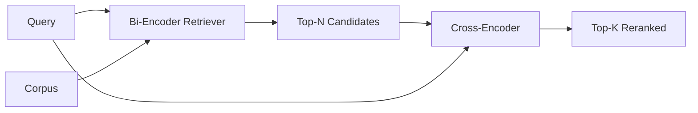

# 交叉编码器重排序

> 双编码器独立嵌入查询和文档.交叉编码器将它们连接起来并同时读取.交叉编码器是最聪明的阅读器,也是最慢的.

**Type:** Build
**Languages:** Python
**Prerequisites:** 第11期第06课（RAG）、第11期第07课（高级RAG）；第 19 阶段 Track B 基础（第 20-29 课）；第 19 阶段第 65 课（混合检索喂养此阶段）
**Time:** ~90 分钟

## 学习目标
- 通过输入形状,参数计数和每次查询, 形成了两种编码器检查器和跨编码器重排器的区别.
- 从一开始,它用了一个小型交叉编码器作为一个变压器块,它耗费了大量的查询,文件序列并发出了单个相关标志.
- 连接两阶段检索然后重新排序管道:使用廉价检索器检索前N,使用交叉编码器将N 重新排序为前K,返回K。
- 在小型固定语料库中衡量延迟与质量权衡,并针对给定的延迟预算选择正确的N──

## 问题

双编码器将查询和文档映射到相同的向量空间并按余弦排列. 这两种编码永远不会看到对方. 该模型必须将文档中的所有有用内容压缩到单个向量,而不考虑查询. 这是一个快速索引,每文档一次嵌入,查询一次嵌入,这是唯一的方法来排名语料库规模.

价格就是精度. 两个具有相同的整体主题的文件可以几乎具有相同的嵌入,即使其中一个回答了查询,另一个没有回答.

交叉编码器通过一起阅读查询和文件来解决这个问题.`[query] [SEP] [document]`作为单个序列,在整个连接中运行充分的注意力,并产生一个相关标志量――文件中的每个标志都可以参与查询的每个标志――模型根据完整的上下文来决定分数――

成本就是吞吐量. 双编码器嵌入一次并永久查询的情况下,交叉编码器每一次查询,文档) 运行一次.

解决方案是分阶段――使用双编码器检索前 N 个――使用双编码器将 N 重新排序为顶-K―― N 很小(50到 200),交叉编码器质量提升集中在重要的地方――总延迟保持在请求预算内――总质量是交叉编码器质量,其上限是双编码器在 N 处的召回率――

## 概念



### 交叉编码器的输入形状

标准包装为`[CLS] query_tokens [SEP] document_tokens [SEP]`△CLS 位置输出被送到输出相关标志的单个线性头. 有些实现使用平均值池而不是CLS;差异很小.

已发布的22M参数交叉编码器`ms-marco-MiniLM-L-6-v2`权重等级) 是典型的生产点.较小的模型损失质量速度比节省延迟速度快.较大的模型.`bge-reranker-v2-m3`) 保留用于离线排名或 K 较小的首页排名重新排名.

### 为什么这个课程训练是小孩子

在生产过程中,你加载一个检查点并运行它. 在本课程中,我们的目标是向你展示模型的形状和延迟质量曲线的形状,而不是训练最先进的排序器.因此,我们构建了一个小型的排序器.`nn.Module`它们包含一个变压器块,多头注意力 (默认为4个头) 和一个回归头.

玩具模型从固定语料库中学习正确的形状:相关查询文档对不相关的对较高预测分数.端到端管道对双编码器输出进行重新排序,并重新排序的顶-k与黄金标签相关.

### 延迟与质量

两阶段管道有一个可调节参数:N. 在保留的查询集中将N从5扫描到100,即可得到曲线.

|N |第 2 阶段的 recall@1 |每个查询的交叉编码器前向传递 |延迟 |
|---|--------------------|---------------------------------------|---------|
| 5 | 0.62 | 0.62 5 |低|
| 20 | 0.81 | 0.81 20 |中等|
| 50 | 50 0.86 | 0.86 50 | 50高|
| 100 | 100 0.86 | 0.86 100 | 100非常高|

上面的数字只是说明形状,而不是该装置的测量值――形状是真实的――总有20到50名候选人左右的拐点,使重新排名升级达到和――过膝盖,你就无需付出任何代价――

从评估曲线中选择N加上延迟预算――交叉编码器无法提高N处的召回率到高于双编码器的召回率,因此低N 限制质量,而不仅仅是延迟――


```figure
rerank-funnel
```

## 构建它

`code/main.py`实现:

- `CrossEncoder`- 一个小的`torch.nn.Module`标记嵌入,一个具有多头注意力和前的变压器块,产生一个标志的平均值池头.
- `tokenize_pair(query, document)`- 将两个字符打包成一个ID序列,其类型ID代币边界、确定性和stdlib──
- `train_tiny(pairs)`对于手工代币的变化 (查询,文档,相关性) 三元列表进行一次监督训练,因此模型可以在固定上产生合理分数.
- `rerank(query, candidates, top_k)`- 生产接口
- `pipeline(query, retriever, top_n, top_k)`- 两级流.
- 演示`main()`查询前 N 个,重新排名到前 K 个,并排印两列表,并报告每个阶段的延迟.

运行它:

```bash
python3 code/main.py
```

输出显示双编码器的顶-N、交叉编码器的顶-K以及时间序列摘要――交叉编码器每次调用需要更长时间,但不会在完整的语料库上运行――当选择双编码器排名第二或第三的答案时,两阶段总数保持在请求预算范围内――

## 演示将隐藏故障模式

**交叉编码器不对称。** `rerank(q, d)`和 `rerank(d, q)`总是首先提供查询. 如果你不小心交换,记忆就会崩.

**N 太低，无法暴露该 bug。**如果设置N=K,交叉编码器无法重新排序;它只能重新排序重量;;电梯看起来为零;;选择N 至少三倍K;;

**训练数据泄漏到评估中。**如果手工标志的训练包含评估查询,则重新排名看起来很奇怪.

**生产权重很密集。**参数交叉编码器在 float32 时为 88MB──在承诺低于 100毫秒的 p95 之前规划模型服务器内存──

**批处理很重要。**真正的交叉编码器在一批中运行 N 个候选人. 本课程在 `_batch_encode`中执行此操作,它使用`torch.tensor(...)`构建批量 id 和类型 id 张量并运行一次前向传递──跳过批量处理,延迟会乘以N──

## 使用它

生产模式:

- 两种编码器,交叉编码器和N 连接在一起.
- 通过 (查询,文档_id) 哈希缓存重排器的输出──稳定语料库上的相同查询会重排成相同顺序;缓存命中可以免费降低延迟──
- 记录排名第 1 的交叉编码器分数――上级-1 分数低于语料库特定值的查询是域外命中;让LLM表达我不确定──

## 发货

第68 课程端到端评估这两个阶段管道. 第69 课程将重排器接入第65 课程的混合检查器之后,答案生成器之前. 重排是端到端系统的第二阶段.

## 练习

1. 将N从5扫到50,并绘制重排输出回忆@1――找到该固定上的拐点――
2. 交叉编码器训练十个时代,而不是1个.
3. 用CLS标志 头替换平均值池──比较该固定的收性──
4. 添加第二个交叉编码器头,用于预测文档中的答案是否如此标签──使用两个头进行推理;一为排名,一为门──
5. 将确定性模拟双编码器替换为第65课中的双编码器,并将两个阶段链接起来――测量顶部K与单独双编码器的变化――

## 关键术语

|术语 |人们怎么说|它实际上意味着什么 |
|------|-----------------|------------------------|
|双编码器 | “矢量检索器” |独立编码查询和文档；余弦对它们进行排名 |
|交叉编码器 | “重排” |联合编码(query, doc)；输出一个相关标量 |
|两级管道 | “检索并重排” |便宜的检索器返回 N，昂贵的重排器保留 K |
| N（候选预算）| “重新排列池” |每个查询交叉编码器得分的候选者数量 |
|平均池头 | “最后隐藏的平均值” |将编码器的最后一层输出平均为一个向量 |

## 进一步阅读

- 诺格耶拉,乔,Passage与BERT,2019年 - 规范的交叉编码器排名论文
- 雷默斯,古雷维奇,Sentence-BERT:使用西安语BERT 网络的句子嵌入,2019年 - 关于双编码器与交叉编码器
- [SentenceTransformers 交叉编码器文档](https://www.sbert.net/examples/applications/cross-encoder/README.html)
- [BGE Reranker v2 模型卡](https://huggingface.co/BAAI/bge-reranker-v2-m3)
- 第19阶段 第65课 - 混合检索器养此重新排序阶段
- 第19阶段 第68课 - 衡量重新排名带来的提升评估
