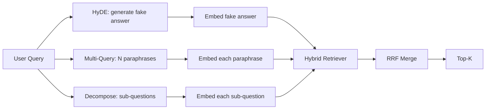

# 查询重写:HyDE、多查询和分解

> 用户输入的查询不是查询器想要的查询. 重写弥补了查询前的差距,因此索引看到的内容更接近答案.

**Type:** Build
**Languages:** Python
**Prerequisites:** 第 11 阶段课程 04（嵌入）、06（RAG）；第 19 阶段 Track B 基础（第 20-29 课）；第 19 阶段第 64 和 65 课
**Time:** ~90 分钟

## 学习目标
- 实现假设文档嵌入 (HyDE):生成一个假答案,嵌入它,根据这个向量而不是查询向量进行检查.
- 实现多查询扩展:将一个查询重写为N个释义,逐个检索,通过倒数等级融合合并并集.
- 实现查询分解:将复杂问题分为子问题,按子问题检索,合并――
- 比较三位重写者在一场比赛中的表现,并解释每种策略何时获胜.
- 连接一个模拟的LLM,产生确定性的固定输出,以便重写器循环离线运行.

## 问题

用户输入当传输失败和预算耗尽时,我们的团队会做什么?──语料库里有一份文档写道:AbortMultipartOnFail会停止进行的S3 分段传输,并在传输失败时减少每个桶的重试预算──查询和文档没有共享名词短语──BM25未定.双编码器将文档排在第三或第四,因为查询量在嵌入空间中更偏向于取消任务文档区域,而不是停止传输文档区域──如果答案已经进入前N,第66课的两个阶段重排可以回来;但如果根本没有前N,名排器就永远无法看到它──

修复方法是在查询触及检查器之前重写查询.2023年论文 精确零射精密检查没有相关性标签 ((Gao 等人) 介绍了HyDE:要求LLM 编写一个能够回答查询的文档,嵌入这个假设文档,并将其嵌入用于检查向量.

两种近亲技术与HyDE相结合.多查询扩展. 采用微软的GraphRAG术语) 生成查询的N个释义并检查每个释义,然后合并. 分解.

本课程将实现这三个项目,并针对相同的固定语料库运行它们.

## 概念



### 详细信息

简单的提示:

```text
You are a domain expert. Write a one-paragraph passage that answers the question
below. Use the same vocabulary and phrasing the documentation in this domain would
use. Do not refuse. Do not say you do not know.

Question: {user_query}

Passage:
```

作为事实答案,LLM的答案是错误的,因为LLM不了解你的语料库――那很好――检索器不关心事实正确性,只关心代币分发――假设段落包含堕胎、多部分、桶、预算等词语,因为这些词语会出现在这个主题的真实文档段落里――嵌入该段落――向量会落在真实段落附近――

在生产中,您将假设的文档限制在两到三个句子.较长的假设会收集更多的噪音.较短的单词会失去HyDE所需的词汇信号.

### 多查询扩展详解

生成用户查询的N 个释义──最简单的提示:

```text
Rewrite the following question in {N} different ways. Each rewrite must preserve
the original intent. Number them 1 to {N}. Do not add explanations.
```

检索每释义的顶级k――将 N个排名列表与RRF 合并(与第65课中的算法相同) ⋅廉价、并行、确定性――

当用户的措辞是提出问题的许多有效方式之一,多查询胜利,任何重写都会提出更好.

### 详细分解

单一检索不能满足多方面的问题――分解要求 LLM 将问题拆成子问题,系统再检索每个子问题――提示:

```text
The following question may require information from multiple distinct topics.
Decompose it into a list of sub-questions. Each sub-question must be answerable
independently. If the question is already atomic, return it unchanged.

Question: {user_query}
```

检索每个子题――合并――对于包含连词、多从句比较或两个不相关的主题的问题,分解是正确的工具――原子问题的工具错误;分解器的工作是回复单个问题,而不是发明假子问题――

### 为什么这三个都存在

三者是互补的. HyDE 弥补查询代币与语料库代币之间的差距.多查询覆盖释义方差.分解覆盖多主题查询.生产系统会运行这三种策略,并为每个查询选择合适策略.

## 模拟法学士

模拟LLM是一个以用户查询为关键的小型查询表,以及未见的查询后备表包括:

- 对于每一个固定 查询:书面假设段落、三个释义和分解结果──
- 对于未知查询:确定性转换:获取查询的内容词,通过同义词映射对其进行扩展,然后返回结果.

模拟的形状才是重要的,而不是数据. 在生产中,你将模拟替换为真实模型调用.


```figure
cd-hyde-vector
```

## 构建它

`code/main.py`实现:

- `MockLLM`- 上述确定性替代――
- `HyDERewriter`- 调用LLM编写假设文档,将重写器输出返回为`RewriteResult`包含假设文本和检查器应使用的查询.
- `MultiQueryRewriter`- 调用LLM进行N个释义,返回查询列表
- `DecomposeRewriter`- 调用LLM进行分解,返回子问题――
- `retrieve_with_rewriter`- 采用重写器和检查器,运行重写,融合结果――
- 一个演示,在固定上运行三个重写机并打印哪个策略首先返回黄金答案文档.

重复使用第65 课中的检查器形状(混合BM25 +密集) 融合仍然是相同的RRF──唯一的新形状是重写器接口,它很小──

运行它:

```bash
python3 code/main.py
```

输出是每个策略的排名和最终摘要―― HyDE 在措辞不匹配的查询中获胜――多查询在释义方差查询中获胜――分解在多主题查询中获胜――后备方案 (无重写器) 至少在三者中失败――

## 演示将隐藏故障模式

**HyDE 对语料库特定标识符的幻觉是错误的。**该模型发明了一个函数名称――右侧文档的假设BM25 分数崩了,因为发明的名称现在是一个高权重标志,未出现在索引中――限制融合中假设的长度和重量BM25较低――

**多查询重写全部收敛。**弱模型会产生三个几乎相同的释义―― N 次检索返回相同的顶-k―― RRF 合并并不是比单个检索好―― 在重写提示中添加显式多样性指令并通过Jaccard 检测重复项――

**分解过度分割。**分解器将原子问题变成列表.检查全部返回相同的文档,但排名降低.

**延迟成倍增加。**需要花费一次LLM 通话费用――多查询花费一次LLM调用以生成N次重写,然后生成N次检索――分解需要一次LLM调用分解,然后进行M次检索――检索并行进行;LLM电话是发言权――

## 使用它

生产模式:

- 按查询长度选择每一个查询策略:原子短查询得到多查询,复杂多句查询得到分解,行话重查询得到HyDE──
- 通过查询哈希缓存重写器输出――许多查询重复――
- 并行运行所有三个结果集,并使用RRF将三个结果集结为一个.

## 发货

第69课将重写器阶段接到第65课的检查器之前,并放在第66课的重排器之前. 第68课评估重写器给检查器提升了回忆.

## 练习

1. 实现RAG-Fusion (多查询的2024年变体),其中重写器的释义有意多样化,然后重新排序步骤 (第 66 课) 选择最终列表――
2. 添加第四种策略:向LLM 询问更一般的问题,检查该问题,然后再缩小范围)
3. 通过添加问题是原子的头来训练分解器识别原子查询.
4. 用真实模型调用替换模拟LLM――测量堆上每个策略的延迟――
5. 每次重写的重写量增加分数.

## 关键术语

|术语 |人们怎么说|它实际上意味着什么 |
|------|-----------------|------------------------|
|海德 | “伪造文件检索”| LLM写出答案；嵌入并检索它而不是查询 |
|多查询 | “释义扩展”| N次重写查询；检索N次，按RRF合并|
|分解 | “子查询分割” |多主题查询拆分为子问题，单独检索 |
|原子查询 | “单一主题” |如果不发明假子问题就无法分解 |
|后退一步| “抽象查询”|提出更一般性的问题，检索，然后缩小范围 |

## 进一步阅读

- 高、马、林、Callan,无相关标签的精确零样本密集检索(HyDE),2023
- 微软研究院,检索的多查询扩展
- 斯坦福大学DSPy,多跳QA的子查询分解
- [LlamaIndex 查询转换文档](https://docs.llamaindex.ai/en/stable/optimizing/advanced_retrieval/query_transformations/)
- 第11阶段 第07课 - 高级RAG模式
- 第19阶段 第65课 - 重写器提供的检索器
- 第19阶段 第68课 - 测量重写器提升的评估
