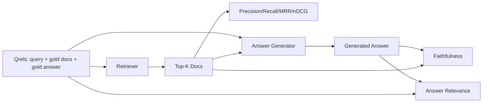

# 评价:精确率,召回率,MRR,nDCG,忠诚度,答案相关性

> 如果您不能同时评价查询和答案,则无法运送系统――两者不是相同的指标,并且相同的提示在不同的轴上失败――

**Type:** Build
**Languages:** Python
**Prerequisites:** 第11期第06课（RAG）、10（评估）；第 19 阶段 Track B 基础（第 20-29 课）；第 19 阶段课程 64, 65, 66, 67
**Time:** ~90 分钟

## 学习目标
- 根据黄金尔 计算四个检索指标:精度@k、回忆@k、MRR(平均倒数排名) 和nDCG@k。
- 计算两个答案等级指标:忠诚度 (每个主张都基于查询到的下文) 和答案相关性 (答案解决问题)
- 构建一个由评分端到端读取的固定文件
- 读取指标值 检查,排名,生成或接地:

## 问题

RAG系统至少有四个活动部分:分块器,检索器,重排序器,生成器.其中任何一个可能导致错误答案.

用户报告错误答案──是因为分块机截断了答案跨度吗?是因为检查器没有把部分放在顶部?是因为重排器推出正确的部分后的第一位吗?是因为生成器忽略了该部分并编制了内容吗?仅凭答案无法判断──你需要:

- 检查指标,用于评分检查器的结果.
- 标志进行排名,对正确块在序列中的位置进行评分.
- 忠实地对生成器是否停留在检查到的上下文进行评价.
- 答案与评分的相关性是否完全解决了问题.

在本课程中,你将模拟LLM法官,转换为真正的法官.

## 概念



### 精度@k

如果黄金有3个文件,并且前3个文件和一个错误的文件返回,则精度@3为2/3──当不相关的检查块的成本很高时(生成器在上面浪费代币,或者该块破坏答案),请使用精度──

### 提醒

如果金有3个文件,并且在前5个文件中包含所有这些文件,则回忆@5为1.0──当错过答案的成本很高时,请使用回忆(您宁愿看到额外的错误块,也不愿完全错过答案块)

在生产RAG中,人们通常引用的标志是 recall@k――生成可以很容易删除不相关的块;它无法从未见过的块中发明出答案――

### 平均倒数排名)

对于每个查询,找到排名列表中的第一个相关文档位置.排名倒数为1/位置.整个查询集的平均值.

排名第 1 的查询贡献 1.0 ・排名第 2 的贡献 0.5 ・排名第 10 的贡献 0.1 ・ 这个指标主要占列表顶部的原因

### 其他类型

标准化贴现累积收益――完整公式为每一个检索到的文档分配增益――通常为1表示相关,0表示不相关),根据位置对数进行折扣,求和,然后除以理想的DCG――如果您排名完美,您将拥有DCG) 范围0到1――

黄金可以说文档A 是 3,文档B 是 2,文档C 是 1──MRR 和recall@k 将所有内容平化为二进制──当语料库每一个查询有多部分相关文档时,请使用nDCG──

### 忠诚

对于每一个答案的声明,检查检查到的下文是否支持该声明.

忠诚抓住了模型发明内容的生成器故障模式.即使检查器返回正确的块,产生幻觉的生成器也会损坏.

本课程通过确定性模拟判断来实现忠实性,该判断检查每个声明的符号是否与检查的下文重叠值.

### 答案相关性

答案是否真的解决问题?忠诚问答案是否基于上下文?──答案相关性问答案是否基于问题?──一个忠实但偏离主题的答案在忠诚度上得分高,在相关性方面得分低──一个简短的、切题的、忽略上下文的答案在相关性上得分高,但在忠诚度上得分低──标准实现也使用M作为判断:

## 固定式

```python
{
  "qid": "q1",
  "query": "what is the abort threshold for multipart uploads",
  "gold_doc_ids": ["d1", "d3"],
  "gold_answer_substring": "three failed parts",
  "graded_relevance": {"d1": 3, "d3": 2},
}
```

每次查询都带着:
- 查询字符串,
- 一组黄金文档ID (用于精确度/召回率/MRR),
- 分级相关性字典 (对 nDCG),
- 黄金答案字符串(作为每个克雷尔的参考数据保存;本课中的忠实性是通过检查到的上下文而不是本字符串来判断提取的声明来计算) ⋅

在生产中,你可以对这些活动进行. 本课程提供了手工构建的固定,因此评估可以即时使用.


```figure
ci-rag-metric-ladder
```

## 构建它

`code/main.py`实现:

- `precision_at_k(retrieved, gold, k)`- 字面定义――
- `recall_at_k(retrieved, gold, k)`- 字面定义――
- `mean_reciprocal_rank(retrieved_list_of_lists, gold_list)`- 查询的平均值
- `ndcg_at_k(retrieved, graded_relevance, k)`- DCG/IDCG 具有二进制或分级增益.
- `extract_claims(answer)`- 将答案分成句子形的主张.
- `faithfulness(claims, context_texts, judge)`- 被判定支持的索赔的一部分
- `answer_relevance(question, answer, judge)`- 判断答案是否解决问题
- `MockJudge`- 确定性代码重叠判断,以便评估离线运行.
- `evaluate_pipeline(pipeline_fn, qrels, ks)`- 运行每个指标的协调器
- 针对运行三种管道变体(分块基线、混合检索、混合 + 重新排名) 并打印标签表的演示──

运行它:

```bash
python3 code/main.py
```

输出显示单个指标中每个变体的精度@k、回忆@k、MRR、nDCG@k、忠实性和答案相关性──混合检查行在召回方面击败分块器基线;重新排序在MRR上击败混合行──

## 读取标志来诊断故障

|症状|可能的原因 |修复什么问题 |
|---------|-------------|-------------|
|低召回率@k，低精度@k |分块剪切答案或检索器找不到它 |分块边界（第 64 课）或检索器模态（第 65 课） |
|不错的召回率@k，低 MRR |右块位于 top-k 中但不在位置 1 |重新排序（第 66 课）|
|高MRR，低忠诚度|尽管上下文正确，生成器仍然发明内容 |生成提示；强制引用或拒绝 |
|忠诚度高，相关性低 |答案有根据但偏离主题 |查询重写器（第 67 课）或生成提示 |
|均四高，用户仍抱怨|评估集不具有代表性 |使用真实用户查询扩展 qrels |

## 演示将隐藏故障模式

**LLM-as-judge 偏差。**模型判断自己的输出时,往往会认为它比实际情况更忠实――使用与生成器不同的模型系列进行判断,或对样本进行手动分级――

**Qrel 腐烂。**随着语料库的变化,黄金答案也会发生变化. 2024 年 1 月 1 季度的黄金文档在 2024 年 10 月不再是正确答案,因为团队重新命名了这个函数.

**忠诚度微观检查错过了宏观声明。**每句话的忠诚度可能会通过,而整个答案的结构会产生误导.

**Recall@k 掩盖了每个查询的失败。**平均回报率90%可以隐藏一个查询类总是丢失的情况.

## 使用它

生产模式:

- 对于每个检查器或生成器的变更运行评估.
- 保持每个查询的标志跟踪. 当用户抱怨时,寻找匹配的类别,看看它是否会被捕.
- 针对 Qrel 进行分层:在 CI 中运行的20个查询烟雾集;每晚运行的200个回归集;每周运行的2000个深组──

## 发货

第69课连接整个管道 (分块器,检索器,重排器,生成器),并针对端到端系统运行此评估.

## 练习

1. 添加第五个检索指标:hit-rate@k。将其与recall@k 进行比较──当它们不同时进行解释──
2. 实行分级忠诚度:0(不支持) 、1(部分支持) 、2(完全支持) 。相应地更新指标。
3. 用真实模型调用替换模拟判断――衡量模拟裁判和真实裁判之间的比赛中的分歧――
4. 添加查询类片段(字面、释义、多主题) 报告──每片标志──
5. 添加答案长度标标并将其与忠诚相关联――绘制曲线――

## 关键术语

|术语 |人们怎么说|它实际上意味着什么 |
|------|-----------------|------------------------|
|精度@k | “命中率超过检索” | top-k 中黄金的比例 |
|recall@k | “命中了 gold 吗”| top-k 中包含 gold chunk 的比例 |
| MRR | “第一击位置”| 1 的平均值/第一个相关文档的排名 |
| nDCG@k | “分级排名质量”| top-k 上的 DCG 除以理想 DCG |
|诚信| “接地气” |检索到的上下文支持的答案声明的比例 |
|答案相关性 | “它解决了这个问题吗？” |答案是否符合问题的意图 |
|问题 | “金标”|带标签的查询集及其黄金文档和答案 |

## 进一步阅读

- ,沃尔希斯,评估评估测量稳定性,SIGIR 2000 - 关于排名指标的规范论文
- 基于累积增益的评估 velin、Kekalainen,IR 技术
- [Ragas：RAG 管道的自动评估](https://docs.ragas.io)
- [人择，评估 RAG](https://www.anthropic.com/news/evaluating-rag)
- 第11阶段 第10课 - 评估框架基础
- 第19阶段课程 64-67 - 评估组件
- 第19阶段 第69课 - 本次评估评分的端到端管道
