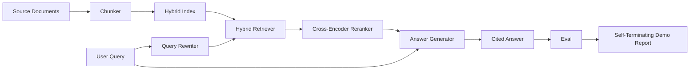

# 端到端 RAG 系统

> 组件的六课. 一个管道. 一个评估循环. 一个自动终止的演示.

**Type:** Build
**Languages:** Python
**Prerequisites:** 第11期第06课（RAG）、10（评估）；第 19 阶段 Track B 基础（第 20-29 课）；第 19 阶段课程 64, 65, 66, 67, 68
**Time:** ~90 分钟

## 学习目标
- 将分块器,混合检查器,查询重写器,跨编码器重排器和答案生成器组合单端到端管道.
- 实现一个答案生成器,通过块点引用其声明,并具有低信心拒绝退回功能.
- 针对组装良好管道运行第68课程的评估,并证明分阶段的构建在每个指标上都优于单独的同一个组件.
- 构建一个自动终止的CLI演示,演示将采集固定语料库,运行固定的查询集,并以摘要报告退出零.

## 问题

孤立的六个成分不能证明什么――分块器可以在 recall@5上战胜语料库,但在系统的 recall@5上失败,因为检查器无法对分块器发出的内容进行排名――重排器可以提高合成候选池的MRR,但无法处理真正的双编码器候选人,因为重排预算下双编码器的召回率太低――查询重写器可以在单个查询上提升黄金文档,然后在下一个查询上断绝,因为LLM模拟返回退化假设――

集成测试是整个管道针对相同的固定管道,端到端运行,具有相同的标志,并使用一个将所有内容连接在一起的编排文件.这是本课程的内容.如果集成管道的标志优于每个阶段的独立演示标志,那么你已经证明了该系统.

## 概念



### 接线选择

管道是一个小图. 每个阶段都是一个具有清晰签名的函数.

|舞台|输入|输出|
|-------|-------|--------|
|块块|文档正文 |块记录列表 |
|检索器 |查询字符串 | Top-N chunk 记录 |
|重写器（可选）|查询字符串 |重写列表+假设|
|重新排序 |查询，候选人 |带有交叉分数的 Top-K 块记录 |
|发电机|查询，top-K Chunk 记录 |带有引文的答案字符串 |

总体而言,每一个签名都稳定,组合就很简单.`Pipeline`类包含五个阶段,按顺序运行它们.`query`方法──每一个阶段都是可交换的:传入不同的分块器、检索器、重写器、重排器或生成器,管道仍然可以运行──

### 带引文的答案生成器

发电机是最后一级,也是最容易损坏的. 本课程提供了一个确定性模拟生成器,该生成器:

1. 取出前 K 个重新排序的块.
2. 最多选择两个文本包含与查询重叠程度最高的内容代币的块.
3. 发出一个答案,这个答案是每个单元中的一个句子的连接,每个句子后一个.`[doc_id:chunk_index]`点──
4. 如果没有块重叠高于拒绝值,则发出我不知道且不带引用.

在生产中,你可以使用提示模板将模拟替换为真正的LLM调用:

```text
You are answering a question using only the snippets below.
Cite every claim with the anchor in parentheses.
If the snippets do not answer the question, say "I do not know".

Question: {query}

Snippets:
{enumerated chunks with anchors}

Answer:
```

低信度拒绝路径是记录跨编码器排名1 分数的全部原因. 如果它低于语料库值,则生成器会拒绝.

### 自终止演示

演示端到端运行所有内容.它打印一个查询的每个阶段细分,对四个固定的 Qrel 运行评估,打印标签,如果第 68 课所有标签都满足演示中设置的值,则将处于零退出状态.如果任何标志低于值,演示将退出并显示非零状态,并显示一个消息,指出失败标志.

这就是CI冒烟测试的形式.该管道离线运行,快速确定,固定的值故意严格,因此六节课程中的任何一课的回归都会导致演示失败.


```figure
rag-pipeline-flow
```

## 构建它

`code/main.py`实现:

- `Chunk`- 穿越所有阶段的记录(使用chunk_index 和源 doc_id 扩展第 64 课的形状) 👇
- `Chunker`- 从第64课中选择策略 (默认递归分)
- `HybridIndex`- 捆绑BM25+密集+RRF 来自第65课.
- `Rewriter`根据查询长度和连词存在,从第67课中选择HyDE、多查询、分解之一──
- `Reranker`第66课时训练过的交叉编码器,使用较小的固定训练集,因此可以在几秒钟内收到──
- `Generator`- 具有引用和低信任拒绝的确定性模拟生成器
- `Pipeline`- 使用返回`Result(answer, top_k, latency_ms_per_stage)`的`query(question)`方法组成五个阶段――
- `run_demo()`- 摄取语料库,运行三个固定查询,运行评估,印结果,并按值设置退出代码――

运行它:

```bash
python3 code/main.py
```

输出是一个打印的查询痕迹,完整评估表和最终通过/失败状态.

## 演示将隐藏故障模式

**分块器边界漂移。**如果在评估图标过程和演示中交换分块器策略,黄金文档ID 不再排列.

**Reranker 训练集泄漏到 eval 中。**第66课程中14个训练三组包括类似于评估查询的查询. 在生产中,严格保留评估查询.

**模拟生成器隐藏了幻觉风险。**模拟无法产生幻觉,因为它只从检查到检查的块中发出文本. 本课程注意到这一点,并指出实际模型的生产转向方式.

**无流式传输。**管道在每个阶段结束时返回完整答案――生产系统将传输发电机的输出――流媒体超出范围;无论如何,答案等级指标都会对最终字符串产生作用――

**延迟是离线的。**模拟LLM调用是恒定时间――真正LLM电话占主导地位――在请求范围内规划延迟预算;本课程的每阶段计时时间仅测量CPU工作――

## 使用它

生产模式:

- 避免布线在存储库中分布.
- 在每个涉及阶段的合并之前运行评估.如果评估下降,则合并不会落下.
- 保持每次CI运行的指标跟踪,以便您可以回归归交换阶段.
- 添加20个查询的烟雾集 (回归集的子集),运行时间不超过30秒;完整的回归集每晚运行.

## 发货

本课程中的管道文件是第19阶段F轨道课程的其余部分所采用的形状.后续课程将增加摄取自动化,增量重新索引,遥测和顶部服务层.检查,重新排序,重写和评估部分已经完成.

## 练习

1. 在重写器中添加每个查询策略选择器:第67课的启动式 (长度,连词,行话比例) 选择HyDE,多查询或分解――
2. 在环境标志后面添加到生成器的真正的LLM调用――默认为模拟――测量延迟增量――
3. 扩展演示以获取真实语料库的加载`--corpus path`标志──重新运行评估和值检查──
4. 向分块器添加 `--strategy`标志──衡量每个策略对端到端回忆的贡献──
5. 添加流生成器接口并将其输入到 eval 中. 确认忠实度是根据最终字符串而不是流式前计算的.

## 关键术语

|术语 |人们怎么说|它实际上意味着什么 |
|------|-----------------|------------------------|
|管道| “RAG 管道”|从摄取到引用答案的撰写阶段|
|引文锚| “来源链接” |每个声明附加的 (doc_id, chunk_index) 引用 |
|低置信度拒答| “我不知道” |当重排器 top-1 分数低于阈值时，生成器不返回答案 |
|smoke set | “CI 评估”|每次 PR 检查中运行的最小 qrels 子集 |
|阶段接口| “函数签名”|各个管道阶段的稳定输入输出类型 |

## 进一步阅读

- [人择、建筑搜索与检索](https://www.anthropic.com/news/contextual-retrieval)
- [Pinterest，MCP 内部搜索](https://medium.com/pinterest-engineering)- 参考生产架构
- [Ragas：RAG 管道的自动评估](https://docs.ragas.io)
- 第11阶段 第06课 - RAG基础知识
- 第十九阶段课程64-68 - 组成组件
