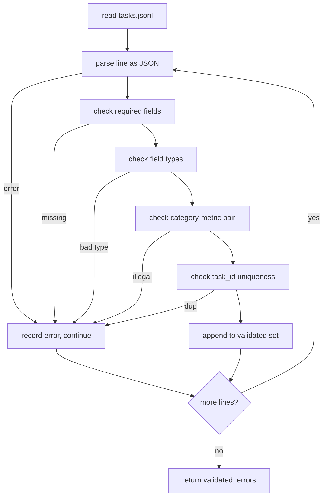

# 任务规范格式

> 评估安全带的好坏取决于其任务执行的合同. 在编写单个评分函数之前,请结结JSONL 形状和量度词汇.

**Type:** Build
**Languages:** Python
**Prerequisites:** 19期B轨地基
**Time:** ~90 分钟

## 学习目标


```figure
ci-task-spec-gate
```

- 定义一个JSONL 任务记录模式,以一种形式涵盖算术,多项选择,代码执行,分类和自由文本摘要.
- 固定量名称的封闭词汇表,以便下游课程 (71-73) 可以在单个字段上分派──
- 指定少数样本示例和后处理规则作为任务的一部分,而不是运行者的部分,因此相同的提示将产生模型之间相同的目标.
- 实施严格的验证器,在形式错误记录到运行器之前将拒绝它.
- 发布一个包含10个任务的固定集,用于测试规范的每个分支,以便验证器有一些真正的东西可以──

## 为什么要结论规则

研究代码库积累 eval 脚本的速度还要比积累测试的速度快. 六个月后,每个笔记本都有自己的JSON形状,每个指标都被重新实现了两次,并且无法在运行之间进行比较.

这种形状借鉴了大,HELM 和 lm-eval 风格线束的想法,但字段名称是我们的.

## 记录形状

任务是单行的JSON对象.`tasks.jsonl`并独立验证每条线――坏线将停止记录,而不是运行――

```json
{
  "task_id": "arith_001",
  "category": "arithmetic",
  "prompt": "Compute the result. Question: 17 + 24\nAnswer:",
  "targets": ["41"],
  "metric_name": "exact_match",
  "few_shot_examples": [
    {"prompt": "Question: 2 + 2\nAnswer:", "completion": "4"}
  ],
  "post_process": "strip_whitespace",
  "metadata": {"difficulty": "easy"}
}
```

必须填字段为`task_id`,我知道.`category`,我知道.`prompt`,我知道.`targets`,我知道.`metric_name`,我知道.`post_process`,我知道.`few_shot_examples`和 `metadata`是可选的. 不知名的.

## 字段规则

`task_id`是一个没有空格的字符串.

`category`是 `arithmetic`,我知道.`mcq`,我知道.`code_exec`,我知道.`classification`,我知道.`summary`之一. 类别限制了对单字母目标的量和后处理是合法的.`code_exec`任务必须使用`metric_name = code_exec`没有任何`mcq`任务必须使用`metric_name = exact_match`,我知道.

`prompt`是一个非空字符串. 验证器禁止尾随空格并拒绝提示 正文中已包含少数镜头块的记录.

`targets`是一个非空字符串列表.`exact_match`任何相应的元素都会被考虑进来.`f1`和`rouge_l`为了赢得胜利.`mcq`列表仅包含一个元素.

`metric_name`是 `exact_match`,我知道.`f1`,我知道.`bleu_4`,我知道.`rouge_l`,我知道.`accuracy`,我知道.`code_exec`之一――词汇是封闭的――新标志需要新的教训和新条款――

`few_shot_examples`是 `{prompt, completion}`证书器将限制列表为8条目,以限制提示.

`post_process`是 `none`,我知道.`strip_whitespace`,我知道.`lower`,我知道.`extract_letter`,我知道.`extract_code_block`,我知道.`extract_first_line`之一. 每条规则都有一个确定性行为.

## 验证器行为



验证器返回两个列表:已验证记录和错误记录,其中包含违规行、违规规则和错误字段. 如果错误列表是空的,运营器拒绝启动,除非设置显式.`--allow-bad-tasks`标志:

## 镜头染

运行者将提示前面的几个示例与空行分隔符连接起来――每个模型都运行相同的代码路径,因此唯一的差异来源是模型本身――作者编写一次示例,而不是每个提供者编写一次――

```python
def render(task):
    parts = []
    for ex in task.get("few_shot_examples", []):
        parts.append(ex["prompt"] + " " + ex["completion"])
    parts.append(task["prompt"])
    return "\n\n".join(parts)
```

## 后处理规则

后处理步骤在生成后,标志在运行之前.

- `none`返回字符串不变──
- `strip_whitespace`去除前导和尾随空白──
- `lower`小写字符串.
- `extract_letter`返回与`[A-E]`匹配的第一个字符,用于MCQ.
- `extract_code_block`返回第一个三重反引号隔离块主体,用于代码执行.
- `extract_first_line`返回第一个非空行,用于汇总分类.

需要在此列表之外的规则任务属于新课程.

## 本课不做什么

它不得分. 它不调用模型. 它不运行代码. 这些内容出现在第71,72和75课中. 本课结结了所有这些人遵守的合同.

10个任务组件 覆盖两个算术项,两个MCQ项,两个代码执行项,两个分类项和两个摘要项.验证器通过所有10条规则.`tasks_bad.jsonl`) 会触发每条规则,并且验证器返回的错误数量与这些错误相似.

## 如何阅读代码

`main.py`定义了`TaskSpec`,我知道.`validate_task`,我知道.`validate_file`和 CLI 入口点──固定加载器是`load_fixtures`染和后处理辅助员 位于验证逻辑旁边,因此第75课中的运行员只需要导入单个模块.

从上到下阅读`main.py`然后读取`code/tests/test_spec.py`测会确定每个验证规则和每个后处理行为.`main.py`底部的演示会验证捆绑的固定并打印摘要――

## 更进一步

真正的评估套件以模式增长列的方式增长类别.清醒的举动是拒绝添加类别而不添加标志,后处理规则和至少一个固定任务.
