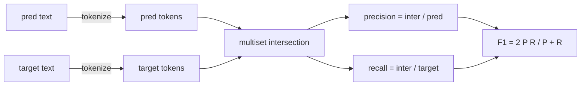
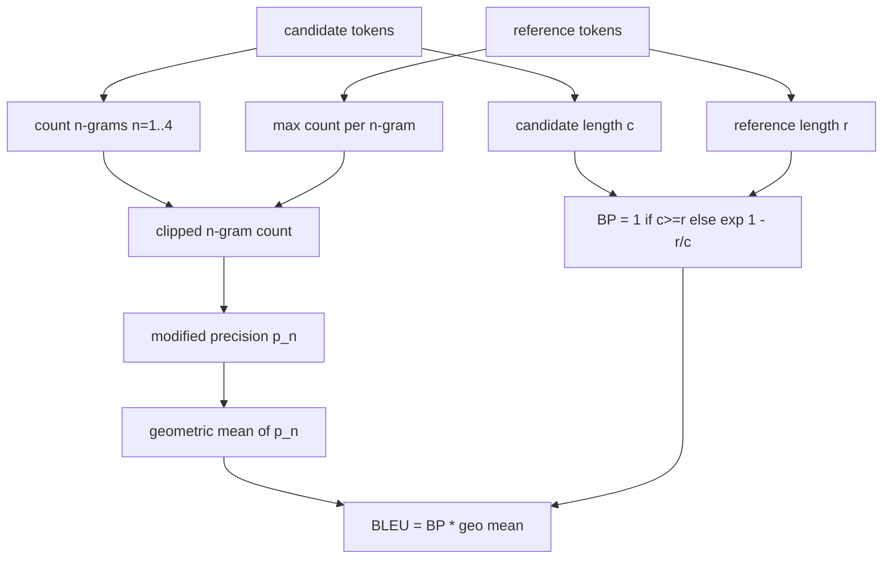

# 经典指标

> 五个指标仍然占据了大多数已发布的LLM评估数字. 从第一性原理实现每个指标,这样你才知道数字的含义.

**Type:** Build
**Languages:** Python
**Prerequisites:** 第 19 期 Track B 基础，第 70 课
**Time:** ~90 分钟

## 学习目标


```figure
cd-bleu-overlap
```

- 通过明确的代币化规则实现代币级精确匹配、F1 和准确性.
- 从头开始 实施 BLEU-4:修改 n 元语法精度, n 的几何平均值等于 1 到 4,简洁性损失.
- 使用最长的公共子序列以及精度和召回率的F-beta组合实现ROUGE-L──
- 调度第70课中的指标_名称 字段,以便运行者保持与标志无关的状态.
- 基于工作示例而不是第三方库中提取的参考向量来固定行为.

## 为什么要重新实现

您将阅读BLEU 28.3的论文和BLEU 0.283的论文.您将发现两个库的ROUGE-L 分数差距为10分,因为一个库截为小写,而另一个库则不截为.停止混的最快方法是自己编写指标,然后指向决定标的行程和应用平滑行程.

蓝色是计数和位,红色是动态规划,F1是代币上的集合交集,最困难的部分是选择代币器并致力于它.

## 标志性

分词器是`re.findall(r"\w+", text.lower())`‧小写、字母数字运行、删除标点符号──本课程中的每个标志都使用这个精确的分词器──跑步者没有选择权──如果您交换分词器,您将运行不同的基准测试──

```python
TOKEN_RE = re.compile(r"\w+", re.UNICODE)
def tokenize(text):
    return TOKEN_RE.findall(text.lower())
```

这是一个意图的简化. 生产设置将关心CJK,缩写和代码标识符. 本课程的重点是,代码生成器是一个合约,而不是一个旋转.

## 精确匹配

```python
def exact_match(pred, targets):
    return float(any(pred.strip() == t.strip() for t in targets))
```

每个任务返回1.0或0.0――数据集的聚合就是平均值――这是算术,MCQ和短分类任务的主力――

## 标志级F1

设置用于预测和目标的代币多重集──精度是多重集交换除了预测的多重集──召回率是相同的交换除了目标的多重集──F1是调和平均值──应实现处理空预测和空目标边缘情况──



对于多目标任务,我们在目标列表中选择了最好的F1――这与文献中广泛报道的SQuAD式行为相符.

## 蓝色-4

我们使用的公式是语料库级别的BLEU-4,具有标准简洁性惩罚和对修改后的 n 元语法计数进行加平,因此单个缺失的 4 元语法不会将分数推至零──

对于每个候选人,我们对 n 等于1、2、3、4 时的修改后的 n 元语法精度进行计数. 修改后的精度通过任何参考中 n 元语法最大计数来剪辑候选人 n 元语法数,因此候选人不能通过重复短语来膨胀. 四个精度的几何平均值受到简洁惩罚的影响.



平滑规则是林和奥赫所说的方法1:在对比数之前,将每个 n 元精度分子和分母都加上1──当引用不匹配的4克并保持接近长候选人的不平滑值时,这可以避免.`log 0`,我知道.

## 脂-L

红色-L比较候选标记序列和参考标记序列的最长的公共子序列. LCS 捕获词序列不强制连续性,这就是为什么它是默认的摘要量量. 我们使用标准动态规划表计算LCS 长度,然后导出召回率.`lcs / reference length`精度为`lcs / candidate length`并与F-beta结合,其中对称F1形式的β等于1──

```python
def lcs_length(a, b):
    n, m = len(a), len(b)
    dp = numpy.zeros((n + 1, m + 1), dtype=int)
    for i in range(n):
        for j in range(m):
            if a[i] == b[j]:
                dp[i+1, j+1] = dp[i, j] + 1
            else:
                dp[i+1, j+1] = max(dp[i+1, j], dp[i, j+1])
    return int(dp[n, m])
```

选择 ROUGE-L 的任务为每个任务支付 O(n m) 成本──对于保持在毫秒以下的典型摘要长度──

## 准确度

对于多个目标分类任务,准确性将降低到与单个标准化目标的精确匹配. 我们将其公开为单独的函数,以便调节程序可以在`metric_name`没有必要在运行者内进行字符串比较.

## 派遣合同

单一入口点是`score(metric_name, prediction, targets)`,它回来了.`[0, 1]`运行者不会根据标志名进行分支. 它会转交呼叫并写入结果.

```python
def score(metric_name, pred, targets):
    if metric_name == "exact_match":
        return exact_match(pred, targets)
    if metric_name == "f1":
        return max(f1_score(pred, t) for t in targets)
    if metric_name == "bleu_4":
        return max(bleu4(pred, t) for t in targets)
    if metric_name == "rouge_l":
        return max(rouge_l(pred, t) for t in targets)
    if metric_name == "accuracy":
        return accuracy(pred, targets)
    raise ValueError(f"unknown metric_name: {metric_name}")
```

`code_exec`在第72课时处理并插入其中调节程序中.

## 本课不做什么

它不调用模型. 它没有使代代标准化超出了第70课后处理规则已经实现的范围. 它不计算置信区间. 它不执行BLEURT或BERTScore. 它需要模型,并且位于不同的课程中.

## 如何阅读代码

`main.py`将每个指标定义为一个自由函数加上调度程序.`_reference_examples`块中. 展示针对八个示例运行调度程序,并打印每个指标的分数.`code/tests/test_metrics.py`中的测试固定参考向量并强调每个边缘情况 ((空预测、空参考、无共享标志、精确匹配、重复短语剪辑) 

从上到下阅读`main.py`△这些功能按复杂度排列. 精确匹配和准确度占一行. F1是六行.

## 更进一步

经典指标是必要的,但还不够的. 他们奖励表面重叠而忽略意义. 一旦你信任经典底层,解决方法就是将基于模型的指标分层.
