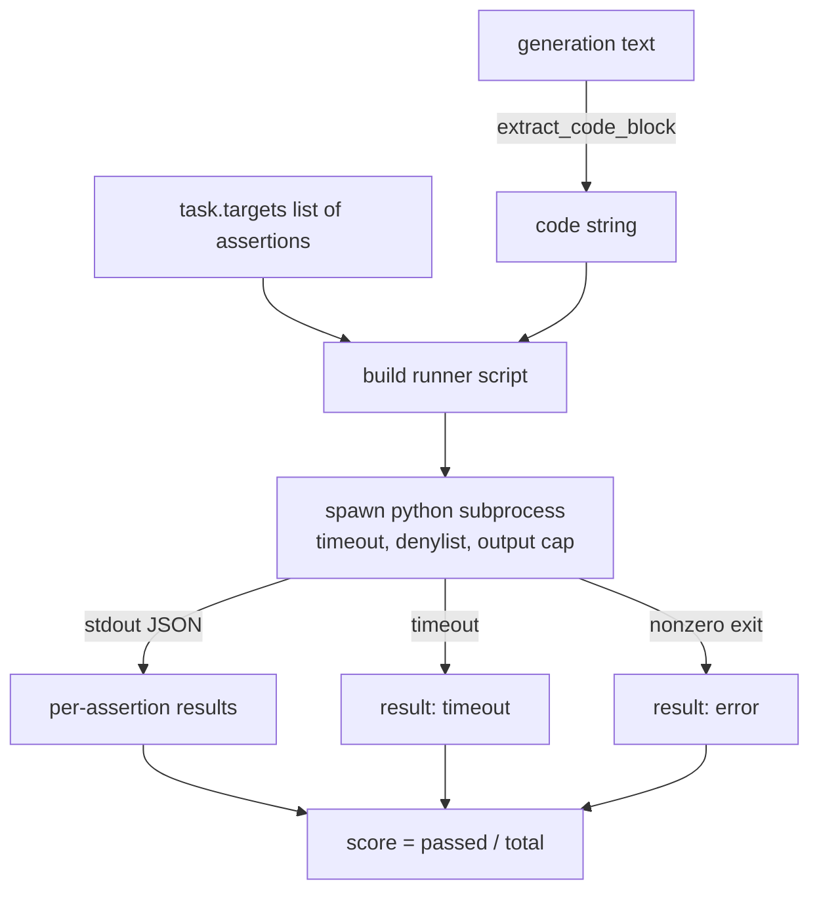
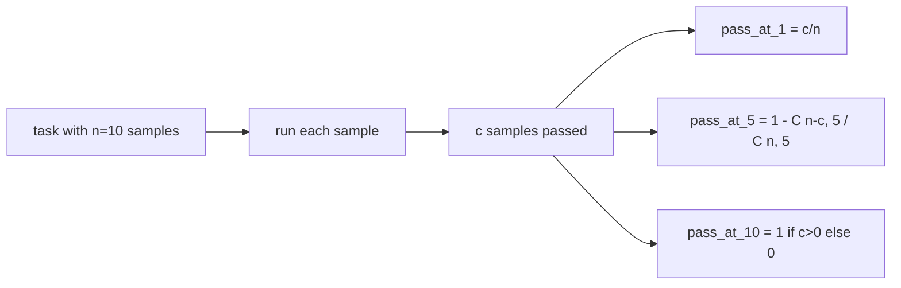

# 代码执行指标

> 经过测试后的代码是正确的. 评估工具必须提取代码,在不使主机崩的情况下运行它,并诚实地统计通过率. 本课将构建这个表面.

**Type:** Build
**Languages:** Python
**Prerequisites:** 第 19 期 Track B 基础，第 70 和 71 课
**Time:** ~90 分钟

## 学习目标


```figure
sandbox-runner
```

- 以与第70课后处理规则相匹配的方式从自由形式生成中提取代码块.
- 在具有挂钟超时的隔离过程中执行出口上限和进口拒绝列表的候选码.
- 根据所提供的断言字符串中通过候选人的分数来评价任务.
- 计算从一个模型进行多代的任务的通过-在-k.
- 沙箱崩、语法错误和超时视为一流的失败模式,并具有可以记录的不同退出代码.

## 为什么需要一个孤立的子进程

内部联`exec`存在安全和稳定性隐患.`while True: pass`永远阻止评估.`import shutil; shutil.rmtree('/')`确实像听起来一样灾难性――解决方法是为每个候选人生成一个新的Python解释器,在 stdin 上传递代码,将断言结果写入 stdout,并在溢出时终止这个过程――主机评估 进程继续运行――

人类Eval、MBPP、BigCodeBench 和LiveCodeBench等真正的评估都使用子进程沙箱──某些层次的Docker 位于顶部──我们在子进程中停滞是有原因的:它可移植,它是stdlib,并且它捕获了对教育评估至关重要的故障模式──生产部署增加了序列、网络隔离和只读文件系统──关于强化的下一个教训是在这个轨道之外──

## 代码执行任务的形状

`code_exec`任务携带`targets`中的断言字符串──运行器从生成中提取隔离的代码块,围绕它构建测试工具,然后运行结果──



分数是`[0, 1]`中分数――有三个断言任务,其中两次通过分数为0.667――无论发生什么故障,运行者都会返回相同的形状:子进程崩将映射到标准化错误代码,而不是上升到线束的Python回溯――

## 拒绝名单

拒绝列表是基于导入. 在运行候选码之前,运营脚本会将危险模块的导入重写到引发.`ImportError("denied")`保存中. 保存中.`os.system`,我知道.`subprocess`,我知道.`socket`,我知道.`requests`,我知道.`urllib`,我知道.`urllib.request`,我知道.`urllib.error`,我知道.`urllib.parse`,我知道.`ctypes`,我知道.`shutil` `http.client`,我知道.`asyncio.subprocess`,我知道.

我们不会假装这是刀枪不进的. 确定的对抗代码可以逃脱Python中的任何进程.

```python
DENIED = {
    "os.system": True,
    "subprocess": True,
    "socket": True,
    "shutil": True,
    "requests": True,
    "urllib": True,
    "ctypes": True,
}
```

我们通过在前面添加`import sys`和一个通过子补丁`os.system`发起的守护者来包装候选人.`main.py`在中.

## 挂钟超时

每个过程都有一个默认预算.`subprocess.run(..., timeout=t)`如果超时,跑者会被捕.`TimeoutExpired`终止进程,并记录任务`timeout`退出原因――该任务分数为零――运行者继续进步――

每个任务的超时可通过.`task.metadata.timeout_s`进行配置.长时间运行的单元测试可能需要更多;第70课程的验证器将将该值限制在30秒内,以保持套件的边界.

## 输出上限

进程可能会淹没标准输出,耗尽主机内存. 运行者将将流式传输到缓冲区,运行总数超过256 KB 时即结束进程.`exit_code = error`详细信息字符串为`"output overflow"`,当一代人不小心编写一个印制无限循环时,

## 通过

通过-k 是使用的无偏估计器.`n`独立样本和其中的`c`通过,来自`n`长大小为`k`样本至少包含一个通过解决方案的概率为:

```text
pass_at_k(n, c, k) = 1 - C(n - c, k) / C(n, k)
```

当 当`n - c < k`时,分子未定义,值为 `1`应实现直接处理边缘情况. 我们在第74课中公开了`pass_at_k(n, c, k)`供排行榜层使用――



## 退出代码

跑步者回归每任务的五个结果之一:

- 当每个断言通过时为`pass`,我知道.
- `assertion_fail`代码运行,但至少有一个断言失败时.
- `syntax_error`当代码未导入或有语法错误时.
- `timeout`当挂钟到期时.
- `error`为了其他任何崩,包括拒绝列表命运和输出溢出,`"output overflow"`表面的溢出)

分数仍然是零头.退出代码是元数据. 下游课程可以决定是否将超时计为零或丢失数据.

## 本课不做什么

它不会给你一个真正的沙箱. 它不会运行来自开放网络的不可信赖代码. 它不会处理现状任务,例如文件 I/O 或网络调用. 这些需要容器或微VM. 本课程的重点是契约:一个独立的子进程.

## 如何阅读代码

`main.py`定义了`extract_code`,我知道.`run_candidate`,我知道.`score_code_exec`和 `pass_at_k`△子进程运行脚本构建为字符串,并作为 `-c`传递给新的Python解释器.`code/tests/test_exec.py`中的测试针对从HumanEval 风格中提取工作的示例执行了四个退出代码以及通过-at-k――

从上到下阅读`main.py`流道模板是承重件. 着断言循环,直到你能预测它写回父进程的JSON信封.

## 更进一步

一旦子流程形状起作用,下一个问题就是可移植性――不同的Python版本在Windows上处理SIGKILL的方式不同――最干净的解决方案是将运营器放入Docker镜像中――接下来是用真实单元测试文件替换断言字符串,以便评估与生产CI的功能相匹配――此时停止调用断言字符串测试模式;它们是玩具测试,并且有玩具故障――
