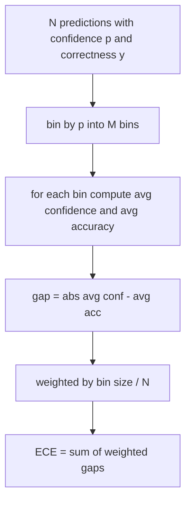
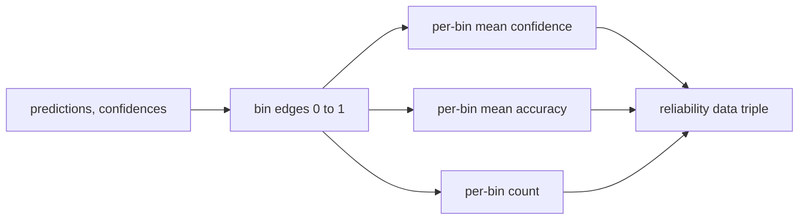

# 困惑度和校准

> 如果你的模型对1000个答案表示90%的信任,并且正确回答600个,则表明它没有经过很好的校准.校准是值得信赖的评估的一半.

**Type:** Build
**Languages:** Python
**Prerequisites:** 第 19 期 Track B 基础，第 70 和 71 课
**Time:** ~90 分钟

## 学习目标


```figure
cd-reliability-diagram
```

- 根据模型适配器提供的代币负对数概率计算保留语料库上的代币级困惑度.
- 根据分箱预测概率计算分类器或多项选择评估的预期校准误差 (ECE) .
- 计算Brier 分数 (对正确性指标的平均差) 并解释它何时执行了 ECE 不执行操作.
- 构建图形可靠性图形数据,需要图形的可靠性和准确性曲线.
- 让所有三个连接到评估线中,以便运行者可以将`perplexity`,我知道.`ece`和 `brier`编号附加到模型报告中.

## 困惑告诉你什么

困惑度是每个代币的指数平均负对数似然──越低越好──困惑度为1意味着模型为每个实际代币分配概率 1.语汇量大小的困惑意味着模型是统一的,没有学到任何东西──实际数字介于两者之间:维基文字-103 上的强大 2026年基本模型大约为8至12──同一文本上一个坏的则为50多──

这种工具本身并不计算数概率. 这些来自模型适配器. 这种工具聚合:它获取每个代币的数概率列表,每个序列的代币计数列表,并返回语料库困惑.

```python
def perplexity(neg_log_probs, token_counts):
    total_nll = sum(neg_log_probs)
    total_tokens = sum(token_counts)
    return math.exp(total_nll / total_tokens)
```

实现处理零代币边缘情况并断言对数概率是负的.`log p`而不是`-log p`适配器会产生低于1的困惑度,这是不可能的.

## 欧洲经济委员会 措施是什么

预期校准误差根据信任将预测分组到固定数量的盒子,然后测量各盒子的信任与准确之间的平均差距,并按盒子大小加权.



标准公式在`[0, 1]`上使用10个等宽的子. 实现任何正整数计数.`bins`参数,以便运营商在发布约定 (10) 和比较约定 (15) 之间进行选择.

由于ECE箱数和样本大小存在偏差. 使用10个箱和100个预测,您无法区分0.02个ECE和随机噪音.

## 分数是欧洲经济委员会没有的

如果模型对一半数据库过于自信,而对另一半数据库过于缺乏信心,则其ECE可能较低,同时本地校准也很差.

对于二元结果,Brier是`mean((p_i - y_i)^2)`△它分解为可靠性,分辨率和不确定性.

```python
def brier(p, y):
    return float(np.mean((p - y) ** 2))
```

## 可靠图数据

根据每个盒子的经验准确性绘制了预测定位.对角线是完美的定位.该函数返回三个数组:每个单元平均定位.



返回的元组是调用层绘图图或计算自定义 ECE 变体(自适应 ECE、扫描 ECE等) 所需的元组──我们返回了数组,因此下游代码不必进行转换──

## 置信来源

这种工具不假设信任来自软max.`[0, 1]`对于多项选择任务,自然置信度是`softmax over option log-likelihoods`对于自由文本来说,自然信任是模型的自我报告概率或平均对数似的指数.

## 边缘情况

- 所有预测都是错误的:ECE是平均值,Brier是高值,困惑是模型对文本的看法.
- 所有预测均以高信任度正确:ECE 接近零,Brier 接近零.
- 完全不确定的预测因素:ECE为0.5 减去准确度,Brier为0.25 减去校正项.
- 空输入:ECE、Brier 和可靠性回报`0.0`对于零代币情况,困难 返回 `NaN`,这些路径均不会发出警告;运行者检查这些值并决定是否报告或跳过.

这些案例被纳入测试中. 真实基准测试中的真实模型不会击败它们,但有缺陷的适配器或小样本会击败它们,并且运行器不应该崩.

## 调度

校准不像F1那样是针对每个任务的指标.`(confidence, correct)`对于,并计算一次 ECE、Brier 和可靠性数据――困惑在保留的文本语料库上计算,与个别任务的评分分分开放――

界面是:

```python
report = CalibrationReport.from_predictions(confidences, correct)
report.ece          # float
report.brier        # float
report.reliability  # tuple of three numpy arrays
report.populated_bins  # int
```

`PerplexityResult.from_token_nll(neg_log_probs, token_counts)`返回每个代币的困惑度和平均负数相似之.

## 本课不做什么

它不调用模型――它没有实现软max――它不估计输出标志的信任度;这是适配器的工作――它不进行温度缩放或普拉特缩放;这些是事后修复,存在于不同的课程中――本课的重点是让三个数字 (困惑度、ECE、Brier) 变得可信且可重复――

## 如何阅读代码

`main.py`定义`perplexity`,我知道.`expected_calibration_error`,我知道.`brier_score`,我知道.`reliability_diagram`和 `CalibrationReport`现在,`PerplexityResult`数据类型: 演示运行在已知基本事实的综合预测上:一个准确的良好模型,一个过度自信的模型和一个不够自信的模型.`code/tests/test_calibration.py`中的测试固定每个边缘情况以及综合预测变量的参考值.

从上到下阅读`main.py`△函数排序从标量到向量进行报告. 每个函数都有一个简短的文档字符串,其中包含数学和合同.

## 更进一步

校准是发布的评估中最容易被忽视的轴.大多数排名都会报告一个准确数字并称之为完成.一个在准确度中获胜而在Brier上失败的模型是比较准确度上得分较低但可靠地报告其不确定性模型更糟糕的生产部署. 一旦校准管道就在位,在保留的验证片上增加温度缩小,重新计算ECE,并观察间隙缩小.这是一个单独的课程,但地板就在这里.
