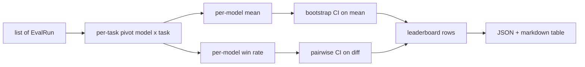
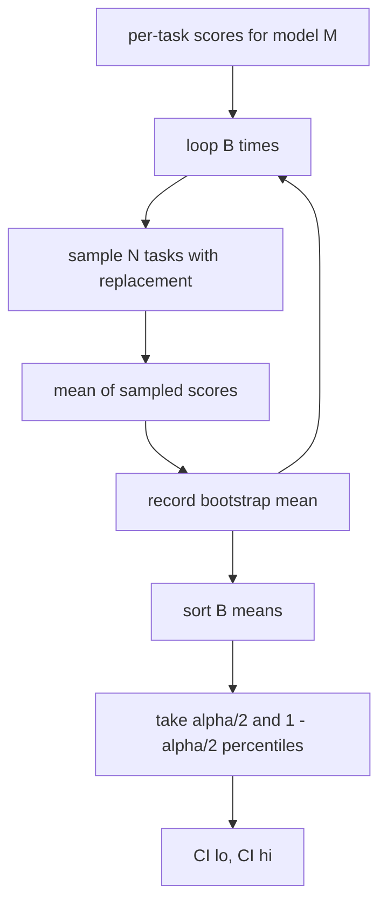

# 排行榜聚合

> 每个任务的分数很容易. 跨构造任务的每个模型排名更困难.

**Type:** Build
**Languages:** Python
**Prerequisites:** 第19期B轨基础，第70、71、73课
**Time:** ~90 分钟

## 学习目标


```figure
ci-leaderboard-ci
```

- 聚合多个模型和多个任务的每个任务分数,
- 标准化异质分数,以使通过率和蓝色值不会过度影响总计.
- 根据平均值和胜率进行模型排名,并解释每个模型何时是正确的总结.
- 计算每个模型的平均分数和成交差的引导置信区间
- 排行榜输出为JSON 报告和Markdown 表,第75课中的运行者可以将其粘贴到CI 评论中.

## 输入的形状

聚合器使用`EvalRun`记录列表:

```python
@dataclass
class EvalRun:
    model_id: str
    task_id: str
    metric_name: str
    score: float          # in [0, 1]
    category: str
```

第75课中的跑者为每一个`(model, task)`对于发出一条记录.聚合机不关心分数是如何产生的.`[0, 1]`在中.

## 输出

出来三张表:



排行榜行包含:`model_id`,我知道.`mean_score`,我知道.`mean_ci_lo`,我知道.`mean_ci_hi`,我知道.`win_rate`,我知道.`tasks_completed`以及可选的每个类别平均值`categories`地图

## 标准化

如果一个任务的得分为`[0, 1]`另一个任务的得分为`[0, 100]`则第二个任务默默地主导平均值.聚合器验证每个输入分数是否位于`[0, 1]`中,否则拒绝运行.修复位于上游:该指标应该已经返回一个分数.

## 平均值和胜率

这两种排名方案都以不同的目标为服务.

平均分数是一个模型的每个任务分数的平均值.

胜率计算模型在同一任务中击败所有其他模型的频率――对于每个任务,得分最高的模型获胜(平分)――胜率等于获胜次数除了模型得分的任务数量――它对异常值和尺度差异不太敏感,但会丢失信息――

```python
def win_rate(model_id, runs_by_task, all_models):
    wins, total = 0, 0
    for task_id, runs in runs_by_task.items():
        scores = {r.model_id: r.score for r in runs if r.model_id in all_models}
        if model_id not in scores:
            continue
        total += 1
        best = max(scores.values())
        if scores[model_id] >= best:
            wins += 1
    return wins / total if total else 0.0
```

预测: 预测: 预测: 预测: 预测: 预测: 预测: 预测: 预测: 预测: 预测: 预测: 预测: 预测: 预测: 预测: 预测: 预测: 预测: 预测: 预测: 预测: 预测: 预测: 预测: 预测: 预测: 预测: 预测: 预测: 预测: 预测: 预测: 预测: 预测: 预测: 预测: 预测: 预测: 预测: 预测: 预测: 预测: 预测: 预测: 预测: 预测: 预测: 预测: 预测: 预测: 预测: 预测: 预测: 预测: 预测: 预测: 预测: 预测: 预测: 预测: 预测: 预测: 预测: 预测: 预测: 预测:

## 自举置信区间

每个模型平均值具有通过任务进行重采采集的平均值,重采集的平均值,重复.`B`接下来,并`alpha`级别获取百分位间隔――



对于成绩来说,我们要对每个任务进行不同的指导.`score_A - score_B`用户阅读间隔是否不包括零. 如果确实如此,则差异在阿尔法水平面上显著.

低级助手`bootstrap_mean_ci`,我知道.`bootstrap_pairwise_diff`) 认为`B=1000`公共聚合器`aggregate`,我知道.`pairwise_diffs`) 认为`b=500`由于这种情况,演示和测试保持快速――默认的阿尔法值为0.05――本课程使引导程序保持纯粹的,而不是学习.

## 类别

如果设置了`EvalRun.category`聚合器还会报告每个类别的平均值.`math`,我知道.`reasoning`,我知道.`code`,我知道.`safety`,它可以让运行者发现模型是否整体良好,但代码是弱的,这是标题平均值隐藏的信息.

## 染 标记

排行榜呈现为 标记表:

```text
| Rank | Model | Mean | 95% CI | Win rate | Tasks |
|------|-------|------|--------|----------|-------|
| 1    | gpt   | 0.78 | 0.74-0.82 | 0.62 | 50 |
| 2    | claude| 0.75 | 0.71-0.79 | 0.34 | 50 |
| 3    | random| 0.10 | 0.07-0.13 | 0.04 | 50 |
```

该表按平均分排序. 关键字: 保存两位小数.长模型ID被切断为20个字符.

## 本课不做什么

它不运行模型――它不调用量级层――它不实现自适应EC或其他校准变体;这些是第73课――它没有执行任务加权――在这里,每个任务都同样重要――生产排行榜权重任务;我们通过`weight`字段将该子保持开放状态,但在聚合器中忽略它.

## 如何阅读代码

`main.py`定义了`EvalRun`,我知道.`LeaderboardRow`,我知道.`aggregate`,我知道.`bootstrap_mean_ci`,我知道.`bootstrap_pairwise_diff`和 `render_markdown`△该演示构建了一个由三个模型和十二个任务组成的综合套件,集成并打印排列表以及成对差异表.`code/tests/test_leaderboard.py`中试定了启动,标记染,胜率边缘情况和空输入行为.

从上到下阅读`main.py`△数据形状`EvalRun`,我知道.`LeaderboardRow`) 首先出现,次是聚合器,第三是启动,最后是染――每个功能都有一个聚焦的合约――

## 更进一步

自然下一步是对比任务的重要性,而不是对比不对比的引导程序――如果模型A和B都运行相同的百项任务,则适当的测试是我们实现的针对个别任务的对比引导程序――除此之外,你还需要一个尊重任务系列的分层引导程序――数学问题不是相互独立的;算术错误模式会影响其中十个――这是后续行动――本课的重点是正确的说法,以便评估你可以防范的数字――
