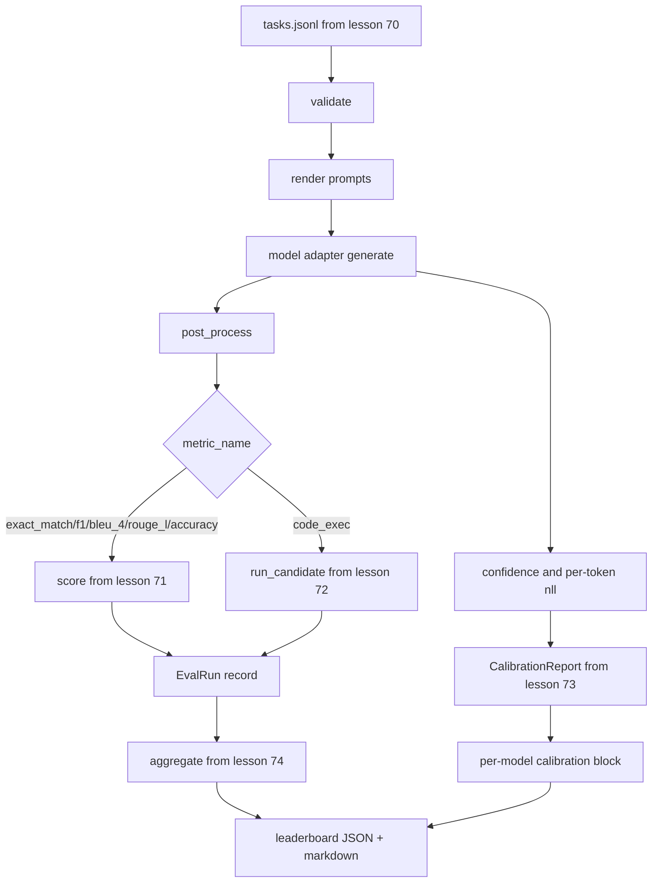

# 端到端评估运行器

> 五堂管道安装课,一堂水课――运行者读取第70课中的任务规范,通过适配器调用模型,对第71课和第72课进行评价,附加第73课中的校准报告,并发出第74课中的排行榜――演示自行终止――

**Type:** Build
**Languages:** Python
**Prerequisites:** 第 19 期 Track B 基础，第 70 至 74 课
**Time:** ~90 分钟

## 学习目标


```figure
eval-grid
```

- 定义任何模型 (模拟,本地,API) 都可以通过小方法满足表面的`ModelAdapter`接口.
- 在固定JSONL文件上运行评估,并在工作池中并行执行任务.
- 一次性将测量层 (F1、BLEU-4、ROUGE-L、code_exec) 与校准层组合在一起.
- 发出每个模型的`EvalRun`记录并将其直接输入排行榜聚合器.
- 同时输出JSON 报告和标记表;在干净运行时退出零自终止,在验证或运行时失败时退出零不零――

## 管道



运行者是整合点. 第70至74课程中的每一个课程都有一个由运行者编写的模块.

## 适配器接口

适配器是跑步机和任何模型之间的接口.

```python
class ModelAdapter:
    model_id: str

    def generate(self, prompt: str, task: TaskSpec) -> Generation: ...
```

`Generation`是一个数据类,具有:

- `text`模型的自由格式输出
- `confidence`其他:`[0, 1]`中的浮点数,表示模型自我报告的答案概率
- `token_nll`产生图的可选负对数似然总和
- `token_count`:生成的可选数量

运行器中的模拟适配器提供三种风格:`RuleBasedAdapter`(确定性,近乎完美),`NoisyAdapter`们的确很高兴.`BiasedAdapter`现在,我们在第70课时,

## 并行执行

运行者使用`concurrent.futures.ThreadPoolExecutor`按模型并行运行任务――工作线程数量认为8 和任务数量中较小的.线程就足够了,因为实际模型调用瓶是网络 I/O――代码执行路径在任务中生成自己的子进程,执行器只安排等着――

对于确定性测试,竞选者会公开`run_eval(adapters, tasks, parallel=False)`为了测试可以确定执行顺序.

## 单遍评分循环

对于每一个任务:

1. 染提示(几个枪 前加上提示正文)
2. 呼叫适配器并为呼叫计时.
3. 根据任务规则,生产进行后处理.
4. 调度到度量层――
5. 使用分数和指标元数据构建`EvalRun`记录.
6. 将`(confidence, correct)`对于附加校准缓冲区

对于精确匹配样式标志`exact_match`,我知道.`accuracy`,我知道.`code_exec`),`correct`信号是`score >= 1.0`对于分级指标,`score >= 0.5`信号是`score >= 0.5`△ 值位于`_correct_from_score`运行器不会公开覆盖.

## 聚合

每个任务得到结果后, 运营商将调用第74课.`aggregate`和 `pairwise_diffs`及第73课中`CalibrationReport.from_predictions`△输出是一个JSON信封:

```json
{
  "leaderboard": [...],
  "pairwise": [...],
  "calibration": {
    "model_id_a": {"ece": 0.04, "brier": 0.10, "populated_bins": 8, ...},
    ...
  },
  "summary": {
    "tasks": 10,
    "models": 3,
    "wall_seconds": 1.2
  }
}
```

运行者还将标记表写入标准输出,以便用户可以将结果粘贴到 PR 评论中.

## 自终止演示

演示将在第70课时的10个固定任务上运行三个模拟适配器.

清洁运行标准是:

- 第70课中验证的每项任务
- 第71课和第72课中的每项任务均计分.
- 第73课下汇总校准报告没有错误.
- 排名将基于规则的适配器严格排名随机适配器之上.

如果其中任何一个中断,运行者将以非零值退出,并出现结构性错误在JSON信封中.

## 本课不做什么

它不调用真实模型――它不实现API 密钥流或速度限制处理――它不实现流式或部分生成;适配器每次调用都会回归一代――它不进行重试或缓存――这些问题存在于适配器层;运行者与指标和提供者无关――

## 如何阅读代码

`main.py`是集成的. 它通过一个小小的.`_load_sibling`帮助程序从其他五个课程模块导入,帮助程序通过相对路径解析它们.`Generation`,我知道.`EvalReport`和 `ModelAdapter`模拟适配器位于文件的底部.

从上到下阅读`main.py`覽进口,然后查看`run_eval`然后是`_score_one`接着是适配器.最后的演示是切入点.

`code/tests/test_runner.py`中试定适配器接口"",单通道循环"",并行与顺序等效果"",校准缓冲区和JSON包网形状――

## 更进一步

运营商是地板.`(task_id, model_id, model_version)`键控制的结果缓存"",跟踪每次运行的美元和代币的成本分类账"",重试层的回退率限制"",通过-k"任务的采样策略以及长套件的流输出格式――其中每个都是一个单独的关注点,它包装运营器,而不需要改变指标或聚合层――这种分离是合同的重点――

模拟工作后,为真正的提供程序添加适配器. 选择一个免费级别,写三十行水,看看排名亮起.
