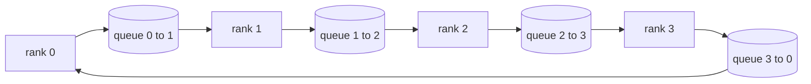

# 从零实现集体行动

> 将分布式训练结合在一起的四个集体操作是所有减少,播放,收集和减少_散布.`multiprocessing.Queue`网格上构建一次它们,根据实现验证的参考,轨道的其余部分就变成了管道.

**Type:** Build
**Languages:** Python
**Prerequisites:** 第 19 阶段 Track C 课程 42-49
**Time:** ~90 分钟

## 学习目标

- 在两次传递中实现环节所有减少,然后全部聚集)并证明每列通信量为每个元素 2(N-1) /N 字节.
- 在`multiprocessing.Queue`上的点对点发送上构建广播、全部聚集和减少_散播──
- 根据相同的输入`torch.distributed`总体来说,
- 在集群形状、延迟下限和带宽上限方面,捍卫环与树的选择.

## 问题

在N级上简单所有缩小将张量N 次发送到根并广播N 次 次.每个级别的带宽缩小为O(N),根成为瓶,并且挂钟楼层是最慢的链接乘以N. 环所有缩小将其展平为大小为T/N的2(N-1) 块,因此每个级别字节降至2T(N-1)/N,与集群大小无关. 树所有缩小在小N和高延迟链路上获胜,因为深度是log2(N) 跳而不是2(N-1) ⋅集群形状选择错误的拓展,最慢的决定时间步骤.

您将在本教程中阅读的每个分布式训练框架都取决于这些四个原语―― PyTorch DDP 将梯度与每个参数桶进行一个全减同步―― ZeRO 通过 reduce_scatter对优化器状态进行分片,并通过 allgather 广播更新参数―― FSDP 将向前变成全减_scatter 加上降_scatter――管道并行需要广播以跨阶段组激活――如果你无法实现这四个集合,你就无法推测为什么训练会停止,为什么梯度不匹配现在的3级,或者为什么在交换道管道泡会增加――

## 概念



### 分两次进行全减

将张量分为N个相等块,索引为0..N-1──每个级别 拥有与其等级相等块索引──第1遍,减少_散布,运行N-1步骤──在步骤 s,排列 r 发送块 (r - s) 调到N到位 (r + 1) 调到N,并从排列 (r - 1) 调到N 接收块 (r - s - 1) 调到N,将接收的块 积累到本地副本中──经过N-1 步骤之后,全部级别 r 拥有块 r总和和──第2次,全部收集,运行N-1 个步骤,并围绕旋转完成块,直到每个级别都保存了全部总和总和.

|原语|每 rank 字节 |步骤|何时使用 |
|-----------|---------------|-------|-------------|
|Ring allreduce| 2T(N-1)/N | 2(N-1) |大 T、fat-pipe 同构集群 |
|Tree allreduce | T log2(N) | 2 log2(N) |小 T 或高延迟链路 |
|广播| T | log2(N) 树 |参数初始化，标量配置|
|allgather| T(N-1)/N | N-1 |分片转发，ZeRO 取消分片 |
|reduce_scatter | T(N-1)/N | N-1 | ZeRO 梯度分片 |

### 队列网格作为NCCL的替代品

在PCIe和NVLink上运行,并减少了硬件卸载.`multiprocessing.Queue`为了让您与单个生产商和单个消费者交付点对点. 减少发生在用户空间中,因此您需要支付Python开销,但连接模式和NCCL环都减少了.

### 针对全球 进行验证

每个原始语言都会进行单元测试,将其输出与使用相同的小世界相同的张量进行全球后端初始化.`torch.distributed`进行比较. 如果你的环子全部减少与gloo的偏差超过float32epsilon,则测试失败.


```figure
ci-ring-allreduce
```

## 构建它

`code/main.py`实现:

- `Mesh`类,将 N 个 `multiprocessing.Queue`实例连接到环中,并按等级公开`send(dst, tensor)`和 `recv(src)`,我知道.
- `ring_allreduce(mesh, rank, world_size, tensor)`运行两遍算法――
- 在树上`broadcast(mesh, rank, world_size, tensor, src)`,我知道.
- `allgather(mesh, rank, world_size, tensor)`使用N-1轮换.
- `reduce_scatter(mesh, rank, world_size, tensor)`作为所有减少的前半部分.
- `_gloo_reference(op, world_size, tensor)`通过`torch.distributed`运行相同的输入,并使用 gloo 进行字节相等比较.

运行它:

```bash
python3 code/main.py
```

输出:比较队列网格和 gloo 输出每一个基元验证表,后面跟着一个证明 2T(N-1) /N缩小的每列节计器.

## 野外生产模式

三种模式使基元足够坚固,可以交付.

**在 allreduce 之前对梯度进行分桶。**1B参数模型有数万个梯度张量――每张量进行一次降低会支付N倍的延迟下限――DDP将梯度存储为约25MB的块,并发出一个降低;小张量骑在大张量的后面――如果不分桶,延迟开销将占主导地位――

**通信与计算重叠。**逆向以相反的顺序逐层计算梯度――当最后层的梯度准备好时,开始全部减少,同时下层继续计算―― PyTorch DDP 将其与桶就绪连接起来――当网络有置时,重叠会使可见的通信时间减少一半――

**根据消息大小而不是宗教来选择环或树。**交叉是带宽与延迟:超过1 MB,带宽项 2T(N-1) /N占主导地位,环获胜;低于1 MB,log2(N) 跳数获胜.对一种拓进行硬编码会降低错误消息大小吞吐量――

## 使用它

生产模式:

- **PyTorch DDP。**在向后调用分桶梯度上`dist.all_reduce`斗大小可调;对于100Gbit 以太网,默认25MB是合理的.
- **DeepSpeed ZeRO。**发出减散_散射来对梯度进行分片,然后在发出之前进行全部集成来重建完整参数――本课程的原语正是ZRO所做的调整――
- **FSDP.**前向从所有集 开始对层进行取消分片,计算,然后使用减少_散射 进行缩减并丢弃取消分片――同样的原语,不同的时间表――

## 发货

使用第77-81课中的队列网格原语――第77课电线全部简化为DDP――第78课将减少_散布 连接到ZRO――第79课将广播连接到管道激活中――第81课将所有内容组成端到端演示――

## 练习

1. 添加树所有变体,并根据消息大小在环和树之间切换――测量交叉――
2. 添加`recv_timeout_ms`为了使停滞的排名出现截止日期错误,而不是永远挂.
3. 总是说四个原语.`multiprocessing.Queue`替换为TCP套接字――同样的测试,真线――
4. 添加带宽检测挂,以便将每列字节计数器记录到JSONL.
5. 比较大小为1KB,1MB,16.MB的张积的4个等级的环与树的挂钟时间.

## 关键术语

|术语 |人们怎么说|它实际上意味着什么 |
|------|----------------|------------------------|
|allreduce| “跨等级总和”|调用后，每个等级都保留相同的简化张量 |
|戒指| “快速拓扑”| N-1 个大小为 T/N 的块绕周期流动两次 |
|树| “日志拓扑”|归约遵循二叉树；深度为 log2(N) 跳 |
|allgather| “连接碎片”|每个等级都以其他等级的碎片结束 |
|reduce_scatter | “平分总和”|每个排名仅以一个块的总和结束 |
|桶| “融合小张量”|将N个小的全部合并为一个大的|

## 进一步阅读

- [PyTorch 分布式：NCCL 集体](https://pytorch.org/docs/stable/distributed.html#collective-functions)
- [Horovod环全减纸](https://arxiv.org/abs/1802.05799)
- NCCL拓和算法选择]https://docs.nvidia.com/deeplearning/nccl/user-guide/docs/index.html)
- [Patarasuk 和 Yuan，带宽最优 allreduce 算法](https://www.cs.fsu.edu/~xyuan/paper/09jpdc.pdf)
- 第十阶段 第五课 - 分布式训练概述
- 第19阶段 第77课 - DDP 连接在这些原语之上
