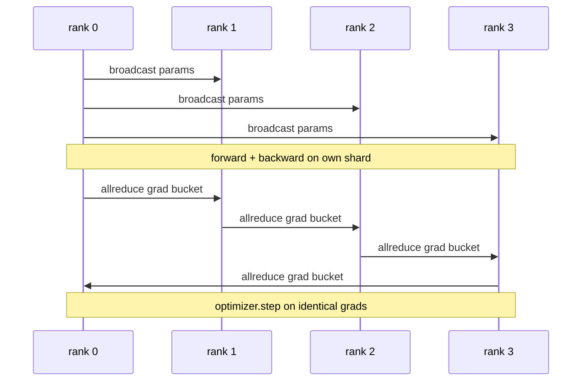

# 从一开始的数据并行 DDP

> 分布数据并行是所有降低的一个子.包装一个模型,从0级开始播出初始参数,这样每个级别都开始相同,在每个发出梯度的降低参数上安装一个向后子,剩下的就是梯度下降.整个图案有200行.

**Type:** Build
**Languages:** Python
**Prerequisites:** 第 19 期 Track C 课程 42-49
**Time:** ~90 分钟

## 学习目标

- 连接一个`DistributedDataParallel`形状包装器,该包装器播放初始参数并向后减少梯度.
- 基于文件的会议的后端排名`torch.multiprocessing.spawn`,我知道.
- 通过在相同数据上进行顺序训练, 显示每个步骤参数等效性, 证明梯度同步的正确性.
- 捍卫储备桶 (梯度融合) 和重叠 (向后通信) 的使用,将其作为将工作的DPD转变为生产DP的两个转变.

## 问题

具有12GB 激活量的1000亿参数模型不适合消费级GPU──即使适合,训练也需要数周的时间──数据并行将批次分为N个级别,每个级别计算其分片上的前向和后向,并且在每个阶段,每个级别的梯度都会相加,以便所有N个副本保持相同──求和梯度就是优化器采用的──

如果没有梯度同步,N个副本会在第二步发生分歧.该模型不再是在更多数据上训练的模型,而是巧合共享初级权重的N个独立模型.如果梯度同步不好做,每个参数都会减少,没有重叠,没有分桶),网络就会成为瓶,GPU会空等待线路.

## 概念



### 需要三个操作

|舞台|集体|为什么 |
|-------|-----------|-----|
|初始化|从排名 0 开始广播 |每个排名都以相同的参数开始 |
|后退|各梯度的 allreduce |平均梯度是优化器所采用的 |
|有时|缓冲区广播| Batchnorm 运行统计数据保持同步 |

### 为什么是平均值而不是总值

根据世界规模的平均水平,总数不变:在一级调整的学习率在四级有效,因为每步调度幅度不会改变.

### 为什么要使用桶梯度

变压器有数千个参数张量――每张量一次减小会支付全局延迟下限数千倍的费用――DDP将梯度分组到约25MB的储存桶,并发出一个减小――每个储存桶的总字节数量在线移动,但延迟在储存桶上分摊――对于本课程的小模型,我们将所有内容分组到一个桶中;结构是承载的――

### 为什么要固定种子

每个级别都必须调用`torch.manual_seed(seed + rank)`进行洗牌,但调用`torch.manual_seed(seed)`进行参数初始化.单个共享种子意味着每个级别都看到相同的批次序.参数的特定级别的种子意味着初始参数与浮动的不一致,并且梯度同步不再使副本相同.


```figure
ci-ddp-grad-sync
```

## 构建它

`code/main.py`实现:

- `MiniMLP`只有一个小的 MLP,在几秒钟内收到,大到足以暴露布线.
- `DistributedDataParallel(model, world_size)`装机的装备,其`sync_grads`将积累的全部减少 求和梯度除以世界_尺寸.
- `worker(rank, world_size, ...)`通过Gloo、前进、后退、同步、步进进行`torch.distributed`开始的完整训练循环.
- `_reference_single_process_loop(...)`测试字节相等参数等效性,用于在一个级别上按顺序训练相同的数据.

运行它:

```bash
python3 code/main.py
```

输出:每步训练表,将单个进程损失和参数校验和与4级以上运行的DDP进行比较.

## 野外生产模式

三种模式使得DP硬化到足以发货.

**查找未使用的参数。**某些转发路径有条件跳过参数 (前退出),但DDP的桶式子仍然等待它们,并将所有死锁减少.`find_unused_parameters=True`告诉DP在减少之前查看哪些参数获得梯度. 成本是每一步的图形走路,所以除非你的前向分支,否则不要考虑它.

**静态图优化。**当转发跨步骤稳定时,`static_graph=True`让DDP预先计算储备桶调度――优化规模很重要:预计算每一步节省了几毫秒,这在10,000步中复杂――

**梯度累积需要小心。**通过 K 微批次的累积梯度不同步骤,每个微批次可实现10倍的吞吐量提升.`no_sync()`为了暂停后向所有减少,你忘记管理,你就白白减少了K次;吞吐量下降到最低点.

## 使用它

生产模式:

- **PyTorch DDP。**规范的实现.`torch.nn.parallel.DistributedDataParallel(model)`连接分桶、重叠和没有同步 上下文──
- **HuggingFace Accelerate。**添加一个处理`torchrun`环境变量和模型包装的启动器――底层的DP相似――
- **Megatron-LM 数据并行。**将DDP和张量并行结合起来用于大型模型;数据并行部分是相同的全部减后后退模式.

## 发货

第78课 (ZeRO 分片) 将每个参数的全部减小替换为减散,因此每个级别只存储其优化器状态的分片. 第81课将DDP与ZeRO组合成端到端演示.

## 练习

1. 添加可配置的大梯度桶,并与每个参数进行更深层次的模型测量,
2. 将`no_sync()`实现为上下文管理器,并验证梯度累积与K个微批次单个进程基线相匹配.
3.添加`find_unused_parameters`模式,其中前向有时跳过其中一个MLP层;如果没有该标志,运行将陷入局.
4.将将gloo替换为`torch.distributed.barrier()`只有步骤,感觉在基于所有减少的步骤和基于障碍的步骤的区别.
5. 测量批量大小为1、16、256 的梯度同步开销作为步长时间的一部分,并解释缩小比例.

## 关键术语

|术语 |人们怎么说|它实际上意味着什么 |
|------|----------------|------------------------|
|DDP | “数据并行” |广播参数并减少每一步梯度的包装器 |
|桶| “保险丝梯度”| N组小都化为一大|
|重叠| “隐藏通讯” |当后面的层仍在向后计算时发出 allreduce |
|无同步 | 「积累」|跳过后向 allreduce 进行梯度累积 |
|查找未使用的 | “分支前进”|减少之前检测无梯度的参数 |

## 进一步阅读

- [PyTorch 分布式数据并行文档](https://pytorch.org/docs/stable/generated/torch.nn.parallel.DistributedDataParallel.html)
- PyTorch DDP内部教程]https://pytorch.org/tutorials/intermediate/ddp_tutorial.html)
- [Li等人，PyTorch分布式：加速数据并行训练的经验](https://arxiv.org/abs/2006.15704)
- 第19阶段 第76课 - 建立的集体
- 第19阶段 第78课 - ZeRO 分片将每个参数的全部减少 换成减少_分散
