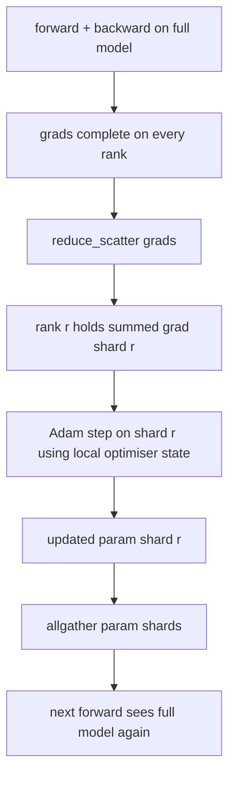

# 优化器状态分片

> 亚当为每个参数存储两个矩阵估计,均以 float32 形式存储. 7B 参数模型携带56GB的优化器状态. ZeRO 第一阶段分片跨越N 个级别;每个级别拥有1/N的优化器. 在本地步骤后,更新的参数分片播放回来,每个级别重建完整的模型,然后开始下一步.

**Type:** Build
**Languages:** Python
**Prerequisites:** 第 19 期 Track C 课程 42-49
**Time:** ~90 分钟

## 学习目标

- 个级别的碎片优化器状态 ((第一时刻、第二时刻、fp32 主副本),因此每个级别拥有1/N。
- 使用减少_散射器只传递每个级别的分片的梯度和,然后所有集将更新的参数分片播回来.
- 根据普通DP 计算阶段 1 阶段 2 阶段 3 的内存节省表.
- 在模型大小和宽带预算上捍卫第一阶段,第二阶段和第三阶段的选择.

## 问题

尼拉DP 复制了一切:参数,梯度和优化器状态在每个级别上都完整存在.对于fp16中的7B参数模型,这意味着每个级别14GB参数,14.GB梯度和28GB优化器状态.优化器状态是最大的术语,也是最容易分片的,因为它仅触及在步骤期间,而不是在前进或后退期间触及.

泽罗第1阶段对优化器状态进行分片――每个级别拥有1/N的亚当时刻――向后,泽罗不会减少整个梯度并进入本地步骤,而是减少_散射,因此每个级别只接收其分片的梯度总和―― 排名将将优化器步骤应用于其主参数分片――更新后的参数碎片然后全部收集,以便每个级别具有下一个前进的完整模型―― N. 优化器内存下 N. 每个步骤的线路流量减少与 DDP 相等:1 减少_散射加上1 整合等1 带所有减少乘以宽度――内存获胜,吞吐量保持不变――

## 概念



### 泽罗的阶段

|阶段|分片对象 |每 rank 内存|每 step 通信|
|-------|----------------|------------------|---------------|
| DDP |无 |params + grads + optim | 1x allreduce |
| ZeRO-1 |optimizer state |params + grads + optim/N | 1x reduce_scatter + 1x allgather |
| ZeRO-2 |optim + grads |params + grads/N + optim/N | 1x reduce_scatter + 1x allgather |
| ZeRO-3 |optim + grads + params |params/N + grads/N + optim/N |每层 1x allgather + 每层 1x reduce_scatter |

第一个阶段是成本最低的胜利,因为优化状态主导了预算. 第二阶段需要梯度分片累积逻辑,但带宽相同. 第三阶段 (FSDP) 为每一个前向和后向支付每个层次通信费用,从而获得参数分片内存下降.

### 记忆数学,实数

对于使用Adam 以混合精度训练的具有P参数模型:

|术语 |vanilla|ZeRO-1 |为什么 |
|------|---------|--------|-----|
| fp16 参数 | 2P字节| 2P字节|需要转发|
| FP16 梯度 | 2P字节| 2P字节|需要落后|
| fp32 母版 | 4P字节| 4P/N 字节 |只有最优化的人才会使用它 |
| fp32 第一时刻 | 4P字节| 4P/N 字节 |只有最优化的人才会使用它 |
| fp32 第二时刻 | 4P字节| 4P/N 字节 |只有最优化的人才会使用它 |
|总计 | 16P字节| 4P + 12P/N 字节 |   |

时:尼 16P,ZeRO-1 5.5P,降低65%── N=64 时:尼 16P,ZeRO-1 4.19P,降低74%.──

### 为什么减少_散射 优于所有减少-然后-碎片

降低为每个级别提供完整的求和梯度.如果只需要分片r,则减少的梯度的(N-1) /N会浪费在r上.


```figure
cd-zero-shard
```

## 构建它

`code/main.py`实现:

- `flatten_params(module)`和 `unflatten_into(module, flat)`将模型的参数包装成连续的张量并解压回来.
- `ZeroOptimizer(model, world_size, rank, lr)`拥有主副本和当时的等级碎片.
- `step()`在平坦梯度上运行减少_散射,将亚当应用于排名分片,并将更新参数全部收集回来.
- 一个演示,训练3层MLP20个步骤,并打印每个步骤的内存预算以及普通的DP基线.

运行它:

```bash
python3 code/main.py
```

输出:每步损失和内存表显示 ZeRO-1 与 DDP 的完整副本相比,在每个级别保持1/N 的优化器状态.

## 野外生产模式

让ZERO 足以交付.

**分片检查点很重要。**泽罗-1的优化器状态按级别划分;检查点必须记录哪个级别拥有什么. 第80课构建了分片检查点清单,该清单在同一世界小时恢复了泽罗运行.

**混合精度是重点。**泽罗是一种混合精度技术; fp32 主副本是分片的. 在没有混合精度的情况下运行,泽罗将给 fp32 主人带来内存税,而没有相应的 fp16 前向胜利.

**第一阶段几乎是免费的。**通信在带宽方面与DDP相似.内存节省与N 成线性关系. 唯一的成本是优化器分片的账记.

## 使用它

生产模式:

- **DeepSpeed ZeRO。**为了实现.`deepspeed_config.json`选择阶段 1/2/3 和分区大小──
- **PyTorch FSDP。**火原生等效项`ShardingStrategy.SHARD_GRAD_OP`是ZERO-2; `FULL_SHARD`是ZERO-3.
- **HuggingFace Accelerate。**将深度速度和FSDP封装在统一配置下.

## 发货

第79课) 管道并行) 是正交分片轴:管道不是跨同一模型对优化器状态进行分片,而是跨等级进行分片. 第81课在端到端演示中组成了DDP + ZeRO.

## 练习

1.通过分片梯度扩展到ZeRO-2:每个级别仅存储其分片梯度,通过反向后将非分片部分清零实现.
2. 添加一个内存分析器,用于打印0级的实际fp32字节使用情况和公式预测情况.
3. 测量普通DDP与ZRO-1的每步挂钟时间,并将其分解为前向、后向、通信──
4. 在 ZeRO-1 下实现梯度剪切:必须通过局部范数平方的全部减小 跨所有分片计算 L2 范数――
5. 使用所有减少而不是减少_散射 实现创新 ZeRO,测量线路时间差异――用数字来捍卫减少_散射的选择――

## 关键术语

|术语 |人们怎么说|它实际上意味着什么 |
|------|----------------|------------------------|
|ZeRO-1 | “优化器分片”|每个等级拥有 1/N 的 fp32 master + Adam 时刻 |
| ZeRO-2 | “grads 也分片”|每个 rank 在 reduce_scatter 后也会丢弃非本分片的梯度 |
|ZeRO-3 | “分片参数” |每个等级保存 1/N 的 fp16 参数；向前每层allgather |
|master copy| “fp32 权重”|高精度参数复制优化器更新|
|reduce_scatter | “平分总和”|仅提供每个等级其分片的梯度总和 |

## 进一步阅读

- [Rajbhandari 等人，ZeRO：训练万亿参数模型的内存优化](https://arxiv.org/abs/1910.02054)
- [DeepSpeed ZeRO 文档](https://www.deepspeed.ai/tutorials/zero/)
- [PyTorch FSDP 文档](https://pytorch.org/docs/stable/fsdp.html)
- 第19阶段 第76课 - 本课所涉及的减少_分散和全集
- 第19阶段 第80课 - ZeRO 状态必须使用的分片检查点
