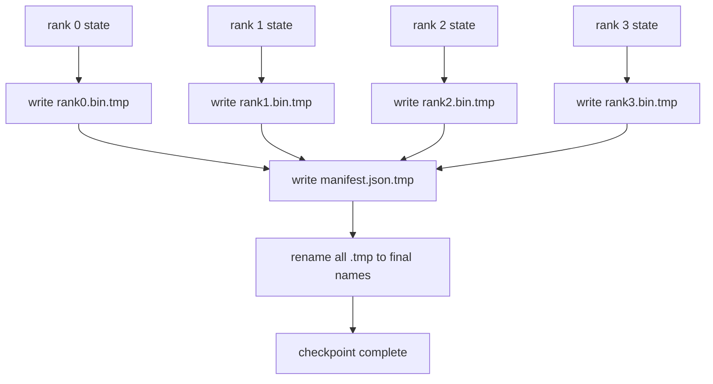

# 分片检查点和原子恢复

> 每隔几个小时就会因为节点故障而暂停70B参数的训练作业――检查点的形式决定你是损失30分钟还是30小时――分片检查点并行写进每个级别的分片,并记录所有权在清单中――恢复从自己的文件中加载每个级别的分片,重建在相同的世界小时状态,并且优化器就像没有发生任何事情一样――原子写入可以防止半个完成检查点毒害下一个恢复――

**Type:** Build
**Languages:** Python
**Prerequisites:** 第 19 期 Track C 课程 42-49
**Time:** ~90 分钟

## 学习目标

- 另存多级检查点,为每个级别的分片文件以及记录哪个级别有什么清单.
- 使用原子写入模式 (写入临时路径然后重新命名),因此写入过程中的崩永远不会产生半完成的检查点.
- 从清单中恢复,验证每个级别的fp16 参数和 ZeRO 优化器状态的字节相等状态.
- 保护清单架构免受三种故障模式的影响:全局大小变更,分片计数不匹配和部分写入.

## 问题

通常检查点将所有参数和优化器状态读到0级,收集并写入单个文件.对于70B型号,通过一级网络端口提供1.1TB的状态.写入会阻所有其他级别,因为它们空等待收集. IO 带宽是最慢的单个GPU 网络链接,而不是聚合带宽. 在真实集群中,收集然后写入步骤可能需要比以前的训练时间更长的时间,这意味着每个训练日的运作传输检查点都少于一个.

分片检查点翻转模式:每个级别将自己的分片并行写入自己的文件.清单记录了哪个级别拥有哪个分片,因此恢复可以将每个分片放回其来源处.

## 概念



### 清单架构

```json
{
  "world_size": 4,
  "step": 1234,
  "wall_clock_seconds": 4521,
  "shards": [
    {"rank": 0, "path": "rank0.bin", "sha256": "...", "param_shard_offset": 0, "param_shard_numel": 65536},
    {"rank": 1, "path": "rank1.bin", "sha256": "...", "param_shard_offset": 65536, "param_shard_numel": 65536}
  ],
  "schema_version": 1
}
```

三场都是承重的.`world_size`让不同小的简历大声失败,而不是默默地损坏.`sha256`抓取部分或损坏的写入.`param_shard_offset`和 `param_shard_numel`让载体在正确位置重建平面参数张量.

### 原子写入

标准模式:将每个分片写入`<name>.tmp`清单写入`manifest.json.tmp`后续重新命名. 后续重新命名. 后续重新命名是原子的. 新文件完全存在,旧文件完全存在. 后续重新命名之前的崩将使前一个检查点成为活动检查点. 如果没有原子写入,崩可能留下一个带着指向它的当前清单的部分分片,并且在恢复时会破坏优化器状态.

### 模式必须防御的三种故障模式

|失败|症状|防御|
|---------|---------|---------|
|世界规模的变化|在 N=8 上恢复，并从 N=4 开始清单 |清单中的 world_size 不匹配，大声失败 |
|分片数量不匹配 |resume 看到的 rank*.bin 文件少于 manifest 中的分片 |枚举分片，验证每个分片都存在 |
|部分写入|分片文件在刷新过程中被截断|加载时进行 sha256 验证 |

每个防御都会尽早拒绝负载;另一种选择是静默损坏,当损失变为NaN时,100步后就会出现这种损坏.

### 为什么每一个级别的文件,而不是一个大文件

通过`O_APPEND`对于一个文件的发发写适用于POSIX字节对齐写入,但实际上,一个分片内的偏移量跨越MB大小的区域,并锁定占主导地位.当底层文件系统是并行的时,每个级别的文件都没有争议,并且可以从条带化中受益.因此,生产文件堆 (DeepSpeed,FSDP,NeMo) 都使用每级别.


```figure
ci-sharded-checkpoint
```

## 构建它

`code/main.py`实现:

- `ShardManifest`数据类,具有上述结构加上`to_json`现在,我们要去.`from_json`,我知道.
- `save_sharded(state_dict_per_rank, dir, step)`使用原子临时然后重新命名模式将每个级别的二进制状态写入其自己的文件,然后写入清单.
- `load_sharded(dir, expected_world_size)`读取清单,验证每分片的第256页,并返回每个级别的状态字典.
- 往返测试:构建每列状态、保存、加载、断言字节相等──

运行它:

```bash
python3 code/main.py
```

输出:4 个分片文件以及写入清单,然后通过字节相等验证重新加载.

## 野外生产模式

三种模式使检查点足够坚定进行运输.

**异步写入。**生产堆 在单独的线程或过程中发出检查点写入,以便训练继续进行.障碍位于下一个检查点:在前一个保存完成之前不要开始下一个保存.`async_io`标志正是这样做.

**先本地快速磁盘，然后异步上传。**写入本地NVMe(快速),然后异步上传到S3或GCS──两层模式使集群内检查点能够快速恢复,同时将持久副本发送到集群外进行存档──清单携带本地路径;上传清单携带远程路径──

**轮换很重要。**生产运行保留最后的 K 个检查点 (通常为3-5个) 并轮换最早的检查点. 如果不轮换,磁盘会在运行中填满,并且下一个检查点会失败.

## 使用它

生产模式:

- **DeepSpeed 检查点。** `deepspeed.save_checkpoint(tag=step)`写入每个级别的文件和指向活动标签`latest`文件.
- **PyTorch FSDP 检查点。** `torch.distributed.checkpoint`使用决定每个级别的布局`Planner`保存分片状态――
- **NeMo.**使用添加元数据的统一`save_to_checkpoint`封装深度速度和FSDP

## 发货

第81课保存了DDP+ZeRO运行的分片检查点,并重新加载在同一世界小时,以证明恢复契约成立.

## 练习

1. 添加异步写入:在线程中启动保存并让训练继续――阻止下一次保存,直到下一次保存完成――
2. 添加`last_5_steps`轮换:保留5个最近的检查点,删除最旧的检查点,然后保存新的检查点.
3. 转转将检查点滚动为新的活动检查点,无需完整的 sha256) ⋅
4. 添加跨世界小的负载:通过读取清单、连接和重新分片,将分片从N=4重新平衡到N=8──
5. 将上传添加到假S3(第二目录)并编写上传清单――捍卫两层存储策略――

## 关键术语

|术语 |人们怎么说|它实际上意味着什么 |
|------|----------------|------------------------|
|分片检查点 | “按等级保存”|每个rank并行写入自己的分片文件|
|清单 | “索引”|记录分片路径、偏移量和 sha256 的 JSON 文件 |
|原子写| “tmp 然后重命名” |写入 .tmp，然后 POSIX 重命名，以便崩溃使先前的文件保持活动状态 |
|部分写入| “截断的碎片” |写入过程中的崩溃会产生损坏的分片； sha256 抓住它 |
|旋转| “保留最后 K”|在写入新检查点以限制磁盘使用量之前删除最旧的检查点 |

## 进一步阅读

- [DeepSpeed 检查点](https://www.deepspeed.ai/tutorials/checkpointing/)
- [PyTorch torch.distributed.checkpoint](https://pytorch.org/docs/stable/distributed.checkpoint.html)
- [POSIX重命名原子性](https://pubs.opengroup.org/onlinepubs/9699919799/functions/rename.html)
- 第19阶段 第78课 - 此检查点旨在保存的ZRO状态
- 第19阶段 第81课 - 端到端演示往返保存的状态
