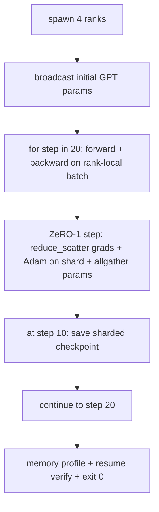

# 端到端分布式训练

> 第76 课到第80 课各拼了一件作品──这是组件:一个在4个模拟队列上训练的微型GPT,使用DDP进行梯度同步,ZeRO-1用于优化器状态分片,以及中间代币处的分片检查点──演示运行20个步骤,自动终止,打印损失曲线和内存配置文件,并写入可恢复检查点──

**Type:** Build
**Languages:** Python
**Prerequisites:** 第 19 期 Track C 课程 42-49
**Time:** ~90 分钟

## 学习目标

- 将DPDP(第77课) 加上ZERO-1(第78课) 加上分片检查点(第80课) 组成一个训练循环──
- 在小型合成语料库上训练2层变压器语言模型,跨4个模拟等级进行20个步骤.
- 印出每一步丢失表,每列内存配置文件以及在同一小时恢复字节相等的检查点清单.
- 捍卫作文:每件作品都可以在之前的课程中独立测试,本课证明它们是作曲的.

## 问题

石是各部分组合的证据. 第76课实施集体. 第77课将它们纳入DDP. 第78课使用减少_分散 分片优化器状态. 第79课分析管道. 第80课保存一个分片检查点. 每节都有自己的测试. 真正的训练运行会同时使用每个原语. 如果组合错误,损失会散发,检查点拒绝恢复,或者每个列内存在应该缩小,但会增长.

本课程运行端到端演示并验证四个不变量: (a) 损失在浮动噪音中的20个步骤中单调减少, (b) 每个阶段在每个步骤中都保持相同的参数范数, (c) 每个阶段优化器内存等于ZERO-1公式12P/N字节,以及 (d) 步骤10处检查点在重新启动时重新加载字节阶段等.

## 概念



### 迷你GPT

该模型故意很小:2个变压器块,嵌入式32、4个注意力头,词汇64、序列长度16、批次4、几千个参数――足够大执行每个连线决策(多头注意力运行标准屏蔽路径;LayerNorm需要同步权重;LM头是返回词汇的单独线性投影) ・足够小,4个CPU级别的20个步骤可以在几秒内完成――

### 组成规则

|课程片段 |它拥有什么 |它留给循环什么？
|--------------|--------------|----------------------------|
| DDP广播 |初始参数同步 |构建时一次调用 |
| ZeRO-1 步骤 |梯度同步、母版更新、参数广播 |每一步调用一次，替换 optimiser.step |
|分片检查点 |保持每等级状态，用 sha256 体现 |通过 allgather 收集状态，调用等级 0 |
|训练循环 |向前、向后、丢失记录 |按顺序调用以上三个 |

循环不知关于减少_散射或约会文件.

### 为什么是小型GPT而不是仅仅是MLP

第77课中的MLP足以验证梯度同步――一个小的GPT添加了三个东西:词汇上的单独的LM头在本课中,为了清晰的起见,将解开;完整的GPT通常将头与代币嵌入联系起来 (起来),软max+交叉作为损失 (比MSE更多的数值边缘情况),以及一个不对称的前向嵌入,然后是注意力,然后是每个层的MLP) 坚持使用MLP作为Capstone 隐藏合成是否正确处理LayerNorm或嵌入层的渐变形状.

### 自终止意味着退出 0

循环运行固定20步并退出没有`while True`没有人干预,没有从外部状态恢复.你可以在无人值守的情况下运行,完成后找到完整日志的石是证明系统连接正确的石.如果任何部分陷入局,演示永远不会回来,并且测试装置会捕获它.


```figure
ci-distributed-assembly
```

## 构建它

`code/main.py`实现:

- `MiniGPT`具有屏蔽自注意力和独立的LM头的2层变压器.
- `make_corpus(seed, total_tokens)`确定性的下一个预测数据.
- `_train_worker`根据阶级生成;广播初始化参数,运行循环,调用 ZeRO 步骤,在步骤 10 写入分片检查点──
- `verify_resume`运行后,重新加载过程中的第10步检查点,并断言保存的主分片与内存中快照逐字节匹配.
- `main`编排整个演示,打印丢失表,内存配置文件和验证结果.

运行它:

```bash
python3 code/main.py
```

输出:20 行丢失表,4 行每列内存配置文件,检查点清单以及成功时的简报验证行行.

## 野外生产模式

三种模式完成了真实运行的构图.

**每 K 分钟检查一次，而不是每 K 步骤一次。**步骤时间随着长度和微量计量而变化――不管模型大小如何,10 分钟的检查点节奏都会捕获相同的计算――为了简单地看,本课程使用步骤的方法;生产采用挂钟为主――

**及早检测分歧。**生产运行后面添加了NAN 防护和丢失尖峰检测器;如果损失在一步跳跃超过2倍,则回滚到前一个检查点,而不是让优化器进入退化状态――本课程的损失曲线很平滑,因此防护装置未使用,但子保留――

**跨等级聚合内存配置文件。**每个级别内实际运行中因级别不同 ((具有最大管道阶段的级别具有更多活跃) ◎生产记录各级别的最大值加上平均值;本课程按级别打印以显示公式匹配──

## 使用它

生产模式:

- **DeepSpeed.**在一个配置下结合了DDP + ZeRO + 管道 + 激活检查点――本课程的构图是DeepSpeed 形状的缩影――
- **PyTorch FSDP。**本机等效项.`FullyShardedDataParallel`和 `ShardingStrategy.SHARD_GRAD_OP`是ZERO-2.
- **NeMo 和 Megatron-LM。**为最大的模型添加张量并行;否则,组合的形状相同.

## 发货

完整曲目到此结束. 这六个课程共同构成了真正的团队在采用深度速度之前将构建的分布式训练子系统. 这种抽象已经针对全球,已经得到证实,故障模式已经得到运用.

## 练习

1. 增加注意力头的张量并行分并验证损失与单排基线匹配──两级:每级一半人头,注意力输出都减少──
2. 添加4个微批次梯度积累,并证明梯度等于一个大批次梯度.
3. 添加一条从步骤10开始恢复的路径,该路径实际上继续训练到步骤20,并产生与原始运行相同的最终损失.
4. 将标标导出 (损失,梯度范数,步时间) 添加到JSONL,以便事件后可视化运行.
5. 添加一个NaN 防护,在丢失峰时回滚到前一个检查点,并使用单步LR 乘数强制峰执行回滚.

## 关键术语

|术语 |人们怎么说|它实际上意味着什么 |
|------|----------------|------------------------|
|端到端| “将一切连接起来”|一次运行构成了每个部分，而不是每个部分的单元测试 |
|内存简介 | “每级 GB”|每个等级上保存的参数、梯度、优化器状态的字节数 |
|简历合同 | “保存并加载”|检查点往返后每列状态字节相等 |
|自动终止 | “有界奔跑”|固定步数，完成后退出 0，循环中没有人 |

## 进一步阅读

- 深度端到端训练教程]https://www.deepspeed.ai/getting-started/)
- PyTorch FSDP进阶教程](https://pytorch.org/tutorials/intermediate/FSDP_advanced_tutorial.html)
- Megatron-LM训练脚本参考]https://github.com/NVIDIA/Megatron-LM)
- 第19阶段 第76-80课 - 本课组成的每首曲子
- 第十七阶段 - 将组合移动到真实集群
