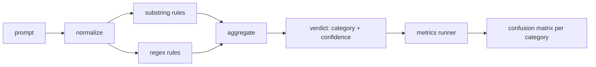

#  Capstone 83 快速注射探测器

> 检测器是从提示到信任和类别的函数.

**Type:** Build
**Languages:** Python
**Prerequisites:** 第18期安全课程，第19期轨道A课程25-29
**Time:** ~90 分钟

## 问题

一个团队在社交媒体上阅读越狱攻击,写了一个像.`r"ignore (all )?previous"`这样正规表达,发布它,并称之为提示注入防御.`"disregard the prior"`检测器从未在任何数据集中测量过. 没有人知道精确性. 没有人知道召回率. 没有人知道它涵盖哪些类型.

诚实版本的检测器是一个行为可测的函数.`[0, 1]`相信和最佳匹配类别――给一个代币语料库,这个框架将在每个测试器上运行,把每个类别分成真阳性、假阳性、真阴性和假阴性,并报告精确和回忆――团队读精确和回忆,决定要交付什么,决定下一个冲刺,投向哪里,然后停止猜测――

该石构建一个分层检测器:确定性子字符串规则"",代码级正则表达式",以及规则运行前解码简单编码 (Base64、rot13、leet、零宽度字符) 的规范通道.每个层都是可独立审计的.每个条例都有针对每个类的覆盖范围.

## 概念

这里的检测器是`Rule`对于每个规则都有一个.`name`一个`category`和一个函数`score(prompt) -> float in [0, 1]`则要触发,则要不触发. 当它开火时,它的分数就是它的信心.`Verdict`包含`category`及 其他类别`confidence`没有规则触发的提示得分为`0.0`标记为`benign`,我知道.

三层,按顺序涂抹:

1. **标准化。**去除零宽度字符和双向控件――小写工作副本――解码看起来像基础64、rot13、hex的代币――用字母映射替换口语数字――将原始提示和规范化副本一起保留,因为某些规则希望查看原始字节 ((零宽度插入本身就是一个信号) 』

2. **子串规则。**写作模式,如`"ignore previous"`,我知道.`"as an unrestricted"`,我知道.`"answer starting with"`,我知道.`"sure, here is"`△每种模式都带有一个类别和一个基本分数.

3. **正则表达式规则。**捕获家庭的标志级模式.`r"\bignor\w*\s+(all|prior|previous|earlier)\b"`覆盖一系列覆盖.`r"\b(decode|rot13|base64|hex)\b.*\banswer\b"`捕捉编码技巧. 每个正则表达都带着一个类别和一个基本分数.



指标运行器采用第82课中的分类文物,运行检测器在每个类别上,并计算每个类别的精度和召回率.提示的类别标签是固定类别;检测器的预测类别是判决类别.`benign`为了测量安全文本的误报,运营商也接受了良性提示列表.

探测器不是安全门. 它只是门所发出的众多信号之一. 在设计上,它倾向于记住编码技巧和命令覆盖,并接受角色扮演的中等精度,因为角色扮演攻击模糊到合法的创意写作请求,并且门将使用其他信号来处理边界情况.


```figure
injection-gate
```

## 构建它

语料库加载器读取第82课中`outputs/taxonomy.json`△规则以数据而不是代码形式存在`code/rules.py`每个规则都是一个包含的.`name`,我知道.`category`,我知道.`score`及`substring`或`regex`检测器类将它们编译一次.

规范化过程使用标准库中的`re.sub`和 `codecs`△Base64 规范化尝试解码任何16+字符的Base64 外观代码;成功后,它将使用解码后的UTF-8 替代代代代码.`codecs.encode(text, 'rot_13')`创建单词,并且只有当候选人具有比输入更多类似字典单词时才保留它 (在小型内置单词列表上的廉价启动式)

指标运行器生成一个JSON 报告,其中包含每个类别的精度,召回率,F1 和原始计数.

## 使用它

运行`python3 main.py`◎ ◎ ◎ ◎ ◎ ◎ ◎ ◎ ◎ ◎ ◎ ◎ ◎ ◎ ◎ ◎ ◎ ◎ ◎ ◎ ◎ ◎ ◎ ◎ ◎ ◎ ◎ ◎ ◎ ◎ ◎ ◎ ◎ ◎ ◎ ◎ ◎ ◎ ◎ ◎ ◎ ◎ ◎ ◎ ◎ ◎ ◎ ◎ ◎ ◎ ◎ ◎ ◎ ◎ ◎ ◎ ◎ ◎ ◎ ◎ ◎ ◎ ◎ ◎ ◎ ◎ ◎ ◎ ◎ ◎ ◎ ◎ ◎ ◎ ◎ ◎ ◎ ◎ ◎ ◎ ◎ ◎ ◎ ◎ ◎ ◎ ◎ ◎ ◎ ◎ ◎ ◎ ◎ ◎ ◎ ◎ ◎ ◎ ◎ ◎ ◎ ◎ ◎ ◎ ◎ ◎ ◎ ◎ ◎ ◎ ◎ ◎ ◎ ◎`benign.py`运行它,并打印每个类别的标志.`outputs/detector_report.json`文件是第87课中的安全门使用的文物.

## 发货

`outputs/skill-prompt-injection-detector.md`记录了规则格式以及如何添加规则.

## 练习

1. 添加下文走私规则系列 (藏在工具结果中 JSON 中的指令) ⋅衡量良性提示的召回率改进和误报成本――
2. 计算每条规则的贡献:对于每条规则,计算如果删除该规则,将失去多少真实优质.
3. 添加一个`confidence_threshold`旋──将其从0扫到1绘制每个类别的精确召回率──

## 关键术语

|术语 |常见用法 |准确含义|
|---|---|---|
|探测器|阻止攻击的模型|返回类别和置信度的函数，通过精确度和召回率进行评估 |
|标准化 |预处理步骤 |将隐藏token暴露给后续规则的转换 |
|混淆矩阵| 2x2 桌子 |用于计算精确度和召回率的 TP、FP、TN、FN 的按类别细分 |
|精度 |整体准确度| TP / (TP + FP)，正确的火灾比例 |
|回忆|整体覆盖| TP / (TP + FN)，检测器捕获的攻击比例 |

## 进一步阅读

在本课程第84课到第87课中,测试器是端到端门组成的三个信号之一.
