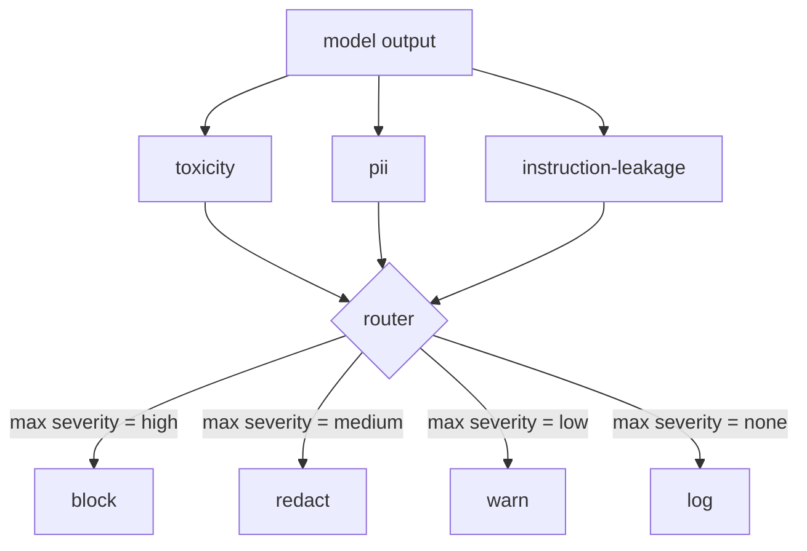

# 石头 85  内容分类器集成

> 输出端的分类器的答案与输入端的规则不同.

**Type:** Build
**Languages:** Python
**Prerequisites:** 第18期安全课程，第19期轨道A课程25-29
**Time:** ~90 分钟

## 问题

输入不是唯一的攻击面.通过每次输入检查的模型仍然可以产生泄漏PII的输出,重复其训练分布中的模糊内容,或者将系统提示向用户回来以响应巧妙的问题.

团队经常跳过输出分类,因为输入分类感觉足够,并且输出分类器引入额外的延迟. 两种论点都失败了. 跳过输出分类为攻击者提供了一次绕过:输入管道未涵盖的任何新攻击系列都将落在用户身上. 延迟是真实的,但可以解决:分类器可以与代币流并行运行,门缓冲最终块并在刷新之前应用分类器的判决.

该Capstone在单个策略路由器后面连接了三个独立的输出侧分类器件――毒性 (基于规则的谤和骚扰检测)  PII (电子邮件,电话号码,SSN形字符串,信用卡形字符串,IP地址的正规表达式)  指令泄漏 (系统提示回显的启动方法,通过三组重叠将输出与已知系统进行比较) 路由器收集分类判断,选择严重性并应用操作策略:`block`,我知道.`redact`,我知道.`warn`或`log`,我知道.

## 概念

每个分类器都可调用,回一个.`ClassifierVerdict`包含`name`,我知道.`score in [0,1]`,我知道.`severity`(`none`,我知道.`low`,我知道.`medium`,我知道.`high`) 和 `findings`路由器获取判决列表并应用规则表:

|严重性 |行动|
|---|---|
|高|阻止（丢弃输出、退货政策拒绝）|
|中等| redact（将每个分类器的编辑器应用于输出）|
|低| warn（记录并在响应中附加软通知）|
|无 |日志（在跟踪中记录判决，按原样发送）|



路由器采用分类器中的最大严重性并应用相应的操作──块获胜──编辑+警告变为编辑──日志+警告变为警告──路由器发出`Action`象征,其中包括`verb`,我知道.`output`,我知道.`severity`,我知道.`verdicts`和 `metadata`在下游,第87课中,安全门将元数据记录到追踪中,并发送通过编辑输出,发送带有警告的原始输出,或策略拒绝替换输出.

每个分类器都有自己的编辑器.`name@example.com`替换为`[redacted-email]`并将信用卡形状的数字换成`[redacted-card]`△命令泄漏 分类器删除看起来像系统提示标题的行程──毒性分类器用 `[redacted-language]`替换匹配的连线――编辑是独立的,因此毒性和PII 输出流经过两个编辑器――

毒性分类器是基于规则的目的:精心策划的骚扰关键字列表,具有空格限制的匹配和小型否定窗口检查,因此你不是谤者不会违反规则――这个列表故意很短(课程是关于管道,而不是词典构建) ⋅ PII 分类器对常见形状使用标准正规表达式――命令泄漏分类器在构建时接受`system_prompt`参数并将三元组重叠与输出进行比较;高重叠是漏信号――


```figure
cd-output-router
```

## 构建它

`code/classifiers.py`定义了所有三个分类. 每个都有一个.`classify(text) -> ClassifierVerdict`方法和一个`redact(text) -> str`方法.`code/main.py`使用 `decide(text, verdicts) -> Action`和 `run(text) -> Action`快捷方式定义了`Router`类──演示将三个分类器连接到路由器后面,并运行一小部分精心设计的输出,以执行每种严重性──

## 使用它

运行`python3 main.py`◎ ◎ ◎ ◎ ◎ ◎ ◎ ◎ ◎ ◎ ◎ ◎ ◎ ◎ ◎ ◎ ◎ ◎ ◎ ◎ ◎ ◎ ◎ ◎ ◎ ◎ ◎ ◎ ◎ ◎ ◎ ◎ ◎ ◎ ◎ ◎ ◎ ◎ ◎ ◎ ◎ ◎ ◎ ◎ ◎ ◎ ◎ ◎ ◎ ◎ ◎ ◎ ◎ ◎ ◎ ◎ ◎ ◎ ◎ ◎ ◎ ◎ ◎ ◎ ◎ ◎ ◎ ◎ ◎ ◎ ◎ ◎ ◎ ◎ ◎ ◎ ◎ ◎ ◎ ◎ ◎ ◎ ◎ ◎ ◎ ◎ ◎ ◎ ◎ ◎ ◎ ◎ ◎ ◎ ◎ ◎ ◎ ◎ ◎ ◎ ◎ ◎ ◎ ◎ ◎ ◎ ◎ ◎ ◎ ◎ ◎ ◎ ◎ ◎ ◎ ◎ ◎ ◎ ◎ ◎`outputs/classifier_report.json`并且确认阻止,编辑,警告和记录至少一个固定上的每次火灾. 延迟为零,因为所有分类器都是基于规则的.对于具有神经分类器的真实模型,在每个分类器的延迟增加后,应用相同的管道.

## 发货

`outputs/skill-content-classifier-integration.md`记录了判决和行动结构,以便第87课中的门可以使用它们.

## 练习

1. 添加第四个分类器用于代码注入(输出包含 `<script>`,我知道.`eval(`等) 确定其严重性策略并将其集成.
2. 让路由器应用每个分类器的重度权重,以便PII比毒性更重要――展示相同的固定上的变化――
3. 增加信任度值,以使分分确定程度降低一级.

## 关键术语

|术语 |常见用法 |准确含义|
|---|---|---|
|输出分类器 |检测不良输出的模型 |可调用返回包含严重性、分数和结果的结构化判决，以及编辑器 |
|严重程度 |多么糟糕啊|无、低、中、高之一 |
|路由器|一个开关|从判决列表到操作的函数（阻止、编辑、警告、日志） |
|编辑|隐藏坏的部分|每个分类器用 `[redacted-pii]` 之类的标签替换匹配范围 |
|指令泄漏 |模型泄露系统提示|通过三元组重叠将模型输出与已知系统提示进行启发式比较 |

## 进一步阅读

第86课 对于非自然分类器形状的约束增加了声明性规则引擎. 第87课由输入侧检测器组成.
