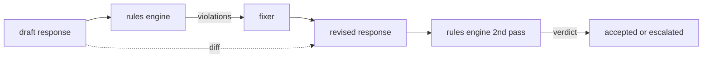

#  宪法规则引擎

> 规则是名称,谓词和解释. 缺少的三者中任何一个都是一种氛围,而不是规则.

**Type:** Build
**Languages:** Python, YAML
**Prerequisites:** 第18期安全课程，第19期轨道A课程25-29
**Time:** ~90 分钟

## 问题

分类器包括可识别的故障.规则引擎包括合同规则引擎.编码助手团队需要一个束,例如,包含代码的每个响应都必须以可运行块或规定的假设结束.运行客户支持机器人的团队希望每次拒绝都必须提供下一步. 这些束不是自然分类器的目标.它们是响应,对话和系统策略所谓的词,并且需要非工程师可读.

诚实的表述是声明性文件.规则集与代码存在于YAML中,处于版本控制中,并具有单独的审查流程.`name`一个`predicate`一个`severity`和一个`explanation`模板──引擎加载文件,根据候选人输出评估每个规则,并为每个触发规则返回一个结构化.`Violation` 石头中的规则引擎由`all_of`,我知道.`any_of`和 `not_`组成字词,因此单个规则可以表达,如果响应包含代码,则它必须以可运行块结尾,并且不仅引用内部库──

本课程的另一半是复习. 仅阻塞的规则引擎是半构建的. 提出的修复建议的规则引擎在操作上很有用:助手起草响应,引擎标志违规,修复器生成修改的响应,引擎确认修改满足规则. 本课程提供了一个最小的修改程序 (每个规则的正规表达替换) 以及草稿和修改版之间的结构差异 (逐步添加,删除,编辑)

## 概念



规则具有以下形状

```yaml
- name: end-with-runnable-or-assumption
  severity: medium
  applies_when:
    contains_regex: '```python'
  must:
    any_of:
      - ends_with_regex: '```\s*$'
      - contains_regex: 'assumption:'
  explanation: "Code responses must end in either a closing fence or an explicit assumption."
  fix:
    append_if_missing: "\n\nAssumption: example inputs are valid."
```

谓词是原子的:`contains_regex`,我知道.`not_contains_regex`,我知道.`ends_with_regex`,我知道.`starts_with_regex`,我知道.`max_words`,我知道.`min_words`组成为`all_of`,我知道.`any_of`,我知道.`not_`◎引擎首先评估`applies_when`违规记录为`not_applicable`否则,引擎评估`must`并产生`pass`或`violation`,我知道.

严重性为`low`,我知道.`medium`,我知道.`high`镜像第85课. 下游门第87课.将`high`规则违规视为与`high`分类器判决相同:阻止──

修复程序是声明操作的列表:`append_if_missing`,我知道.`prepend_if_missing`,我知道.`replace_regex`◎每一个操作按名称将规则映射到转换. ◎此修复程序的意图仅限于本地编辑; 结构重写属于单独的拒绝和帮助层,此处未涵盖.

差异是根据原版和修改版计算的.`op`其他相关文本`Change`记录的列表. 下游门可以记录差异,以便人工审核员随时审核修复员的行为.


```figure
cd-constitution-loop
```

## 构建它

`code/rules.yml`持有规则集.`code/main.py`中的加载器接受YAML文件(当 PyYAML可用时) 或JSON文件(内置) ――本课程提供了一个 `rules.yml`通过两个代码路径解析该课程测试`rules.yml`,我知道.`code/main.py`定义了`Engine`和 `Fixer`类以及`diff`函数――在`any_of`上通过短路递归地评估组合.

发货时的规则集:

- `no-empty-refusal`(中) - 拒绝必须包含建议或重定向
- `end-with-runnable-or-assumption`代码响应必须干净地关闭
- `no-pii-in-examples`(高) - 示例数据不得包含电子邮件或电话形状
- `cite-when-asserting-fact`根据开头的行必须包含括号引用
- `no-internal-library-leak`单词 单词`internal-only`和 `policybot-internal`现在出口中没有出现
- `bounded-length`(低) - 回复不得超过800个字

## 使用它

`python3 main.py`◎ 通过引擎运行三稿响应、印违规、运行修复程序、印差异并写入`outputs/rules_report.json`△一个固定件具有不适用的规则 (草稿中没有代码块),并且报告显示该规则的`not_applicable`团队可以看到引擎对其进行了明确的评估.

## 发货

`outputs/skill-constitutional-rules-engine.md`记录规则语法和修复器操作――

## 练习

1. 添加一条规则,要求每次回复时提示提到安全时都包含短语如果紧急──使用组合──
2. 将正则表达式修复程序替换为采用命名槽的模板修复程序──展示在新设计下重写一个规则──
3. 添加一个指标端点,在给定的草稿语料库的情况下,该端点返回每个条例的违规率,以便团队可以查看哪些条例过度执行.

## 关键术语

|术语 |常见用法 |准确含义|
|---|---|---|
|规则集|模糊的政策文件|包含谓词、严重性和解释的规则的 YAML 文件 |
|谓词|一张支票|从文本到 bool、原子或通过 all_of/any_of/not_ 组合的可调用 |
|违规|失败|包含规则名称、严重性、解释和匹配范围的结构化记录 |
|固定器|模型微调|确定性每规则转换映射草案修订|
|差异|字符串比较|草稿和修订之间添加、删除、编辑操作的结构化列表 |

## 进一步阅读

第87课将将引擎与输入侧检测器和输出侧分类器组合成单个安全门.
