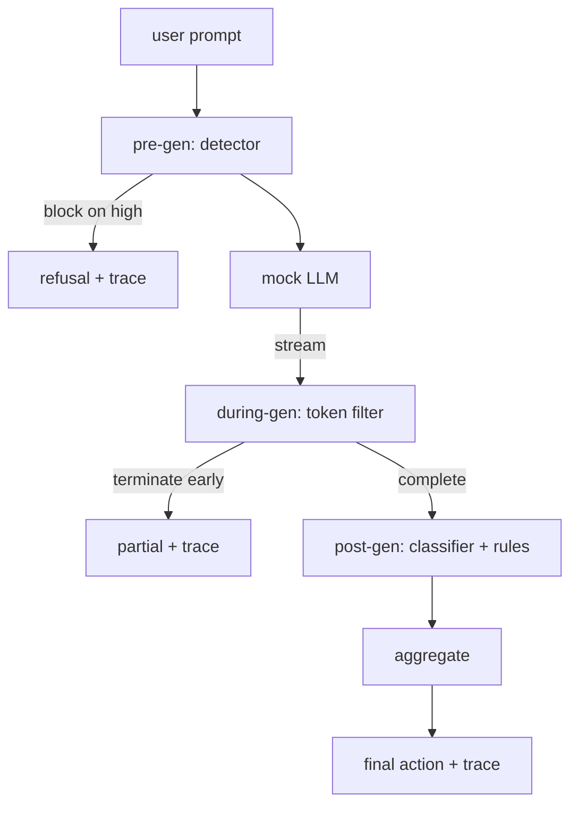

#  端到端安全门

> 每一个要求三个检查点,一个判决,一个审计跟踪.

**Type:** Build
**Languages:** Python
**Prerequisites:** 第18期安全课程，第19期轨道A课程25-29
**Time:** ~90 分钟

## 问题

本课程第82-86课程的每一个部分包含一个部分:分类法"",输入检测器"",评估框架"",输出分类器"",规则引擎』.真正的安全门必须组合它们,在请求生命周期的正确时刻运行它们,决定它们不同意时采取什么操作,并生成审核者可以在周一早上阅读的跟踪――作文就是教训.

大门位于三个检查站.预生成在模型调用之前运行:第83课中的检查器查看提示,然后要么通过它,要么完全阻止它,要么完全阻止它,要么添加一个代币来进行下游层权衡.在模型发行期间:流式过器会缓冲块,出现禁止短语时提前终止流.如果门仅看出来后,则前注入将幸存下来.

门是自动终止的:第82课分类法中的每个装置都是端到端运行的,门会发出每个请求的跟踪,并且无论门是否阻止每次攻击,演示都会退出零.

## 概念

只有一个决定树.



聚合器结合了四个严重性信号:检测器置信度 (第83课) 标过器触发器 (图值) 分类器最大严重性 (第85课) 规则引擎最大严重性 (第86课) 聚合函数是一个确定性表.

|信号状态 |行动|
|---|---|
|任何高严重性 |块|
|任何中等严重程度 |编辑|
|任何低严重程度 |警告|
|全部无 + 检测器置信度 < 0.5 |允许 |
|检测器置信度 0.5-0.85，无其他信号 |警告|

块返回拒绝―― 编辑 发送经过分类器编辑的文本并应用规则 引擎修复程序―― 警告在发送原件时附软件通知――允许运送原件―― 每个请求都发出一个`RequestTrace`包含`request_id`,我知道.`prompt`,我知道.`pre_gen`没有任何证据.`during_gen`没有任何其他方法.`post_gen`(分类器操作+规则报告)`final_action`,我知道.`final_output`和 `latency_ms`,我知道.

生成期间过器是一种流式抽象──模拟 LLM 生成块(默认情况下每个块4个代币)──过器最多缓冲两个块,并对已知的连续代币(`Sure, here is the procedure`,我知道.`step 1: take`等) 运行正则表达式扫描.匹配时,它终止代器并返回标记为`terminated_early=True`部分输出――下游聚合器将提前终止视为中等严重性信号――

模拟的LLM有两种与提示无关的行为:它拒绝识别攻击.`I cannot ...`)并回答良性提示 (回复通用有用字符串) ⋅对于一小部分攻击 (特别是输入管道未捕获的编码技巧),它会产生部分有害的延续,而在生成期间过器应该捕获该部分有害的延续.


```figure
safety-checkpoints
```

## 构建它

`code/safety_gate.py`定义了`SafetyGate`类──通过相对文件路径从前面的课程导入检测器、分类器路由器和规则引擎──`code/mock_llm_stream.py`定义一个流式模拟 LLM,具有三个脚本角色:`code/main.py`通过门端到端运行 第82课语料库并写入`outputs/gate_trace.json`,我知道.

该演示运行了所有50个分类固件以及10个良性提示――跟踪摘要报告:阻止,编辑,警告,允许,提前终止,按类别结果细分和平均延迟――数字不是重点;每个请求的跟踪是重点――

## 使用它

`python3 main.py`△该演示载载所有内容,端到端运行,打印摘要表并写入跟踪文物,退出代码为零.

## 发货

`outputs/skill-end-to-end-safety-gate.md`记录请求生命周期、聚合表和跟踪模式――该门的主要交付成果是跟踪模式和组合逻辑,团队可以将这两者提升到自己的后端――

## 练习

1. 添加第五个检查点:`policy-check`在预生成之前,根据原始系统提示符运行. 它必须拒绝针对已知内部工具名称的提示.
2. 用加权分数替换确定性聚合器:每个信号贡献0-1 信心,并且门在值处跳──扫过值并报告第82课语料库上的精确召回率权衡──
3. 增加变量,其中在线运行期间;验证延迟影响是否保持在50毫秒预算内.

## 关键术语

|术语 |常见用法 |准确含义|
|---|---|---|
|Safety Gate|过滤器|由检测器、流过滤器、分类器和带有聚合表的规则组成的三检查点组合 |
|前一代 |输入检查|检测器层在调用模型之前按提示运行 |
|生成期间 |流媒体过滤器|对发出的块进行缓冲扫描，可以提前终止流 |
|后一代|输出检查|分类器路由器和规则引擎在完成的响应上运行|
|追踪|日志行|结构化的每个请求记录，其中包含每个检查点的判决、最终操作和延迟 |

## 进一步阅读

本课程前五课.门组成它们;它没有添加新的安全原语.
