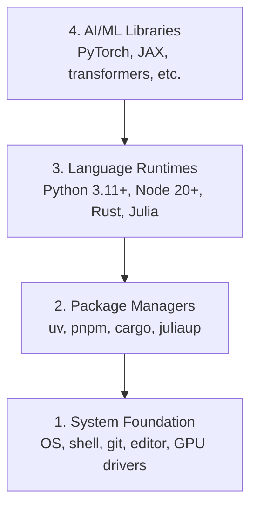

# Dev Environment

> 你的 tools 会塑造你的思考方式。一次配置，正确配置。

**Type:** Build
**Languages:** Python, Node.js, Rust
**Prerequisites:** None
**Time:** ~45 分钟

## 学习目标
- 从零开始设置 Python 3.11+、Node.js 20+ 和 Rust toolchains
- 配置 virtual environments 和 package managers，以实现可复现 builds
- 使用 CUDA/MPS 验证 GPU access，并运行一个测试 Tensor operation
- 理解四层 stack：system、packages、runtimes、AI libraries

## 问题
你将用 Python、TypeScript、Rust 和 Julia 学习 200+ 节 AI engineering 课程。如果你的 environment 坏了，每一节课都会变成和 tooling 作斗争，而不是学习。

多数人会跳过 environment setup。然后他们花数小时 debug import errors、version conflicts 和缺失的 CUDA drivers。我们要把这件事一次性正确做好。

## 概念
一个 AI engineering environment 有四层：



我们自底向上安装。每一层都依赖它下面的一层。

## 构建它
### 步骤 1： System Foundation

检查你的 system 并安装基础组件。

```bash
# macOS
xcode-select --install
brew install git curl wget

# Ubuntu/Debian
sudo apt update && sudo apt install -y build-essential git curl wget

# Windows (use WSL2)
wsl --install -d Ubuntu-24.04
```

### 步骤 2： Python with uv

我们使用 `uv`——它比 pip 快 10-100x，并且会自动处理 virtual environments。

```bash
curl -LsSf https://astral.sh/uv/install.sh | sh

uv python install 3.12

uv venv
source .venv/bin/activate  # or .venv\Scripts\activate on Windows

uv pip install numpy matplotlib jupyter
```

验证：

```python
import sys
print(f"Python {sys.version}")

import numpy as np
print(f"NumPy {np.__version__}")
a = np.array([1, 2, 3])
print(f"Vector: {a}, dot product with itself: {np.dot(a, a)}")
```

### 步骤 3： Node.js with pnpm

用于 TypeScript 课程（agents、MCP servers、web apps）。

```bash
curl -fsSL https://fnm.vercel.app/install | bash
fnm install 22
fnm use 22

npm install -g pnpm

node -e "console.log('Node', process.version)"
```

### 步骤 4： Rust

用于 performance-critical 课程（inference、systems）。

```bash
curl --proto '=https' --tlsv1.2 -sSf https://sh.rustup.rs | sh

rustc --version
cargo --version
```

### 步骤 5： Julia (Optional)

用于 Julia 擅长的 math-heavy 课程。

```bash
curl -fsSL https://install.julialang.org | sh

julia -e 'println("Julia ", VERSION)'
```

### 步骤 6：GPU 设置（如果你有）

```bash
# NVIDIA
nvidia-smi

# Install PyTorch with CUDA
uv pip install torch torchvision torchaudio --index-url https://download.pytorch.org/whl/cu124
```

```python
import torch
print(f"CUDA available: {torch.cuda.is_available()}")
if torch.cuda.is_available():
    print(f"GPU: {torch.cuda.get_device_name(0)}")
```

没有 GPU？没问题。多数课程可在 CPU 上运行。对于 training-heavy 课程，使用 Google Colab 或 cloud GPUs。

### 步骤 7： Verify Everything

运行验证脚本：

```bash
python phases/00-setup-and-tooling/01-dev-environment/code/verify.py
```

## 使用它
你的 environment 现在已准备好用于本课程的每一节课。下面是各处会用到的内容：

| Language | Used In | Package Manager |
|----------|---------|-----------------|
| Python | Phases 1-12 (ML, DL, NLP, Vision, Audio, LLMs) | uv |
| TypeScript | Phases 13-17 (Tools, Agents, Swarms, Infra) | pnpm |
| Rust | Phases 12, 15-17 (Performance-critical systems) | cargo |
| Julia | Phase 1 (Math foundations) | Pkg |

## 交付它
本课会产出一个任何人都能运行的验证脚本，用于检查自己的 setup。

查看 `outputs/prompt-env-check.md`，其中有一个 prompt，可帮助 AI assistants 诊断 environment issues。

## 练习
1. 运行验证脚本并修复任何失败项
2. 为本课程创建一个 Python virtual environment，并安装 PyTorch
3. 用全部四种 languages 写一个 "hello world"，并逐个运行
