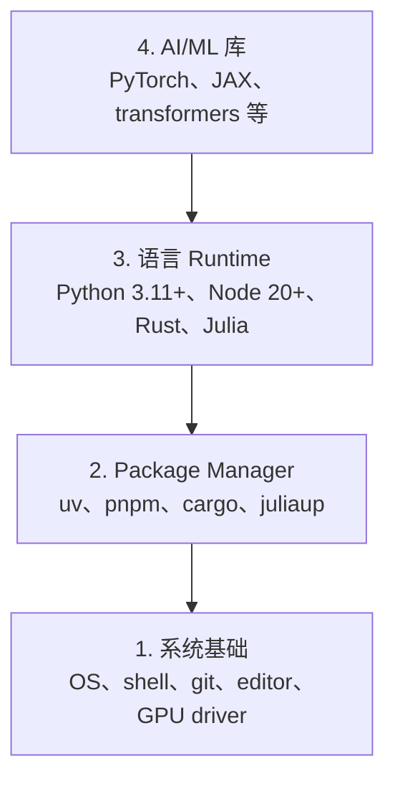

# 开发环境

> 你的工具会塑造你的思维方式。一次配置，正确配置。

**Type:** Build
**Languages:** Python, Node.js, Rust
**Prerequisites:** 无
**Time:** 约 45 分钟

## 学习目标

- 从头搭建 Python 3.11+、Node.js 20+ 和 Rust toolchain
- 配置虚拟环境和 package manager，以实现可复现构建
- 使用 CUDA/MPS 验证 GPU 访问，并运行测试 Tensor 操作
- 理解四层 stack：系统、package、runtime 和 AI 库

## 问题

你即将使用 Python、TypeScript、Rust 和 Julia 学习 500 多节 AI engineering 课程。如果环境有问题，每一节课都会变成与工具较劲，而不是专注于学习。

大多数人会跳过环境配置。然后，他们会花费数小时调试 import error、版本冲突和缺失的 CUDA driver。我们要一次把这件事正确做好。

## 概念

AI engineering 环境包含四层：



我们自下而上进行安装。每一层都依赖其下方的层。

```figure
s0-env-stack
```

## 动手构建

### 第 1 步：系统基础

检查你的系统并安装基础工具。

```bash
# macOS
xcode-select --install
brew install git curl wget

# Ubuntu/Debian
sudo apt update && sudo apt install -y build-essential git curl wget

# Windows（使用 WSL2）
wsl --install -d Ubuntu-24.04
```

### 第 2 步：使用 uv 安装 Python

我们使用 `uv`，它比 pip 快 10 至 100 倍，并且能够自动处理虚拟环境。

```bash
curl -LsSf https://astral.sh/uv/install.sh | sh

uv python install 3.12

uv venv
source .venv/bin/activate  # Windows 上使用 .venv\Scripts\activate

uv pip install numpy matplotlib jupyter
```

验证：

```python
import sys
print(f"Python {sys.version}")

import numpy as np
print(f"NumPy {np.__version__}")
a = np.array([1, 2, 3])
print(f"Vector: {a}，与自身的 Dot Product: {np.dot(a, a)}")
```

### 第 3 步：使用 pnpm 安装 Node.js

用于 TypeScript 课程（Agent、MCP server、web app）。

```bash
curl -fsSL https://fnm.vercel.app/install | bash
fnm install 22
fnm use 22

npm install -g pnpm

node -e "console.log('Node', process.version)"
```

**macOS / Apple Silicon (M1/M2/M3/M4)：** 如果 installer 因 `Error: Cannot install under Rosetta 2 in ARM default prefix (/opt/homebrew)` 而停止，说明你的 terminal 正在 Rosetta 2 下运行（`arch` 输出 `i386`），而 Homebrew 是原生 arm64 构建。强制使用 arm64 安装 fnm，将其接入 shell，然后从 `fnm install 22` 开始重新运行上面的命令：

```bash
arch -arm64 brew install fnm
echo 'eval "$(fnm env --use-on-cd)"' >> ~/.zshrc
source ~/.zshrc
```

### 第 4 步：Rust

用于对性能要求较高的课程（Inference、系统）。

```bash
curl --proto '=https' --tlsv1.2 -sSf https://sh.rustup.rs | sh

rustc --version
cargo --version
```

### 第 5 步：Julia（可选）

用于 Julia 更具优势的数学密集型课程。

```bash
curl -fsSL https://install.julialang.org | sh

julia -e 'println("Julia ", VERSION)'
```

### 第 6 步：配置 GPU（如果你有 GPU）

**NVIDIA（Linux / Windows）：**

```bash
nvidia-smi

# 安装支持 CUDA 的 PyTorch
uv pip install torch torchvision torchaudio --index-url https://download.pytorch.org/whl/cu124
```

**macOS / Apple Silicon (M1/M2/M3/M4)：** Mac 上没有 CUDA，这是预期情况，并非故障。请**不要**传入 `--index-url .../cuXXX`（这些 wheel 仅适用于 Linux/Windows，因此安装会失败）。安装包含 Apple MPS (Metal) GPU backend 的普通构建：

```bash
uv pip install torch torchvision torchaudio
```

验证（适用于所有平台）：

```python
import torch
print(f"CUDA 可用：{torch.cuda.is_available()}")           # 在 macOS 上为 False，这是预期结果
print(f"MPS 可用： {torch.backends.mps.is_available()}")   # 在 Apple Silicon 上为 True
if torch.cuda.is_available():
    print(f"GPU：{torch.cuda.get_device_name(0)}")
```

没有 GPU？没关系。大多数课程都可以在 CPU 上运行。对于 Training 负载较重的课程，请使用 Google Colab 或 cloud GPU。

### 第 7 步：验证你想开始的学习路线

请从 repository 根目录运行本课程中的所有命令，也就是包含 `README.md` 和 `phases/` 的目录。预检只会检查启动所选路线所需的内容。默认情况下，它会跳过后续工具，让新学习者看到一个清晰的结果，而不是满屏警告。

开始完整的初学者学习序列：

```bash
python3 phases/00-setup-and-tooling/01-dev-environment/code/verify.py --route beginner
```

或者仅检查你想学习的路线：

```bash
python3 phases/00-setup-and-tooling/01-dev-environment/code/verify.py --route ml-foundations
python3 phases/00-setup-and-tooling/01-dev-environment/code/verify.py --route llm-engineering
python3 phases/00-setup-and-tooling/01-dev-environment/code/verify.py --route agents
python3 phases/00-setup-and-tooling/01-dev-environment/code/verify.py --route mcp
python3 phases/00-setup-and-tooling/01-dev-environment/code/verify.py --route agent-skills
python3 phases/00-setup-and-tooling/01-dev-environment/code/verify.py --route certification
```

如果希望通过同一次预检检查后续课程使用的可选工具和依赖，请添加 `--show-later`。缺少后续工具绝不会阻止所选路线启动。

每个未通过的必需检查都会提供检测到的路径或 import error，以及准确的修复命令。Agent Skills 和 certification 路线还会显示需要手动执行的 host 检查，因为 Python script 无法证明 AI host 已发现某个 Skill，也无法证明你选择的 Skill scope 可写。

初学者预检通过后，它会输出第一节可运行课程的准确命令：

```text
已准备好开始初学者课程。
下一步：python3 phases/01-math-foundations/01-linear-algebra-intuition/code/vectors.py
```

## 实际使用

你的环境现已准备好启动刚刚检查的路线。请在课程要求时再安装后续工具，不要因为整个 stack 尚未就绪而阻塞第一节课。以下是你将在整个课程体系中使用的内容：

| 语言 | 使用范围 | Package Manager |
|----------|---------|-----------------|
| Python | Phase 1-12（ML、DL、NLP、Vision、Audio、LLMs） | uv |
| TypeScript | Phase 13-17（Tool、Agent、Swarm、Infra） | pnpm |
| Rust | Phase 12、15-17（性能要求较高的系统） | cargo |
| Julia | Phase 1（数学基础） | Pkg |

## 交付成果

本课程会生成一个 verification script，任何人都可以用它检查自己的配置。

请参阅 `outputs/prompt-env-check.md`，其中提供了一个帮助 AI assistant 诊断环境问题的 Prompt。

## 练习

1. 运行 verification script 并修复所有失败项
2. 为本课程创建 Python 虚拟环境并安装 PyTorch
3. 使用四种语言分别编写并运行一个“hello world”
