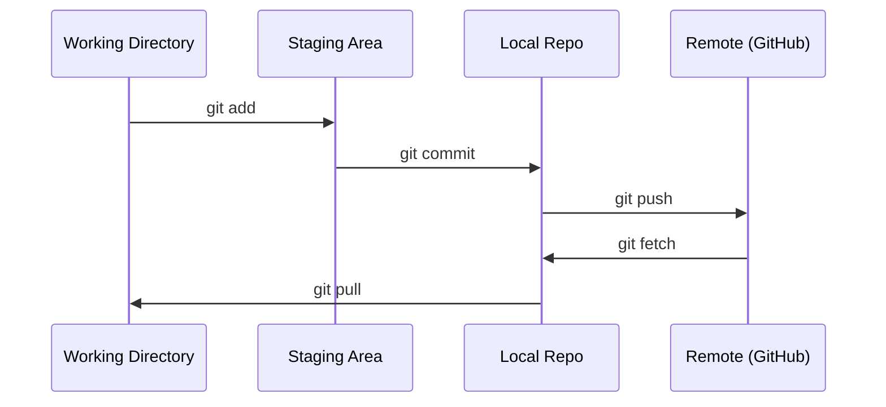

# Git & Collaboration

> Version control 不是可选项。你在这里构建的每个 experiment、每个 model、每节课都要被 tracked。

**Type:** Learn
**Languages:** --
**Prerequisites:** Phase 0, Lesson 01
**Time:** ~30 分钟

## 学习目标
- 配置 git identity，并使用 add、commit 和 push 的日常 workflow
- 为隔离 experiments 创建并 merge branches，避免破坏 main
- 编写一个 `.gitignore`，排除 model checkpoints 和大型 binary files
- 使用 `git log` 浏览 commit history，理解 project evolution

## 问题
你将跨 20 个 phases 编写数百个 code files。没有 version control，你会丢失工作、破坏无法撤销的东西，也无法与他人协作。

Git 是工具。GitHub 是 code 所在的地方。本课只覆盖本课程所需内容，不多不少。

## 概念


记住三件事：
1. 经常保存（`git commit`）
2. Push 到 remote（`git push`）
3. 为 experiments 创建 branch（`git checkout -b experiment`）

## 构建它
### 步骤 1： Configure git

```bash
git config --global user.name "Your Name"
git config --global user.email "you@example.com"
```

### 步骤 2：日常工作流

```bash
git status
git add file.py
git commit -m "Add perceptron implementation"
git push origin main
```

### 步骤 3：为实验创建分支

```bash
git checkout -b experiment/new-optimizer

# ... make changes, commit ...

git checkout main
git merge experiment/new-optimizer
```

### 步骤 4： 使用这个课程 repo

```bash
git clone https://github.com/rohitg00/ai-engineering-from-scratch.git
cd ai-engineering-from-scratch

git checkout -b my-progress
# work through lessons, commit your code
git push origin my-progress
```

## 使用它
对于本课程，你只需要这些 commands：

| Command | When |
|---------|------|
| `git clone` | 获取 course repo |
| `git add` + `git commit` | 保存你的工作 |
| `git push` | 备份到 GitHub |
| `git checkout -b` | 在不破坏 main 的情况下尝试东西 |
| `git log --oneline` | 查看你做过什么 |

就这些。本课程不需要 rebase、cherry-pick 或 submodules。

## 练习
1. Clone 这个 repo，创建一个名为 `my-progress` 的 branch，创建一个 file，commit 它，push 它
2. 创建一个 `.gitignore`，排除 model checkpoint files（`.pt`、`.pth`、`.safetensors`）
3. 用 `git log --oneline` 查看这个 repo 的 commit history，并阅读 lessons 是如何被添加的

## 关键术语
| Term | What people say | What it actually means |
|------|----------------|----------------------|
| Commit | “保存” | 你的整个 project 在某个时间点的 snapshot |
| Branch | “一个副本” | 指向某个 commit 的 pointer，会随着你的工作向前移动 |
| Merge | “合并 code” | 把一个 branch 的 changes 应用到另一个 branch |
| Remote | “云端” | 托管在其他地方的 repo 副本（GitHub、GitLab） |
