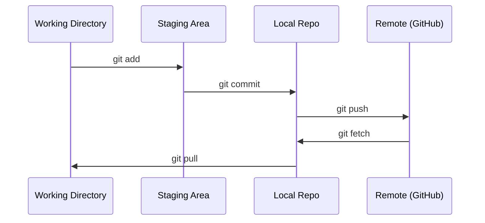

# Git 与协作

> 版本控制不是可选项。你在这里构建的每个实验、每个 Model、每节课程都会被跟踪。

**Type:** Learn
**Languages:** --
**Prerequisites:** Phase 0, Lesson 01
**Time:** ~30 分钟

## 学习目标

- 配置 git 身份，并使用 add、commit 和 push 的日常工作流
- 为独立实验创建并合并 Branch，同时不破坏 main
- 编写一个排除 Model Checkpoint 和大型二进制文件的 `.gitignore`
- 使用 `git log` 浏览 commit 历史，了解项目的演进过程

## 问题

你即将在 20 个 Phase 中编写数百个代码文件。如果没有版本控制，你会丢失工作成果、破坏某些无法撤销的内容，并且无法与他人协作。

Git 是使用的工具。GitHub 是代码存放的位置。本课只介绍这门课程所需的内容，不涉及其他内容。

## 核心概念



需要记住三件事：
1. 经常保存（`git commit`）
2. 推送到 Remote（`git push`）
3. 为实验创建 Branch（`git checkout -b experiment`）

```figure
s0-commit-dag
```

## 动手构建

### 第 1 步：配置 git

```bash
git config --global user.name "Your Name"
git config --global user.email "you@example.com"
```

### 第 2 步：日常工作流

```bash
git status
git add file.py
git commit -m "Add perceptron implementation"
git push origin main
```

### 第 3 步：为实验创建 Branch

```bash
git checkout -b experiment/new-optimizer

# ... 进行修改并 commit ...

git checkout main
git merge experiment/new-optimizer
```

### 第 4 步：使用本课程 repo

你无法直接向课程 repo 执行 push，只有维护者拥有写入权限。请先在 GitHub 上 Fork（右上角的 Fork 按钮），让 `origin` 指向你自己的副本：

```bash
git clone https://github.com/YOUR-USERNAME/ai-engineering-from-scratch.git
cd ai-engineering-from-scratch

git checkout -b my-progress
# 学习课程并 commit 你的代码
git push origin my-progress
```

## 实际使用

对于本课程，你只需要这些命令：

| 命令 | 使用时机 |
|---------|------|
| `git clone` | 获取课程 repo |
| `git add` + `git commit` | 保存你的工作 |
| `git push` | 将工作备份到 GitHub |
| `git checkout -b` | 在不破坏 main 的情况下尝试新内容 |
| `git log --oneline` | 查看自己完成了哪些工作 |

仅此而已。本课程不需要 rebase、cherry-pick 或 submodules。

## 练习

1. Fork 此 repo，clone 你的 Fork，创建名为 `my-progress` 的 Branch，创建一个文件，对其执行 commit，然后 push
2. 创建一个排除 Model Checkpoint 文件（`.pt`、`.pth`、`.safetensors`）的 `.gitignore`
3. 使用 `git log --oneline` 查看此 repo 的 commit 历史，并阅读各节课程是如何添加的

## 关键术语

| 术语 | 人们通常怎么说 | 它的实际含义 |
|------|----------------|----------------------|
| Commit | “保存” | 项目在某个时间点的完整快照 |
| Branch | “一个副本” | 指向某个 commit 的指针，并随着你的工作向前移动 |
| Merge | “合并代码” | 获取一个 Branch 中的变更，并将其应用到另一个 Branch |
| Remote | “云端” | 托管在其他位置（GitHub、GitLab）的 repo 副本 |
