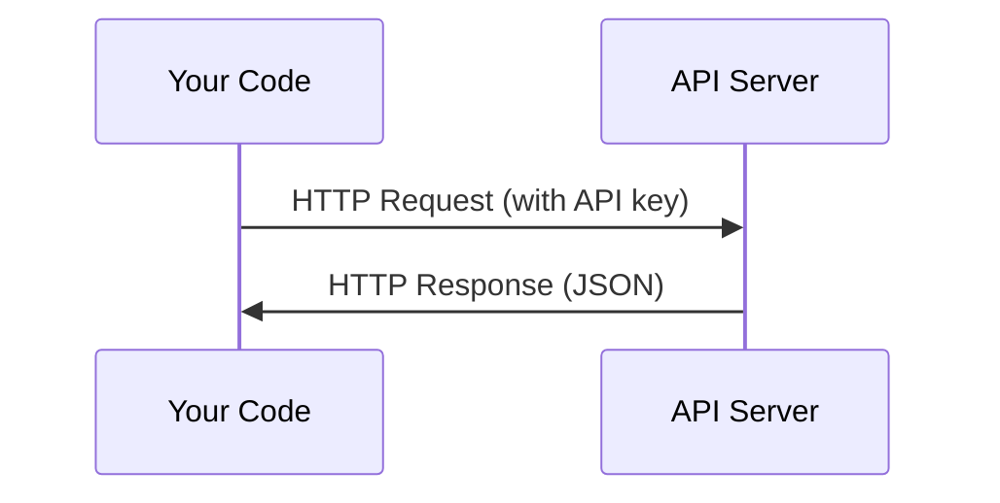

# APIs & Keys

> 每个 AI API 的工作方式都一样：发送 request，得到 response。细节会变，模式不变。

**Type:** Build
**Languages:** Python, TypeScript
**Prerequisites:** Phase 0, Lesson 01
**Time:** ~30 分钟

## 学习目标
- 使用 environment variables 和 `.env` files 安全存储 API keys
- 同时使用 Anthropic Python SDK 和 raw HTTP 发起一次 LLM API call
- 比较基于 SDK 和 raw HTTP 的 request/response formats，以便 debugging
- 识别并处理常见 API errors，包括 authentication 和 rate limits

## 问题
从 Phase 11 开始，你会调用 LLM APIs（Anthropic、OpenAI、Google）。在 Phase 13-16 中，你会构建在 loops 中使用这些 APIs 的 agents。你需要知道 API keys 如何工作、如何安全存储它们，以及如何发起你的第一次 API call。

## 概念


每个 API call 都有：
1. 一个 endpoint（URL）
2. 一个 API key（authentication）
3. 一个 request body（你想要什么）
4. 一个 response body（你得到什么）

## 构建它
### 步骤 1：安全存储 API keys

绝不要把 API keys 放进代码。使用 environment variables。

```bash
export ANTHROPIC_API_KEY="sk-ant-..."
export OPENAI_API_KEY="sk-..."
```

或者使用 `.env` file（把它加入 `.gitignore`）：

```
ANTHROPIC_API_KEY=sk-ant-...
OPENAI_API_KEY=sk-...
```

### 步骤 2：第一次 API 调用 (Python)

```python
import anthropic

client = anthropic.Anthropic()

response = client.messages.create(
    model="claude-sonnet-4-20250514",
    max_tokens=256,
    messages=[{"role": "user", "content": "What is a neural network in one sentence?"}]
)

print(response.content[0].text)
```

### 步骤 3： 第一次 API 调用 (TypeScript)

```typescript
import Anthropic from "@anthropic-ai/sdk";

const client = new Anthropic();

const response = await client.messages.create({
  model: "claude-sonnet-4-20250514",
  max_tokens: 256,
  messages: [{ role: "user", content: "What is a neural network in one sentence?" }],
});

console.log(response.content[0].text);
```

### 步骤 4： Raw HTTP (no SDK)

```python
import os
import urllib.request
import json

url = "https://api.anthropic.com/v1/messages"
headers = {
    "Content-Type": "application/json",
    "x-api-key": os.environ["ANTHROPIC_API_KEY"],
    "anthropic-version": "2023-06-01",
}
body = json.dumps({
    "model": "claude-sonnet-4-20250514",
    "max_tokens": 256,
    "messages": [{"role": "user", "content": "What is a neural network in one sentence?"}],
}).encode()

req = urllib.request.Request(url, data=body, headers=headers, method="POST")
with urllib.request.urlopen(req) as resp:
    result = json.loads(resp.read())
    print(result["content"][0]["text"])
```

这就是 SDKs 在背后做的事情。理解 raw HTTP call 有助于 debugging。

## 使用它
对于本课程：

| API | When you need it | Free tier |
|-----|-----------------|-----------|
| Anthropic (Claude) | Phases 11-16（agents, tools） | 注册赠送 $5 credit |
| OpenAI | Phase 11（comparison） | 注册赠送 $5 credit |
| Hugging Face | Phases 4-10（models, datasets） | Free |

你现在不需要全部设置。等 lesson 需要时再设置。

## 交付它
本 lesson 会产出：
- `outputs/prompt-api-troubleshooter.md` - 诊断常见 API errors

## 练习
1. 获取一个 Anthropic API key，并发起你的第一次 API call
2. 尝试 raw HTTP 版本，并将 response format 与 SDK 版本进行比较
3. 故意使用错误的 API key，并阅读 error message

## 关键术语
| Term | What people say | What it actually means |
|------|----------------|----------------------|
| API key | "Password for the API" | 一个唯一字符串，用于标识你的 account 并授权 requests |
| Rate limit | "They're throttling me" | 每分钟/每小时最大 requests 数量，用于防止滥用并确保公平使用 |
| Token | "A word"（在 API 语境中） | 一个 billing unit：input 和 output Tokens 会被分别计数并收费 |
| Streaming | "Real-time responses" | 逐词获取 response，而不是等待完整 response |
