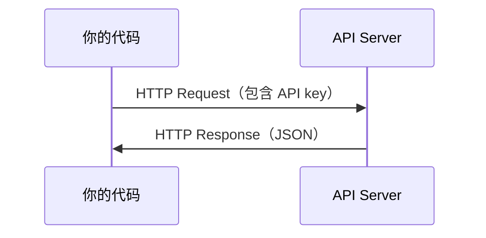

# API 与密钥

> 每个 AI API 的工作方式都相同：发送请求，获取响应。细节会变化，模式不会。

**Type:** Build
**Languages:** Python, TypeScript
**Prerequisites:** Phase 0, Lesson 01
**Time:** ~30 分钟

## 学习目标

- 使用环境变量和 `.env` 文件安全地存储 API key
- 使用 Anthropic Python SDK 和原始 HTTP 发起 LLM API 调用
- 比较基于 SDK 和原始 HTTP 的请求/响应格式，以便进行调试
- 识别并处理常见的 API 错误，包括身份验证错误和速率限制

## 问题

从 Phase 11 开始，你将调用 LLM API（Anthropic、OpenAI、Google）。在 Phase 13-16 中，你将构建循环使用这些 API 的 Agent。你需要了解 API key 的工作方式、如何安全地存储它们，以及如何发起第一次 API 调用。

## 核心概念



每次 API 调用都包含：
1. 一个 endpoint（URL）
2. 一个 API key（身份验证）
3. 一个 request body（你想要什么）
4. 一个 response body（你得到什么）

```figure
s0-secret-inject
```

## 动手构建

### 第 1 步：安全地存储 API key

绝不要把 API key 写入代码。请使用环境变量。

```bash
export ANTHROPIC_API_KEY="sk-ant-..."
export OPENAI_API_KEY="sk-..."
```

或者使用 `.env` 文件（并将其添加到 `.gitignore`）：

```text
ANTHROPIC_API_KEY=sk-ant-...
OPENAI_API_KEY=sk-...
```

### 第 2 步：第一次 API 调用（Python）

```python
import os

import anthropic

client = anthropic.Anthropic()

MODEL = os.environ.get("LLM_MODEL", "claude-sonnet-5")

response = client.messages.create(
    model=MODEL,
    max_tokens=256,
    messages=[{"role": "user", "content": "用一句话解释什么是 Neural Network？"}]
)

print(response.content[0].text)
```

`LLM_MODEL` 用于选择 Anthropic model id，默认值是未标注日期的 Sonnet alias。其他 provider（OpenAI、Google 等）都遵循 API key 加 model id 的相同模式，但各自拥有不同的 SDK、endpoint 和请求/响应 schema。

### 第 3 步：第一次 API 调用（TypeScript）

```typescript
import Anthropic from "@anthropic-ai/sdk";

const client = new Anthropic();

const MODEL = process.env.LLM_MODEL ?? "claude-sonnet-5";

const response = await client.messages.create({
  model: MODEL,
  max_tokens: 256,
  messages: [{ role: "user", content: "用一句话解释什么是 Neural Network？" }],
});

console.log(response.content[0].text);
```

### 第 4 步：原始 HTTP（不使用 SDK）

```python
import os
import urllib.request
import json

url = "https://api.anthropic.com/v1/messages"
headers = {
    "Content-Type": "application/json",
    "x-api-key": os.environ["ANTHROPIC_API_KEY"],
    "anthropic-version": "2023-06-01",
}
body = json.dumps({
    "model": os.environ.get("LLM_MODEL", "claude-sonnet-5"),
    "max_tokens": 256,
    "messages": [{"role": "user", "content": "用一句话解释什么是 Neural Network？"}],
}).encode()

req = urllib.request.Request(url, data=body, headers=headers, method="POST")
with urllib.request.urlopen(req) as resp:
    result = json.loads(resp.read())
    print(result["content"][0]["text"])
```

这就是 SDK 在底层执行的操作。理解原始 HTTP 调用有助于调试。

## 实际使用

对于本课程：

| API | 使用时机 | 免费套餐 |
|-----|-----------------|-----------|
| Anthropic (Claude) | Phase 11-16（Agent、Tool） | 注册赠送 $5 额度 |
| OpenAI | Phase 11（比较） | 注册赠送 $5 额度 |
| Hugging Face | Phase 4-10（Model、Dataset） | 免费 |

你现在不需要设置所有这些 API。请在课程要求使用时再进行设置。

## 交付成果

本课将生成：
- `outputs/prompt-api-troubleshooter.md` - 诊断常见 API 错误

## 练习

1. 获取一个 Anthropic API key，并发起你的第一次 API 调用
2. 尝试原始 HTTP 版本，并将其响应格式与 SDK 版本进行比较
3. 故意使用错误的 API key，并阅读错误消息

## 关键术语

| 术语 | 人们通常怎么说 | 它的实际含义 |
|------|----------------|----------------------|
| API key | “API 的密码” | 用于识别你的账户并授权请求的唯一字符串 |
| Rate limit | “他们在限制我的速度” | 为防止滥用并确保公平使用而设置的每分钟或每小时最大请求数 |
| Token | “一个单词”（在 API 上下文中） | 计费单位：输入和输出 Token 会分别计数和收费 |
| Streaming | “实时响应” | 逐字获取响应，而不是等待完整响应生成完毕 |
