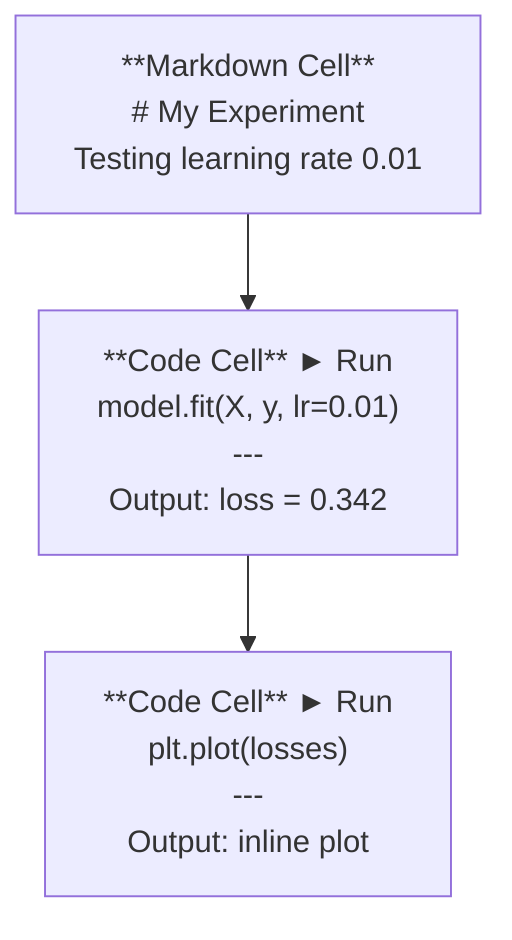
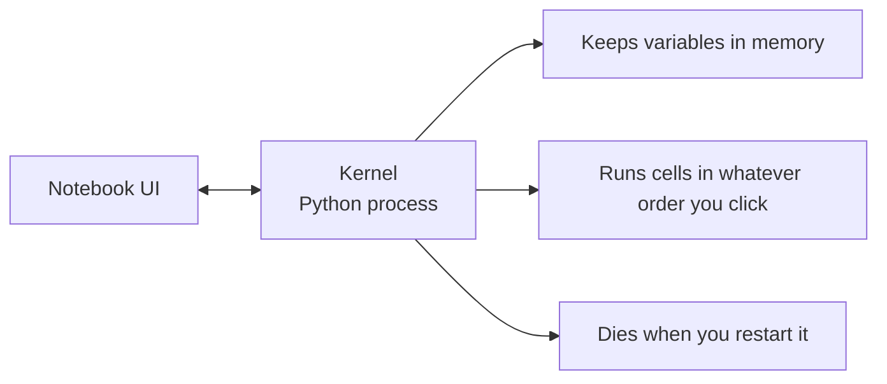

# Jupyter Notebooks

> Notebooks 是 AI engineering 的实验台。你在这里做 prototype，然后把有效的部分移到 production。

**类型：** Build
**语言：** Python
**前置要求：** Phase 0, Lesson 01
**时间：** 约 30 分钟

## 学习目标

- 安装并启动 JupyterLab、Jupyter Notebook，或带 Jupyter extension 的 VS Code
- 使用 magic commands（`%timeit`、`%%time`、`%matplotlib inline`）进行 benchmark 并 inline 可视化
- 区分何时使用 notebooks、何时使用 scripts，并应用“在 notebooks 中探索，在 scripts 中交付”的工作流
- 识别并避免常见 notebook 陷阱：乱序执行、隐藏状态和内存泄漏

## 问题

每篇 AI paper、tutorial 和 Kaggle competition 都使用 Jupyter notebooks。它们让你分段运行代码、inline 查看输出、混合代码与说明，并快速迭代。如果你试图不用 notebooks 学 AI，就像做数学作业却没有草稿纸。

但 notebooks 确实有陷阱。人们把它们用于所有事情，包括它们非常不擅长的事情。知道什么时候用 notebook、什么时候用 script，会让你以后少掉很多调试噩梦。

## 概念

notebook 是由一组单元格组成的列表。每个单元格要么是代码，要么是文本。



Kernel 是后台运行的一个 Python process。当你运行一个 cell 时，它会把代码发送给 kernel，kernel 执行代码并把结果发回。所有 cells 共享同一个 kernel，所以变量会在 cells 之间保留。



“你按什么顺序点就按什么顺序运行”这一点既是超能力，也是容易踩的坑。

## 构建

### 步骤 1： 选择你的界面

三种选择，同一种格式：

| Interface | Install | Best for |
|-----------|---------|----------|
| JupyterLab | `pip install jupyterlab` then `jupyter lab` | 完整 IDE 体验、多标签、文件浏览器、terminal |
| Jupyter Notebook | `pip install notebook` then `jupyter notebook` | 简单、轻量、一次一个 notebook |
| VS Code | Install "Jupyter" extension | 已在你的 editor 中、git 集成、debugging |

三者都读写同一个 `.ipynb` 文件。选你喜欢的即可。JupyterLab 是 AI 工作中最常见的选择。

```bash
pip install jupyterlab
jupyter lab
```

### 步骤 2： 重要的键盘快捷键

你会在两种模式中操作。按 `Escape` 进入 command mode（左侧蓝色栏），按 `Enter` 进入 edit mode（绿色栏）。

**Command mode（最常用）：**

| Key | Action |
|-----|--------|
| `Shift+Enter` | 运行 cell，移动到下一个 |
| `A` | 在上方插入 cell |
| `B` | 在下方插入 cell |
| `DD` | 删除 cell |
| `M` | 转换为 markdown |
| `Y` | 转换为 code |
| `Z` | 撤销 cell 操作 |
| `Ctrl+Shift+H` | 显示所有快捷键 |

**Edit mode：**

| Key | Action |
|-----|--------|
| `Tab` | Autocomplete |
| `Shift+Tab` | 显示函数签名 |
| `Ctrl+/` | 切换 comment |

`Shift+Enter` 是你每天会用上千次的快捷键。先学它。

### 步骤 3： Cell 类型

**Code cells** 运行 Python 并显示输出：

```python
import numpy as np
data = np.random.randn(1000)
data.mean(), data.std()
```

输出：`(0.0032, 0.9987)`

**Markdown cells** 渲染格式化文本。用它们记录你正在做什么以及为什么这样做。支持 headers、bold、italic、LaTeX math（`$E = mc^2$`）、tables 和 images。

### 步骤 4： Magic commands

这些不是 Python。它们是 Jupyter 特有的命令，以 `%`（line magic）或 `%%`（cell magic）开头。

**为你的代码计时：**

```python
%timeit np.random.randn(10000)
```

输出：`45.2 us +/- 1.3 us per loop`

```python
%%time
model.fit(X_train, y_train, epochs=10)
```

输出：`Wall time: 2.34 s`

`%timeit` 会多次运行代码并取平均。`%%time` 只运行一次。用 `%timeit` 做 microbenchmarks，用 `%%time` 做 training runs。

**启用 inline plots：**

```python
%matplotlib inline
```

现在每个 `plt.plot()` 或 `plt.show()` 都会直接在 notebook 中渲染。

**不离开 notebook 安装 packages：**

```python
!pip install scikit-learn
```

`!` 前缀会运行任意 shell command。

**检查环境变量：**

```python
%env CUDA_VISIBLE_DEVICES
```

### 步骤 5： Inline 显示 rich output

Notebooks 会自动显示 cell 中最后一个表达式。但你也可以控制它：

```python
import pandas as pd

df = pd.DataFrame({
    "model": ["Linear", "Random Forest", "Neural Net"],
    "accuracy": [0.72, 0.89, 0.94],
    "training_time": [0.1, 2.3, 45.6]
})
df
```

这会渲染一个格式化的 HTML table，而不是文本 dump。Plots 也是一样：

```python
import matplotlib.pyplot as plt

plt.figure(figsize=(8, 4))
plt.plot([1, 2, 3, 4], [1, 4, 2, 3])
plt.title("Inline Plot")
plt.show()
```

Plot 会出现在 cell 正下方。这就是 notebooks 主导 AI 工作的原因。你可以同时看到 data、plot 和 code。

对于 images：

```python
from IPython.display import Image, display
display(Image(filename="architecture.png"))
```

### 步骤 6： Google Colab

Colab 是云端的免费 Jupyter notebook。它提供 GPU、预装 libraries 和 Google Drive 集成。无需 setup。

1. 前往 [colab.research.google.com](https://colab.research.google.com)
2. 上传本课程中的任意 `.ipynb` 文件
3. Runtime > Change runtime type > T4 GPU（免费）

Colab 与本地 Jupyter 的区别：
- Files 不会在 sessions 之间保留（保存到 Drive 或下载）
- 预装：numpy、pandas、matplotlib、torch、tensorflow、sklearn
- 使用 `from google.colab import files` 上传/下载 files
- 使用 `from google.colab import drive; drive.mount('/content/drive')` 做持久存储
- 免费层 sessions 在 90 分钟不活动后会超时

## 使用

### Notebooks vs Scripts：何时使用哪一个

| Use notebooks for | Use scripts for |
|-------------------|-----------------|
| 探索 dataset | Training pipelines |
| Prototype model | Reusable utilities |
| 可视化结果 | 任何包含 `if __name__` 的东西 |
| 解释你的工作 | 按计划运行的 code |
| 快速 experiments | Production code |
| Course exercises | Packages and libraries |

规则：**在 notebooks 中探索，在 scripts 中交付**。

AI 中常见的工作流：
1. 在 notebook 中探索 data
2. 在 notebook 中 prototype 你的 model
3. 一旦可行，就把 code 移到 `.py` files
4. 把这些 `.py` files 再 import 回 notebook，用于进一步 experiments

### 常见陷阱

**乱序执行。** 你先运行 cell 5，再运行 cell 2，再运行 cell 7。Notebook 在你的机器上能用，但别人从上到下运行时会坏。修复：分享前执行 Kernel > Restart & Run All。

**隐藏状态。** 你删除了一个 cell，但它创建的变量仍在内存里。Notebook 看起来干净，却依赖一个已经不存在的 cell。修复：定期重启 kernel。

**内存泄漏。** 加载 4GB dataset、训练 model、再加载另一个 dataset。什么都没释放。修复：`del variable_name` 和 `gc.collect()`，或重启 kernel。

## 交付

本课会产出：
- `outputs/prompt-notebook-helper.md`，用于调试 notebook 问题

## 练习

1. 打开 JupyterLab，创建一个 notebook，并使用 `%timeit` 比较 list comprehension 与 numpy 在创建 100,000 个随机数 array 时的差异
2. 创建一个同时包含 markdown 和 code cells 的 notebook，加载 CSV、显示 dataframe，并绘制 chart。然后运行 Kernel > Restart & Run All 验证它能从上到下正常运行
3. 把 `code/notebook_tips.py` 中的 code 粘贴到 Colab notebook 中，并使用免费 GPU 运行

## 关键术语

| Term | What people say | What it actually means |
|------|----------------|----------------------|
| Kernel | “运行我代码的东西” | 一个独立的 Python process，用来执行 cells 并在内存中保存变量 |
| Cell | “一个 code block” | Notebook 中可独立运行的单元，可以是 code 或 markdown |
| Magic command | “Jupyter 技巧” | 以 `%` 或 `%%` 为前缀、用于控制 notebook 环境的特殊命令 |
| `.ipynb` | “Notebook file” | 一个包含 cells、outputs 和 metadata 的 JSON 文件。代表 IPython Notebook |

## 延伸阅读

- [JupyterLab Docs](https://jupyterlab.readthedocs.io/) 查看完整功能集
- [Google Colab FAQ](https://research.google.com/colaboratory/faq.html) 查看 Colab 特定限制与功能
- [28 Jupyter Notebook Tips](https://www.dataquest.io/blog/jupyter-notebook-tips-tricks-shortcuts/) 查看进阶快捷键
