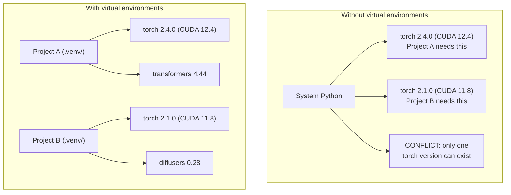

# Python Environments

> Dependency hell 真实存在。Virtual environments 是解药。

**类型：** Build
**语言：** Python
**前置要求：** Phase 0, Lesson 01
**时间：** 约 30 分钟

## 学习目标

- 使用 `uv`、`venv` 或 `conda` 创建隔离的 virtual environments
- 编写包含 optional dependency groups 的 `pyproject.toml`，并生成 lockfiles 以保证可复现性
- 诊断并修复常见坑：global installs、pip/conda mixing、CUDA version mismatches
- 为存在依赖冲突的 projects 实现 per-phase environment strategy

## 问题

你为一个 fine-tuning project 安装 PyTorch 2.4。下周，另一个 project 需要 PyTorch 2.1，因为它的 CUDA build 被固定了。你全局升级后，第一个 project 坏了。你降级后，第二个又坏了。

这就是 dependency hell。它在 AI/ML 工作中经常发生，因为：

- PyTorch、JAX 和 TensorFlow 各自携带自己的 CUDA bindings
- Model libraries 会固定特定 framework versions
- 一个全局 `pip install` 会覆盖之前存在的任何内容
- CUDA 11.8 builds 不能与 CUDA 12.x drivers 一起工作（反之亦然）

修复方法：每个 project 都有自己的隔离环境和自己的 packages。

## 概念



## 构建

### Option 1: uv venv（推荐）

`uv` 是最快的 Python package manager（比 pip 快 10-100 倍）。它在一个工具中处理 virtual environments、Python versions 和 dependency resolution。

```bash
curl -LsSf https://astral.sh/uv/install.sh | sh

uv python install 3.12

cd your-project
uv venv
source .venv/bin/activate
```

安装 packages：

```bash
uv pip install torch numpy
```

一步创建带 `pyproject.toml` 的 project：

```bash
uv init my-ai-project
cd my-ai-project
uv add torch numpy matplotlib
```

### Option 2: venv（内置）

如果你不能安装 `uv`，Python 自带 `venv`：

```bash
python3 -m venv .venv
source .venv/bin/activate  # Linux/macOS
.venv\Scripts\activate     # Windows

pip install torch numpy
```

比 `uv` 慢，但只要安装了 Python 就能用。

### Option 3: conda（需要时使用）

Conda 管理非 Python 依赖，例如 CUDA toolkits、cuDNN 和 C libraries。以下情况使用它：

- 你需要特定 CUDA toolkit version，但不想 system-wide 安装
- 你在 shared cluster 上，无法安装 system packages
- 某个 library 的安装说明写着“use conda”

```bash
# Install miniconda (not the full Anaconda)
curl -LsSf https://repo.anaconda.com/miniconda/Miniconda3-latest-Linux-x86_64.sh -o miniconda.sh
bash miniconda.sh -b

conda create -n myproject python=3.12
conda activate myproject

conda install pytorch torchvision torchaudio pytorch-cuda=12.4 -c pytorch -c nvidia
```

一条规则：如果你在某个环境中使用 conda，就在该环境中所有 packages 都使用 conda。在 conda env 中混用 `pip install` 会造成很难调试的依赖冲突。

### 本课程：Per-Phase Strategy

你可以为整个课程创建一个环境。不要这样做。不同 phases 需要不同的（有时冲突的）依赖。

策略：

```
ai-engineering-from-scratch/
├── .venv/                    <-- shared lightweight env for phases 0-3
├── phases/
│   ├── 04-neural-networks/
│   │   └── .venv/            <-- PyTorch env
│   ├── 05-cnns/
│   │   └── .venv/            <-- same PyTorch env (symlink or shared)
│   ├── 08-transformers/
│   │   └── .venv/            <-- might need different transformer versions
│   └── 11-llm-apis/
│       └── .venv/            <-- API SDKs, no torch needed
```

`code/env_setup.sh` 中的 script 会为本课程创建 base environment。

## pyproject.toml 基础

每个 Python project 都应该有一个 `pyproject.toml`。它用一个文件替代 `setup.py`、`setup.cfg` 和 `requirements.txt`。

```toml
[project]
name = "ai-engineering-from-scratch"
version = "0.1.0"
requires-python = ">=3.11"
dependencies = [
    "numpy>=1.26",
    "matplotlib>=3.8",
    "jupyter>=1.0",
    "scikit-learn>=1.4",
]

[project.optional-dependencies]
torch = ["torch>=2.3", "torchvision>=0.18"]
llm = ["anthropic>=0.39", "openai>=1.50"]
```

然后安装：

```bash
uv pip install -e ".[torch]"    # base + PyTorch
uv pip install -e ".[llm]"     # base + LLM SDKs
uv pip install -e ".[torch,llm]" # everything
```

## Lockfiles

Lockfile 会把每个依赖（包括 transitive ones）固定到精确版本。这保证可复现性：任何从 lockfile 安装的人都会得到完全相同的 packages。

```bash
# uv generates uv.lock automatically when using uv add
uv add numpy

# pip-tools approach
uv pip compile pyproject.toml -o requirements.lock
uv pip install -r requirements.lock
```

把 lockfile 提交到 git。当有人 clone repo 时，他们从 lockfile 安装，就会得到相同版本。

## 常见错误

### 1. 全局安装

```bash
pip install torch  # BAD: installs to system Python

source .venv/bin/activate
pip install torch  # GOOD: installs to virtual environment
```

检查你的 packages 安装到哪里：

```bash
which python       # should show .venv/bin/python, not /usr/bin/python
which pip           # should show .venv/bin/pip
```

### 2. 混用 pip 和 conda

```bash
conda create -n myenv python=3.12
conda activate myenv
conda install pytorch -c pytorch
pip install some-other-package   # BAD: can break conda's dependency tracking
conda install some-other-package # GOOD: let conda manage everything
```

如果你必须在 conda 内使用 pip（有些 packages 只有 pip），先安装所有 conda packages，然后最后安装 pip packages。

### 3. 忘记 activate

```bash
python train.py           # uses system Python, missing packages
source .venv/bin/activate
python train.py           # uses project Python, packages found
```

你的 shell prompt 应该显示环境名称：

```
(.venv) $ python train.py
```

### 4. 把 .venv 提交到 git

```bash
echo ".venv/" >> .gitignore
```

Virtual environments 有 200MB-2GB。它们是本地的，不能在机器之间移植。提交 `pyproject.toml` 和 lockfile 即可。

### 5. CUDA version mismatch

```bash
nvidia-smi                # shows driver CUDA version (e.g., 12.4)
python -c "import torch; print(torch.version.cuda)"  # shows PyTorch CUDA version

# These must be compatible.
# PyTorch CUDA version must be <= driver CUDA version.
```

## 使用

运行 setup script 创建你的课程环境：

```bash
bash phases/00-setup-and-tooling/06-python-environments/code/env_setup.sh
```

这会在 repo root 创建 `.venv`，安装并验证 core dependencies。

## 练习

1. 运行 `env_setup.sh` 并确认所有 checks 通过
2. 创建第二个 virtual environment，在其中安装不同版本的 numpy，并确认两个环境相互隔离
3. 为一个同时需要 PyTorch 和 Anthropic SDK 的 project 编写 `pyproject.toml`
4. 故意在全局安装一个 package（不 activate venv），观察它安装到哪里，然后卸载它

## 关键术语

| Term | What people say | What it actually means |
|------|----------------|----------------------|
| Virtual environment | “一个 venv” | 一个隔离目录，包含 Python interpreter 和 packages，与 system Python 分离 |
| Lockfile | “固定的 dependencies” | 一个列出每个 package 及其精确版本的文件，保证跨机器安装完全一致 |
| pyproject.toml | “新的 setup.py” | 标准 Python project 配置文件，替代 setup.py/setup.cfg/requirements.txt |
| Transitive dependency | “依赖的依赖” | Package B 依赖 C；如果你安装了依赖 B 的 A，那么 C 就是 A 的 transitive dependency |
| CUDA mismatch | “我的 GPU 不能用了” | PyTorch 编译时使用的 CUDA version 与你的 GPU driver 支持的版本不同 |
