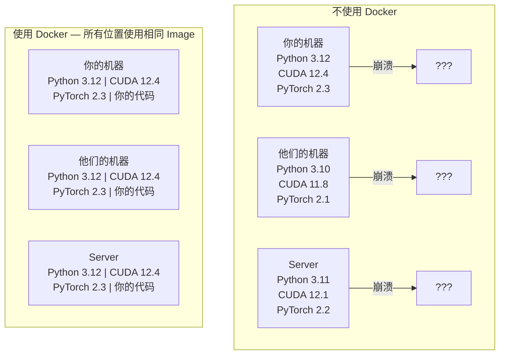

# 面向 AI 的 Docker

> Container 让“在我的机器上可以运行”成为过去式。

**Type:** Build
**Languages:** Docker
**Prerequisites:** Phase 0, Lessons 01 and 03
**Time:** ~60 分钟

## 学习目标

- 使用 Dockerfile 构建支持 GPU，并包含 CUDA、PyTorch 和 AI 库的 Docker Image
- 将 host 目录挂载为 Volume，使 Model、Dataset 和代码能够在 Container 重建后继续保留
- 配置 NVIDIA Container Toolkit，在 Container 内暴露 GPU
- 使用 Docker Compose 编排多服务 AI 应用（Inference server + Vector 数据库）

## 问题

你在自己的笔记本电脑上使用 PyTorch 2.3、CUDA 12.4 和 Python 3.12 训练了一个 Model。你的同事使用的是 PyTorch 2.1、CUDA 11.8 和 Python 3.10。你的 Model 在他们的机器上崩溃了。而你的 Dockerfile 可以在两台机器上运行。

AI 项目的依赖关系非常棘手。典型技术栈包括 Python、PyTorch、CUDA driver、cuDNN、系统级 C 库，以及 flash-attn 这类需要精确 compiler 版本的专用 package。Docker 将所有这些内容打包到单个 Image 中，使其可以在任何地方以完全相同的方式运行。

## 核心概念

Docker 将代码、runtime、库和系统 Tool 封装到一个称为 Container 的隔离单元中。可以把它理解为一台轻量级虚拟机，但它不会运行自己的 OS kernel，而是共享 host OS kernel，因此只需几秒钟即可启动，而不是几分钟。



### 为什么 AI 项目比大多数项目更需要 Docker

1. **GPU driver 很脆弱。** CUDA 12.4 代码无法在 CUDA 11.8 上运行。Docker 会在 Container 内隔离 CUDA toolkit，同时通过 NVIDIA Container Toolkit 共享 host GPU driver。

2. **Model weight 很大。** 一个拥有 7B parameter 的 Model 在 fp16 格式下占用 14 GB。你不会希望每次重建时都重新下载它。Docker Volume 允许你从 host 挂载 Model 目录。

3. **多服务架构很常见。** 一个真正的 AI 应用并不只是一个 Python 脚本。它还包括 Inference server、用于 RAG 的 Vector 数据库，可能还包括 Web frontend。Docker Compose 可以使用一个命令编排所有这些服务。

### 关键术语

| 术语 | 含义 |
|------|---------------|
| Image | 只读模板。相当于你的配方。由 Dockerfile 构建。 |
| Container | Image 的运行实例。相当于你的厨房。 |
| Dockerfile | 用于构建 Image 的指令。逐层执行。 |
| Volume | 在 Container 重启后仍然保留的持久化存储。 |
| docker-compose | 使用 YAML 定义多 Container 应用的 Tool。 |

### AI 中常见的 Container 模式

```text
Dev Container
  完整的 toolkit。支持 editor。包含 Jupyter 和调试 Tool。
  用于开发和实验。

Training Container
  最小化配置。只包含 Training 脚本和依赖项。
  在 GPU cluster 上运行。不包含 editor，也不包含 Jupyter。

Inference Container
  针对服务进行优化。Image 小，冷启动速度快。
  在生产环境中运行于 load balancer 之后。
```

```figure
s0-image-layers
```

## 动手构建

### 第 1 步：安装 Docker

```bash
# macOS
brew install --cask docker
open /Applications/Docker.app

# Ubuntu
curl -fsSL https://get.docker.com | sh
sudo usermod -aG docker $USER
# 注销并重新登录，使 group 变更生效
```

验证：

```bash
docker --version
docker run hello-world
```

### 第 2 步：安装 NVIDIA Container Toolkit（使用 NVIDIA GPU 的 Linux）

它允许 Docker Container 访问你的 GPU。macOS 和 Windows（WSL2）用户可以跳过此步骤；Docker Desktop 在这些平台上以不同方式处理 GPU passthrough。

```bash
distribution=$(. /etc/os-release;echo $ID$VERSION_ID)
curl -fsSL https://nvidia.github.io/libnvidia-container/gpgkey | sudo gpg --dearmor -o /usr/share/keyrings/nvidia-container-toolkit-keyring.gpg
curl -s -L https://nvidia.github.io/libnvidia-container/$distribution/libnvidia-container.list | \
    sed 's#deb https://#deb [signed-by=/usr/share/keyrings/nvidia-container-toolkit-keyring.gpg] https://#g' | \
    sudo tee /etc/apt/sources.list.d/nvidia-container-toolkit.list

sudo apt-get update
sudo apt-get install -y nvidia-container-toolkit
sudo nvidia-ctk runtime configure --runtime=docker
sudo systemctl restart docker
```

测试 Container 内的 GPU 访问：

```bash
docker run --rm --gpus all nvidia/cuda:12.4.1-base-ubuntu22.04 nvidia-smi
```

如果看到 GPU 信息，说明 toolkit 正常工作。

### 第 3 步：理解 Base Image

选择正确的 Base Image 可以节省数小时的调试时间。

```text
nvidia/cuda:12.4.1-devel-ubuntu22.04
  完整的 CUDA toolkit。包含 compiler。
  用途：构建需要 nvcc 的 package（flash-attn、bitsandbytes）
  大小：约 4 GB

nvidia/cuda:12.4.1-runtime-ubuntu22.04
  仅包含 CUDA runtime。不包含 compiler。
  用途：运行预构建代码
  大小：约 1.5 GB

pytorch/pytorch:2.6.0-cuda12.4-cudnn9-runtime
  在 CUDA 之上预安装 PyTorch。
  用途：跳过 PyTorch 安装步骤
  大小：约 6 GB

python:3.12-slim
  不包含 CUDA。仅支持 CPU。
  用途：在 CPU 上执行 Inference、运行轻量级 Tool
  大小：约 150 MB
```

### 第 4 步：为 AI 开发编写 Dockerfile

下面是 `code/Dockerfile` 中的 Dockerfile。让我们逐步了解它：

```dockerfile
FROM nvidia/cuda:12.4.1-devel-ubuntu22.04

ENV DEBIAN_FRONTEND=noninteractive
ENV PYTHONUNBUFFERED=1

RUN apt-get update && apt-get install -y --no-install-recommends \
    software-properties-common \
    git \
    curl \
    build-essential \
    && add-apt-repository -y ppa:deadsnakes/ppa \
    && apt-get update && apt-get install -y --no-install-recommends \
    python3.12 \
    python3.12-venv \
    python3.12-dev \
    && rm -rf /var/lib/apt/lists/*

RUN update-alternatives --install /usr/bin/python python /usr/bin/python3.12 1

RUN curl -sSL https://raw.githubusercontent.com/pypa/get-pip/3b73145063be545b649ad9ca83ea8da5fc915a4f/public/get-pip.py -o /tmp/get-pip.py \
    && echo "a341e1a43e38001c551a1508a73ff23636a11970b61d901d9a1cad2a18f57055  /tmp/get-pip.py" | sha256sum -c - \
    && python /tmp/get-pip.py \
    && rm /tmp/get-pip.py \
    && update-alternatives --install /usr/bin/pip pip /usr/local/bin/pip3.12 1

RUN python -m pip install --no-cache-dir --upgrade pip setuptools wheel

RUN python -m pip install --no-cache-dir \
    torch==2.6.0+cu124 \
    torchvision==0.21.0+cu124 \
    torchaudio==2.6.0+cu124 \
    --index-url https://download.pytorch.org/whl/cu124

RUN python -m pip install --no-cache-dir \
    numpy \
    pandas \
    scikit-learn \
    matplotlib \
    jupyter \
    transformers \
    datasets \
    accelerate \
    safetensors

WORKDIR /workspace

VOLUME ["/workspace", "/models"]

EXPOSE 8888

CMD ["python"]
```

构建它：

```bash
docker build -t ai-dev -f phases/00-setup-and-tooling/07-docker-for-ai/code/Dockerfile .
```

第一次构建需要一段时间（需要下载 CUDA Base Image 和 PyTorch）。后续构建将使用缓存的 layer。

运行它：

```bash
docker run --rm -it --gpus all \
    -v $(pwd):/workspace \
    -v ~/models:/models \
    ai-dev python -c "import torch; print(f'PyTorch {torch.__version__}, CUDA: {torch.cuda.is_available()}')"
```

在 Container 内运行 Jupyter：

```bash
docker run --rm -it --gpus all \
    -v $(pwd):/workspace \
    -v ~/models:/models \
    -p 8888:8888 \
    ai-dev jupyter notebook --ip=0.0.0.0 --port=8888 --no-browser --allow-root
```

### 第 5 步：为数据和 Model 挂载 Volume

Volume mount 对 AI 工作至关重要。如果不使用它们，当 Container 停止时，下载的 14 GB Model 就会消失。

```bash
# 挂载你的代码
-v $(pwd):/workspace

# 挂载共享的 Model 目录
-v ~/models:/models

# 挂载 Dataset
-v ~/datasets:/data
```

在 Training 脚本中，从挂载路径加载：

```python
from transformers import AutoModel

model = AutoModel.from_pretrained("/models/llama-7b")
```

Model 位于你的 host 文件系统中。无论重建 Container 多少次，都无需重新下载。

### 第 6 步：使用 Docker Compose 构建多服务 AI 应用

一个真正的 RAG 应用需要 Inference server 和 Vector 数据库。Docker Compose 可以使用一个命令运行这两项服务。

查看 `code/docker-compose.yml`：

```yaml
services:
  ai-dev:
    build:
      context: .
      dockerfile: Dockerfile
    deploy:
      resources:
        reservations:
          devices:
            - driver: nvidia
              count: all
              capabilities: [gpu]
    volumes:
      - ../../../:/workspace
      - ~/models:/models
      - ~/datasets:/data
    ports:
      - "8888:8888"
    stdin_open: true
    tty: true
    command: jupyter notebook --ip=0.0.0.0 --port=8888 --no-browser --allow-root

  qdrant:
    image: qdrant/qdrant:v1.12.5
    ports:
      - "6333:6333"
      - "6334:6334"
    volumes:
      - qdrant_data:/qdrant/storage

volumes:
  qdrant_data:
```

启动所有服务：

```bash
cd phases/00-setup-and-tooling/07-docker-for-ai/code
docker compose up -d
```

现在，你的 AI Dev Container 可以通过 service name 访问位于 `http://qdrant:6333` 的 Vector 数据库。Docker Compose 会自动创建共享网络。

从 AI Container 内测试连接：

```python
from qdrant_client import QdrantClient

client = QdrantClient(host="qdrant", port=6333)
print(client.get_collections())
```

停止所有服务：

```bash
docker compose down
```

添加 `-v` 还可以删除 qdrant Volume：

```bash
docker compose down -v
```

### 第 7 步：AI 工作中常用的 Docker 命令

```bash
# 列出正在运行的 Container
docker ps

# 列出所有 Image 及其大小
docker images

# 删除未使用的 Image（回收磁盘空间）
docker system prune -a

# 检查正在运行的 Container 内的 GPU 使用情况
docker exec -it <container_id> nvidia-smi

# 将文件从 Container 复制到 host
docker cp <container_id>:/workspace/results.csv ./results.csv

# 查看 Container log
docker logs -f <container_id>
```

## 实际使用

你现在已经拥有一个可复现的 AI 开发环境。在本课程的后续内容中：

- 使用 `docker compose up` 同时启动开发环境和 Vector 数据库
- 将代码、Model 和数据挂载为 Volume，确保重建期间不会丢失任何内容
- 当某节课程需要新的 Python package 时，将其添加到 Dockerfile 并重新构建
- 与队友共享你的 Dockerfile。他们将获得完全相同的环境。

### 没有 GPU？

移除 `--gpus all` flag 和 NVIDIA deploy block。Container 仍然可以用于基于 CPU 的课程。PyTorch 会检测到 CUDA 不存在，并自动回退到 CPU。

## 练习

1. 构建 Dockerfile，并在 Container 内运行 `python -c "import torch; print(torch.__version__)"`
2. 启动 docker-compose stack，并验证 AI Container 能够通过 `http://qdrant:6333/collections` 访问 Qdrant
3. 将 `flask` 添加到 Dockerfile，重新构建，然后在端口 5000 上运行一个简单的 API server。使用 `-p 5000:5000` 映射端口
4. 使用 `docker images` 测量 Image 大小。尝试将 Base Image 从 `devel` 切换为 `runtime`，并比较大小

## 关键术语

| 术语 | 人们通常怎么说 | 它的实际含义 |
|------|----------------|----------------------|
| Container | “轻量级 VM” | 一个使用 host kernel 的隔离进程，拥有自己的文件系统和网络 |
| Image layer | “缓存的步骤” | 每条 Dockerfile 指令都会创建一个 layer。未发生变化的 layer 会被缓存，因此重建速度很快。 |
| NVIDIA Container Toolkit | “Docker 中的 GPU” | 一个通过 `--gpus` flag 将 host GPU 暴露给 Container 的 runtime hook |
| Volume mount | “共享文件夹” | 映射到 Container 内的 host 目录。Container 停止后，变更仍会保留。 |
| Base image | “起点” | Dockerfile 基于其进行构建的 `FROM` Image。它决定了哪些内容已预先安装。 |
