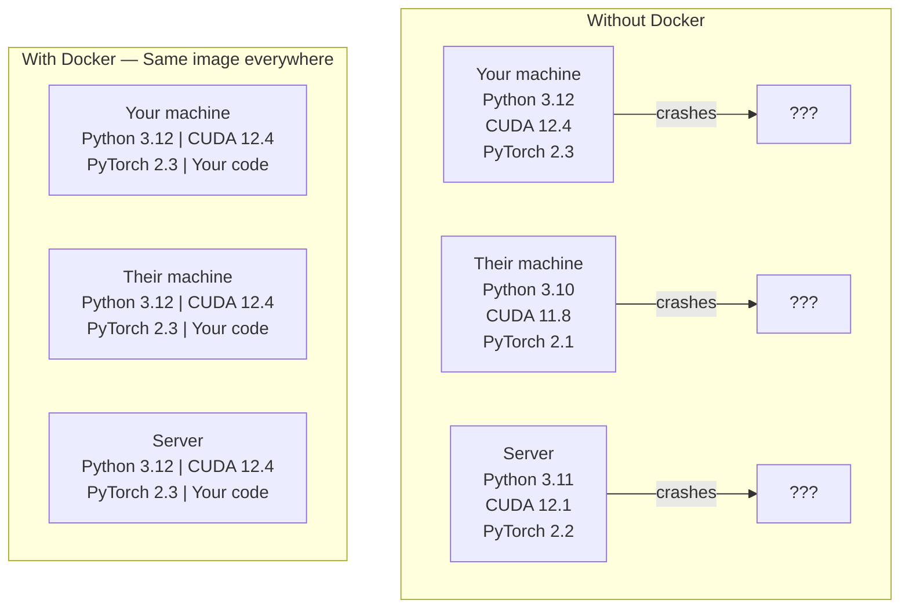

# 面向 AI 的 Docker

> Containers 让“在我机器上能跑”成为过去式。

**类型：** Build
**语言：** Python
**先修：** Phase 0，Lessons 01 和 03
**时间：** ~60 分钟

## 学习目标

- 从 Dockerfile 构建启用 GPU 的 Docker image，其中包含 CUDA、PyTorch 和 AI libraries
- 将宿主机目录作为 volumes 挂载，以便在 container 重建之间持久保留 models、datasets 和 code
- 配置 NVIDIA Container Toolkit，让 containers 内部可以访问 GPUs
- 使用 Docker Compose 编排多服务 AI applications（inference server + Vector database）

## 问题

你在自己的笔记本上用 PyTorch 2.3、CUDA 12.4 和 Python 3.12 训练了一个 model。你的同事使用 PyTorch 2.1、CUDA 11.8 和 Python 3.10。你的 model 在他们机器上崩溃。你的 Dockerfile 在两台机器上都能工作。

AI projects 是依赖噩梦。典型 stack 包括 Python、PyTorch、CUDA drivers、cuDNN、系统级 C libraries，以及像 flash-attn 这样需要精确编译器版本的专用包。Docker 会把所有这些打包成一个单一 image，并且到处都以相同方式运行。

## 概念

Docker 会把你的代码、runtime、libraries 和系统工具封装到一个叫 container 的隔离单元中。你可以把它想成一个轻量级 virtual machine，只不过它共享宿主 OS kernel，而不是运行自己的 kernel，所以它用几秒启动，而不是几分钟。



### 为什么 AI projects 比大多数项目更需要 Docker

1. **GPU drivers 很脆弱。** CUDA 12.4 代码无法在 CUDA 11.8 上运行。Docker 会隔离 container 内部的 CUDA toolkit，同时通过 NVIDIA Container Toolkit 共享宿主 GPU driver。

2. **Model weights 很大。** 一个 7B parameter model 在 fp16 下是 14 GB。你不会想每次重建时都重新下载它。Docker volumes 让你可以从宿主机挂载一个 models 目录。

3. **多服务架构很常见。** 一个真正的 AI application 不只是一个 Python 脚本。它是一个 inference server、一个用于 RAG 的 Vector database，也许还有一个 web frontend。Docker Compose 用一条命令编排所有这些服务。

### 关键术语

| 术语 | 含义 |
|------|---------------|
| Image | 只读模板。你的配方。由 Dockerfile 构建。 |
| Container | image 的运行实例。你的厨房。 |
| Dockerfile | 用于构建 image 的指令。逐层构建。 |
| Volume | 在 container 重启后依然保留的持久存储。 |
| docker-compose | 用 YAML 定义多 container applications 的工具。 |

### AI 中常见的 container 模式

```
Dev Container
  Full toolkit. Editor support. Jupyter. Debugging tools.
  Used during development and experimentation.

Training Container
  Minimal. Just the training script and dependencies.
  Runs on GPU clusters. No editor, no Jupyter.

Inference Container
  Optimized for serving. Small image. Fast cold start.
  Runs behind a load balancer in production.
```

## 构建它

### 步骤 1： 安装 Docker

```bash
# macOS
brew install --cask docker
open /Applications/Docker.app

# Ubuntu
curl -fsSL https://get.docker.com | sh
sudo usermod -aG docker $USER
# Log out and back in for group change to take effect
```

验证：

```bash
docker --version
docker run hello-world
```

### 步骤 2： 安装 NVIDIA Container Toolkit（带 NVIDIA GPU 的 Linux）

这会让 Docker containers 能够访问你的 GPU。macOS 和 Windows（WSL2）用户可以跳过这一步；Docker Desktop 在这些平台上以不同方式处理 GPU passthrough。

```bash
distribution=$(. /etc/os-release;echo $ID$VERSION_ID)
curl -fsSL https://nvidia.github.io/libnvidia-container/gpgkey | sudo gpg --dearmor -o /usr/share/keyrings/nvidia-container-toolkit-keyring.gpg
curl -s -L https://nvidia.github.io/libnvidia-container/$distribution/libnvidia-container.list | \
    sed 's#deb https://#deb [signed-by=/usr/share/keyrings/nvidia-container-toolkit-keyring.gpg] https://#g' | \
    sudo tee /etc/apt/sources.list.d/nvidia-container-toolkit.list

sudo apt-get update
sudo apt-get install -y nvidia-container-toolkit
sudo nvidia-ctk runtime configure --runtime=docker
sudo systemctl restart docker
```

在 container 内测试 GPU 访问：

```bash
docker run --rm --gpus all nvidia/cuda:12.4.1-base-ubuntu22.04 nvidia-smi
```

如果你看到 GPU 信息，说明 toolkit 正常工作。

### 步骤 3： 理解 base images

选择正确的 base image 可以节省数小时调试时间。

```
nvidia/cuda:12.4.1-devel-ubuntu22.04
  Full CUDA toolkit. Compilers included.
  Use for: building packages that need nvcc (flash-attn, bitsandbytes)
  Size: ~4 GB

nvidia/cuda:12.4.1-runtime-ubuntu22.04
  CUDA runtime only. No compilers.
  Use for: running pre-built code
  Size: ~1.5 GB

pytorch/pytorch:2.3.1-cuda12.4-cudnn9-runtime
  PyTorch pre-installed on top of CUDA.
  Use for: skipping the PyTorch install step
  Size: ~6 GB

python:3.12-slim
  No CUDA. CPU only.
  Use for: inference on CPU, lightweight tools
  Size: ~150 MB
```

### 步骤 4： 为 AI development 编写 Dockerfile

这是 `code/Dockerfile` 中的 Dockerfile。逐步看一下：

```dockerfile
FROM nvidia/cuda:12.4.1-devel-ubuntu22.04

ENV DEBIAN_FRONTEND=noninteractive
ENV PYTHONUNBUFFERED=1

RUN apt-get update && apt-get install -y --no-install-recommends \
    python3.12 \
    python3.12-venv \
    python3.12-dev \
    python3-pip \
    git \
    curl \
    build-essential \
    && rm -rf /var/lib/apt/lists/*

RUN update-alternatives --install /usr/bin/python python /usr/bin/python3.12 1

RUN python -m pip install --no-cache-dir --upgrade pip setuptools wheel

RUN python -m pip install --no-cache-dir \
    torch==2.3.1 \
    torchvision==0.18.1 \
    torchaudio==2.3.1 \
    --index-url https://download.pytorch.org/whl/cu124

RUN python -m pip install --no-cache-dir \
    numpy \
    pandas \
    scikit-learn \
    matplotlib \
    jupyter \
    transformers \
    datasets \
    accelerate \
    safetensors

WORKDIR /workspace

VOLUME ["/workspace", "/models"]

EXPOSE 8888

CMD ["python"]
```

构建它：

```bash
docker build -t ai-dev -f phases/00-setup-and-tooling/07-docker-for-ai/code/Dockerfile .
```

第一次会花一些时间（下载 CUDA base image + PyTorch）。后续构建会使用 cached layers。

运行它：

```bash
docker run --rm -it --gpus all \
    -v $(pwd):/workspace \
    -v ~/models:/models \
    ai-dev python -c "import torch; print(f'PyTorch {torch.__version__}, CUDA: {torch.cuda.is_available()}')"
```

在 container 内运行 Jupyter：

```bash
docker run --rm -it --gpus all \
    -v $(pwd):/workspace \
    -v ~/models:/models \
    -p 8888:8888 \
    ai-dev jupyter notebook --ip=0.0.0.0 --port=8888 --no-browser --allow-root
```

### 步骤 5： 用于 data 和 models 的 volume mounts

Volume mounts 对 AI 工作至关重要。没有它们，当 container 停止时，你的 14 GB model 下载就会消失。

```bash
# Mount your code
-v $(pwd):/workspace

# Mount a shared models directory
-v ~/models:/models

# Mount datasets
-v ~/datasets:/data
```

在你的 training script 中，从挂载路径加载：

```python
from transformers import AutoModel

model = AutoModel.from_pretrained("/models/llama-7b")
```

model 位于你的宿主文件系统上。你可以随意重建 container，而无需重新下载。

### 步骤 6： 用于多服务 AI apps 的 Docker Compose

真正的 RAG application 需要一个 inference server 和一个 Vector database。Docker Compose 用一条命令运行两者。

参见 `code/docker-compose.yml`：

```yaml
services:
  ai-dev:
    build:
      context: .
      dockerfile: Dockerfile
    deploy:
      resources:
        reservations:
          devices:
            - driver: nvidia
              count: all
              capabilities: [gpu]
    volumes:
      - ../../../:/workspace
      - ~/models:/models
      - ~/datasets:/data
    ports:
      - "8888:8888"
    stdin_open: true
    tty: true
    command: jupyter notebook --ip=0.0.0.0 --port=8888 --no-browser --allow-root

  qdrant:
    image: qdrant/qdrant:v1.12.5
    ports:
      - "6333:6333"
      - "6334:6334"
    volumes:
      - qdrant_data:/qdrant/storage

volumes:
  qdrant_data:
```

启动所有服务：

```bash
cd phases/00-setup-and-tooling/07-docker-for-ai/code
docker compose up -d
```

现在你的 AI dev container 可以通过 service name 在 `http://qdrant:6333` 访问 Vector database。Docker Compose 会自动创建共享 network。

从 AI container 内测试连接：

```python
from qdrant_client import QdrantClient

client = QdrantClient(host="qdrant", port=6333)
print(client.get_collections())
```

停止所有服务：

```bash
docker compose down
```

添加 `-v` 也会删除 qdrant volume：

```bash
docker compose down -v
```

### 步骤 7： AI 工作中有用的 Docker 命令

```bash
# List running containers
docker ps

# List all images and their sizes
docker images

# Remove unused images (reclaim disk space)
docker system prune -a

# Check GPU usage inside a running container
docker exec -it <container_id> nvidia-smi

# Copy a file from container to host
docker cp <container_id>:/workspace/results.csv ./results.csv

# View container logs
docker logs -f <container_id>
```

## 使用它

现在你有了一个可复现的 AI development environment。在本课程后续内容中：

- 使用 `docker compose up` 同时启动你的 dev environment 和 Vector database
- 将 code、models 和 data 作为 volumes 挂载，这样重建之间不会丢失任何东西
- 当某节课需要新的 Python 包时，把它添加到 Dockerfile 并重建
- 与队友共享你的 Dockerfile。他们会获得完全相同的 environment。

### 没有 GPU？

移除 `--gpus all` flag 和 NVIDIA deploy block。container 仍然适用于基于 CPU 的课程。PyTorch 会检测到 CUDA 不存在，并自动回退到 CPU。

## 练习

1. 构建 Dockerfile，并在 container 内运行 `python -c "import torch; print(torch.__version__)"`
2. 启动 docker-compose stack，并验证 AI container 可以访问 `http://qdrant:6333/collections` 上的 Qdrant
3. 将 `flask` 添加到 Dockerfile，重建，并在 5000 端口运行一个简单的 API server。用 `-p 5000:5000` 映射端口
4. 用 `docker images` 测量 image size。尝试把 base image 从 `devel` 切换到 `runtime`，并比较大小

## 关键术语

| 术语 | 人们常说 | 实际含义 |
|------|----------------|----------------------|
| Container | “轻量级 VM” | 使用宿主 kernel 的隔离进程，拥有自己的 filesystem 和 network |
| Image layer | “缓存步骤” | 每条 Dockerfile 指令都会创建一个 layer。未变化的 layers 会被缓存，因此重建很快。 |
| NVIDIA Container Toolkit | “Docker 中的 GPU” | 一个 runtime hook，通过 `--gpus` flag 将宿主 GPUs 暴露给 containers |
| Volume mount | “共享文件夹” | 宿主机上的目录被映射到 container 内。container 停止后，变更仍会保留。 |
| Base image | “起点” | 你的 Dockerfile 基于其构建的 `FROM` image。它决定了预装内容。 |
