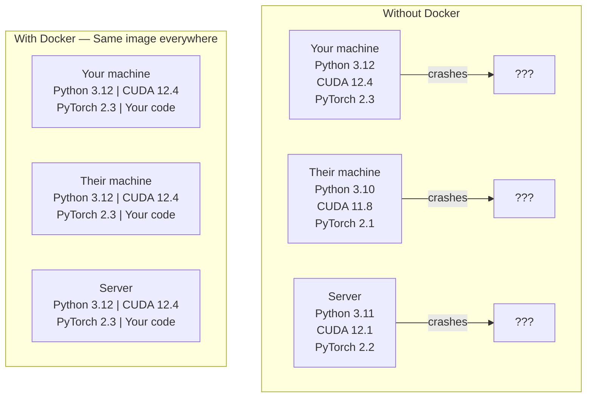

# Docker for AI

> Containers 让“在我机器上能跑”成为过去式。

**Type:** Build
**Languages:** Docker
**Prerequisites:** Phase 0, Lessons 01 and 03
**Time:** ~60 分钟

## Learning Objectives

- 从 Dockerfile 构建启用 GPU 的 Docker image，包含 CUDA、PyTorch 和 AI libraries
- 将 host directories 作为 volumes mount，以便在 container rebuilds 之间持久化 models、datasets 和 code
- 配置 NVIDIA Container Toolkit，让 containers 内部可以访问 GPUs
- 使用 Docker Compose 编排多服务 AI applications（inference server + vector database）

## 问题

你在 laptop 上使用 PyTorch 2.3、CUDA 12.4 和 Python 3.12 训练了一个 model。你的同事使用 PyTorch 2.1、CUDA 11.8 和 Python 3.10。你的 model 在他们的机器上崩溃。你的 Dockerfile 在两边都能工作。

AI projects 是 dependency nightmares。一个典型 stack 包括 Python、PyTorch、CUDA drivers、cuDNN、system-level C libraries，以及像 flash-attn 这样需要精确 compiler versions 的 specialized packages。Docker 会把所有这些打包到一个 image 中，并在任何地方以相同方式运行。

## 概念

Docker 会把你的 code、runtime、libraries 和 system tools 封装到一个称为 container 的隔离单元中。可以把它看作轻量级 virtual machine，只是它共享 host OS kernel，而不是运行自己的 kernel，因此启动只需几秒，而不是几分钟。



### 为什么 AI projects 比大多数项目更需要 Docker

1. **GPU drivers 很脆弱。** CUDA 12.4 code 不能在 CUDA 11.8 上运行。Docker 会隔离 container 内的 CUDA toolkit，同时通过 NVIDIA Container Toolkit 共享 host GPU driver。

2. **Model weights 很大。** 一个 7B parameter model 在 fp16 下有 14 GB。你不会想在每次 rebuild 时重新下载它。Docker volumes 允许你从 host mount 一个 models directory。

3. **Multi-service architectures 很常见。** 一个真实的 AI application 不只是一个 Python script。它是 inference server、用于 RAG 的 vector database，可能还有 web frontend。Docker Compose 用一条命令编排所有这些服务。

### 关键词汇

| Term | What it means |
|------|---------------|
| Image | 只读 template。你的 recipe。由 Dockerfile 构建。 |
| Container | image 的运行实例。你的 kitchen。 |
| Dockerfile | 构建 image 的 instructions。逐层构建。 |
| Volume | 可在 container restarts 后保留的持久化 storage。 |
| docker-compose | 用 YAML 定义 multi-container applications 的工具。 |

### AI 中常见的 container patterns

```
Dev Container
  完整 toolkit。Editor support。Jupyter。Debugging tools。
  用于 development 和 experimentation。

Training Container
  最小化。只有 training script 和 dependencies。
  在 GPU clusters 上运行。没有 editor，没有 Jupyter。

Inference Container
  为 serving 优化。Small image。Fast cold start。
  在 production 中运行于 load balancer 后方。
```

## Build It

### Step 1：安装 Docker

```bash
# macOS
brew install --cask docker
open /Applications/Docker.app

# Ubuntu
curl -fsSL https://get.docker.com | sh
sudo usermod -aG docker $USER
# Log out and back in for group change to take effect
```

验证：

```bash
docker --version
docker run hello-world
```

### Step 2：安装 NVIDIA Container Toolkit（带 NVIDIA GPU 的 Linux）

这让 Docker containers 能够访问你的 GPU。macOS 和 Windows（WSL2）用户可以跳过；Docker Desktop 在这些平台上以不同方式处理 GPU passthrough。

```bash
distribution=$(. /etc/os-release;echo $ID$VERSION_ID)
curl -fsSL https://nvidia.github.io/libnvidia-container/gpgkey | sudo gpg --dearmor -o /usr/share/keyrings/nvidia-container-toolkit-keyring.gpg
curl -s -L https://nvidia.github.io/libnvidia-container/$distribution/libnvidia-container.list | \
    sed 's#deb https://#deb [signed-by=/usr/share/keyrings/nvidia-container-toolkit-keyring.gpg] https://#g' | \
    sudo tee /etc/apt/sources.list.d/nvidia-container-toolkit.list

sudo apt-get update
sudo apt-get install -y nvidia-container-toolkit
sudo nvidia-ctk runtime configure --runtime=docker
sudo systemctl restart docker
```

在 container 内测试 GPU access：

```bash
docker run --rm --gpus all nvidia/cuda:12.4.1-base-ubuntu22.04 nvidia-smi
```

如果你看到了 GPU info，说明 toolkit 正常工作。

### Step 3：理解 base images

选择正确的 base image 可以节省数小时调试时间。

```
nvidia/cuda:12.4.1-devel-ubuntu22.04
  完整 CUDA toolkit。包含 compilers。
  Use for: 构建需要 nvcc 的 packages（flash-attn、bitsandbytes）
  Size: ~4 GB

nvidia/cuda:12.4.1-runtime-ubuntu22.04
  仅 CUDA runtime。没有 compilers。
  Use for: 运行 pre-built code
  Size: ~1.5 GB

pytorch/pytorch:2.3.1-cuda12.4-cudnn9-runtime
  基于 CUDA 预装 PyTorch。
  Use for: 跳过 PyTorch install step
  Size: ~6 GB

python:3.12-slim
  没有 CUDA。仅 CPU。
  Use for: CPU inference、lightweight tools
  Size: ~150 MB
```

### Step 4：为 AI development 编写 Dockerfile

这是 `code/Dockerfile` 中的 Dockerfile。逐段看一下：

```dockerfile
FROM nvidia/cuda:12.4.1-devel-ubuntu22.04

ENV DEBIAN_FRONTEND=noninteractive
ENV PYTHONUNBUFFERED=1

RUN apt-get update && apt-get install -y --no-install-recommends \
    python3.12 \
    python3.12-venv \
    python3.12-dev \
    python3-pip \
    git \
    curl \
    build-essential \
    && rm -rf /var/lib/apt/lists/*

RUN update-alternatives --install /usr/bin/python python /usr/bin/python3.12 1

RUN python -m pip install --no-cache-dir --upgrade pip setuptools wheel

RUN python -m pip install --no-cache-dir \
    torch==2.3.1 \
    torchvision==0.18.1 \
    torchaudio==2.3.1 \
    --index-url https://download.pytorch.org/whl/cu124

RUN python -m pip install --no-cache-dir \
    numpy \
    pandas \
    scikit-learn \
    matplotlib \
    jupyter \
    transformers \
    datasets \
    accelerate \
    safetensors

WORKDIR /workspace

VOLUME ["/workspace", "/models"]

EXPOSE 8888

CMD ["python"]
```

构建它：

```bash
docker build -t ai-dev -f phases/00-setup-and-tooling/07-docker-for-ai/code/Dockerfile .
```

第一次会花一些时间（下载 CUDA base image + PyTorch）。后续 builds 会使用 cached layers。

运行它：

```bash
docker run --rm -it --gpus all \
    -v $(pwd):/workspace \
    -v ~/models:/models \
    ai-dev python -c "import torch; print(f'PyTorch {torch.__version__}, CUDA: {torch.cuda.is_available()}')"
```

在 container 内运行 Jupyter：

```bash
docker run --rm -it --gpus all \
    -v $(pwd):/workspace \
    -v ~/models:/models \
    -p 8888:8888 \
    ai-dev jupyter notebook --ip=0.0.0.0 --port=8888 --no-browser --allow-root
```

### Step 5：用于 data 和 models 的 volume mounts

Volume mounts 对 AI 工作至关重要。没有它们，你的 14 GB model downloads 会在 container 停止后消失。

```bash
# Mount your code
-v $(pwd):/workspace

# Mount a shared models directory
-v ~/models:/models

# Mount datasets
-v ~/datasets:/data
```

在你的 training script 中，从 mounted path 加载：

```python
from transformers import AutoModel

model = AutoModel.from_pretrained("/models/llama-7b")
```

model 位于你的 host filesystem 上。你可以随意 rebuild container，而无需重新下载。

### Step 6：用于 multi-service AI apps 的 Docker Compose

一个真实的 RAG application 需要 inference server 和 vector database。Docker Compose 用一条命令运行两者。

见 `code/docker-compose.yml`：

```yaml
services:
  ai-dev:
    build:
      context: .
      dockerfile: Dockerfile
    deploy:
      resources:
        reservations:
          devices:
            - driver: nvidia
              count: all
              capabilities: [gpu]
    volumes:
      - ../../../:/workspace
      - ~/models:/models
      - ~/datasets:/data
    ports:
      - "8888:8888"
    stdin_open: true
    tty: true
    command: jupyter notebook --ip=0.0.0.0 --port=8888 --no-browser --allow-root

  qdrant:
    image: qdrant/qdrant:v1.12.5
    ports:
      - "6333:6333"
      - "6334:6334"
    volumes:
      - qdrant_data:/qdrant/storage

volumes:
  qdrant_data:
```

启动所有服务：

```bash
cd phases/00-setup-and-tooling/07-docker-for-ai/code
docker compose up -d
```

现在你的 AI dev container 可以通过 service name 在 `http://qdrant:6333` 访问 vector database。Docker Compose 会自动创建 shared network。

从 AI container 内测试连接：

```python
from qdrant_client import QdrantClient

client = QdrantClient(host="qdrant", port=6333)
print(client.get_collections())
```

停止所有服务：

```bash
docker compose down
```

加上 `-v` 也会删除 qdrant volume：

```bash
docker compose down -v
```

### Step 7：AI 工作中实用的 Docker commands

```bash
# List running containers
docker ps

# List all images and their sizes
docker images

# Remove unused images (reclaim disk space)
docker system prune -a

# Check GPU usage inside a running container
docker exec -it <container_id> nvidia-smi

# Copy a file from container to host
docker cp <container_id>:/workspace/results.csv ./results.csv

# View container logs
docker logs -f <container_id>
```

## Use It

你现在拥有了可复现的 AI development environment。在本课程后续部分：

- 使用 `docker compose up` 同时启动你的 dev environment 和 vector database
- 将 code、models 和 data 作为 volumes mount，确保 rebuilds 之间不会丢失任何内容
- 当某节 lesson 需要新的 Python package 时，把它添加到 Dockerfile 并 rebuild
- 与 teammates 共享你的 Dockerfile。他们会得到完全相同的 environment。

### 没有 GPU？

移除 `--gpus all` flag 和 NVIDIA deploy block。container 仍然适用于基于 CPU 的 lessons。PyTorch 会自动检测没有 CUDA，并 fallback 到 CPU。

## 练习

1. 构建 Dockerfile，并在 container 内运行 `python -c "import torch; print(torch.__version__)"`
2. 启动 docker-compose stack，并验证可从 AI container 访问 `http://qdrant:6333/collections` 上的 Qdrant
3. 将 `flask` 添加到 Dockerfile，rebuild，并在 port 5000 上运行一个简单 API server。使用 `-p 5000:5000` map 端口
4. 使用 `docker images` 测量 image size。尝试把 base image 从 `devel` 切换到 `runtime`，并比较大小

## 关键术语

| Term | What people say | What it actually means |
|------|----------------|----------------------|
| Container | “Lightweight VM” | 使用 host kernel 的隔离进程，拥有自己的 filesystem 和 network |
| Image layer | “Cached step” | 每条 Dockerfile instruction 都会创建一个 layer。未变化的 layers 会被 cached，因此 rebuilds 很快。 |
| NVIDIA Container Toolkit | “GPU in Docker” | 一个 runtime hook，通过 `--gpus` flag 将 host GPUs 暴露给 containers |
| Volume mount | “Shared folder” | host 上映射进 container 的目录。container 停止后 changes 仍会保留。 |
| Base image | “Starting point” | 你的 Dockerfile 基于其构建的 `FROM` image。它决定了预装内容。 |
