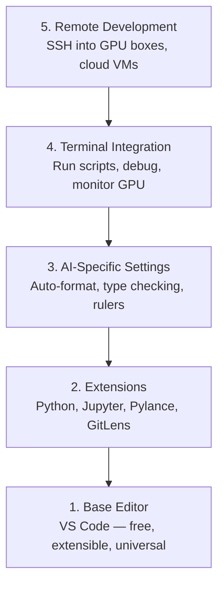

# Editor Setup

> 你的编辑器是你的协作伙伴。一次性配置好它，让它不再碍事，并开始真正发挥作用。

**Type:** Build
**Languages:** --
**Prerequisites:** Phase 0, Lesson 01
**Time:** ~20 分钟

## 学习目标
- 安装 VS Code，并配置 Python、Jupyter、linting 和 remote SSH 所需的核心 extensions
- 为 AI workflows 配置 format-on-save、type checking 和 notebook output scrolling
- 配置 Remote SSH，像编辑本地代码一样在远程 GPU 机器上编辑和 debug 代码
- 评估其他编辑器选择（Cursor、Windsurf、Neovim）以及它们在 AI work 中的取舍

## 问题
你会在编辑器里花费数千小时：编写 Python、运行 notebooks、debug training loops，以及 SSH 到 GPU 机器。配置不当的编辑器会让每一次工作都充满阻力：没有 autocomplete、没有 type hints、没有 inline errors、需要手动格式化，以及笨重的 terminal workflow。

正确配置只需要 20 分钟。跳过它，每天都会损失 20 分钟。

## 概念
AI engineering 的编辑器配置需要五样东西：



## 构建它
### 步骤 1： Install VS Code

推荐使用 VS Code。它免费、可在所有 OS 上运行、对 Jupyter notebook 有一流支持，并且 extension 生态覆盖了 AI work 所需的一切。

从 [code.visualstudio.com](https://code.visualstudio.com/) 下载。

在 terminal 中验证：

```bash
code --version
```

如果 macOS 上找不到 `code`，打开 VS Code，按 `Cmd+Shift+P`，输入 "Shell Command"，然后选择 "Install 'code' command in PATH"。

### 步骤 2：安装必要扩展

在 VS Code 中打开 integrated terminal（`Ctrl+`` ` 或 `` Cmd+` ``），安装 AI work 需要的 extensions：

```bash
code --install-extension ms-python.python
code --install-extension ms-python.vscode-pylance
code --install-extension ms-toolsai.jupyter
code --install-extension eamodio.gitlens
code --install-extension ms-vscode-remote.remote-ssh
code --install-extension ms-python.debugpy
code --install-extension ms-python.black-formatter
code --install-extension charliermarsh.ruff
```

每个 extension 的作用：

| Extension | Why |
|-----------|-----|
| Python | Language 支持、virtual env 检测、run/debug |
| Pylance | 快速 type checking、autocomplete、import resolution |
| Jupyter | 在 VS Code 内运行 notebooks、variable explorer |
| GitLens | 查看谁改了什么、inline git blame |
| Remote SSH | 像本地一样打开远程 GPU 机器上的文件夹 |
| Debugpy | Python 的 step-through debugging |
| Black Formatter | 保存时自动格式化，保持风格一致 |
| Ruff | 快速 linting，捕获常见错误 |

本课中的 `code/.vscode/extensions.json` 文件包含完整推荐列表。当你打开 project folder 时，VS Code 会提示你安装它们。

### 步骤 3：配置设置

复制本课 `code/.vscode/settings.json` 中的 settings，或通过 `Settings > Open Settings (JSON)` 手动应用。

AI work 的关键 settings：

```jsonc
{
    "python.analysis.typeCheckingMode": "basic",
    "editor.formatOnSave": true,
    "editor.rulers": [88, 120],
    "notebook.output.scrolling": true,
    "files.autoSave": "afterDelay"
}
```

为什么这些很重要：

- **Type checking on basic**：在运行前捕获错误的 argument types。能节省 debug tensor shape mismatches 和错误 API parameters 的时间。
- **Format on save**：再也不用考虑格式化。Black 会处理。
- **Rulers at 88 and 120**：Black 在 88 处换行。120 标记显示 docstrings 和 comments 什么时候过长。
- **Notebook output scrolling**：Training loops 会打印数千行。没有 scrolling 时，output panel 会无限膨胀。
- **Auto-save**：你会忘记保存。你的 training script 会运行旧代码。Auto-save 可以防止这种情况。

### 步骤 4： Terminal 集成

VS Code 的 integrated terminal 是你运行 training scripts、监控 GPU、管理 environments 的地方。

正确配置它：

```jsonc
{
    "terminal.integrated.defaultProfile.osx": "zsh",
    "terminal.integrated.defaultProfile.linux": "bash",
    "terminal.integrated.fontSize": 13,
    "terminal.integrated.scrollback": 10000
}
```

有用的快捷键：

| Action | macOS | Linux/Windows |
|--------|-------|---------------|
| Toggle terminal | `` Ctrl+` `` | `` Ctrl+` `` |
| New terminal | `Ctrl+Shift+`` ` | `Ctrl+Shift+`` ` |
| Split terminal | `Cmd+\` | `Ctrl+\` |

Split terminals 很有用：一个用于运行你的 script，另一个用于用 `nvidia-smi -l 1` 或 `watch -n 1 nvidia-smi` 监控 GPU。

### 步骤 5：远程开发（SSH 到 GPU 机器）

这是 AI work 最重要的 extension。你会在远程机器上运行 training（cloud VMs、lab servers、Lambda、Vast.ai）。Remote SSH 让你打开远程 filesystem、编辑文件、运行 terminals，并像一切都在本地一样 debug。

Setup：

1. 安装 Remote SSH extension（已在 Step 2 完成）。
2. 按 `Ctrl+Shift+P`（或 `Cmd+Shift+P`），输入 "Remote-SSH: Connect to Host"。
3. 输入 `user@your-gpu-box-ip`。
4. VS Code 会自动在远程机器上安装它的 server component。

如需 passwordless access，配置 SSH keys：

```bash
ssh-keygen -t ed25519 -C "your-email@example.com"
ssh-copy-id user@your-gpu-box-ip
```

为了方便，把 host 添加到 `~/.ssh/config`：

```
Host gpu-box
    HostName 203.0.113.50
    User ubuntu
    IdentityFile ~/.ssh/id_ed25519
    ForwardAgent yes
```

现在 `Remote-SSH: Connect to Host > gpu-box` 会立即连接。

## Alternatives

### Cursor

[cursor.com](https://cursor.com) 是一个内置 AI code generation 的 VS Code fork。它使用相同的 extension 生态和 settings 格式。如果你使用 Cursor，本课中的所有内容仍然适用。导入同一份 `settings.json` 和 `extensions.json`。

### Windsurf

[windsurf.com](https://windsurf.com) 是另一个 AI-first VS Code fork。情况相同：相同 extensions、相同 settings 格式、相同 Remote SSH 支持。

### Vim/Neovim

如果你已经使用 Vim 或 Neovim 并且效率很高，那就继续使用。AI Python work 的最低配置：

- **pyright** 或 **pylsp** 用于 type checking（通过 Mason 或手动安装）
- **nvim-lspconfig** 用于 language server integration
- **jupyter-vim** 或 **molten-nvim** 用于 notebook-like execution
- **telescope.nvim** 用于 file/symbol search
- **none-ls.nvim** 搭配 black 和 ruff 用于 formatting/linting

如果你还没有使用 Vim，不要现在开始。学习曲线会和学习 AI engineering 竞争。使用 VS Code。

## 使用它
有了这套配置，你的日常 workflow 看起来像这样：

1. 在 VS Code 中打开 project folder（或通过 Remote SSH 连接到 GPU 机器）。
2. 在编辑器中编写 Python，使用 autocomplete、type hints 和 inline errors。
3. 使用 Jupyter extension 内联运行 Jupyter notebooks。
4. 使用 integrated terminal 运行 training scripts、`uv pip install` 和 GPU monitoring。
5. 提交前用 GitLens review changes。

## 练习
1. 安装 VS Code 和 Step 2 中列出的所有 extensions
2. 将本课的 `settings.json` 复制到你的 VS Code config 中
3. 打开一个 Python 文件，验证 Pylance 显示 type hints，并且 Black 会在保存时格式化
4. 如果你可以访问远程机器，配置 Remote SSH 并打开其上的一个文件夹

## 关键术语
| Term | What people say | What it actually means |
|------|----------------|----------------------|
| LSP | "Autocomplete engine" | Language Server Protocol：一种标准，让 editors 可以从特定 language 的 server 获取 type info、completions 和 diagnostics |
| Pylance | "The Python plugin" | Microsoft 的 Python language server，使用 Pyright 进行 type checking 和 IntelliSense |
| Remote SSH | "Working on the server" | VS Code extension，在远程机器上运行轻量 server，并将 UI stream 到本地 editor |
| Format on save | "Auto-prettier" | 每次保存时 editor 都会运行 formatter（Black、Ruff），因此 code style 始终一致 |
