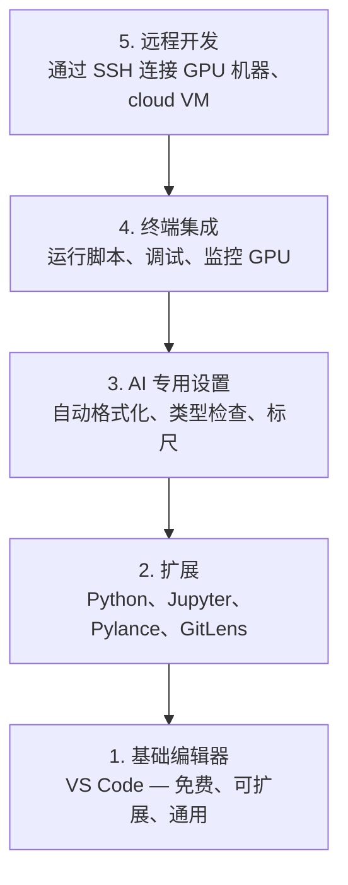

# 编辑器设置

> 编辑器是你的副驾驶。一次配置到位，让它不再妨碍你，并开始真正发挥作用。

**Type:** Build
**Languages:** --
**Prerequisites:** Phase 0, Lesson 01
**Time:** ~20 分钟

## 学习目标

- 安装 VS Code，以及用于 Python、Jupyter、linting 和远程 SSH 的必要扩展
- 为 AI 工作流配置保存时格式化、类型检查和 notebook 输出滚动
- 设置 Remote SSH，像操作本地环境一样编辑和调试远程 GPU 机器上的代码
- 评估其他编辑器选择（Cursor、Windsurf、Neovim）及其用于 AI 工作时的取舍

## 问题

你将在编辑器中投入数千小时：编写 Python、运行 notebook、调试 Training 循环，以及通过 SSH 连接 GPU 机器。配置不当的编辑器会让每次工作都充满阻力：没有自动补全、没有类型提示、没有行内错误提示、需要手动格式化，终端工作流也十分笨拙。

正确的设置只需 20 分钟。跳过这一步，每天都会多浪费 20 分钟。

## 概念

一套用于 AI Engineering 的编辑器设置需要具备五项能力：



```figure
s0-lsp-roundtrip
```

## 动手构建

### 第 1 步：安装 VS Code

推荐使用 VS Code。它免费、支持所有操作系统、对 Jupyter notebook 提供一流支持，而且其扩展生态覆盖了 AI 工作所需的一切。

从 [code.visualstudio.com](https://code.visualstudio.com/) 下载。

在终端中验证：

```bash
code --version
```

如果在 macOS 上找不到 `code`，请打开 VS Code，按下 `Cmd+Shift+P`，输入 "Shell Command"，然后选择 "Install 'code' command in PATH"。

### 第 2 步：安装必要扩展

在 VS Code 中打开集成终端（所有平台均使用 `` Ctrl+` ``），然后安装对 AI 工作至关重要的扩展：

```bash
code --install-extension ms-python.python
code --install-extension ms-python.vscode-pylance
code --install-extension ms-toolsai.jupyter
code --install-extension eamodio.gitlens
code --install-extension ms-vscode-remote.remote-ssh
code --install-extension ms-python.debugpy
code --install-extension ms-python.black-formatter
code --install-extension charliermarsh.ruff
```

各扩展的作用：

| 扩展 | 用途 |
|-----------|-----|
| Python | 语言支持、虚拟环境检测、运行与调试 |
| Pylance | 快速类型检查、自动补全、import 解析 |
| Jupyter | 在 VS Code 中运行 notebook、查看变量 |
| GitLens | 查看谁修改了什么，以及行内 git blame |
| Remote SSH | 像操作本地目录一样打开远程 GPU 机器上的文件夹 |
| Debugpy | 对 Python 进行单步调试 |
| Black Formatter | 保存时自动格式化，保持风格一致 |
| Ruff | 快速 linting，捕获常见错误 |

本课的 `code/.vscode/extensions.json` 文件包含完整的推荐扩展列表。打开项目文件夹时，VS Code 会提示你安装这些扩展。

### 第 3 步：配置设置

复制本课 `code/.vscode/settings.json` 中的设置，或通过 `Settings > Open Settings (JSON)` 手动应用。

AI 工作的关键设置：

```jsonc
{
    "python.analysis.typeCheckingMode": "basic",
    "editor.formatOnSave": true,
    "editor.rulers": [88, 120],
    "notebook.output.scrolling": true,
    "files.autoSave": "afterDelay"
}
```

这些设置的重要性：

- **将类型检查设置为 basic**：在运行前捕获错误的参数类型，减少排查 Tensor 形状不匹配和 API 参数错误所花费的时间。
- **保存时格式化**：以后无需再考虑格式问题，由 Black 负责处理。
- **在 88 和 120 处显示标尺**：Black 会在 88 个字符处换行。120 标记能显示 docstring 和注释何时变得过长。
- **Notebook 输出滚动**：Training 循环可能打印数千行内容。如果不启用滚动，输出面板会无限扩张。
- **自动保存**：你总会有忘记保存的时候，导致 Training 脚本运行旧代码。自动保存可以防止这种情况。

### 第 4 步：终端集成

VS Code 的集成终端用于运行 Training 脚本、监控 GPU 和管理环境。

正确配置它：

```jsonc
{
    "terminal.integrated.defaultProfile.osx": "zsh",
    "terminal.integrated.defaultProfile.linux": "bash",
    "terminal.integrated.fontSize": 13,
    "terminal.integrated.scrollback": 10000
}
```

实用快捷键：

| 操作 | macOS | Linux/Windows |
|--------|-------|---------------|
| 显示或隐藏终端 | `` Ctrl+` `` | `` Ctrl+` `` |
| 新建终端 | `` Ctrl+Shift+` `` | `` Ctrl+Shift+` `` |
| 拆分终端 | `Cmd+\` | `Ctrl+Shift+5` |

拆分终端非常实用：一个用于运行脚本，另一个使用 `nvidia-smi -l 1` 或 `watch -n 1 nvidia-smi` 监控 GPU。

### 第 5 步：远程开发（通过 SSH 连接 GPU 机器）

这是 AI 工作中最重要的扩展。你会在远程机器上运行 Training（cloud VM、实验室服务器、Lambda、Vast.ai）。Remote SSH 让你能够打开远程文件系统、编辑文件、运行终端并进行调试，就像所有内容都在本地一样。

设置步骤：

1. 安装 Remote SSH 扩展（已在第 2 步完成）。
2. 按下 `Ctrl+Shift+P`（或 `Cmd+Shift+P`），输入 "Remote-SSH: Connect to Host"。
3. 输入 `user@your-gpu-box-ip`。
4. VS Code 会自动在远程机器上安装其服务器组件。

如需免密码访问，请设置 SSH key：

```bash
ssh-keygen -t ed25519 -C "your-email@example.com"
ssh-copy-id user@your-gpu-box-ip
```

为了方便使用，将 host 添加到 `~/.ssh/config`：

```
Host gpu-box
    HostName 203.0.113.50
    User ubuntu
    IdentityFile ~/.ssh/id_ed25519
    ForwardAgent yes
```

现在使用 `Remote-SSH: Connect to Host > gpu-box` 即可立即连接。

## 其他选择

### Cursor

[cursor.com](https://cursor.com) 是内置 AI 代码生成能力的 VS Code fork。它使用相同的扩展生态和设置格式。如果你使用 Cursor，本课的所有内容仍然适用。导入相同的 `settings.json` 和 `extensions.json` 即可。

### Windsurf

[windsurf.com](https://windsurf.com) 是另一个以 AI 为优先的 VS Code fork。情况相同：相同的扩展、相同的设置格式，以及相同的 Remote SSH 支持。

### Vim/Neovim

如果你已经在使用 Vim 或 Neovim，并且能高效完成工作，请继续使用。面向 AI Python 工作的最低配置如下：

- **pyright** 或 **pylsp**，用于类型检查（通过 Mason 或手动安装）
- **nvim-lspconfig**，用于 Language Server 集成
- **jupyter-vim** 或 **molten-nvim**，用于类似 notebook 的执行体验
- **telescope.nvim**，用于文件和 symbol 搜索
- **none-ls.nvim**，配合 black 和 ruff 进行格式化与 linting

如果你尚未使用 Vim，现在不要开始。它的学习曲线会与学习 AI Engineering 争夺时间。使用 VS Code。

## 实际使用

完成这些设置后，你的日常工作流如下：

1. 在 VS Code 中打开项目文件夹（或通过 Remote SSH 连接 GPU 机器）。
2. 在编辑器中编写 Python，并使用自动补全、类型提示和行内错误提示。
3. 通过 Jupyter 扩展直接运行 Jupyter notebook。
4. 使用集成终端运行 Training 脚本、执行 `uv pip install` 和监控 GPU。
5. 提交前使用 GitLens 检查更改。

## 练习

1. 安装 VS Code 和第 2 步列出的所有扩展
2. 将本课的 `settings.json` 复制到你的 VS Code 配置中
3. 打开一个 Python 文件，验证 Pylance 能显示类型提示，并且 Black 会在保存时格式化
4. 如果你可以访问远程机器，请设置 Remote SSH 并打开其中的一个文件夹

## 关键术语

| 术语 | 人们通常怎么说 | 它的实际含义 |
|------|----------------|----------------------|
| LSP | “自动补全引擎” | Language Server Protocol：一种标准，使编辑器能够从特定语言的服务器获取类型信息、补全建议和诊断信息 |
| Pylance | “Python 插件” | Microsoft 的 Python Language Server，使用 Pyright 进行类型检查并提供 IntelliSense |
| Remote SSH | “在服务器上工作” | 一种 VS Code 扩展，会在远程机器上运行轻量级服务器，并将 UI 流式传输到本地编辑器 |
| Format on save | “自动美化” | 每次保存时，编辑器都会运行 formatter（Black、Ruff），从而始终保持一致的代码风格 |
