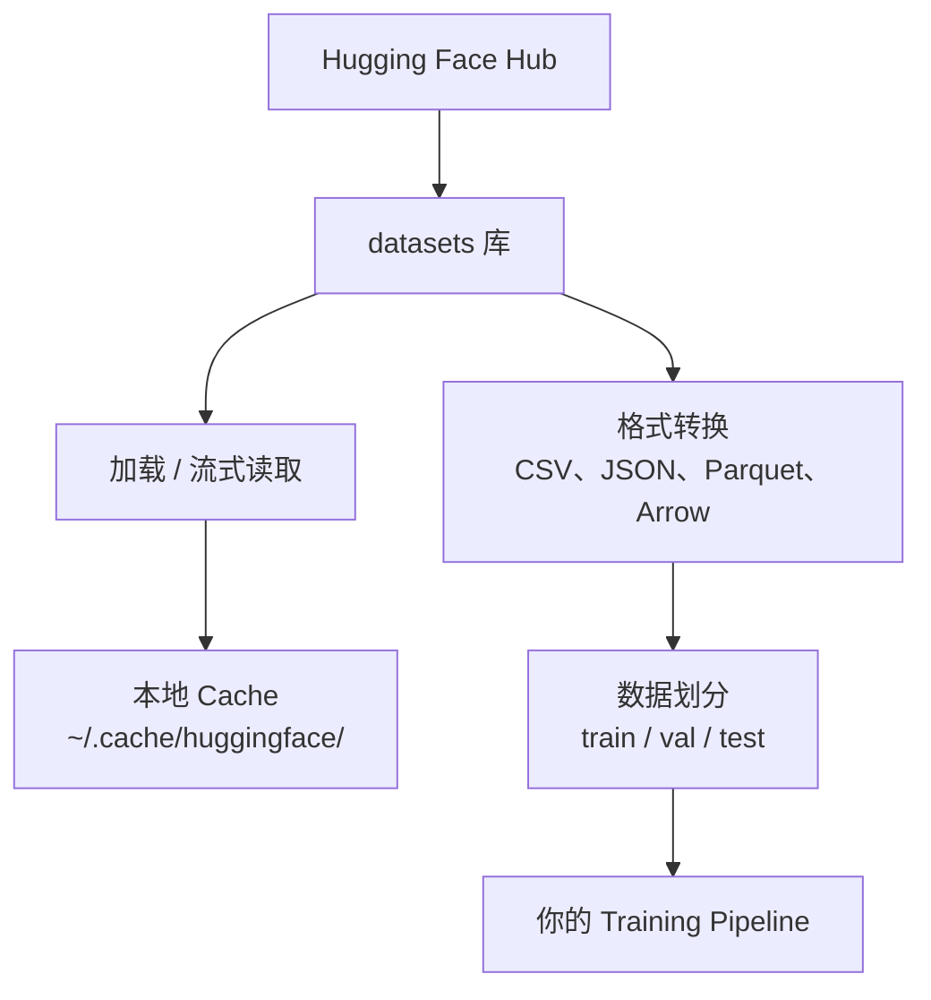

# 数据管理

> 数据是燃料。管理数据的方式决定了你能前进多快。

**Type:** Build
**Language:** Python
**Prerequisites:** Phase 0, Lesson 01
**Time:** ~45 分钟

## 学习目标

- 使用 Hugging Face `datasets` 库加载、流式读取和缓存 Dataset
- 在 CSV、JSON、Parquet 和 Arrow 格式之间转换，并解释各自的取舍
- 使用固定的随机 seed 创建可复现的 train/validation/test Dataset 划分
- 使用 `.gitignore`、Git LFS 或 DVC 管理大型 Model 和 Dataset 文件

## 问题

每个 AI 项目都始于数据。你需要查找 Dataset、下载数据、在不同格式之间转换、为 Training 和 Evaluation 划分数据，并对其进行版本控制，使实验能够复现。每次都手动完成这些工作既缓慢又容易出错。你需要一套可重复执行的工作流。

## 概念



Hugging Face `datasets` 库是为 AI 工作加载数据的标准方式。它原生支持下载、缓存、格式转换和流式读取。

```figure
s0-data-pipeline
```

## 动手构建

### 第 1 步：安装 datasets 库

```bash
pip install datasets huggingface_hub
```

### 第 2 步：加载 Dataset

```python
from datasets import load_dataset

dataset = load_dataset("stanfordnlp/imdb")
print(dataset)
print(dataset["train"][0])
```

这会下载 IMDB 电影评论 Dataset。首次下载后，它将从 `~/.cache/huggingface/datasets/` 中的 Cache 加载。

### 第 3 步：流式读取大型 Dataset

有些 Dataset 太大，无法完整存入磁盘。流式读取会逐行加载数据，无需下载全部内容。

```python
dataset = load_dataset("wikimedia/wikipedia", "20220301.en", split="train", streaming=True)

for i, example in enumerate(dataset):
    print(example["title"])
    if i >= 4:
        break
```

流式读取会提供一个 `IterableDataset`。数据行到达时，你便对其进行处理。无论 Dataset 有多大，内存用量都保持不变。

### 第 4 步：Dataset 格式

`datasets` 库底层使用 Apache Arrow。你可以根据 Pipeline 的需求转换为其他格式。

```python
dataset = load_dataset("stanfordnlp/imdb", split="train")

dataset.to_csv("imdb_train.csv")
dataset.to_json("imdb_train.json")
dataset.to_parquet("imdb_train.parquet")
```

格式对比：

| 格式 | 大小 | 读取速度 | 最适合 |
|--------|------|-----------|----------|
| CSV | 大 | 慢 | 方便人类阅读、电子表格 |
| JSON | 大 | 慢 | API、嵌套数据 |
| Parquet | 小 | 快 | 分析、列式查询 |
| Arrow | 小 | 最快 | 内存处理（`datasets` 内部使用的格式） |

对于 AI 工作，Parquet 是最合适的存储格式。Arrow 是在内存中处理数据时使用的格式。CSV 和 JSON 用于数据交换。

### 第 5 步：数据划分

每个 ML 项目都需要三种划分：

- **Train**：Model 从中学习（通常占 80%）
- **Validation**：在 Training 期间检查进展（通常占 10%）
- **Test**：Training 完成后的最终 Evaluation（通常占 10%）

有些 Dataset 已预先完成划分。如果没有，则需要自行划分：

```python
dataset = load_dataset("stanfordnlp/imdb", split="train")

split = dataset.train_test_split(test_size=0.2, seed=42)
train_val = split["train"].train_test_split(test_size=0.125, seed=42)

train_ds = train_val["train"]
val_ds = train_val["test"]
test_ds = split["test"]

print(f"Train: {len(train_ds)}, Val: {len(val_ds)}, Test: {len(test_ds)}")
```

始终设置 seed 以确保可复现性。相同的 seed 每次都会生成相同的划分。

### 第 6 步：下载并缓存 Model

Model 是大型文件。`huggingface_hub` 库负责处理下载和缓存。

```python
from huggingface_hub import hf_hub_download, snapshot_download

model_path = hf_hub_download(
    repo_id="sentence-transformers/all-MiniLM-L6-v2",
    filename="config.json"
)
print(f"Cached at: {model_path}")

model_dir = snapshot_download("sentence-transformers/all-MiniLM-L6-v2")
print(f"Full model at: {model_dir}")
```

Model 会缓存到 `~/.cache/huggingface/hub/`。下载完成后，后续运行时可以立即加载。

### 第 7 步：处理大型文件

Model 权重和大型 Dataset 不应放入 git。你有三种选择：

**选项 A：.gitignore（最简单）**

```
*.bin
*.safetensors
*.pt
*.onnx
data/*.parquet
data/*.csv
models/
```

**选项 B：Git LFS（在 git 中跟踪大型文件）**

```bash
git lfs install
git lfs track "*.bin"
git lfs track "*.safetensors"
git add .gitattributes
```

Git LFS 会在 repo 中存储指针，而将实际文件存储在单独的服务器上。GitHub 免费提供 1 GB 空间。

**选项 C：DVC（数据版本控制）**

```bash
pip install dvc
dvc init
dvc add data/training_set.parquet
git add data/training_set.parquet.dvc data/.gitignore
git commit -m "Track training data with DVC"
```

DVC 会创建指向数据的小型 `.dvc` 文件。数据本身存放在 S3、GCS 或其他远程存储后端中。

| 方式 | 复杂度 | 最适合 |
|----------|-----------|----------|
| .gitignore | 低 | 个人项目、可以重新获取的已下载数据 |
| Git LFS | 中 | 通过 git 共享 Model 权重的团队 |
| DVC | 高 | 可复现的实验、大型 Dataset、团队协作 |

对于本课程，使用 `.gitignore` 就足够了。当你需要在多台机器上精确复现实验时，再使用 DVC。

### 第 8 步：存储模式

**本地存储**适用于小于约 10 GB 的 Dataset。HF Cache 会自动处理这些数据。

**Cloud 存储**适用于更大的数据，或需要在多台机器之间共享的数据：

```python
import os

local_path = os.path.expanduser("~/.cache/huggingface/datasets/")

# s3_path = "s3://my-bucket/datasets/"
# gcs_path = "gs://my-bucket/datasets/"
```

DVC 可以直接与 S3 和 GCS 集成：

```bash
dvc remote add -d myremote s3://my-bucket/dvc-store
dvc push
```

对于本课程，本地存储已经足够。当你在远程 GPU 实例上进行 Fine-tuning 时，Cloud 存储才会变得重要。

## 本课程使用的 Dataset

| Dataset | 课程 | 大小 | 教学内容 |
|---------|---------|------|----------------|
| IMDB | Tokenization、Classification | 84 MB | 文本 Classification 基础 |
| WikiText | Language modeling | 181 MB | Next-token prediction |
| SQuAD | QA 系统 | 35 MB | Question answering、span |
| Common Crawl（子集） | Embedding | 不定 | 大规模文本处理 |
| MNIST | 视觉基础 | 21 MB | 图像 Classification 基础 |
| COCO（子集） | Multimodal | 不定 | 图像与文本配对 |

你现在不需要下载所有这些 Dataset。每节课都会说明它所需的数据。

## 实际使用

运行工具脚本，验证所有功能是否正常：

```bash
python code/data_utils.py
```

该脚本会下载一个小型 Dataset、转换格式、进行划分并打印摘要。

## 交付成果

本课将产出：
- `code/data_utils.py` - 可复用的数据加载与缓存工具
- `outputs/prompt-data-helper.md` - 用于为任务寻找合适 Dataset 的 Prompt

## 练习

1. 使用 `mrpc` config 加载 `glue` Dataset，并检查前 5 个样本
2. 流式读取 `c4` Dataset，并统计 10 秒内可以处理多少个样本
3. 将 Dataset 转换为 Parquet，并与 CSV 比较文件大小
4. 使用固定 seed 创建 70/15/15 的 train/val/test 划分，并验证各部分大小

## 关键术语

| 术语 | 人们通常怎么说 | 它的实际含义 |
|------|----------------|----------------------|
| Dataset split | “Training 数据” | 在 ML 生命周期的不同阶段使用的命名子集（train/val/test） |
| Streaming | “延迟加载” | 从远程来源逐行处理数据，无需下载完整 Dataset |
| Parquet | “压缩版 CSV” | 针对分析查询和存储效率优化的列式文件格式 |
| Arrow | “快速 dataframe” | `datasets` 库内部使用的内存列式格式，支持零复制读取 |
| Git LFS | “用于大文件的 Git” | 将大型文件存储在 git repo 之外，同时在版本控制中保留指针的扩展 |
| DVC | “用于数据的 Git” | 与 Cloud 存储集成的 Dataset 和 Model 版本控制系统 |
| Cache | “已经下载过” | 此前获取的数据在本地保存的副本，默认存储在 ~/.cache/huggingface/ |
