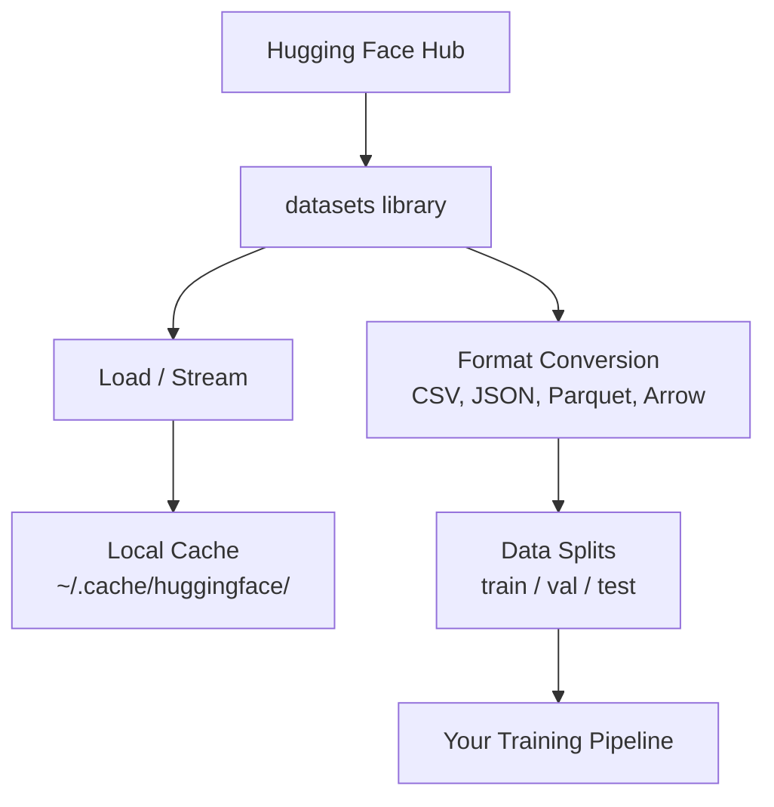

# Data Management

> Data 是燃料。你如何管理它，决定了你能走多快。

**Type:** Build
**Language:** Python
**Prerequisites:** Phase 0, Lesson 01
**Time:** ~45 分钟

## 学习目标
- 使用 Hugging Face `datasets` library 加载、stream 和 cache datasets
- 在 CSV、JSON、Parquet 和 Arrow formats 之间转换，并解释它们的取舍
- 使用固定 random seeds 创建可复现的 train/validation/test splits
- 使用 `.gitignore`、Git LFS 或 DVC 管理大型 model 和 dataset files

## 问题
每个 AI 项目都从 data 开始。你需要找到 datasets、下载它们、在 formats 之间转换、拆分用于 training 和 evaluation，并对它们做 versioning，让 experiments 可复现。每次手动做这些事既慢又容易出错。你需要一个可重复的 workflow。

## 概念


Hugging Face `datasets` library 是为 AI work 加载 data 的标准方式。它开箱即用地处理 downloading、caching、format conversion 和 streaming。

## 构建它
### 步骤 1：安装 datasets library

```bash
pip install datasets huggingface_hub
```

### 步骤 2： Load a dataset

```python
from datasets import load_dataset

dataset = load_dataset("imdb")
print(dataset)
print(dataset["train"][0])
```

这会下载 IMDB 电影评论 dataset。首次下载后，它会从 `~/.cache/huggingface/datasets/` 的 cache 加载。

### 步骤 3：流式处理大型数据集

有些 datasets 太大，无法完整放入磁盘。Streaming 会逐行加载，而不下载完整内容。

```python
dataset = load_dataset("wikimedia/wikipedia", "20220301.en", split="train", streaming=True)

for i, example in enumerate(dataset):
    print(example["title"])
    if i >= 4:
        break
```

Streaming 会给你一个 `IterableDataset`。你会在 rows 到达时处理它们。无论 dataset 多大，memory usage 都保持恒定。

### 步骤 4： Dataset formats

`datasets` library 底层使用 Apache Arrow。你可以根据 pipeline 的需要转换为其他 formats。

```python
dataset = load_dataset("imdb", split="train")

dataset.to_csv("imdb_train.csv")
dataset.to_json("imdb_train.json")
dataset.to_parquet("imdb_train.parquet")
```

Format 对比：

| Format | Size | Read Speed | Best For |
|--------|------|-----------|----------|
| CSV | 大 | 慢 | Human readability、spreadsheets |
| JSON | 大 | 慢 | APIs、nested data |
| Parquet | 小 | 快 | Analytics、columnar queries |
| Arrow | 小 | 最快 | In-memory processing（`datasets` 内部使用的格式） |

对于 AI work，Parquet 是最佳 storage format。Arrow 是你在 memory 中使用的格式。CSV 和 JSON 用于 interchange。

### 步骤 5： Data splits

每个 ML 项目都需要三个 splits：

- **Train**：model 从这里学习（通常 80%）
- **Validation**：你在 training 过程中检查进展（通常 10%）
- **Test**：training 完成后的最终 evaluation（通常 10%）

有些 datasets 已经预先 split。没有时，自己 split：

```python
dataset = load_dataset("imdb", split="train")

split = dataset.train_test_split(test_size=0.2, seed=42)
train_val = split["train"].train_test_split(test_size=0.125, seed=42)

train_ds = train_val["train"]
val_ds = train_val["test"]
test_ds = split["test"]

print(f"Train: {len(train_ds)}, Val: {len(val_ds)}, Test: {len(test_ds)}")
```

始终设置 seed 以保证 reproducibility。同一个 seed 每次都会产生相同的 split。

### 步骤 6： 下载并缓存模型

Models 是大型文件。`huggingface_hub` library 会处理 downloading 和 caching。

```python
from huggingface_hub import hf_hub_download, snapshot_download

model_path = hf_hub_download(
    repo_id="sentence-transformers/all-MiniLM-L6-v2",
    filename="config.json"
)
print(f"Cached at: {model_path}")

model_dir = snapshot_download("sentence-transformers/all-MiniLM-L6-v2")
print(f"Full model at: {model_dir}")
```

Models 会 cache 到 `~/.cache/huggingface/hub/`。下载一次后，后续运行会立即加载。

### 步骤 7：处理大文件

Model weights 和大型 datasets 不应该进入 git。有三种选择：

**Option A: .gitignore（最简单）**

```
*.bin
*.safetensors
*.pt
*.onnx
data/*.parquet
data/*.csv
models/
```

**Option B: Git LFS（在 git 中跟踪大型文件）**

```bash
git lfs install
git lfs track "*.bin"
git lfs track "*.safetensors"
git add .gitattributes
```

Git LFS 在你的 repo 中存储 pointers，并将实际文件存储在单独的 server 上。GitHub 提供 1 GB 免费额度。

**Option C: DVC（data version control）**

```bash
pip install dvc
dvc init
dvc add data/training_set.parquet
git add data/training_set.parquet.dvc data/.gitignore
git commit -m "Track training data with DVC"
```

DVC 会创建小型 `.dvc` 文件，指向你的 data。Data 本身存放在 S3、GCS 或其他 remote storage backend 中。

| Approach | Complexity | Best For |
|----------|-----------|----------|
| .gitignore | 低 | 个人项目、可重新获取的 downloaded data |
| Git LFS | 中 | 通过 git 共享 model weights 的团队 |
| DVC | 高 | 可复现 experiments、大型 datasets、团队 |

对于本课程，`.gitignore` 已经足够。当你需要跨机器复现精确 experiments 时，再使用 DVC。

### 步骤 8： Storage patterns

**Local storage** 适用于小于 ~10 GB 的 datasets。HF cache 会自动处理。

**Cloud storage** 适用于更大的内容，或需要跨机器共享的内容：

```python
import os

local_path = os.path.expanduser("~/.cache/huggingface/datasets/")

# s3_path = "s3://my-bucket/datasets/"
# gcs_path = "gs://my-bucket/datasets/"
```

DVC 可以直接与 S3 和 GCS 集成：

```bash
dvc remote add -d myremote s3://my-bucket/dvc-store
dvc push
```

对于本课程，local storage 足够。Cloud storage 会在你在远程 GPU instances 上 fine-tune 时变得相关。

## 本课程使用的 Datasets

| Dataset | Lessons | Size | What It Teaches |
|---------|---------|------|----------------|
| IMDB | Tokenization、classification | 84 MB | Text classification 基础 |
| WikiText | Language modeling | 181 MB | Next-token prediction |
| SQuAD | QA systems | 35 MB | Question answering、spans |
| Common Crawl (subset) | Embeddings | 不定 | Large-scale text processing |
| MNIST | Vision basics | 21 MB | Image classification fundamentals |
| COCO (subset) | Multimodal | 不定 | Image-text pairs |

你现在不需要下载所有这些。每节课会说明它需要什么。

## 使用它
运行 utility script 验证一切正常：

```bash
python code/data_utils.py
```

这会下载一个小 dataset、转换它、split 它，并打印 summary。

## 交付它
本课产出：
- `code/data_utils.py` - 可复用的 data loading 和 caching utility
- `outputs/prompt-data-helper.md` - 用于为任务寻找合适 dataset 的 prompt

## 练习
1. 使用 `mrpc` config 加载 `glue` dataset，并检查前 5 个 examples
2. Stream `c4` dataset，并统计 10 秒内可以处理多少 examples
3. 将一个 dataset 转换为 Parquet，并将 file size 与 CSV 对比
4. 使用固定 seed 创建 70/15/15 train/val/test split，并验证 sizes

## 关键术语
| Term | What people say | What it actually means |
|------|----------------|----------------------|
| Dataset split | "Training data" | 一个命名 subset（train/val/test），用于 ML lifecycle 的不同阶段 |
| Streaming | "Load it lazily" | 从远程 source 逐行处理 data，而不下载完整 dataset |
| Parquet | "Compressed CSV" | 一种 columnar file format，针对 analytical queries 和 storage efficiency 优化 |
| Arrow | "Fast dataframe" | `datasets` library 内部使用的 in-memory columnar format，用于 zero-copy reads |
| Git LFS | "Git for big files" | 一个 extension，将大型文件存储在 git repo 外，同时在 version control 中保留 pointers |
| DVC | "Git for data" | 一个用于 datasets 和 models 的 version control system，可与 cloud storage 集成 |
| Cache | "Already downloaded" | 之前获取过的 data 的本地副本，默认存储在 ~/.cache/huggingface/ |
