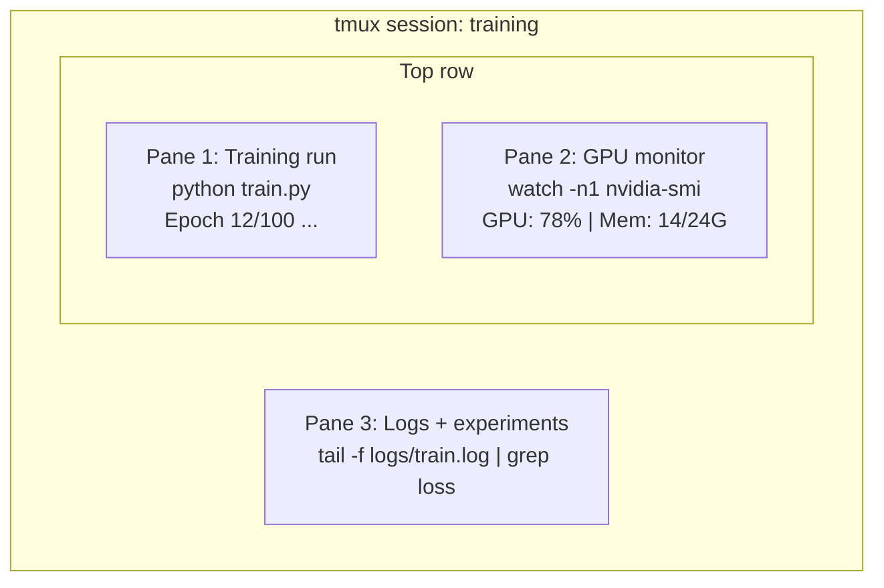

# Terminal 与 Shell

> terminal 是 AI engineers 的主场。要在这里变得熟练。

**类型：** 学习
**语言：** --
**先修要求：** Phase 0, Lesson 01
**时间：** ~35 分钟

## 学习目标

- 使用 piping、redirects 和 `grep` 从命令行过滤并处理训练日志
- 创建包含多个 panes 的持久 tmux sessions，用于并发训练和 GPU 监控
- 使用 `htop`、`nvtop` 和 `nvidia-smi` 监控系统与 GPU 资源
- 使用 SSH、`scp` 和 `rsync` 在本地与远程机器之间传输文件

## 问题

你花在 terminal 里的时间会比任何 editor 都多。训练运行、GPU 监控、日志 tail、远程 SSH sessions、环境管理。每个 AI workflow 都会接触 shell。如果你在这里慢，哪里都会慢。

本课覆盖 AI 工作真正需要的 terminal 技能。不讲 Unix 历史。不深入 Bash scripting。只讲你需要的内容。

## 概念



三件事同时运行。一个 terminal。你可以 detach，回家，再 SSH 回来，然后 reattach。训练会继续运行。

## 构建它

### 步骤 1： 了解你的 shell

检查你正在运行哪个 shell：

```bash
echo $SHELL
```

大多数系统使用 `bash` 或 `zsh`。两者都可以。本课程中的 commands 在任意一个里都能工作。

需要知道的关键内容：

```bash
# Move around
cd ~/projects/ai-engineering-from-scratch
pwd
ls -la

# History search (most useful shortcut you'll learn)
# Ctrl+R then type part of a previous command
# Press Ctrl+R again to cycle through matches

# Clear terminal
clear   # or Ctrl+L

# Cancel a running command
# Ctrl+C

# Suspend a running command (resume with fg)
# Ctrl+Z
```

### 步骤 2： Piping 和 redirects

Piping 会把 commands 连接起来。这就是你处理日志、过滤输出、串联工具的方式。你会经常用到它。

```bash
# Count how many times "loss" appears in a log
cat train.log | grep "loss" | wc -l

# Extract just the loss values from training output
grep "loss:" train.log | awk '{print $NF}' > losses.txt

# Watch a log file update in real time, filtering for errors
tail -f train.log | grep --line-buffered "ERROR"

# Sort experiments by final accuracy
grep "final_accuracy" results/*.log | sort -t= -k2 -n -r

# Redirect stdout and stderr to separate files
python train.py > output.log 2> errors.log

# Redirect both to the same file
python train.py > train_full.log 2>&1
```

你需要掌握的三个 redirects：

| 符号 | 作用 |
|--------|-------------|
| `>` | 将 stdout 写入文件（覆盖） |
| `>>` | 将 stdout 追加到文件 |
| `2>` | 将 stderr 写入文件 |
| `2>&1` | 将 stderr 发送到与 stdout 相同的位置 |
| `\|` | 将一个 command 的 stdout 作为 stdin 发送给下一个 command |

### 步骤 3： 后台进程

训练运行需要数小时。你不想一直开着 terminal。

```bash
# Run in background (output still goes to terminal)
python train.py &

# Run in background, immune to hangup (closing terminal won't kill it)
nohup python train.py > train.log 2>&1 &

# Check what's running in background
jobs
ps aux | grep train.py

# Bring a background job to foreground
fg %1

# Kill a background process
kill %1
# or find its PID and kill that
kill $(pgrep -f "train.py")
```

`&`、`nohup` 和 `screen`/`tmux` 的区别：

| 方法 | 关闭 terminal 后还能继续？ | 可以 reattach？ |
|--------|-------------------------|---------------|
| `command &` | 否 | 否 |
| `nohup command &` | 是 | 否（查看 log file） |
| `screen` / `tmux` | 是 | 是 |

任何超过几分钟的任务，都用 tmux。

### 步骤 4： tmux

tmux 让你创建包含多个 panes 的持久 terminal sessions。这是管理训练运行最有用的单个工具。

```bash
# Install
# macOS
brew install tmux
# Ubuntu
sudo apt install tmux

# Start a named session
tmux new -s training

# Split horizontally
# Ctrl+B then "

# Split vertically
# Ctrl+B then %

# Navigate between panes
# Ctrl+B then arrow keys

# Detach (session keeps running)
# Ctrl+B then d

# Reattach
tmux attach -t training

# List sessions
tmux ls

# Kill a session
tmux kill-session -t training
```

典型的 AI workflow session：

```bash
tmux new -s train

# Pane 1: start training
python train.py --epochs 100 --lr 1e-4

# Ctrl+B, " to split, then run GPU monitor
watch -n1 nvidia-smi

# Ctrl+B, % to split vertically, tail the logs
tail -f logs/experiment.log

# Now detach with Ctrl+B, d
# SSH out, go get coffee, come back
# tmux attach -t train
```

### 步骤 5： 使用 htop 和 nvtop 监控

```bash
# System processes (better than top)
htop

# GPU processes (if you have NVIDIA GPU)
# Install: sudo apt install nvtop (Ubuntu) or brew install nvtop (macOS)
nvtop

# Quick GPU check without nvtop
nvidia-smi

# Watch GPU usage update every second
watch -n1 nvidia-smi

# See which processes are using the GPU
nvidia-smi --query-compute-apps=pid,name,used_memory --format=csv
```

你会用到的 `htop` keybindings：
- `F6` 或 `>` 按列排序（按 memory 排序可查找 memory leaks）
- `F5` 切换 tree view（查看 child processes）
- `F9` kill 一个 process
- `/` 搜索 process name

### 步骤 6： 用 SSH 连接远程 GPU 机器

当你租用 cloud GPU（Lambda、RunPod、Vast.ai）时，会通过 SSH 连接。

```bash
# Basic connection
ssh user@gpu-box-ip

# With a specific key
ssh -i ~/.ssh/my_gpu_key user@gpu-box-ip

# Copy files to remote
scp model.pt user@gpu-box-ip:~/models/

# Copy files from remote
scp user@gpu-box-ip:~/results/metrics.json ./

# Sync a whole directory (faster for many files)
rsync -avz ./data/ user@gpu-box-ip:~/data/

# Port forward (access remote Jupyter/TensorBoard locally)
ssh -L 8888:localhost:8888 user@gpu-box-ip
# Now open localhost:8888 in your browser

# SSH config for convenience
# Add to ~/.ssh/config:
# Host gpu
#     HostName 192.168.1.100
#     User ubuntu
#     IdentityFile ~/.ssh/gpu_key
#
# Then just:
# ssh gpu
```

### 步骤 7： AI 工作常用 aliases

把这些添加到你的 `~/.bashrc` 或 `~/.zshrc`：

```bash
source phases/00-setup-and-tooling/10-terminal-and-shell/code/shell_aliases.sh
```

或者复制你想要的那些。关键 aliases：

```bash
# GPU status at a glance
alias gpu='nvidia-smi --query-gpu=index,name,utilization.gpu,memory.used,memory.total,temperature.gpu --format=csv,noheader'

# Kill all Python training processes
alias killtraining='pkill -f "python.*train"'

# Quick virtual environment activate
alias ae='source .venv/bin/activate'

# Watch training loss
alias watchloss='tail -f logs/*.log | grep --line-buffered "loss"'
```

完整集合见 `code/shell_aliases.sh`。

### 步骤 8： 常见 AI terminal patterns

这些在实践中会反复出现：

```bash
# Run training, log everything, notify when done
python train.py 2>&1 | tee train.log; echo "DONE" | mail -s "Training complete" you@email.com

# Compare two experiment logs side by side
diff <(grep "accuracy" exp1.log) <(grep "accuracy" exp2.log)

# Find the largest model files (clean up disk space)
find . -name "*.pt" -o -name "*.safetensors" | xargs du -h | sort -rh | head -20

# Download a model from Hugging Face
wget https://huggingface.co/model/resolve/main/model.safetensors

# Untar a dataset
tar xzf dataset.tar.gz -C ./data/

# Count lines in all Python files (see how big your project is)
find . -name "*.py" | xargs wc -l | tail -1

# Check disk space (training data fills disks fast)
df -h
du -sh ./data/*

# Environment variable check before training
env | grep -i cuda
env | grep -i torch
```

## 使用它

本课程中每个工具的使用场景：

| 工具 | 使用时机 |
|------|----------------|
| tmux | 每次训练运行（Phases 3+） |
| `tail -f` + `grep` | 监控训练日志 |
| `nohup` / `&` | 快速后台任务 |
| `htop` / `nvtop` | 调试慢训练、OOM errors |
| SSH + `rsync` | 在 cloud GPUs 上工作 |
| Piping + redirects | 处理实验结果 |
| Aliases | 节省重复 commands 的时间 |

## 练习

1. 安装 tmux，创建一个包含三个 panes 的 session，并在其中一个运行 `htop`，另一个运行 `watch -n1 date`，第三个运行一个 Python script。Detach 然后 reattach。
2. 把 `code/shell_aliases.sh` 中的 aliases 添加到你的 shell config，并用 `source ~/.zshrc`（或 `~/.bashrc`）重新加载。
3. 用 `for i in $(seq 1 100); do echo "epoch $i loss: $(echo "scale=4; 1/$i" | bc)"; sleep 0.1; done > fake_train.log` 创建一个假的训练日志，然后使用 `grep`、`tail` 和 `awk` 只提取 loss values。
4. 为你有权限访问的 server 设置一个 SSH config entry（或使用 `localhost` 练习语法）。

## 关键术语

| 术语 | 人们怎么说 | 实际含义 |
|------|----------------|----------------------|
| Shell | “The terminal” | 解释你的 commands 的程序（bash、zsh、fish） |
| tmux | “Terminal multiplexer” | 一个让你在一个窗口中运行多个 terminal sessions，并支持 detach/reattach 的程序 |
| Pipe | “The bar thing” | `\|` operator，会把一个 command 的 output 作为 input 发送给另一个 command |
| PID | “Process ID” | 分配给每个运行中 process 的唯一编号，用于监控或 kill 它 |
| nohup | “No hangup” | 运行一个不受 hangup signal 影响的 command，因此关闭 terminal 不会 kill 它 |
| SSH | “Connecting to the server” | Secure Shell，一种用于在远程机器上运行 commands 的加密 protocol |
