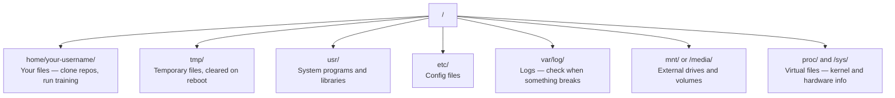

# 面向 AI 的 Linux

> 大多数 AI 都运行在 Linux 上。你需要掌握到不会卡住的程度。

**类型：** 学习
**语言：** --
**先修要求：** Phase 0, Lesson 01
**时间：** ~30 分钟

## 学习目标

- 浏览 Linux file system，并从命令行执行基本文件操作
- 使用 `chmod` 和 `chown` 管理 file permissions，以解决 "Permission denied" errors
- 使用 `apt` 安装 system packages，并为 AI 工作设置一台新的 GPU box
- 识别从 macOS 切换到 Linux 时，开发者在远程机器上常踩的坑

## 问题

你在 macOS 或 Windows 上开发。但一旦你 SSH 到 cloud GPU box、租用 Lambda instance，或启动一台 EC2 machine，就会进入 Ubuntu。terminal 是你唯一的 interface。没有 Finder，没有 Explorer，没有 GUI。如果你不能从命令行浏览 file system、安装 packages、管理 processes，就会一边为闲置 GPU 付费，一边搜索“how to unzip a file in Linux”。

这是一份生存指南。它只覆盖你为了在远程 Linux 机器上做 AI 工作所需的内容。仅此而已。

## File System 布局

Linux 把一切都组织在单一 root `/` 下。没有 `C:\` 或 `/Volumes`。你实际会接触的目录：



你的 home directory 是 `~` 或 `/home/your-username`。几乎所有操作都发生在这里。

## 必备 Commands

以下 15 个 commands 覆盖了你在远程 GPU box 上 95% 的操作。

### 移动位置

```bash
pwd                         # Where am I?
ls                          # What's here?
ls -la                      # What's here, including hidden files with details?
cd /path/to/dir             # Go there
cd ~                        # Go home
cd ..                       # Go up one level
```

### 文件和目录

```bash
mkdir my-project            # Create a directory
mkdir -p a/b/c              # Create nested directories in one shot

cp file.txt backup.txt      # Copy a file
cp -r src/ src-backup/      # Copy a directory (recursive)

mv old.txt new.txt          # Rename a file
mv file.txt /tmp/           # Move a file

rm file.txt                 # Delete a file (no trash, it's gone)
rm -rf my-dir/              # Delete a directory and everything inside
```

`rm -rf` 是永久性的。没有 undo。按回车前请再次确认路径。

### 读取文件

```bash
cat file.txt                # Print entire file
head -20 file.txt           # First 20 lines
tail -20 file.txt           # Last 20 lines
tail -f log.txt             # Follow a log file in real time (Ctrl+C to stop)
less file.txt               # Scroll through a file (q to quit)
```

### 搜索

```bash
grep "error" training.log           # Find lines containing "error"
grep -r "learning_rate" .           # Search all files in current directory
grep -i "cuda" config.yaml          # Case-insensitive search

find . -name "*.py"                 # Find all Python files under current dir
find . -name "*.ckpt" -size +1G     # Find checkpoint files larger than 1GB
```

## Permissions

Linux 中的每个文件都有 owner 和 permission bits。当 scripts 无法执行，或你无法写入某个目录时，就会遇到这个问题。

```bash
ls -l train.py
# -rwxr-xr-- 1 user group 2048 Mar 19 10:00 train.py
#  ^^^             owner permissions: read, write, execute
#     ^^^          group permissions: read, execute
#        ^^        everyone else: read only
```

常见修复方式：

```bash
chmod +x train.sh           # Make a script executable
chmod 755 deploy.sh         # Owner: full, others: read+execute
chmod 644 config.yaml       # Owner: read+write, others: read only

chown user:group file.txt   # Change who owns a file (needs sudo)
```

当某处提示 "Permission denied" 时，几乎总是 permissions 问题。`chmod +x` 或 `sudo` 可以修复大多数情况。

## Package Management (apt)

Ubuntu 使用 `apt`。这是安装 system-level software 的方式。

```bash
sudo apt update             # Refresh the package list (always do this first)
sudo apt install -y htop    # Install a package (-y skips confirmation)
sudo apt install -y build-essential  # C compiler, make, etc. Needed by many Python packages
sudo apt install -y tmux    # Terminal multiplexer (keep sessions alive after disconnect)

apt list --installed        # What's installed?
sudo apt remove htop        # Uninstall
```

你会在新的 GPU box 上常安装的 packages：

```bash
sudo apt update && sudo apt install -y \
    build-essential \
    git \
    curl \
    wget \
    tmux \
    htop \
    unzip \
    python3-venv
```

## Users 和 sudo

你通常以普通 user 登录。有些操作需要 root（admin）权限。

```bash
whoami                      # What user am I?
sudo command                # Run a single command as root
sudo su                     # Become root (exit to go back, use sparingly)
```

在 cloud GPU instances 上，你通常是唯一 user，并且已经有 sudo access。不要把所有东西都以 root 运行。只在需要时使用 sudo。

## Processes 和 systemd

当训练卡住，或你需要检查正在运行的内容时：

```bash
htop                        # Interactive process viewer (q to quit)
ps aux | grep python        # Find running Python processes
kill 12345                  # Gracefully stop process with PID 12345
kill -9 12345               # Force kill (use when graceful doesn't work)
nvidia-smi                  # GPU processes and memory usage
```

systemd 管理 services（background daemons）。如果你运行 inference servers，会用到它：

```bash
sudo systemctl start nginx          # Start a service
sudo systemctl stop nginx           # Stop it
sudo systemctl restart nginx        # Restart it
sudo systemctl status nginx         # Check if it's running
sudo systemctl enable nginx         # Start automatically on boot
```

## 磁盘空间

GPU boxes 的磁盘空间通常有限。Models 和 datasets 会很快填满它。

```bash
df -h                       # Disk usage for all mounted drives
df -h /home                 # Disk usage for /home specifically

du -sh *                    # Size of each item in current directory
du -sh ~/.cache             # Size of your cache (pip, huggingface models land here)
du -sh /data/checkpoints/   # Check how big your checkpoints are

# Find the biggest space hogs
du -h --max-depth=1 / 2>/dev/null | sort -hr | head -20
```

常见省空间方式：

```bash
# Clear pip cache
pip cache purge

# Clear apt cache
sudo apt clean

# Remove old checkpoints you don't need
rm -rf checkpoints/epoch_01/ checkpoints/epoch_02/
```

## Networking

你会从命令行下载 models、传输文件，并调用 APIs。

```bash
# Download files
wget https://example.com/model.bin                   # Download a file
curl -O https://example.com/data.tar.gz              # Same thing with curl
curl -s https://api.example.com/health | python3 -m json.tool  # Hit an API, pretty-print JSON

# Transfer files between machines
scp model.bin user@remote:/data/                     # Copy file to remote machine
scp user@remote:/data/results.csv .                  # Copy file from remote to local
scp -r user@remote:/data/checkpoints/ ./local-dir/   # Copy directory

# Sync directories (faster than scp for large transfers, resumes on failure)
rsync -avz --progress ./data/ user@remote:/data/
rsync -avz --progress user@remote:/results/ ./results/
```

对于任何大型传输，优先使用 `rsync` 而不是 `scp`。它只传输发生变化的 bytes，并且能处理连接中断。

## tmux：保持 Sessions 存活

当你 SSH 到远程 box 时，合上 laptop 会 kill 你的训练运行。tmux 可以防止这种情况。

```bash
tmux new -s train           # Start a new session named "train"
# ... start your training, then:
# Ctrl+B, then D            # Detach (training keeps running)

tmux ls                     # List sessions
tmux attach -t train        # Reattach to session

# Inside tmux:
# Ctrl+B, then %            # Split pane vertically
# Ctrl+B, then "            # Split pane horizontally
# Ctrl+B, then arrow keys   # Switch between panes
```

长时间训练任务总是放在 tmux 里运行。总是如此。

## 面向 Windows 用户的 WSL2

如果你在 Windows 上，WSL2 可以在无需 dual-boot 的情况下提供真实 Linux environment。

```bash
# In PowerShell (admin)
wsl --install -d Ubuntu-24.04

# After restart, open Ubuntu from Start menu
sudo apt update && sudo apt upgrade -y
```

WSL2 运行真实 Linux kernel。本课中的所有内容都能在其中工作。从 WSL 内部看，你的 Windows files 位于 `/mnt/c/Users/YourName/`。

GPU passthrough 需要 Windows 侧安装 NVIDIA drivers。安装 Windows NVIDIA driver（不是 Linux driver），CUDA 就会在 WSL2 内可用。

## Gotchas: macOS 到 Linux

如果你来自 macOS，这些事情会绊住你：

| macOS | Linux | 说明 |
|-------|-------|-------|
| `brew install` | `sudo apt install` | package names 有时不同。`brew install htop` 和 `sudo apt install htop` 效果相同，但 `brew install readline` 和 `sudo apt install libreadline-dev` 不同。 |
| `open file.txt` | `xdg-open file.txt` | 但远程 box 上通常没有 GUI。使用 `cat` 或 `less`。 |
| `pbcopy` / `pbpaste` | 不可用 | SSH 上不存在 pipe 到/来自 clipboard 的能力。 |
| `~/.zshrc` | `~/.bashrc` | macOS 默认使用 zsh。大多数 Linux servers 使用 bash。 |
| `/opt/homebrew/` | `/usr/bin/`, `/usr/local/bin/` | Binaries 位于不同位置。 |
| `sed -i '' 's/a/b/' file` | `sed -i 's/a/b/' file` | macOS sed 需要在 `-i` 后加一个空字符串。Linux 不需要。 |
| Case-insensitive filesystem | Case-sensitive filesystem | 在 Linux 上，`Model.py` 和 `model.py` 是两个不同文件。 |
| Line endings `\n` | Line endings `\n` | 相同。但 Windows 使用 `\r\n`，会破坏 bash scripts。运行 `dos2unix` 修复。 |

## 快速参考卡

```
Navigation:     pwd, ls, cd, find
Files:          cp, mv, rm, mkdir, cat, head, tail, less
Search:         grep, find
Permissions:    chmod, chown, sudo
Packages:       apt update, apt install
Processes:      htop, ps, kill, nvidia-smi
Services:       systemctl start/stop/restart/status
Disk:           df -h, du -sh
Network:        curl, wget, scp, rsync
Sessions:       tmux new/attach/detach
```

## 练习

1. SSH 到任意 Linux machine（或打开 WSL2），并导航到你的 home directory。创建一个 project folder，在其中用 `touch` 创建三个空文件，然后用 `ls -la` 列出它们。
2. 用 apt 安装 `htop`，运行它，并找出哪个 process 使用最多 memory。
3. 启动一个 tmux session，在其中运行 `sleep 300`，detach，列出 sessions，然后 reattach。
4. 使用 `df -h` 检查可用磁盘空间，然后使用 `du -sh ~/.cache/*` 找出 cache 中占空间的内容。
5. 使用 `scp` 将一个文件从本地机器传输到远程机器，然后用 `rsync` 做同样的传输，并比较体验。
