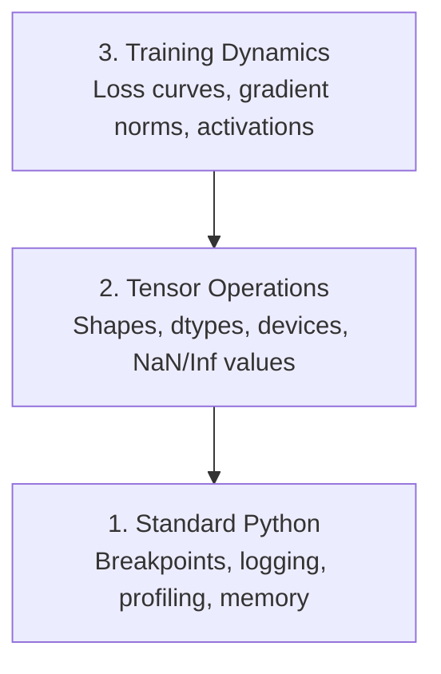

# Debugging 和 Profiling

> 最糟糕的 AI bugs 不会崩溃。它们会静默地在垃圾数据上训练，并报告一条漂亮的 loss curve。

**类型：** 构建
**语言：** Python
**先修要求：** Lesson 1（Dev Environment），基本 PyTorch 熟悉度
**时间：** ~60 分钟

## 学习目标

- 使用条件式 `breakpoint()` 和 `debug_print` 在训练中途检查 tensor shapes、dtypes 和 NaN values
- 使用 `cProfile`、`line_profiler` 和 `tracemalloc` profile 训练循环，找出 bottlenecks
- 检测常见 AI bugs：shape mismatches、NaN loss、data leakage 和 wrong-device tensors
- 设置 TensorBoard 来可视化 loss curves、weight histograms 和 gradient distributions

## 问题

AI code 的失败方式不同于普通 code。web app 会带着 stack trace 崩溃。配置错误的 training loop 会运行 8 小时，烧掉 200 美元 GPU 时间，然后产出一个对每个 input 都预测均值的 model。代码从未报错。bug 可能是 tensor 在错误 device 上、忘记 `.detach()`，或 labels 泄漏进 features。

你需要 debugging tools，在这些静默失败浪费你的时间和 compute 之前抓住它们。

## 概念

AI debugging 分为三个层级：



大多数人会直接跳到第 3 层（盯着 TensorBoard 看）。但 80% 的 AI bugs 都在第 1 层和第 2 层。

```figure
s0-flame-hot
```

## 构建它

### Part 1: Print Debugging（是的，它有效）

Print debugging 经常被轻视。但不该如此。对于 tensor code，一个有针对性的 print statement 往往胜过逐步调试器，因为你需要一次性看到 shapes、dtypes 和 value ranges。

```python
def debug_print(name, tensor):
    print(f"{name}: shape={tensor.shape}, dtype={tensor.dtype}, "
          f"device={tensor.device}, "
          f"min={tensor.min().item():.4f}, max={tensor.max().item():.4f}, "
          f"mean={tensor.mean().item():.4f}, "
          f"has_nan={tensor.isnan().any().item()}")
```

在每个可疑 operation 后调用它。找到 bug 后，移除这些 prints。简单。

### Part 2: Python Debugger（pdb 和 breakpoint）

内置 debugger 在 AI 工作中被低估了。把 `breakpoint()` 放进 training loop，并交互式检查 tensors。

```python
def training_step(model, batch, criterion, optimizer):
    inputs, labels = batch
    outputs = model(inputs)
    loss = criterion(outputs, labels)

    if loss.item() > 100 or torch.isnan(loss):
        breakpoint()

    loss.backward()
    optimizer.step()
```

当 debugger 停下来时，有用的 commands：

- `p outputs.shape` 检查 shapes
- `p loss.item()` 查看 loss value
- `p torch.isnan(outputs).sum()` 统计 NaNs
- `p model.fc1.weight.grad` 检查 gradients
- `c` 继续，`q` 退出

这就是条件式 debugging。只有在看起来不对时才停止。对于 10,000-step 的训练运行，这一点很重要。

### Part 3: Python Logging

当你的 debugging 超出快速检查范围时，用 logging 替换 print statements。

```python
import logging

logging.basicConfig(
    level=logging.INFO,
    format="%(asctime)s [%(levelname)s] %(message)s",
    handlers=[
        logging.FileHandler("training.log"),
        logging.StreamHandler()
    ]
)
logger = logging.getLogger(__name__)

logger.info("Starting training: lr=%.4f, batch_size=%d", lr, batch_size)
logger.warning("Loss spike detected: %.4f at step %d", loss.item(), step)
logger.error("NaN loss at step %d, stopping", step)
```

Logging 提供 timestamps、severity levels 和 file output。当训练运行在凌晨 3 点失败时，你想要的是 log file，而不是已经滚出屏幕的 terminal output。

### Part 4: 为代码区段计时

知道时间花在哪里，是优化的第一步。

```python
import time

class Timer:
    def __init__(self, name=""):
        self.name = name

    def __enter__(self):
        self.start = time.perf_counter()
        return self

    def __exit__(self, *args):
        elapsed = time.perf_counter() - self.start
        print(f"[{self.name}] {elapsed:.4f}s")

with Timer("data loading"):
    batch = next(dataloader_iter)

with Timer("forward pass"):
    outputs = model(batch)

with Timer("backward pass"):
    loss.backward()
```

常见发现：data loading 占训练时间的 60%。修复方式是在你的 DataLoader 中设置 `num_workers > 0`，而不是换更快的 GPU。

### Part 5: cProfile 和 line_profiler

当你需要比 manual timers 更多的信息时：

```bash
python -m cProfile -s cumtime train.py
```

这会显示每个 function call，并按 cumulative time 排序。若要逐行 profiling：

```bash
pip install line_profiler
```

```python
@profile
def train_step(model, data, target):
    output = model(data)
    loss = F.cross_entropy(output, target)
    loss.backward()
    return loss

# Run with: kernprof -l -v train.py
```

### Part 6: Memory Profiling

#### 使用 tracemalloc 查看 CPU Memory

```python
import tracemalloc

tracemalloc.start()

# your code here
model = build_model()
data = load_dataset()

snapshot = tracemalloc.take_snapshot()
top_stats = snapshot.statistics("lineno")
for stat in top_stats[:10]:
    print(stat)
```

#### 使用 memory_profiler 查看 CPU Memory

```bash
pip install memory_profiler
```

```python
from memory_profiler import profile

@profile
def load_data():
    raw = read_csv("data.csv")       # watch memory jump here
    processed = preprocess(raw)       # and here
    return processed
```

用 `python -m memory_profiler your_script.py` 运行，以查看逐行 memory usage。

#### 使用 PyTorch 查看 GPU Memory

```python
import torch

if torch.cuda.is_available():
    print(torch.cuda.memory_summary())

    print(f"Allocated: {torch.cuda.memory_allocated() / 1e9:.2f} GB")
    print(f"Cached: {torch.cuda.memory_reserved() / 1e9:.2f} GB")
```

当你遇到 OOM（Out of Memory）时：

1. 减小 batch size（永远是第一个要尝试的）
2. 使用 `torch.cuda.empty_cache()` 释放 cached memory
3. 对大型 intermediates 使用 `del tensor`，随后调用 `torch.cuda.empty_cache()`
4. 使用 mixed precision（`torch.cuda.amp`）将 memory usage 减半
5. 对非常深的 models 使用 gradient checkpointing

### Part 7: 常见 AI Bugs 以及如何捕获它们

#### Shape Mismatch

最常见的 bug。某个 tensor 的 shape 是 `[batch, features]`，但 model 期望 `[batch, channels, height, width]`。

```python
def check_shapes(model, sample_input):
    print(f"Input: {sample_input.shape}")
    hooks = []

    def make_hook(name):
        def hook(module, inp, out):
            in_shape = inp[0].shape if isinstance(inp, tuple) else inp.shape
            out_shape = out.shape if hasattr(out, "shape") else type(out)
            print(f"  {name}: {in_shape} -> {out_shape}")
        return hook

    for name, module in model.named_modules():
        hooks.append(module.register_forward_hook(make_hook(name)))

    with torch.no_grad():
        model(sample_input)

    for h in hooks:
        h.remove()
```

用一个 sample batch 运行一次。它会映射 model 中每一次 shape transformation。

#### NaN Loss

NaN loss 表示某些东西爆掉了。常见原因：

- Learning rate 太高
- custom loss 中除以零
- 对零或负数取 log
- RNNs 中 gradients 爆炸

```python
def detect_nan(model, loss, step):
    if torch.isnan(loss):
        print(f"NaN loss at step {step}")
        for name, param in model.named_parameters():
            if param.grad is not None:
                if torch.isnan(param.grad).any():
                    print(f"  NaN gradient in {name}")
                if torch.isinf(param.grad).any():
                    print(f"  Inf gradient in {name}")
        return True
    return False
```

#### Data Leakage

你的 model 在 test set 上达到 99% accuracy。听起来很棒。这是 bug。

```python
def check_data_leakage(train_set, test_set, id_column="id"):
    train_ids = set(train_set[id_column].tolist())
    test_ids = set(test_set[id_column].tolist())
    overlap = train_ids & test_ids
    if overlap:
        print(f"DATA LEAKAGE: {len(overlap)} samples in both train and test")
        return True
    return False
```

还要检查 temporal leakage：用未来数据预测过去。split 前先按 timestamp 排序。

#### Wrong Device

不同 devices（CPU vs GPU）上的 tensors 会导致 runtime errors。但有时一个 tensor 会静默停留在 CPU，而其他一切都在 GPU 上，训练只是运行得很慢。

```python
def check_devices(model, *tensors):
    model_device = next(model.parameters()).device
    print(f"Model device: {model_device}")
    for i, t in enumerate(tensors):
        if t.device != model_device:
            print(f"  WARNING: tensor {i} on {t.device}, model on {model_device}")
```

### Part 8: TensorBoard 基础

TensorBoard 会展示训练过程中内部发生了什么。

```bash
pip install tensorboard
```

```python
from torch.utils.tensorboard import SummaryWriter

writer = SummaryWriter("runs/experiment_1")

for step in range(num_steps):
    loss = train_step(model, batch)

    writer.add_scalar("loss/train", loss.item(), step)
    writer.add_scalar("lr", optimizer.param_groups[0]["lr"], step)

    if step % 100 == 0:
        for name, param in model.named_parameters():
            writer.add_histogram(f"weights/{name}", param, step)
            if param.grad is not None:
                writer.add_histogram(f"grads/{name}", param.grad, step)

writer.close()
```

启动它：

```bash
tensorboard --logdir=runs
```

要关注什么：

- **Loss 不下降**：Learning rate 太低，或 model architecture 问题
- **Loss 剧烈震荡**：Learning rate 太高
- **Loss 变成 NaN**：Numerical instability（见上面的 NaN 部分）
- **Train loss 下降，val loss 上升**：Overfitting
- **Weight histograms 坍缩到零**：Vanishing gradients
- **Gradient histograms 爆炸**：需要 gradient clipping

### Part 9: VS Code Debugger

对于交互式 debugging，用 `launch.json` 配置 VS Code：

```json
{
    "version": "0.2.0",
    "configurations": [
        {
            "name": "Debug Training",
            "type": "debugpy",
            "request": "launch",
            "program": "${file}",
            "console": "integratedTerminal",
            "justMyCode": false
        }
    ]
}
```

点击 gutter 设置 breakpoints。使用 Variables pane 检查 tensor properties。Debug Console 让你在执行中途运行任意 Python expressions。

这对逐步查看 data preprocessing pipelines 很有用，尤其是你想看到每次 transformation 的时候。

## 使用它

以下 debugging workflow 可以捕获大多数 AI bugs：

1. **训练前**：用 sample batch 运行 `check_shapes`。验证 input 和 output dimensions 符合预期。
2. **前 10 步**：对 loss、outputs 和 gradients 使用 `debug_print`。确认没有 NaN，并且 values 在合理范围内。
3. **训练期间**：记录 loss、learning rate 和 gradient norms。使用 TensorBoard 可视化。
4. **出问题时**：在 failure point 放置 `breakpoint()`。交互式检查 tensors。
5. **针对性能**：计时 data loading、forward、backward pass。若接近 OOM，则 profile memory。

## 交付它

运行 debugging toolkit script：

```bash
python phases/00-setup-and-tooling/12-debugging-and-profiling/code/debug_tools.py
```

查看 `outputs/prompt-debug-ai-code.md`，其中有一个帮助诊断 AI-specific bugs 的 prompt。

## 练习

1. 运行 `debug_tools.py`，阅读每个 section 的 output。修改 dummy model 引入一个 NaN（提示：在 forward pass 中除以零），观察 detector 捕获它。
2. 使用 `cProfile` profile 一个 training loop，并识别最慢的 function。
3. 使用 `tracemalloc` 找出 data loading pipeline 中哪一行分配了最多 memory。
4. 为一个简单 training run 设置 TensorBoard，并识别 model 是否 overfitting。
5. 在 training loop 内使用 `breakpoint()`。练习从 debugger prompt 检查 tensor shapes、devices 和 gradient values。
