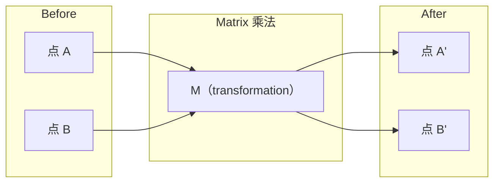
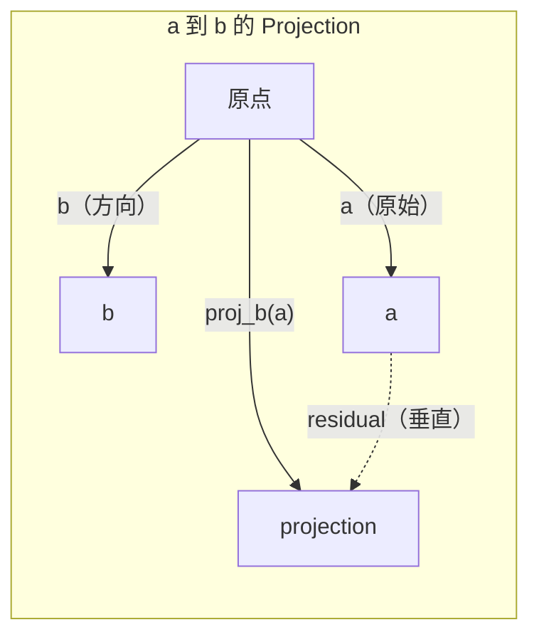

# Linear Algebra 直觉

> 每个 AI model 都只是戴着华丽帽子的 Matrix 数学。

**类型：** 学习
**语言：** Python, Julia
**先修要求：** Phase 0
**时间：** ~60 分钟

## 学习目标

- 在 Python 中从零实现 Vector 和 Matrix 运算（加法、dot product、Matrix multiply）
- 从几何角度解释 dot product、projection 和 Gram-Schmidt process 在做什么
- 使用 row reduction 判断一组 Vector 的 linear independence、rank 和 basis
- 将 Linear Algebra 概念连接到它们在 AI 中的应用：embeddings、attention scores 和 LoRA

## 问题

打开任意一篇 ML 论文。在第一页之内，你就会看到 Vector、Matrix、dot product 和 transformation。没有 Linear Algebra 直觉时，这些只是符号。有了它，你就能看见 Neural Network 实际上在做什么 -- 在空间中移动点。

你不需要成为数学家。你需要看见这些运算在几何上意味着什么，然后亲自把它们写成代码。

## 概念

### Vectors 是点（也是方向）

Vector 只是一个数字列表。但这些数字有含义 -- 它们是空间中的坐标。

**2D Vector [3, 2]：**

| x | y | 点 |
|---|---|-------|
| 3 | 2 | 这个 Vector 从原点 (0,0) 指向平面上的 (3, 2) |

这个 Vector 的 magnitude 为 sqrt(3^2 + 2^2) = sqrt(13)，方向向上且向右。

在 AI 中，Vector 表示一切：
- 一个词 → 一个包含 768 个数字的 Vector（它在 embedding 空间中的“含义”）
- 一张图像 → 一个由数百万个像素值组成的 Vector
- 一个用户 → 一个表示偏好的 Vector

### Matrices 是 Transformations

Matrix 会把一个 Vector 转换成另一个 Vector。它可以旋转、缩放、拉伸或投影。



在 AI 中，Matrix 就是 model：
- Neural Network weights → 将 input 转换为 output 的 Matrices
- Attention scores → 决定关注什么的 Matrices
- Embeddings → 将词映射到 Vectors 的 Matrices

### Dot Product 衡量相似性

两个 Vector 的 dot product 会告诉你它们有多相似。

```
a · b = a₁×b₁ + a₂×b₂ + ... + aₙ×bₙ

方向相同：      a · b > 0  （相似）
相互垂直：      a · b = 0  （无关）
方向相反：      a · b < 0  （不相似）
```

这正是搜索引擎、推荐系统和 RAG 的工作方式 -- 找到 dot product 较高的 Vectors。

### Linear Independence

如果集合中没有任何一个 Vector 可以写成其他 Vector 的组合，那么这些 Vectors 就是 linearly independent 的。如果 v1、v2、v3 independent，它们会 span 一个 3D 空间。如果其中一个是其他 Vector 的组合，它们就只 span 一个平面。

它对 AI 的重要性：你的 feature matrix 应该有 linearly independent columns。如果两个 features 完全相关（linearly dependent），model 就无法区分它们各自的影响。这会在 Regression 中造成 multicollinearity -- weight matrix 会变得不稳定，input 的微小变化会导致 output 大幅摆动。

**具体示例：**

```
v1 = [1, 0, 0]
v2 = [0, 1, 0]
v3 = [2, 1, 0]   # v3 = 2*v1 + v2
```

v1 和 v2 是 independent 的 -- 二者都不是另一个的标量倍数或组合。但 v3 = 2*v1 + v2，所以 {v1, v2, v3} 是一个 dependent set。这三个 Vectors 全都位于 xy-plane。无论你如何组合它们，都无法到达 [0, 0, 1]。你有三个 Vectors，但只有两个自由维度。

在 dataset 中：如果 feature_3 = 2*feature_1 + feature_2，加入 feature_3 不会给 model 带来任何新信息。更糟的是，它会让 normal equations 变成 singular -- weights 没有唯一解。

### Basis 和 Rank

Basis 是一组最小的 linearly independent Vectors，它们 span 整个空间。basis Vectors 的数量就是空间的维度。

3D 空间的 standard basis 是 {[1,0,0], [0,1,0], [0,0,1]}。但 3D 中任意三个 independent Vectors 都能构成有效 basis。选择 basis 就是在选择坐标系。

Matrix 的 rank = linearly independent columns 的数量 = linearly independent rows 的数量。如果 rank < min(rows, cols)，这个 Matrix 就是 rank-deficient。这意味着：
- 该系统有无穷多个解（或没有解）
- transformation 中丢失了信息
- Matrix 不能被 inverted

| 情况 | Rank | 对 ML 的含义 |
|-----------|------|---------------------|
| Full rank (rank = min(m, n)) | 最大可能值 | 存在唯一 least-squares solution。Model well-conditioned。 |
| Rank deficient (rank < min(m, n)) | 低于最大值 | Features 冗余。有无穷多个 weight solutions。需要 regularization。 |
| Rank 1 | 1 | 每一列都是某个 Vector 的缩放副本。所有数据都位于一条线上。 |
| Near rank-deficient（较小的 singular values） | 数值上较低 | Matrix ill-conditioned。极小的 input noise 会造成很大的 output changes。使用 SVD truncation 或 ridge regression。 |

### Projection

将 Vector **a** 投影到 Vector **b** 上，会得到 **a** 在 **b** 方向上的分量：

```
proj_b(a) = (a dot b / b dot b) * b
```

residual (a - proj_b(a)) 与 b 垂直。这种 orthogonal decomposition 是 least-squares fitting 的基础。

Projection 在 ML 中无处不在：
- Linear Regression 最小化 observations 到 column space 的距离 -- 解本身就是一个 projection
- PCA 将数据投影到最大 variance 的方向上
- Transformers 中的 Attention 会计算 queries 到 keys 的 projections



**示例：** a = [3, 4], b = [1, 0]

proj_b(a) = (3*1 + 4*0) / (1*1 + 0*0) * [1, 0] = 3 * [1, 0] = [3, 0]

这个 projection 去掉了 y 分量。这就是最简单形式的 dimensionality reduction -- 丢弃你不关心的方向。

### Gram-Schmidt Process

将任意一组 independent Vectors 转换为 orthonormal basis。Orthonormal 意味着每个 Vector 长度为 1，并且任意一对 Vector 都互相垂直。

算法：
1. 取第一个 Vector，将其 normalize
2. 取第二个 Vector，减去它在第一个 Vector 上的 projection，再 normalize
3. 取第三个 Vector，减去它在所有之前 Vectors 上的 projections，再 normalize
4. 对剩余 Vectors 重复该过程

```
Input:  v1, v2, v3, ...（linearly independent）

u1 = v1 / |v1|

w2 = v2 - (v2 dot u1) * u1
u2 = w2 / |w2|

w3 = v3 - (v3 dot u1) * u1 - (v3 dot u2) * u2
u3 = w3 / |w3|

Output: u1, u2, u3, ...（orthonormal basis）
```

这就是 QR decomposition 内部的工作方式。Q 是 orthonormal basis，R 捕获 projection coefficients。QR decomposition 用于：
- 求解 linear systems（比 Gaussian elimination 更稳定）
- 计算 eigenvalues（QR algorithm）
- Least-squares regression（标准数值方法）

## 构建它

### 步骤 1： 从零实现 Vectors（Python）

```python
class Vector:
    def __init__(self, components):
        self.components = list(components)
        self.dim = len(self.components)

    def __add__(self, other):
        return Vector([a + b for a, b in zip(self.components, other.components)])

    def __sub__(self, other):
        return Vector([a - b for a, b in zip(self.components, other.components)])

    def dot(self, other):
        return sum(a * b for a, b in zip(self.components, other.components))

    def magnitude(self):
        return sum(x**2 for x in self.components) ** 0.5

    def normalize(self):
        mag = self.magnitude()
        return Vector([x / mag for x in self.components])

    def cosine_similarity(self, other):
        return self.dot(other) / (self.magnitude() * other.magnitude())

    def __repr__(self):
        return f"Vector({self.components})"


a = Vector([1, 2, 3])
b = Vector([4, 5, 6])

print(f"a + b = {a + b}")
print(f"a · b = {a.dot(b)}")
print(f"|a| = {a.magnitude():.4f}")
print(f"cosine similarity = {a.cosine_similarity(b):.4f}")
```

### 步骤 2： 从零实现 Matrices（Python）

```python
class Matrix:
    def __init__(self, rows):
        self.rows = [list(row) for row in rows]
        self.shape = (len(self.rows), len(self.rows[0]))

    def __matmul__(self, other):
        if isinstance(other, Vector):
            return Vector([
                sum(self.rows[i][j] * other.components[j] for j in range(self.shape[1]))
                for i in range(self.shape[0])
            ])
        rows = []
        for i in range(self.shape[0]):
            row = []
            for j in range(other.shape[1]):
                row.append(sum(
                    self.rows[i][k] * other.rows[k][j]
                    for k in range(self.shape[1])
                ))
            rows.append(row)
        return Matrix(rows)

    def transpose(self):
        return Matrix([
            [self.rows[j][i] for j in range(self.shape[0])]
            for i in range(self.shape[1])
        ])

    def __repr__(self):
        return f"Matrix({self.rows})"


rotation_90 = Matrix([[0, -1], [1, 0]])
point = Vector([3, 1])

rotated = rotation_90 @ point
print(f"Original: {point}")
print(f"Rotated 90°: {rotated}")
```

### 步骤 3： 为什么这对 AI 很重要

```python
import random

random.seed(42)
weights = Matrix([[random.gauss(0, 0.1) for _ in range(3)] for _ in range(2)])
input_vector = Vector([1.0, 0.5, -0.3])

output = weights @ input_vector
print(f"Input (3D): {input_vector}")
print(f"Output (2D): {output}")
print("This is what a neural network layer does -- matrix multiplication.")
```

### 步骤 4： Julia 版本

```julia
a = [1.0, 2.0, 3.0]
b = [4.0, 5.0, 6.0]

println("a + b = ", a + b)
println("a · b = ", a ⋅ b)       # Julia supports unicode operators
println("|a| = ", √(a ⋅ a))
println("cosine = ", (a ⋅ b) / (√(a ⋅ a) * √(b ⋅ b)))

# Matrix-vector multiplication
W = [0.1 -0.2 0.3; 0.4 0.5 -0.1]
x = [1.0, 0.5, -0.3]
println("Wx = ", W * x)
println("This is a neural network layer.")
```

### 步骤 5： 从零实现 Linear independence 和 projection（Python）

```python
def is_linearly_independent(vectors):
    n = len(vectors)
    dim = len(vectors[0].components)
    mat = Matrix([v.components[:] for v in vectors])
    rows = [row[:] for row in mat.rows]
    rank = 0
    for col in range(dim):
        pivot = None
        for row in range(rank, len(rows)):
            if abs(rows[row][col]) > 1e-10:
                pivot = row
                break
        if pivot is None:
            continue
        rows[rank], rows[pivot] = rows[pivot], rows[rank]
        scale = rows[rank][col]
        rows[rank] = [x / scale for x in rows[rank]]
        for row in range(len(rows)):
            if row != rank and abs(rows[row][col]) > 1e-10:
                factor = rows[row][col]
                rows[row] = [rows[row][j] - factor * rows[rank][j] for j in range(dim)]
        rank += 1
    return rank == n


def project(a, b):
    scalar = a.dot(b) / b.dot(b)
    return Vector([scalar * x for x in b.components])


def gram_schmidt(vectors):
    orthonormal = []
    for v in vectors:
        w = v
        for u in orthonormal:
            proj = project(w, u)
            w = w - proj
        if w.magnitude() < 1e-10:
            continue
        orthonormal.append(w.normalize())
    return orthonormal


v1 = Vector([1, 0, 0])
v2 = Vector([1, 1, 0])
v3 = Vector([1, 1, 1])
basis = gram_schmidt([v1, v2, v3])
for i, u in enumerate(basis):
    print(f"u{i+1} = {u}")
    print(f"  |u{i+1}| = {u.magnitude():.6f}")

print(f"u1 · u2 = {basis[0].dot(basis[1]):.6f}")
print(f"u1 · u3 = {basis[0].dot(basis[2]):.6f}")
print(f"u2 · u3 = {basis[1].dot(basis[2]):.6f}")
```

## 使用它

现在用 NumPy 做同样的事情 -- 这是你在实践中真正会使用的方式：

```python
import numpy as np

a = np.array([1, 2, 3], dtype=float)
b = np.array([4, 5, 6], dtype=float)

print(f"a + b = {a + b}")
print(f"a · b = {np.dot(a, b)}")
print(f"|a| = {np.linalg.norm(a):.4f}")
print(f"cosine = {np.dot(a, b) / (np.linalg.norm(a) * np.linalg.norm(b)):.4f}")

W = np.random.randn(2, 3) * 0.1
x = np.array([1.0, 0.5, -0.3])
print(f"Wx = {W @ x}")
```

### 使用 NumPy 处理 Rank、Projection 和 QR

```python
import numpy as np

A = np.array([[1, 2], [2, 4]])
print(f"Rank: {np.linalg.matrix_rank(A)}")

a = np.array([3, 4])
b = np.array([1, 0])
proj = (np.dot(a, b) / np.dot(b, b)) * b
print(f"Projection of {a} onto {b}: {proj}")

Q, R = np.linalg.qr(np.random.randn(3, 3))
print(f"Q is orthogonal: {np.allclose(Q @ Q.T, np.eye(3))}")
print(f"R is upper triangular: {np.allclose(R, np.triu(R))}")
```

### PyTorch -- Tensors 是带有 Autodiff 的 Vectors

```python
import torch

x = torch.randn(3, requires_grad=True)
y = torch.tensor([1.0, 0.0, 0.0])

similarity = torch.dot(x, y)
similarity.backward()

print(f"x = {x.data}")
print(f"y = {y.data}")
print(f"dot product = {similarity.item():.4f}")
print(f"d(dot)/dx = {x.grad}")
```

dot product 关于 x 的 Gradient 就是 y。PyTorch 自动计算了这一点。Neural Network 中的每个操作都由这类运算构成 -- Matrix multiplies、dot products、projections -- autodiff 会在所有这些运算中追踪 Gradients。

你刚刚从零构建了 NumPy 一行代码能完成的事情。现在你知道底层发生了什么。

## 交付它

本课会产出：
- `outputs/prompt-linear-algebra-tutor.md` -- 一个用于让 AI assistants 通过几何直觉教授 Linear Algebra 的 prompt

## 连接

本课中的每个内容都连接到现代 AI 的具体部分：

| 概念 | 出现位置 |
|---------|------------------|
| Dot product | Transformers 中的 Attention scores，RAG 中的 cosine similarity |
| Matrix multiply | 每个 Neural Network layer，每个 linear transformation |
| Linear independence | Feature selection，避免 multicollinearity |
| Rank | 判断一个系统是否可解，LoRA（low-rank adaptation） |
| Projection | Linear Regression（投影到 column space）、PCA |
| Gram-Schmidt / QR | Numerical solvers，eigenvalue computation |
| Orthonormal basis | 稳定的 numerical computation，whitening transforms |

LoRA 值得特别说明。它通过将 weight updates 分解为 low-rank matrices 来 fine-tune LLMs。与其更新一个 4096x4096 的 weight matrix（16M parameters），LoRA 更新两个尺寸为 4096x16 和 16x4096 的 Matrices（131K parameters）。rank-16 约束意味着 LoRA 假设 weight update 位于完整 4096-dimensional space 中的一个 16-dimensional subspace 内。这就是 Linear Algebra 在真正发挥作用。

## 练习

1. 实现 `Vector.angle_between(other)`，返回两个 Vectors 之间的角度（单位为度）
2. 创建一个 2D scaling matrix，使 x-coordinate 翻倍、y-coordinate 变为三倍，然后将其应用到 Vector [1, 1]
3. 给定 5 个随机的类 word Vectors（dimension 50），使用 cosine similarity 找出最相似的两个
4. 验证 Gram-Schmidt output 确实是 orthonormal 的：检查每一对的 dot product 都为 0，并且每个 Vector 的 magnitude 都为 1
5. 创建一个 rank 为 2 的 3x3 Matrix。使用 `rank()` method 验证。然后解释这些 columns span 的几何对象是什么。
6. 将 Vector [1, 2, 3] 投影到 [1, 1, 1] 上。结果在几何上表示什么？

## 关键术语

| 术语 | 人们常说 | 实际含义 |
|------|----------------|----------------------|
| Vector | “一个箭头” | 一个数字列表，表示 n-dimensional space 中的点或方向 |
| Matrix | “一个数字表” | 一种 transformation，将 Vectors 从一个空间映射到另一个空间 |
| Dot product | “相乘再求和” | 衡量两个 Vectors 对齐程度的指标 -- similarity search 的核心 |
| Embedding | “某种 AI 魔法” | 一个表示某物含义（词、图像、用户）的 Vector |
| Linear independence | “它们不重叠” | 集合中没有任何 Vector 可以写成其他 Vector 的组合 |
| Rank | “有多少维” | Matrix 中 linearly independent columns（或 rows）的数量 |
| Projection | “影子” | 一个 Vector 在另一个 Vector 方向上的分量 |
| Basis | “坐标轴” | 一组最小的 independent Vectors，它们 span 该空间 |
| Orthonormal | “垂直的单位 Vectors” | 彼此互相垂直且各自长度为 1 的 Vectors |
