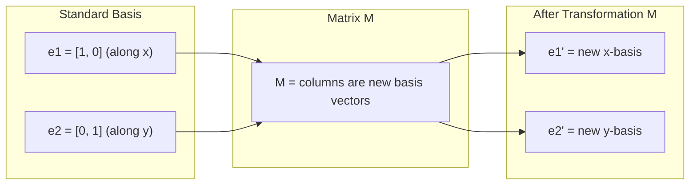
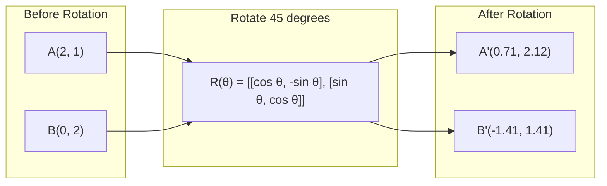
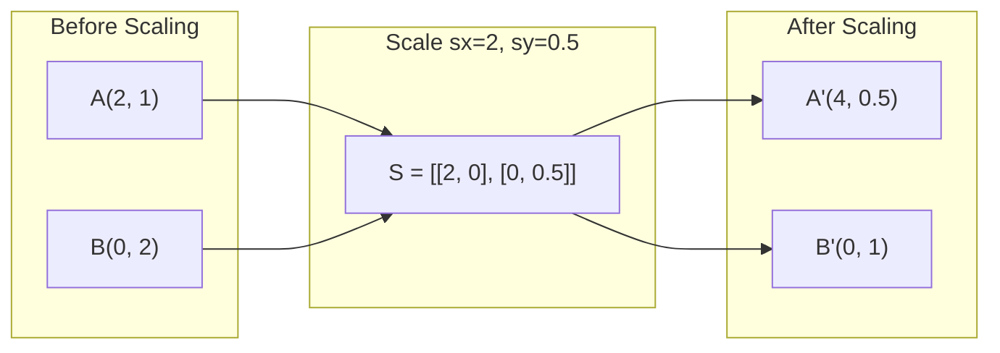
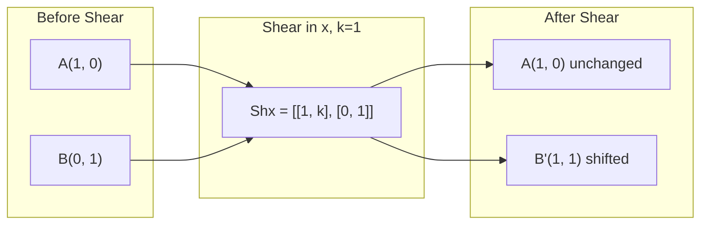
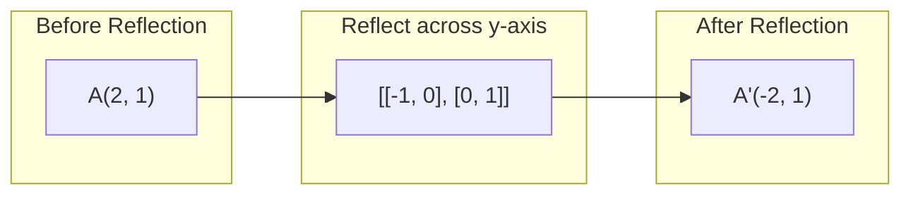
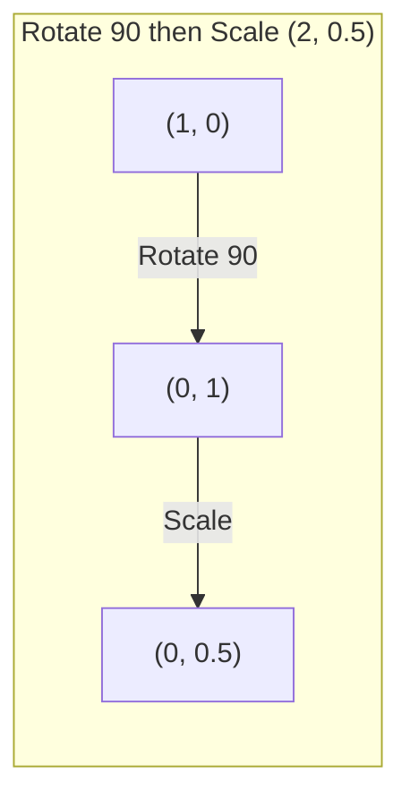
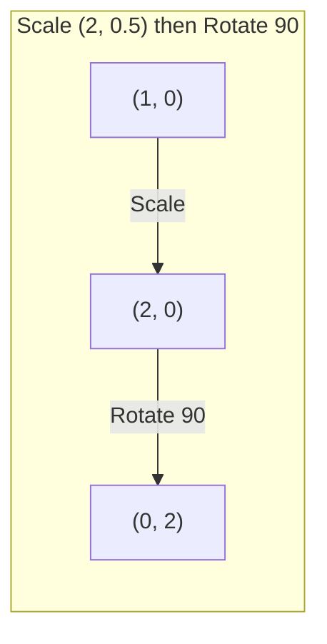

# Matrix 变换

> Matrix 是一台重塑空间的机器。理解它对每个点做了什么，你就理解了整个变换。

**类型：** 构建
**语言：** Python, Julia
**先修要求：** Phase 1, Lessons 01-02 (Linear Algebra Intuition, Vectors & Matrices Operations)
**时间：** ~75 分钟

## 学习目标

- 构造 rotation、scaling、shearing 和 reflection matrices，并将它们应用到 2D 和 3D 点
- 通过 matrix multiplication 组合多个变换，并验证顺序很重要
- 从 characteristic equation 计算 2x2 matrices 的 eigenvalues 和 eigenvectors
- 解释为什么 eigenvalues 决定 PCA 方向、RNN 稳定性和 spectral clustering 行为

## 问题

你读到 PCA，看到“find the eigenvectors of the covariance matrix”。你读到模型稳定性，看到“check if all eigenvalues have magnitude less than 1”。你读到数据增强，看到“apply a random rotation”。在你从几何上理解 matrices 对空间做了什么之前，这些都不会真正有意义。

Matrices 不只是数字网格。它们是空间机器。Rotation matrix 会旋转点。Scaling matrix 会拉伸点。Shearing matrix 会倾斜点。Neural Network 对数据施加的每一个变换，都是这些操作之一，或它们的组合。本课会让这些操作变得具体。

## 核心概念

### 作为 matrices 的变换

2D 中的每个 linear transformation 都可以写成一个 2x2 matrix。这个 matrix 会准确告诉你 basis vectors [1, 0] 和 [0, 1] 最终到达哪里。其余一切都由此推出。



### Rotation

角度为 theta 的 2D rotation 会保持距离和角度不变。它让每个点沿圆弧移动。



在 3D 中，你会围绕某个轴旋转。每个轴都有自己的 rotation matrix：

```
Rz(theta) = | cos  -sin  0 |     Rotate around z-axis
            | sin   cos  0 |     (x-y plane spins, z stays)
            |  0     0   1 |

Rx(theta) = | 1   0     0    |   Rotate around x-axis
            | 0  cos  -sin   |   (y-z plane spins, x stays)
            | 0  sin   cos   |

Ry(theta) = |  cos  0  sin |     Rotate around y-axis
            |   0   1   0  |     (x-z plane spins, y stays)
            | -sin  0  cos |
```

### Scaling

Scaling 会沿每个轴独立地拉伸或压缩。



### Shearing

Shearing 会在保持一个轴固定的同时倾斜另一个轴。它会把矩形变成平行四边形。



Shear matrices：
- `Shx = [[1, k], [0, 1]]` 将 x 平移 k * y
- `Shy = [[1, 0], [k, 1]]` 将 y 平移 k * x

### Reflection

Reflection 会把点沿某个轴或直线镜像过去。



Reflection matrices：
- 沿 y-axis reflection：`[[-1, 0], [0, 1]]`
- 沿 x-axis reflection：`[[1, 0], [0, -1]]`

### Composition：串联变换

先应用变换 A，再应用变换 B，等价于把它们的 matrices 相乘：`result = B @ A @ point`。顺序很重要。先 rotate 再 scale，与先 scale 再 rotate，会得到不同结果。



组合后：`S @ R = [[0, -2], [0.5, 0]]`



组合后：`R @ S = [[0, -0.5], [2, 0]]`

结果不同。Matrix multiplication 不满足交换律。

### Eigenvalues 和 eigenvectors

大多数 vectors 在被 matrix 作用后都会改变方向。Eigenvectors 很特殊：matrix 只会缩放它们，绝不会旋转它们。这个缩放因子就是 eigenvalue。

```
A @ v = lambda * v

v is the eigenvector (direction that survives)
lambda is the eigenvalue (how much it stretches)

Example: A = | 2  1 |
             | 1  2 |

Eigenvector [1, 1] with eigenvalue 3:
  A @ [1,1] = [3, 3] = 3 * [1, 1]     (same direction, scaled by 3)

Eigenvector [1, -1] with eigenvalue 1:
  A @ [1,-1] = [1, -1] = 1 * [1, -1]  (same direction, unchanged)
```

这个 matrix 会沿 [1, 1] 方向把空间拉伸 3x，并保持 [1, -1] 不变。其他每个方向都是这两个方向的混合。

### Eigendecomposition

如果一个 matrix 有 n 个线性无关的 eigenvectors，它就可以被分解：

```
A = V @ D @ V^(-1)

V = matrix whose columns are eigenvectors
D = diagonal matrix of eigenvalues
V^(-1) = inverse of V

This says: rotate into eigenvector coordinates, scale along each axis, rotate back.
```

### 为什么 eigenvalues 重要

**PCA。** Covariance matrix 的 eigenvectors 就是 principal components。Eigenvalues 会告诉你每个 component 捕获了多少 variance。按 eigenvalue 排序，保留前 k 个，你就得到了 dimensionality reduction。

**稳定性。** 在 recurrent networks 和 dynamical systems 中，magnitude > 1 的 eigenvalues 会导致输出爆炸。Magnitude < 1 会导致输出消失。这就是用一句话表述的 vanishing/exploding gradient problem。

**Spectral methods。** Graph Neural Networks 使用 adjacency matrix 的 eigenvalues。Spectral clustering 使用 Laplacian 的 eigenvalues。Eigenvectors 会揭示 graph 的结构。

### Determinant 作为体积缩放因子

Transformation matrix 的 determinant 会告诉你它把面积（2D）或体积（3D）缩放了多少。

```
det = 1:   area preserved (rotation)
det = 2:   area doubled
det = 0:   space crushed to lower dimension (singular)
det = -1:  area preserved but orientation flipped (reflection)

| det(Rotation) | = 1        (always)
| det(Scale sx, sy) | = sx * sy
| det(Shear) | = 1           (area preserved)
| det(Reflection) | = -1     (orientation flipped)
```


```figure
matrix-transform
```

## 构建它

### 步骤 1：从零实现 transformation matrices（Python）

```python
import math

def rotation_2d(theta):
    c, s = math.cos(theta), math.sin(theta)
    return [[c, -s], [s, c]]

def scaling_2d(sx, sy):
    return [[sx, 0], [0, sy]]

def shearing_2d(kx, ky):
    return [[1, kx], [ky, 1]]

def reflection_x():
    return [[1, 0], [0, -1]]

def reflection_y():
    return [[-1, 0], [0, 1]]

def mat_vec_mul(matrix, vector):
    return [
        sum(matrix[i][j] * vector[j] for j in range(len(vector)))
        for i in range(len(matrix))
    ]

def mat_mul(a, b):
    rows_a, cols_b = len(a), len(b[0])
    cols_a = len(a[0])
    return [
        [sum(a[i][k] * b[k][j] for k in range(cols_a)) for j in range(cols_b)]
        for i in range(rows_a)
    ]

point = [1.0, 0.0]
angle = math.pi / 4

rotated = mat_vec_mul(rotation_2d(angle), point)
print(f"Rotate (1,0) by 45 deg: ({rotated[0]:.4f}, {rotated[1]:.4f})")

scaled = mat_vec_mul(scaling_2d(2, 3), [1.0, 1.0])
print(f"Scale (1,1) by (2,3): ({scaled[0]:.1f}, {scaled[1]:.1f})")

sheared = mat_vec_mul(shearing_2d(1, 0), [1.0, 1.0])
print(f"Shear (1,1) kx=1: ({sheared[0]:.1f}, {sheared[1]:.1f})")

reflected = mat_vec_mul(reflection_y(), [2.0, 1.0])
print(f"Reflect (2,1) across y: ({reflected[0]:.1f}, {reflected[1]:.1f})")
```

### 步骤 2：变换的 composition

```python
R = rotation_2d(math.pi / 2)
S = scaling_2d(2, 0.5)

rotate_then_scale = mat_mul(S, R)
scale_then_rotate = mat_mul(R, S)

point = [1.0, 0.0]
result1 = mat_vec_mul(rotate_then_scale, point)
result2 = mat_vec_mul(scale_then_rotate, point)

print(f"Rotate 90 then scale: ({result1[0]:.2f}, {result1[1]:.2f})")
print(f"Scale then rotate 90: ({result2[0]:.2f}, {result2[1]:.2f})")
print(f"Same? {result1 == result2}")
```

### 步骤 3：从零计算 eigenvalues（2x2）

对于一个 2x2 matrix `[[a, b], [c, d]]`，eigenvalues 由 characteristic equation 求解：`lambda^2 - (a+d)*lambda + (ad - bc) = 0`。

```python
def eigenvalues_2x2(matrix):
    a, b = matrix[0]
    c, d = matrix[1]
    trace = a + d
    det = a * d - b * c
    discriminant = trace ** 2 - 4 * det
    if discriminant < 0:
        real = trace / 2
        imag = (-discriminant) ** 0.5 / 2
        return (complex(real, imag), complex(real, -imag))
    sqrt_disc = discriminant ** 0.5
    return ((trace + sqrt_disc) / 2, (trace - sqrt_disc) / 2)

def eigenvector_2x2(matrix, eigenvalue):
    a, b = matrix[0]
    c, d = matrix[1]
    if abs(b) > 1e-10:
        v = [b, eigenvalue - a]
    elif abs(c) > 1e-10:
        v = [eigenvalue - d, c]
    else:
        if abs(a - eigenvalue) < 1e-10:
            v = [1, 0]
        else:
            v = [0, 1]
    mag = (v[0] ** 2 + v[1] ** 2) ** 0.5
    return [v[0] / mag, v[1] / mag]

A = [[2, 1], [1, 2]]
vals = eigenvalues_2x2(A)
print(f"Matrix: {A}")
print(f"Eigenvalues: {vals[0]:.4f}, {vals[1]:.4f}")

for val in vals:
    vec = eigenvector_2x2(A, val)
    result = mat_vec_mul(A, vec)
    scaled = [val * vec[0], val * vec[1]]
    print(f"  lambda={val:.1f}, v={[round(x,4) for x in vec]}")
    print(f"    A@v = {[round(x,4) for x in result]}")
    print(f"    l*v = {[round(x,4) for x in scaled]}")
```

### 步骤 4：Determinant 作为体积缩放因子

```python
def det_2x2(matrix):
    return matrix[0][0] * matrix[1][1] - matrix[0][1] * matrix[1][0]

print(f"det(rotation 45) = {det_2x2(rotation_2d(math.pi/4)):.4f}")
print(f"det(scale 2,3)   = {det_2x2(scaling_2d(2, 3)):.1f}")
print(f"det(shear kx=1)  = {det_2x2(shearing_2d(1, 0)):.1f}")
print(f"det(reflect y)   = {det_2x2(reflection_y()):.1f}")

singular = [[1, 2], [2, 4]]
print(f"det(singular)     = {det_2x2(singular):.1f}")
print("Singular: columns are proportional, space collapses to a line.")
```

## 使用它

NumPy 会用优化过的例程处理这一切。

```python
import numpy as np

theta = np.pi / 4
R = np.array([[np.cos(theta), -np.sin(theta)],
              [np.sin(theta),  np.cos(theta)]])

point = np.array([1.0, 0.0])
print(f"Rotate (1,0) by 45 deg: {R @ point}")

S = np.diag([2.0, 3.0])
composed = S @ R
print(f"Scale(2,3) after Rotate(45): {composed @ point}")

A = np.array([[2, 1], [1, 2]], dtype=float)
eigenvalues, eigenvectors = np.linalg.eig(A)
print(f"\nEigenvalues: {eigenvalues}")
print(f"Eigenvectors (columns):\n{eigenvectors}")

for i in range(len(eigenvalues)):
    v = eigenvectors[:, i]
    lam = eigenvalues[i]
    print(f"  A @ v{i} = {A @ v}, lambda * v{i} = {lam * v}")

print(f"\ndet(R) = {np.linalg.det(R):.4f}")
print(f"det(S) = {np.linalg.det(S):.1f}")

B = np.array([[3, 1], [0, 2]], dtype=float)
vals, vecs = np.linalg.eig(B)
D = np.diag(vals)
V = vecs
reconstructed = V @ D @ np.linalg.inv(V)
print(f"\nEigendecomposition A = V @ D @ V^-1:")
print(f"Original:\n{B}")
print(f"Reconstructed:\n{reconstructed}")
```

### 使用 NumPy 进行 3D rotations

```python
def rotation_3d_z(theta):
    c, s = np.cos(theta), np.sin(theta)
    return np.array([[c, -s, 0], [s, c, 0], [0, 0, 1]])

def rotation_3d_x(theta):
    c, s = np.cos(theta), np.sin(theta)
    return np.array([[1, 0, 0], [0, c, -s], [0, s, c]])

point_3d = np.array([1.0, 0.0, 0.0])
rotated_z = rotation_3d_z(np.pi / 2) @ point_3d
rotated_x = rotation_3d_x(np.pi / 2) @ point_3d

print(f"\n3D point: {point_3d}")
print(f"Rotate 90 around z: {np.round(rotated_z, 4)}")
print(f"Rotate 90 around x: {np.round(rotated_x, 4)}")
```

## 交付它

本课为 PCA（Phase 2）和 Neural Network 权重分析建立几何基础。这里构建的 eigenvalue/eigenvector 代码，与生产级 ML 系统中支撑 dimensionality reduction、spectral clustering 和 stability analysis 的算法相同。

## 练习

1. 将 rotation、scaling 和 shearing 应用于一个 unit square（角点为 [0,0], [1,0], [1,1], [0,1]）。分别打印每种变换后的角点。验证 rotation 会保持角点之间的距离不变。

2. 使用 characteristic equation 手算 matrix [[4, 2], [1, 3]] 的 eigenvalues。然后用你从零实现的函数和 NumPy 进行验证。

3. 创建三个变换的 composition（rotate 30 degrees，按 [1.5, 0.8] scale，使用 kx=0.3 shear），并将其应用到按圆形排列的 8 个点上。打印变换前后的坐标。计算 composed matrix 的 determinant，并验证它等于各个 determinant 的乘积。

## 关键术语

| Term | 人们通常怎么说 | 它实际意味着什么 |
|------|----------------|----------------------|
| Rotation matrix | “旋转东西” | 一个 orthogonal matrix，会让点沿圆弧移动，同时保持距离和角度不变。Determinant 始终为 1。 |
| Scaling matrix | “让东西变大” | 一个 diagonal matrix，会沿每个轴独立地拉伸或压缩。Determinant 是 scale factors 的乘积。 |
| Shearing matrix | “让东西倾斜” | 一个 matrix，会让一个坐标按另一个坐标成比例平移，把矩形变成平行四边形。Determinant 为 1。 |
| Reflection | “镜像东西” | 一个 matrix，会把空间沿某个轴或平面翻转。Determinant 为 -1。 |
| Composition | “做两件事” | 通过相乘 transformation matrices 来串联操作。顺序很重要：B @ A 表示先应用 A，再应用 B。 |
| Eigenvector | “特殊方向” | 一个只会被 matrix 缩放、绝不会被旋转的方向。它是该变换的指纹。 |
| Eigenvalue | “拉伸了多少” | Matrix 缩放其 eigenvector 的标量因子。可以是负数（翻转），也可以是复数（rotation）。 |
| Eigendecomposition | “把 matrix 拆开” | 将一个 matrix 写成 V @ D @ V^(-1)，把它分离为基本缩放方向和幅度。 |
| Determinant | “来自 matrix 的一个数字” | 该变换缩放面积（2D）或体积（3D）的因子。零表示该变换不可逆。 |
| Characteristic equation | “eigenvalues 从哪里来” | det(A - lambda * I) = 0。它的根就是 eigenvalues。 |

## 延伸阅读

- [3Blue1Brown: Linear Transformations](https://www.3blue1brown.com/lessons/linear-transformations) -- 关于 matrices 如何重塑空间的视觉直觉
- [3Blue1Brown: Eigenvectors and Eigenvalues](https://www.3blue1brown.com/lessons/eigenvalues) -- 对 eigenvectors 几何含义的最佳视觉解释
- [MIT 18.06 Lecture 21: Eigenvalues and Eigenvectors](https://ocw.mit.edu/courses/18-06-linear-algebra-spring-2010/) -- Gilbert Strang 的经典讲解
