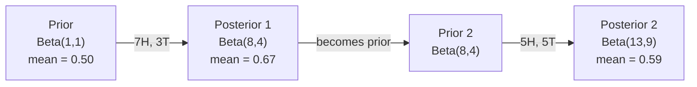

# Bayes' Theorem

> Probability 关注的是你预期会发生什么。Bayes' theorem 关注的是你学到了什么。

**类型：** Build
**语言：** Python
**前置要求：** Phase 1, Lesson 06（Probability Fundamentals）
**时间：** ~75 分钟

## 学习目标

- 应用 Bayes' theorem，根据 prior、likelihood 和 evidence 计算 posterior probability
- 从零构建一个带有 Laplace smoothing 和 log-space computation 的 Naive Bayes 文本分类器
- 比较 MLE 和 MAP estimation，并解释 MAP 如何对应 L2 regularization
- 使用 Beta-Binomial conjugate priors 为 A/B testing 实现 sequential Bayesian updating

## 问题

一项医学检测有 99% 的准确率。你的检测结果为阳性。你真正患病的概率是多少？

大多数人会说 99%。真正答案取决于这种疾病有多罕见。如果每 10,000 人中只有 1 人患病，那么一次阳性结果只意味着你大约有 1% 的患病概率。其他 99% 的阳性结果都是健康人产生的误报。

这不是脑筋急转弯。这就是 Bayes' theorem。每个 spam filter、每个 medical diagnostic、每个量化不确定性的 ML model 都在使用完全相同的推理。你先有一个 belief。你看到 evidence。然后更新它。

如果你在不了解这一点的情况下构建 ML 系统，就会误解 model outputs、设置糟糕的 thresholds，并发布过度自信的 predictions。

## 概念

### 从 joint probability 到 Bayes

你已经在 Lesson 06 中知道 conditional probability 是：

```
P(A|B) = P(A and B) / P(B)
```

对称地：

```
P(B|A) = P(A and B) / P(A)
```

两个表达式共享同一个分子：P(A and B)。令它们相等并重新整理：

```
P(A and B) = P(A|B) * P(B) = P(B|A) * P(A)

Therefore:

P(A|B) = P(B|A) * P(A) / P(B)
```

这就是 Bayes' theorem。四个量，一个方程。

### 四个部分

| Part | Name | What it means |
|------|------|---------------|
| P(A\|B) | Posterior | 看到 evidence B 之后，你对 A 的更新后 belief |
| P(B\|A) | Likelihood | 如果 A 为真，evidence B 出现的概率有多大 |
| P(A) | Prior | 在看到任何 evidence 之前，你对 A 的 belief |
| P(B) | Evidence | 在所有可能性下看到 B 的总概率 |

Evidence 项 P(B) 起到归一化因子的作用。你可以用 total probability law 展开它：

```
P(B) = P(B|A) * P(A) + P(B|not A) * P(not A)
```

### 医学检测示例

一种疾病影响每 10,000 人中的 1 人。检测准确率为 99%（能检出 99% 的患者，误报率为 1%）。

```
P(sick)          = 0.0001     (prior: disease is rare)
P(positive|sick) = 0.99       (likelihood: test catches it)
P(positive|healthy) = 0.01    (false positive rate)

P(positive) = P(positive|sick) * P(sick) + P(positive|healthy) * P(healthy)
            = 0.99 * 0.0001 + 0.01 * 0.9999
            = 0.000099 + 0.009999
            = 0.010098

P(sick|positive) = P(positive|sick) * P(sick) / P(positive)
                 = 0.99 * 0.0001 / 0.010098
                 = 0.0098
                 = 0.98%
```

不到 1%。Prior 占主导。当某种状况很罕见时，即使准确的检测也大多会产生 false positives。这就是医生会要求做确认检测的原因。

### Spam filter 示例

你收到一封包含单词 "lottery" 的 email。它是 spam 吗？

```
P(spam)                = 0.3      (30% of email is spam)
P("lottery"|spam)      = 0.05     (5% of spam emails contain "lottery")
P("lottery"|not spam)  = 0.001    (0.1% of legitimate emails contain "lottery")

P("lottery") = 0.05 * 0.3 + 0.001 * 0.7
             = 0.015 + 0.0007
             = 0.0157

P(spam|"lottery") = 0.05 * 0.3 / 0.0157
                  = 0.955
                  = 95.5%
```

一个词就把概率从 30% 推高到 95.5%。真实的 spam filter 会同时在数百个词上应用 Bayes。

### Naive Bayes：independence assumption

Naive Bayes 通过假设所有 features 在给定 class 的条件下相互独立，把这个思路扩展到多个 features：

```
P(class | feature_1, feature_2, ..., feature_n)
  = P(class) * P(feature_1|class) * P(feature_2|class) * ... * P(feature_n|class)
    / P(feature_1, feature_2, ..., feature_n)
```

"naive" 的部分就是 independence assumption。在文本中，词的出现并不是独立的（"New" 和 "York" 是相关的）。但这个假设在实践中效果出奇地好，因为分类器只需要对 classes 排序，而不是生成校准良好的概率。

由于分母对所有 classes 都相同，你可以跳过它，只比较分子：

```
score(class) = P(class) * product of P(feature_i | class)
```

选择 score 最高的 class。

### Maximum likelihood estimation (MLE)

如何从训练数据得到 P(feature|class)？计数。

```
P("free"|spam) = (number of spam emails containing "free") / (total spam emails)
```

这就是 MLE：选择让观测数据最可能出现的参数值。你在最大化 likelihood function；对于离散计数，它会简化为相对频率。

问题：如果某个词在训练期间从未出现在 spam 中，MLE 会给它分配零概率。一个未见过的词会让整个乘积归零。用 Laplace smoothing 修复这个问题：

```
P(word|class) = (count(word, class) + 1) / (total_words_in_class + vocabulary_size)
```

给每个计数加 1，确保任何概率都不会为零。

### Maximum a posteriori (MAP)

MLE 问的是：哪些 parameters 最大化 P(data|parameters)？

MAP 问的是：哪些 parameters 最大化 P(parameters|data)？

根据 Bayes' theorem：

```
P(parameters|data) proportional to P(data|parameters) * P(parameters)
```

MAP 会在 parameters 本身之上加入一个 prior。如果你认为 parameters 应该较小，就把它编码为惩罚大值的 prior。这与 ML 中的 L2 regularization 完全相同。Ridge regression 中的 "ridge" penalty 本质上就是 weights 上的 Gaussian prior。

| Estimation | Optimizes | ML equivalent |
|------------|-----------|---------------|
| MLE | P(data\|params) | 未 regularize 的训练 |
| MAP | P(data\|params) * P(params) | L2 / L1 regularization |

### Bayesian vs frequentist：实践差异

Frequentists 把 parameters 视为固定但未知的量。他们问：“如果我把这个实验重复很多次，会发生什么？”

Bayesians 把 parameters 视为 distributions。他们问：“基于我已经观察到的内容，我对这些 parameters 有什么 belief？”

对于构建 ML 系统，实践差异如下：

| Aspect | Frequentist | Bayesian |
|--------|-------------|----------|
| Output | 点估计 | 值上的 distribution |
| Uncertainty | Confidence intervals（关于过程） | Credible intervals（关于 parameter） |
| Small data | 可能 overfit | Prior 起到 regularization 的作用 |
| Computation | 通常更快 | 通常需要 sampling（MCMC） |

大多数生产级 ML 是 frequentist 的（SGD、点估计）。当你需要校准良好的不确定性（医学决策、安全关键系统），或者数据很少（few-shot learning、cold start）时，Bayesian methods 会非常有用。

### 为什么 Bayesian thinking 对 ML 很重要

这种关联比类比更深：

**Priors 就是 regularization。** weights 上的 Gaussian prior 就是 L2 regularization。Laplace prior 就是 L1。每次添加 regularization 项时，你都在对期望的 parameter values 做出一个 Bayesian statement。

**Posteriors 就是不确定性。** 单个预测概率无法告诉你 model 对该估计有多自信。Bayesian methods 会给你一个 distribution：“我认为 P(spam) 在 0.8 到 0.95 之间。”

**Bayes updates 就是 online learning。** 今天的 posterior 会成为明天的 prior。当你的 model 看到新数据时，它会增量更新自己的 beliefs，而不是从零重新训练。

**Model comparison 是 Bayesian 的。** Bayesian information criterion (BIC)、marginal likelihood 和 Bayes factors 都使用 Bayesian reasoning 在不过拟合的情况下选择 models。

## 构建它
### 步骤 1：Bayes theorem function

```python
def bayes(prior, likelihood, false_positive_rate):
    evidence = likelihood * prior + false_positive_rate * (1 - prior)
    posterior = likelihood * prior / evidence
    return posterior

result = bayes(prior=0.0001, likelihood=0.99, false_positive_rate=0.01)
print(f"P(sick|positive) = {result:.4f}")
```

### 步骤 2：Naive Bayes classifier

```python
import math
from collections import defaultdict

class NaiveBayes:
    def __init__(self, smoothing=1.0):
        self.smoothing = smoothing
        self.class_counts = defaultdict(int)
        self.word_counts = defaultdict(lambda: defaultdict(int))
        self.class_word_totals = defaultdict(int)
        self.vocab = set()

    def train(self, documents, labels):
        for doc, label in zip(documents, labels):
            self.class_counts[label] += 1
            words = doc.lower().split()
            for word in words:
                self.word_counts[label][word] += 1
                self.class_word_totals[label] += 1
                self.vocab.add(word)

    def predict(self, document):
        words = document.lower().split()
        total_docs = sum(self.class_counts.values())
        vocab_size = len(self.vocab)
        best_class = None
        best_score = float("-inf")
        for cls in self.class_counts:
            score = math.log(self.class_counts[cls] / total_docs)
            for word in words:
                count = self.word_counts[cls].get(word, 0)
                total = self.class_word_totals[cls]
                score += math.log((count + self.smoothing) / (total + self.smoothing * vocab_size))
            if score > best_score:
                best_score = score
                best_class = cls
        return best_class
```

Log probabilities 可以防止 underflow。许多很小的概率相乘会产生对 floating point 来说过小的数字。对 log-probabilities 求和在数值上更稳定，并且在数学上等价。

### 步骤 3：在 spam 数据上训练

```python
train_docs = [
    "win free money now",
    "free lottery ticket winner",
    "claim your prize today free",
    "urgent offer free cash",
    "congratulations you won free",
    "meeting tomorrow at noon",
    "project update attached",
    "can we schedule a call",
    "quarterly report review",
    "lunch on thursday sounds good",
    "team standup notes attached",
    "please review the pull request",
]

train_labels = [
    "spam", "spam", "spam", "spam", "spam",
    "ham", "ham", "ham", "ham", "ham", "ham", "ham",
]

classifier = NaiveBayes()
classifier.train(train_docs, train_labels)

test_messages = [
    "free money waiting for you",
    "meeting rescheduled to friday",
    "you won a free prize",
    "please review the attached report",
]

for msg in test_messages:
    print(f"  '{msg}' -> {classifier.predict(msg)}")
```

### 步骤 4：检查学习到的概率

```python
def show_top_words(classifier, cls, n=5):
    vocab_size = len(classifier.vocab)
    total = classifier.class_word_totals[cls]
    probs = {}
    for word in classifier.vocab:
        count = classifier.word_counts[cls].get(word, 0)
        probs[word] = (count + classifier.smoothing) / (total + classifier.smoothing * vocab_size)
    sorted_words = sorted(probs.items(), key=lambda x: x[1], reverse=True)
    for word, prob in sorted_words[:n]:
        print(f"    {word}: {prob:.4f}")

print("\nTop spam words:")
show_top_words(classifier, "spam")
print("\nTop ham words:")
show_top_words(classifier, "ham")
```

## 使用它
Scikit-learn 提供了可用于生产的 naive Bayes 实现：

```python
from sklearn.feature_extraction.text import CountVectorizer
from sklearn.naive_bayes import MultinomialNB
from sklearn.metrics import classification_report

vectorizer = CountVectorizer()
X_train = vectorizer.fit_transform(train_docs)
clf = MultinomialNB()
clf.fit(X_train, train_labels)

X_test = vectorizer.transform(test_messages)
predictions = clf.predict(X_test)
for msg, pred in zip(test_messages, predictions):
    print(f"  '{msg}' -> {pred}")
```

同一个算法。CountVectorizer 处理 tokenization 和 vocabulary building。MultinomialNB 在内部处理 smoothing 和 log-probabilities。你从零写的版本用 40 行代码完成了同样的事情。

## 交付它
这里构建的 NaiveBayes class 展示了完整 pipeline：tokenization、使用 Laplace smoothing 的 probability estimation、log-space prediction。`code/bayes.py` 中的代码可以端到端运行，除了 Python standard library 之外不需要任何依赖。

### Conjugate Priors

当 prior 和 posterior 属于同一个 distribution family 时，这个 prior 被称为 "conjugate"。这让 Bayesian updating 在代数上很干净——你无需 numerical integration 就能得到 closed-form posterior。

| Likelihood | Conjugate Prior | Posterior | Example |
|-----------|----------------|-----------|---------|
| Bernoulli | Beta(a, b) | Beta(a + successes, b + failures) | Coin flip bias estimation |
| Normal (known variance) | Normal(mu_0, sigma_0) | Normal(weighted mean, smaller variance) | Sensor calibration |
| Poisson | Gamma(a, b) | Gamma(a + sum of counts, b + n) | Modeling arrival rates |
| Multinomial | Dirichlet(alpha) | Dirichlet(alpha + counts) | Topic modeling, language models |

这为什么重要：没有 conjugate priors 时，你需要 Monte Carlo sampling 或 variational inference 来近似 posterior。有了 conjugate priors，你只需要更新两个数字。

Beta distribution 是实践中最常见的 conjugate prior。Beta(a, b) 表示你对某个 probability parameter 的 belief。均值是 a/(a+b)。a+b 越大，distribution 越集中（越自信）。

Beta prior 的特殊情况：
- Beta(1, 1) = uniform。你对 parameter 没有意见。
- Beta(10, 10) = 在 0.5 附近达到峰值。你强烈相信 parameter 接近 0.5。
- Beta(1, 10) = 向 0 偏斜。你相信 parameter 很小。

更新规则极其简单：

```
Prior:     Beta(a, b)
Data:      s successes, f failures
Posterior: Beta(a + s, b + f)
```

没有积分。没有 sampling。只有加法。

### Sequential Bayesian Updating

Bayesian inference 天然是 sequential 的。今天的 posterior 会成为明天的 prior。这就是现实系统如何在不重新处理所有历史数据的情况下增量学习。

具体示例：估计一枚硬币是否公平。

**Day 1：还没有数据。**
从 Beta(1, 1) 开始——一个 uniform prior。你没有意见。
- Prior mean：0.5
- Prior 在 [0, 1] 上是平坦的

**Day 2：观察到 7 次正面，3 次反面。**
Posterior = Beta(1 + 7, 1 + 3) = Beta(8, 4)
- Posterior mean：8/12 = 0.667
- Evidence 表明硬币偏向正面

**Day 3：又观察到 5 次正面，5 次反面。**
使用昨天的 posterior 作为今天的 prior。
Posterior = Beta(8 + 5, 4 + 5) = Beta(13, 9)
- Posterior mean：13/22 = 0.591
- 新的均衡数据把估计值拉回到 0.5 附近



观测顺序并不重要。Beta(1,1) 一次性用全部 12 次正面和 8 次反面更新，也会得到 Beta(13, 9)——结果相同。Sequential updating 和 batch updating 在数学上等价。但 sequential updating 允许你在每一步做决策，而不必存储原始数据。

这是生产级 ML 系统中 online learning 的基础。用于 bandits 的 Thompson sampling、增量推荐系统和 streaming anomaly detectors 都使用这种模式。

### 与 A/B Testing 的联系

A/B testing 本质上是伪装起来的 Bayesian inference。

设定：你正在测试两种按钮颜色。Variant A（blue）和 variant B（green）。你想知道哪一个获得更多点击。

Bayesian A/B test：

1. **Prior。** 两个 variants 都从 Beta(1, 1) 开始。没有 prior preference。
2. **Data。** Variant A：1000 次展示中 50 次点击。Variant B：1000 次展示中 65 次点击。
3. **Posteriors。**
   - A：Beta(1 + 50, 1 + 950) = Beta(51, 951)。Mean = 0.051
   - B：Beta(1 + 65, 1 + 935) = Beta(66, 936)。Mean = 0.066
4. **Decision。** 计算 P(B > A)——B 的真实 conversion rate 高于 A 的概率。

解析地计算 P(B > A) 很困难。但 Monte Carlo 让它变得非常简单：

```
1. Draw 100,000 samples from Beta(51, 951)  -> samples_A
2. Draw 100,000 samples from Beta(66, 936)  -> samples_B
3. P(B > A) = fraction of samples where B > A
```

如果 P(B > A) > 0.95，就发布 variant B。如果它在 0.05 和 0.95 之间，就继续收集数据。如果 P(B > A) < 0.05，就发布 variant A。

相比 frequentist A/B testing 的优势：
- 你会得到一个直接的概率陈述：“B 有 97% 的概率更好”
- 没有 p-value 混淆。没有 “fail to reject the null hypothesis” 这种回避表述。
- 你可以随时查看结果，而不会抬高 false positive rates（没有 "peeking problem"）
- 你可以纳入 prior knowledge（例如，之前的测试表明 conversion rates 通常是 3-8%）

| Aspect | Frequentist A/B | Bayesian A/B |
|--------|----------------|--------------|
| Output | p-value | P(B > A) |
| Interpretation | “如果 A=B，这些数据有多令人意外？” | “B 比 A 更好的可能性有多大？” |
| Early stopping | 会抬高 false positives | 任意时点都是安全的（前提是 prior 选择合理且 model specification 正确） |
| Prior knowledge | 不使用 | 编码为 Beta prior |
| Decision rule | p < 0.05 | P(B > A) > threshold |

## 练习
1. **Multiple tests。** 一名患者在两次独立检测中都呈阳性（两次检测都 99% 准确，疾病流行率为每 10,000 人中 1 人）。两次检测之后的 P(sick) 是多少？把第一次检测得到的 posterior 作为第二次检测的 prior。

2. **Smoothing impact。** 使用 0.01、0.1、1.0 和 10.0 的 smoothing values 运行 spam classifier。Top word probabilities 会如何变化？当 smoothing=0 且某个词只出现在 ham 中时会发生什么？

3. **Add features。** 扩展 NaiveBayes class，使它除了 word counts 之外，也使用 message length（short/long）作为 feature。从训练数据中估计 P(short|spam) 和 P(short|ham)，并把它合并到 prediction score 中。

4. **MAP by hand。** 给定观测数据（10 次 coin flips 中有 7 次 heads），使用 Beta(2,2) prior 计算 bias 的 MAP estimate。把它与 MLE estimate（7/10）进行比较。

## 关键术语
| Term | What people say | What it actually means |
|------|----------------|----------------------|
| Prior | “我的初始猜测” | 观测 evidence 之前的 P(hypothesis)。在 ML 中：regularization 项。 |
| Likelihood | “数据拟合得有多好” | P(evidence\|hypothesis)。在特定 hypothesis 下，观测数据出现的概率有多大。 |
| Posterior | “我更新后的 belief” | P(hypothesis\|evidence)。Prior 乘以 likelihood，然后归一化。 |
| Evidence | “归一化常数” | 所有 hypotheses 下的 P(data)。确保 posterior 求和为 1。 |
| Naive Bayes | “那个简单的文本分类器” | 一个假设 features 在给定 class 时相互独立的分类器。尽管该假设不成立，效果仍然很好。 |
| Laplace smoothing | “Add-one smoothing” | 给每个 feature 增加一个小计数，以防止未见数据产生零概率。 |
| MLE | “直接用频率” | 选择最大化 P(data\|parameters) 的 parameters。没有 prior。在小数据上可能 overfit。 |
| MAP | “带 prior 的 MLE” | 选择最大化 P(data\|parameters) * P(parameters) 的 parameters。等价于 regularized MLE。 |
| Log-probability | “在 log space 中工作” | 使用 log(P) 而不是 P，避免许多小数相乘时发生 floating-point underflow。 |
| False positive | “错误警报” | 检测结果为阳性，但真实状态为阴性。它会推动 base rate fallacy。 |

## 延伸阅读
- [3Blue1Brown: Bayes' theorem](https://www.youtube.com/watch?v=HZGCoVF3YvM) - 使用医学检测示例的可视化解释
- [Stanford CS229: Generative Learning Algorithms](https://cs229.stanford.edu/notes2022fall/cs229-notes2.pdf) - naive Bayes 及其与 discriminative models 的联系
- [Think Bayes](https://greenteapress.com/wp/think-bayes/) - 免费书籍，包含 Python 代码的 Bayesian statistics
- [scikit-learn Naive Bayes](https://scikit-learn.org/stable/modules/naive_bayes.html) - 生产级实现以及何时使用各个 variant
