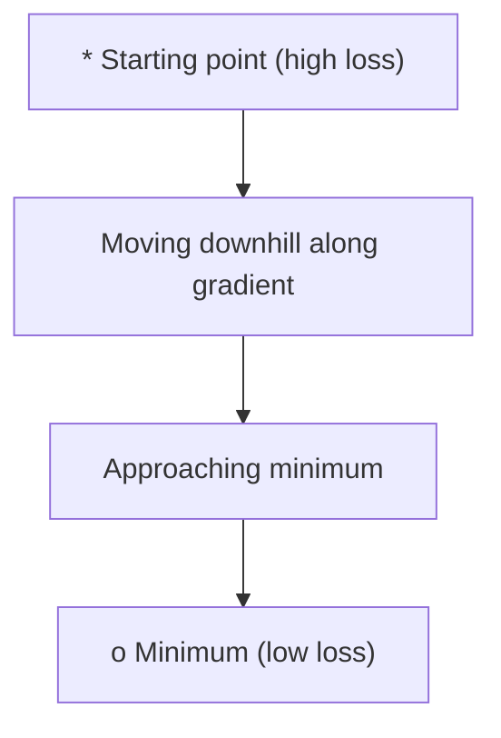
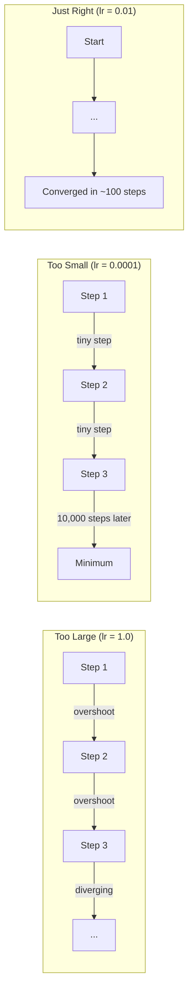
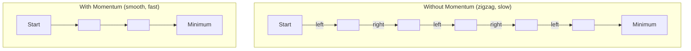
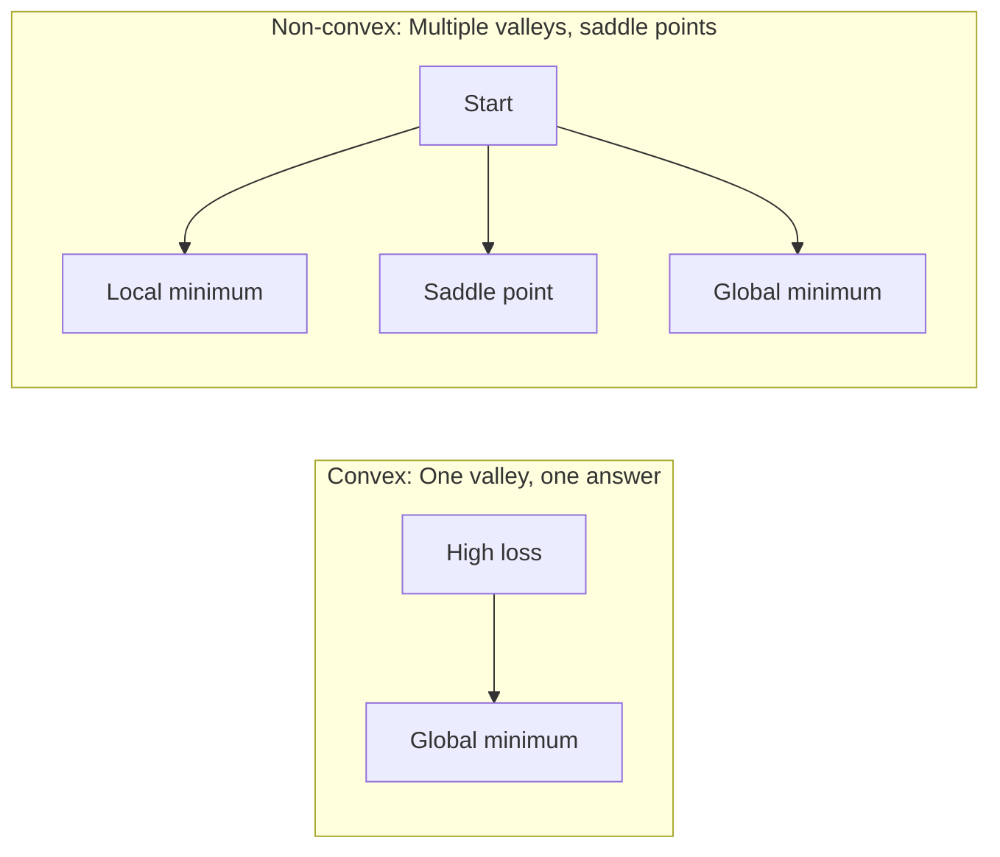
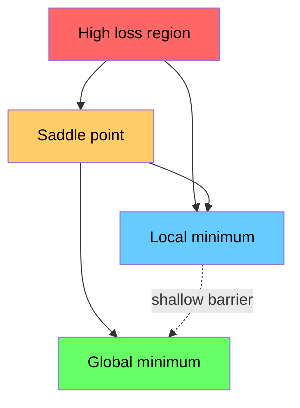

# Optimization

> 训练一个 Neural Network，本质上就是寻找山谷的最低点。

**Type:** Build
**Language:** Python
**Prerequisites:** Phase 1, Lessons 04-05 (Derivatives, Gradients)
**Time:** ~75 minutes

## 学习目标
- 从零实现 vanilla gradient descent、带 momentum 的 SGD，以及 Adam
- 比较 Rosenbrock function 上的 Optimizer 收敛表现，并解释为什么 Adam 会为每个 weight 自适应调整 learning rate
- 区分 convex 与 non-convex Loss landscape，并解释 saddle point 在高维空间中的作用
- 配置 learning rate schedules（step decay、cosine annealing、warmup）以提升训练稳定性

## 问题
你有一个 Loss function。它告诉你模型错得有多离谱。你有 Gradients。它们告诉你哪个方向会让 Loss 变得更糟。现在你需要一种向下走的策略。

最朴素的方法很简单：朝 Gradient 的反方向移动。用一个叫 learning rate 的数来缩放步长。重复执行。这就是 gradient descent，而且它确实有效。但“有效”有前提。learning rate 太大，你会直接越过整个山谷，在两侧之间来回震荡。learning rate 太小，你会用数千个不必要的步骤缓慢爬向答案。遇到 saddle point 时，即使还没有找到 minimum，你也会停止移动。

Deep Learning 中的每一个 Optimizer，都是在回答同一个问题：怎样才能更快、更可靠地到达山谷底部？

## 概念
### What optimization means

Optimization 是寻找能让函数最小化（或最大化）的输入值。在 Machine Learning 中，这个函数就是 Loss。输入是模型的 weights。训练就是 optimization。

```
minimize L(w) where:
  L = loss function
  w = model weights (could be millions of parameters)
```

### Gradient descent (vanilla)

最简单的 Optimizer。计算 Loss 相对于每个 weight 的 Gradient。让每个 weight 沿其 Gradient 的反方向移动。用 learning rate 缩放这一步。

```
w = w - lr * gradient
```

这就是完整算法。一行。



### Learning rate：最重要的 hyperparameter

learning rate 控制步长。它决定了关于收敛的一切。



不存在一个公式可以直接给出正确的 learning rate。你需要通过实验找到它。常见起点：Adam 使用 0.001，带 momentum 的 SGD 使用 0.01。

### SGD vs batch vs mini-batch

Vanilla gradient descent 在迈出一步之前，会在整个 dataset 上计算 Gradient。这称为 batch gradient descent。它稳定，但慢。

Stochastic gradient descent（SGD）在单个随机样本上计算 Gradient，并立即更新。它噪声大，但快。

Mini-batch gradient descent 折中处理。先在一个小 batch（32、64、128、256 个样本）上计算 Gradient，然后更新。这是实际中大家真正使用的方法。

| Variant | Batch size | Gradient quality | Speed per step | Noise |
|---------|-----------|-----------------|---------------|-------|
| Batch GD | 整个 dataset | 精确 | 慢 | 无 |
| SGD | 1 个样本 | 噪声很大 | 快 | 高 |
| Mini-batch | 32-256 | 良好估计 | 均衡 | 中等 |

SGD 和 mini-batch 中的噪声不是 bug。它有助于逃离浅层 local minima 和 saddle points。

### Momentum：向山下滚动的小球

Vanilla gradient descent 只看当前 Gradient。如果 Gradient 来回之字形摆动（在狭窄山谷中很常见），进展就会很慢。Momentum 通过把过去的 Gradients 累积到一个 velocity 项中来解决这个问题。

```
v = beta * v + gradient
w = w - lr * v
```

类比是：一个向山下滚动的球。它不会在每个小凸起处停下再重新开始。它会在一致的方向上积累速度，并抑制震荡。



`beta`（通常为 0.9）控制保留多少历史信息。beta 越高，momentum 越强，路径越平滑，但对方向变化的响应也越慢。

### Adam：adaptive learning rates

不同的 weights 需要不同的 learning rates。某个很少获得大 Gradient 的 weight，在最终获得大 Gradient 时应该迈出更大的步子。某个持续获得巨大 Gradients 的 weight，则应该迈出更小的步子。

Adam（Adaptive Moment Estimation）会为每个 weight 跟踪两件事：

1. First moment（m）：Gradients 的 running average（类似 momentum）
2. Second moment（v）：squared gradients 的 running average（Gradient magnitude）

```
m = beta1 * m + (1 - beta1) * gradient
v = beta2 * v + (1 - beta2) * gradient^2

m_hat = m / (1 - beta1^t)    bias correction
v_hat = v / (1 - beta2^t)    bias correction

w = w - lr * m_hat / (sqrt(v_hat) + epsilon)
```

除以 `sqrt(v_hat)` 是关键洞察。具有大 Gradients 的 weights 会被一个大数相除（有效步长小）。具有小 Gradients 的 weights 会被一个小数相除（有效步长大）。每个 weight 都会获得自己的 adaptive learning rate。

默认 hyperparameters：`lr=0.001, beta1=0.9, beta2=0.999, epsilon=1e-8`。这些默认值对大多数问题都效果不错。

### Learning rate schedules

固定的 learning rate 是一种折中。训练早期，你希望步子大一些，以便快速取得进展。训练后期，你希望步子小一些，以便在 minimum 附近精调。

常见 schedules：

| Schedule | Formula | Use case |
|----------|---------|----------|
| Step decay | lr = lr * factor every N epochs | 简单，手动控制 |
| Exponential decay | lr = lr_0 * decay^t | 平滑降低 |
| Cosine annealing | lr = lr_min + 0.5 * (lr_max - lr_min) * (1 + cos(pi * t / T)) | Transformers，现代训练 |
| Warmup + decay | 线性上升，然后 decay | 大模型，防止早期不稳定 |

### Convex vs non-convex

Convex function 只有一个 minimum。Gradient descent 总能找到它。像 `f(x) = x^2` 这样的 quadratic 是 convex。

Neural Network Loss functions 是 non-convex。它们有许多 local minima、saddle points 和平坦区域。



实践中，高维 Neural Networks 里的 local minima 很少是真正的问题。大多数 local minima 的 Loss 值都接近 global minimum。Saddle points（某些方向平坦、另一些方向弯曲）才是真正的障碍。Mini-batches 带来的 momentum 和噪声有助于逃离它们。

### Loss landscape visualization

Loss 是所有 weights 的函数。对于一个拥有 100 万个 weights 的模型，Loss landscape 存在于 1,000,001 维空间中。我们通过在 weight space 中选择两个随机方向，并沿这些方向绘制 Loss，得到一个 2D surface 来进行可视化。



Sharp minima 泛化较差。Flat minima 泛化较好。这也是带 momentum 的 SGD 在最终 test accuracy 上经常优于 Adam 的原因之一：它的噪声会防止模型停留在 sharp minima 中。


```figure
gradient-descent
```

## 构建它
### 步骤 1： Define a test function

Rosenbrock function 是经典 optimization benchmark。它的 minimum 位于 (1, 1)，处在一条狭窄弯曲的山谷中，容易找到但很难沿着它前进。

```
f(x, y) = (1 - x)^2 + 100 * (y - x^2)^2
```

```python
def rosenbrock(params):
    x, y = params
    return (1 - x) ** 2 + 100 * (y - x ** 2) ** 2

def rosenbrock_gradient(params):
    x, y = params
    df_dx = -2 * (1 - x) + 200 * (y - x ** 2) * (-2 * x)
    df_dy = 200 * (y - x ** 2)
    return [df_dx, df_dy]
```

### 步骤 2： Vanilla gradient descent

```python
class GradientDescent:
    def __init__(self, lr=0.001):
        self.lr = lr

    def step(self, params, grads):
        return [p - self.lr * g for p, g in zip(params, grads)]
```

### 步骤 3： SGD with momentum

```python
class SGDMomentum:
    def __init__(self, lr=0.001, momentum=0.9):
        self.lr = lr
        self.momentum = momentum
        self.velocity = None

    def step(self, params, grads):
        if self.velocity is None:
            self.velocity = [0.0] * len(params)
        self.velocity = [
            self.momentum * v + g
            for v, g in zip(self.velocity, grads)
        ]
        return [p - self.lr * v for p, v in zip(params, self.velocity)]
```

### 步骤 4： Adam

```python
class Adam:
    def __init__(self, lr=0.001, beta1=0.9, beta2=0.999, epsilon=1e-8):
        self.lr = lr
        self.beta1 = beta1
        self.beta2 = beta2
        self.epsilon = epsilon
        self.m = None
        self.v = None
        self.t = 0

    def step(self, params, grads):
        if self.m is None:
            self.m = [0.0] * len(params)
            self.v = [0.0] * len(params)

        self.t += 1

        self.m = [
            self.beta1 * m + (1 - self.beta1) * g
            for m, g in zip(self.m, grads)
        ]
        self.v = [
            self.beta2 * v + (1 - self.beta2) * g ** 2
            for v, g in zip(self.v, grads)
        ]

        m_hat = [m / (1 - self.beta1 ** self.t) for m in self.m]
        v_hat = [v / (1 - self.beta2 ** self.t) for v in self.v]

        return [
            p - self.lr * mh / (vh ** 0.5 + self.epsilon)
            for p, mh, vh in zip(params, m_hat, v_hat)
        ]
```

### 步骤 5： Run and compare

```python
def optimize(optimizer, func, grad_func, start, steps=5000):
    params = list(start)
    history = [params[:]]
    for _ in range(steps):
        grads = grad_func(params)
        params = optimizer.step(params, grads)
        history.append(params[:])
    return history

start = [-1.0, 1.0]

gd_history = optimize(GradientDescent(lr=0.0005), rosenbrock, rosenbrock_gradient, start)
sgd_history = optimize(SGDMomentum(lr=0.0001, momentum=0.9), rosenbrock, rosenbrock_gradient, start)
adam_history = optimize(Adam(lr=0.01), rosenbrock, rosenbrock_gradient, start)

for name, history in [("GD", gd_history), ("SGD+M", sgd_history), ("Adam", adam_history)]:
    final = history[-1]
    loss = rosenbrock(final)
    print(f"{name:6s} -> x={final[0]:.6f}, y={final[1]:.6f}, loss={loss:.8f}")
```

预期输出：Adam 收敛最快。带 momentum 的 SGD 路径更平滑。Vanilla GD 在狭窄山谷中进展缓慢。

## 使用它
实践中，使用 PyTorch 或 JAX Optimizers。它们会处理 parameter groups、weight decay、gradient clipping 和 GPU acceleration。

```python
import torch

model = torch.nn.Linear(784, 10)

sgd = torch.optim.SGD(model.parameters(), lr=0.01, momentum=0.9)
adam = torch.optim.Adam(model.parameters(), lr=0.001)
adamw = torch.optim.AdamW(model.parameters(), lr=0.001, weight_decay=0.01)

scheduler = torch.optim.lr_scheduler.CosineAnnealingLR(adam, T_max=100)
```

经验法则：

- 从 Adam（lr=0.001）开始。它在大多数问题上无需调参就能工作。
- 当你需要最好的最终 accuracy，并且能够承担更多调参成本时，切换到带 momentum 的 SGD（lr=0.01, momentum=0.9）。
- 对 transformers 使用 AdamW（带 decoupled weight decay 的 Adam）。
- 对超过几个 epochs 的训练运行，始终使用 learning rate schedule。
- 如果训练不稳定，降低 learning rate。如果训练太慢，提高它。

## 交付它
本课会产出一个用于选择合适 Optimizer 的 prompt。见 `outputs/prompt-optimizer-guide.md`。

这里构建的 Optimizer classes 会在 Phase 3 中再次出现，那时我们会从零训练一个 Neural Network。

## 练习
1. **Learning rate sweep.** 在 Rosenbrock function 上使用 learning rates [0.0001, 0.0005, 0.001, 0.005, 0.01] 运行 vanilla gradient descent。对每个 learning rate，在 5000 步后绘图或打印最终 Loss。找出仍能收敛的最大 learning rate。

2. **Momentum comparison.** 在 Rosenbrock function 上使用 momentum values [0.0, 0.5, 0.9, 0.99] 运行带 momentum 的 SGD。跟踪每一步的 Loss。哪个 momentum value 收敛最快？哪个会 overshoot？

3. **Saddle point escape.** 定义函数 `f(x, y) = x^2 - y^2`（原点处有一个 saddle point）。从 (0.01, 0.01) 开始。比较 vanilla GD、带 momentum 的 SGD 和 Adam 的行为。哪个能逃离 saddle point？

4. **Implement learning rate decay.** 为 GradientDescent class 添加 exponential decay schedule：`lr = lr_0 * 0.999^step`。比较在 Rosenbrock function 上使用 decay 与不使用 decay 的收敛表现。

## 关键术语
| Term | What people say | What it actually means |
|------|----------------|----------------------|
| Gradient descent | “Go downhill” | 通过减去按 learning rate 缩放后的 Gradient 来更新 weights。最基础的 Optimizer。 |
| Learning rate | “Step size” | 控制每次更新让 weights 移动多远的标量。太大会导致发散。太小会浪费计算。 |
| Momentum | “Keep rolling” | 将过去的 Gradients 累积到一个 velocity Vector 中。抑制震荡，并加速沿一致方向的移动。 |
| SGD | “Random sampling” | Stochastic gradient descent。用随机子集而不是完整 dataset 计算 Gradient。实践中几乎总是指 mini-batch SGD。 |
| Mini-batch | “A chunk of data” | 用于估计 Gradient 的一小部分训练数据（32-256 个样本）。平衡速度与 Gradient 准确性。 |
| Adam | “The default optimizer” | Adaptive Moment Estimation。跟踪每个 weight 的 Gradients 和 squared gradients 的 running averages，从而为每个 weight 提供自己的 learning rate。 |
| Bias correction | “Fix the cold start” | Adam 的 first 和 second moments 初始化为零。Bias correction 在早期步骤中通过除以 (1 - beta^t) 进行补偿。 |
| Learning rate schedule | “Change lr over time” | 在训练过程中调整 learning rate 的函数。早期大步，后期小步。 |
| Convex function | “One valley” | 任意 local minimum 都是 global minimum 的函数。Gradient descent 总能找到它。Neural Network losses 不是 convex。 |
| Saddle point | “Flat but not a minimum” | Gradient 为零，但在某些方向上是 minimum、在另一些方向上是 maximum 的点。高维空间中很常见。 |
| Loss landscape | “The terrain” | 在 weight space 上绘制出的 Loss function。通过沿两个随机方向切片来可视化。 |
| Convergence | “Getting there” | Optimizer 已到达一个继续更新也无法显著降低 Loss 的点。 |

## 延伸阅读
- [Sebastian Ruder: An overview of gradient descent optimization algorithms](https://ruder.io/optimizing-gradient-descent/) - 对所有主要 Optimizers 的全面综述
- [Why Momentum Really Works (Distill)](https://distill.pub/2017/momentum/) - momentum dynamics 的交互式可视化
- [Adam: A Method for Stochastic Optimization (Kingma & Ba, 2014)](https://arxiv.org/abs/1412.6980) - 原始 Adam paper，易读且简短
- [Visualizing the Loss Landscape of Neural Nets (Li et al., 2018)](https://arxiv.org/abs/1712.09913) - 展示 sharp vs flat minima 的 paper
