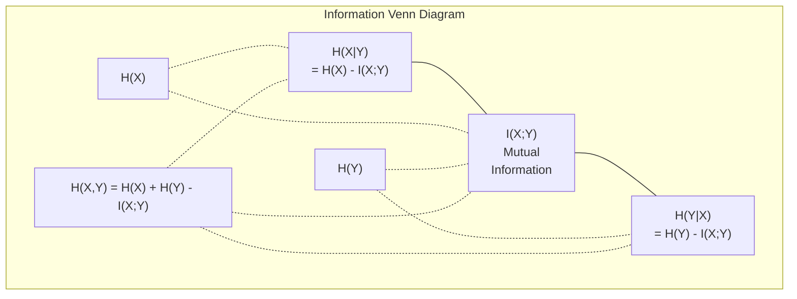

# Information Theory

> Information Theory 衡量 surprise。Loss functions 建立在它之上。

**Type:** Learn
**Language:** Python
**Prerequisites:** Phase 1, Lesson 06 (Probability)
**Time:** ~60 分钟

## 学习目标

- 从零计算 entropy、cross-entropy 和 KL divergence，并解释它们之间的关系
- 推导为什么最小化 cross-entropy loss 等价于最大化 log-likelihood
- 计算 features 与 target 之间的 mutual information，用于排序 feature importance
- 将 perplexity 解释为 language model 从中选择的有效 vocabulary size

## 问题

你在训练的每个 classification model 中都会调用 `CrossEntropyLoss()`。你在每篇 language model 论文中都会看到 “perplexity”。你会在 VAEs、distillation 和 RLHF 中读到 KL divergence。这些概念并不是彼此割裂的。它们都是同一个思想披着不同外衣。

Information Theory 为你提供了推理 uncertainty、compression 和 prediction 的语言。Claude Shannon 在 1948 年发明了它，用来解决通信问题。结果证明，训练 Neural Network 也是一个通信问题：model 正试图通过 learned weights 组成的 noisy channel 传递正确 label。

本课会从零构建每个公式，让你看到它们从何而来，以及为什么有效。

## 概念

### 信息量（Surprise）

当不太可能发生的事情发生时，它携带更多信息。硬币正面朝上？不令人意外。中彩票？非常令人意外。

概率为 p 的事件的信息量是：

```
I(x) = -log(p(x))
```

使用以 2 为底的 log 得到 bits。使用 natural log 得到 nats。同一个思想，不同单位。

```
Event              Probability    Surprise (bits)
Fair coin heads    0.5            1.0
Rolling a 6        0.167          2.58
1-in-1000 event    0.001          9.97
Certain event      1.0            0.0
```

确定事件携带零信息。你早就知道它会发生。

### Entropy（平均惊讶度）

Entropy 是一个 distribution 中所有可能结果的期望 surprise。

```
H(P) = -sum( p(x) * log(p(x)) )  for all x
```

公平硬币对于 binary variable 具有最大 entropy：1 bit。偏置硬币（99% 正面）具有低 entropy：0.08 bits。你已经知道会发生什么，因此每次抛掷几乎不会告诉你任何信息。

```
Fair coin:    H = -(0.5 * log2(0.5) + 0.5 * log2(0.5)) = 1.0 bit
Biased coin:  H = -(0.99 * log2(0.99) + 0.01 * log2(0.01)) = 0.08 bits
```

Entropy 衡量一个 distribution 中不可约的 uncertainty。你无法压缩到低于它。

### Cross-Entropy (你每天使用的 Loss Function)

Cross-entropy 衡量当你使用 distribution Q 来编码实际来自 distribution P 的事件时，平均 surprise 是多少。

```
H(P, Q) = -sum( p(x) * log(q(x)) )  for all x
```

P 是 true distribution（labels）。Q 是你的 model 的 predictions。如果 Q 与 P 完全匹配，cross-entropy 等于 entropy。任何不匹配都会让它变大。

在 classification 中，P 是 one-hot vector（true class 的概率为 1，其他全部为 0）。这会把 cross-entropy 简化为：

```
H(P, Q) = -log(q(true_class))
```

这就是 classification 的完整 cross-entropy loss 公式。最大化正确 class 的预测概率。

### KL Divergence (Distributions 之间的距离)

KL divergence 衡量使用 Q 而不是 P 会带来多少额外 surprise。

```
D_KL(P || Q) = sum( p(x) * log(p(x) / q(x)) )  for all x
             = H(P, Q) - H(P)
```

Cross-entropy 是 entropy 加 KL divergence。由于 true distribution 的 entropy 在训练期间是常数，最小化 cross-entropy 等同于最小化 KL divergence。你是在把 model 的 distribution 推向 true distribution。

KL divergence 不是对称的：D_KL(P || Q) != D_KL(Q || P)。它不是真正的 distance metric。

### Mutual Information

Mutual information 衡量知道一个 variable 能告诉你另一个 variable 多少信息。

```
I(X; Y) = H(X) - H(X|Y)
        = H(X) + H(Y) - H(X, Y)
```

如果 X 和 Y 独立，mutual information 为零。知道其中一个不会告诉你另一个的任何信息。如果它们完全相关，mutual information 等于任一 variable 的 entropy。

在 feature selection 中，feature 与 target 之间的 mutual information 高，意味着该 feature 有用。mutual information 低，意味着它是 noise。

### Conditional Entropy

H(Y|X) 衡量观察到 X 后，关于 Y 还剩下多少 uncertainty。

```
H(Y|X) = H(X,Y) - H(X)
```

两个极端：
- 如果 X 完全决定 Y，那么 H(Y|X) = 0。知道 X 会消除关于 Y 的全部 uncertainty。示例：X = 摄氏温度，Y = 华氏温度。
- 如果 X 对 Y 没有任何信息，那么 H(Y|X) = H(Y)。知道 X 完全不会降低你的 uncertainty。示例：X = 抛硬币结果，Y = 明天的天气。

Conditional entropy 始终非负，并且永远不超过 H(Y)：

```
0 <= H(Y|X) <= H(Y)
```

在 Machine Learning 中，conditional entropy 出现在 decision trees 中。在每次 split 时，algorithm 会选择使 H(Y|X) 最小的 feature X，也就是移除关于 label Y 最多 uncertainty 的 feature。

### Joint Entropy

H(X,Y) 是 X 和 Y 一起的 joint distribution 的 entropy。

```
H(X,Y) = -sum sum p(x,y) * log(p(x,y))   for all x, y
```

关键性质：

```
H(X,Y) <= H(X) + H(Y)
```

当 X 和 Y 独立时等号成立。如果它们共享信息，joint entropy 就小于各自 entropy 之和。这个“缺失”的 entropy 正是 mutual information。



这些关系：
- H(X,Y) = H(X) + H(Y|X) = H(Y) + H(X|Y)
- I(X;Y) = H(X) - H(X|Y) = H(Y) - H(Y|X)
- H(X,Y) = H(X) + H(Y) - I(X;Y)

### Mutual Information（Deep Dive）

Mutual information I(X;Y) 量化知道一个 variable 会减少关于另一个 variable 的多少 uncertainty。

```
I(X;Y) = H(X) - H(X|Y)
       = H(Y) - H(Y|X)
       = H(X) + H(Y) - H(X,Y)
       = sum sum p(x,y) * log(p(x,y) / (p(x) * p(y)))
```

性质：
- I(X;Y) >= 0 始终成立。观察某个东西永远不会让你损失信息。
- 当且仅当 X 和 Y 独立时，I(X;Y) = 0。
- I(X;Y) = I(Y;X)。它是对称的，不同于 KL divergence。
- I(X;X) = H(X)。一个 variable 与自身共享全部信息。

**用于 feature selection 的 mutual information。** 在 ML 中，你希望 features 对 target 有信息量。Mutual information 为你提供了一种有原则的方法来排序 features：

1. 对每个 feature X_i，计算 I(X_i; Y)，其中 Y 是 target variable。
2. 按 MI score 排序 features。
3. 保留前 k 个 features。

这适用于 feature 与 target 之间的任何关系：linear、nonlinear、monotonic 或其他关系。Correlation 只能捕捉 linear relationships。MI 能捕捉所有关系。

| Method | Detects | Computational cost | Handles categorical? |
|--------|---------|-------------------|---------------------|
| Pearson correlation | Linear relationships | O(n) | No |
| Spearman correlation | Monotonic relationships | O(n log n) | No |
| Mutual information | 任意 statistical dependency | O(n log n) with binning | Yes |

### Label Smoothing 与 Cross-Entropy

标准 classification 使用 hard targets：[0, 0, 1, 0]。true class 的概率为 1，其他全部为 0。Label smoothing 会用 soft targets 替换它们：

```
soft_target = (1 - epsilon) * hard_target + epsilon / num_classes
```

当 epsilon = 0.1 且有 4 个 classes 时：
- Hard target:  [0, 0, 1, 0]
- Soft target:  [0.025, 0.025, 0.925, 0.025]

从 Information Theory 视角看，label smoothing 增加了 target distribution 的 entropy。Hard one-hot targets 的 entropy 为 0，也就是没有 uncertainty。Soft targets 具有正 entropy。

为什么这有帮助：
- 防止 model 将 logits 推向极端值（在 cross-entropy 下，要完美匹配 one-hot target 需要无限大的 logits）
- 作为 regularization：model 不能 100% confident
- 改善 calibration：预测概率更好地反映真实 uncertainty
- 缩小训练行为和 inference 行为之间的差距

使用 label smoothing 的 cross-entropy loss 变为：

```
L = (1 - epsilon) * CE(hard_target, prediction) + epsilon * H_uniform(prediction)
```

第二项会惩罚远离 uniform 的 predictions，也就是直接对 confidence 进行 regularization。

### 为什么 Cross-Entropy 是 Classification Loss 的核心

三个视角，同一个结论。

**Information Theory 视角。** Cross-entropy 衡量使用你的 model 的 distribution 而不是真实 distribution 时浪费了多少 bits。最小化它，会让你的 model 成为现实的最高效 encoder。

**Maximum likelihood 视角。** 对于 N 个 true classes 为 y_i 的 training samples：

```
Likelihood     = product( q(y_i) )
Log-likelihood = sum( log(q(y_i)) )
Negative log-likelihood = -sum( log(q(y_i)) )
```

最后一行就是 cross-entropy loss。最小化 cross-entropy = 最大化 training data 在你的 model 下的 likelihood。

**Gradient 视角。** Cross-entropy 关于 logits 的 Gradient 简单地是（predicted - true）。干净、稳定、计算快速。这就是它与 softmax 完美配合的原因。

### Bits vs Nats

唯一的差异是 log 的底数。

```
log base 2   -> bits      (information theory tradition)
log base e   -> nats      (machine learning convention)
log base 10  -> hartleys  (rarely used)
```

1 nat = 1/ln(2) bits = 1.4427 bits。PyTorch 和 TensorFlow 默认使用 natural log（nats）。

### Perplexity

Perplexity 是 cross-entropy 的指数。它告诉你 model 不确定的、同等可能选择的有效数量。

```
Perplexity = 2^H(P,Q)   (if using bits)
Perplexity = e^H(P,Q)   (if using nats)
```

Perplexity 为 50 的 language model，平均来看，就像必须从 50 个可能的 next tokens 中均匀选择一样困惑。越低越好。

GPT-2 在常见 benchmarks 上达到约 30 的 perplexity。现代 models 在覆盖良好的 domains 中可以达到个位数。

## 构建它

### 第 1 步：Information content 和 entropy

```python
import math

def information_content(p, base=2):
    if p <= 0 or p > 1:
        return float('inf') if p <= 0 else 0.0
    return -math.log(p) / math.log(base)

def entropy(probs, base=2):
    return sum(
        p * information_content(p, base)
        for p in probs if p > 0
    )

fair_coin = [0.5, 0.5]
biased_coin = [0.99, 0.01]
fair_die = [1/6] * 6

print(f"Fair coin entropy:   {entropy(fair_coin):.4f} bits")
print(f"Biased coin entropy: {entropy(biased_coin):.4f} bits")
print(f"Fair die entropy:    {entropy(fair_die):.4f} bits")
```

### 步骤 2： Cross-entropy and KL divergence

```python
def cross_entropy(p, q, base=2):
    total = 0.0
    for pi, qi in zip(p, q):
        if pi > 0:
            if qi <= 0:
                return float('inf')
            total += pi * (-math.log(qi) / math.log(base))
    return total

def kl_divergence(p, q, base=2):
    return cross_entropy(p, q, base) - entropy(p, base)

true_dist = [0.7, 0.2, 0.1]
good_model = [0.6, 0.25, 0.15]
bad_model = [0.1, 0.1, 0.8]

print(f"Entropy of true dist:     {entropy(true_dist):.4f} bits")
print(f"CE (good model):          {cross_entropy(true_dist, good_model):.4f} bits")
print(f"CE (bad model):           {cross_entropy(true_dist, bad_model):.4f} bits")
print(f"KL divergence (good):     {kl_divergence(true_dist, good_model):.4f} bits")
print(f"KL divergence (bad):      {kl_divergence(true_dist, bad_model):.4f} bits")
```

### 步骤 3： Cross-entropy as classification loss

```python
def softmax(logits):
    max_logit = max(logits)
    exps = [math.exp(z - max_logit) for z in logits]
    total = sum(exps)
    return [e / total for e in exps]

def cross_entropy_loss(true_class, logits):
    probs = softmax(logits)
    return -math.log(probs[true_class])

logits = [2.0, 1.0, 0.1]
true_class = 0

probs = softmax(logits)
loss = cross_entropy_loss(true_class, logits)

print(f"Logits:      {logits}")
print(f"Softmax:     {[f'{p:.4f}' for p in probs]}")
print(f"True class:  {true_class}")
print(f"Loss:        {loss:.4f} nats")
print(f"Perplexity:  {math.exp(loss):.2f}")
```

### 步骤 4： Cross-entropy equals negative log-likelihood

```python
import random

random.seed(42)

n_samples = 1000
n_classes = 3
true_labels = [random.randint(0, n_classes - 1) for _ in range(n_samples)]
model_logits = [[random.gauss(0, 1) for _ in range(n_classes)] for _ in range(n_samples)]

ce_loss = sum(
    cross_entropy_loss(label, logits)
    for label, logits in zip(true_labels, model_logits)
) / n_samples

nll = -sum(
    math.log(softmax(logits)[label])
    for label, logits in zip(true_labels, model_logits)
) / n_samples

print(f"Cross-entropy loss:      {ce_loss:.6f}")
print(f"Negative log-likelihood: {nll:.6f}")
print(f"Difference:              {abs(ce_loss - nll):.2e}")
```

### 步骤 5： Mutual information

```python
def mutual_information(joint_probs, base=2):
    rows = len(joint_probs)
    cols = len(joint_probs[0])

    margin_x = [sum(joint_probs[i][j] for j in range(cols)) for i in range(rows)]
    margin_y = [sum(joint_probs[i][j] for i in range(rows)) for j in range(cols)]

    mi = 0.0
    for i in range(rows):
        for j in range(cols):
            pxy = joint_probs[i][j]
            if pxy > 0:
                mi += pxy * math.log(pxy / (margin_x[i] * margin_y[j])) / math.log(base)
    return mi

independent = [[0.25, 0.25], [0.25, 0.25]]
dependent = [[0.45, 0.05], [0.05, 0.45]]

print(f"MI (independent): {mutual_information(independent):.4f} bits")
print(f"MI (dependent):   {mutual_information(dependent):.4f} bits")
```

## 使用它

使用 NumPy 表达同样的概念，也就是你在实践中会使用的方式：

```python
import numpy as np

def np_entropy(p):
    p = np.asarray(p, dtype=float)
    mask = p > 0
    result = np.zeros_like(p)
    result[mask] = p[mask] * np.log(p[mask])
    return -result.sum()

def np_cross_entropy(p, q):
    p, q = np.asarray(p, dtype=float), np.asarray(q, dtype=float)
    mask = p > 0
    return -(p[mask] * np.log(q[mask])).sum()

def np_kl_divergence(p, q):
    return np_cross_entropy(p, q) - np_entropy(p)

true = np.array([0.7, 0.2, 0.1])
pred = np.array([0.6, 0.25, 0.15])
print(f"Entropy:    {np_entropy(true):.4f} nats")
print(f"Cross-ent:  {np_cross_entropy(true, pred):.4f} nats")
print(f"KL div:     {np_kl_divergence(true, pred):.4f} nats")
```

你从零构建了 `torch.nn.CrossEntropyLoss()` 内部所做的事情。现在你知道为什么 loss 会在训练过程中下降：你的 model 的 predicted distribution 正在接近 true distribution，用浪费信息的 nats 来衡量。

## 练习

1. 假设英文字母表服从 uniform distribution（26 个字母），计算它的 entropy。然后使用实际字母频率来估计它。哪个更高，为什么？

2. 某个 model 对 true class 为 1 的 sample 输出 logits [5.0, 2.0, 0.5]。手算 cross-entropy loss，然后用你的 `cross_entropy_loss` function 验证。什么样的 logits 会给出零 loss？

3. 证明 KL divergence 不是对称的。选择两个 distributions P 和 Q，计算 D_KL(P || Q) 和 D_KL(Q || P)。解释它们为什么不同。

4. 构建一个 function，为一段 token predictions 序列计算 perplexity。给定一个由 (true_token_index, predicted_logits) pairs 组成的 list，返回该序列的 perplexity。

## 关键术语

| Term | What people say | What it actually means |
|------|----------------|----------------------|
| Information content | “Surprise” | 编码一个事件所需的 bits（或 nats）数量：-log(p) |
| Entropy | “Randomness” | 一个 distribution 中所有 outcomes 的平均 surprise。衡量不可约 uncertainty。 |
| Cross-entropy | “The loss function” | 使用 model distribution Q 编码来自 true distribution P 的事件时的平均 surprise。 |
| KL divergence | “Distance between distributions” | 使用 Q 而不是 P 所浪费的额外 bits。等于 cross-entropy 减 entropy。不是对称的。 |
| Mutual information | “How related are X and Y” | 知道 Y 后，关于 X 的 uncertainty 减少量。为零表示独立。 |
| Softmax | “Turn logits into probabilities” | 取指数并归一化。将任意 real-valued vector 映射为有效 probability distribution。 |
| Perplexity | “How confused the model is” | Cross-entropy 的指数。model 在每一步从中选择的有效 vocabulary size。 |
| Bits | “Shannon's unit” | 使用以 2 为底的 log 衡量的信息。一个 bit 解决一次公平抛硬币。 |
| Nats | “ML's unit” | 使用 natural log 衡量的信息。PyTorch 和 TensorFlow 默认使用。 |
| Negative log-likelihood | “NLL loss” | 对 one-hot labels 来说，与 cross-entropy loss 完全相同。最小化它会最大化正确 predictions 的概率。 |

## 延伸阅读

- [Shannon 1948: A Mathematical Theory of Communication](https://people.math.harvard.edu/~ctm/home/text/others/shannon/entropy/entropy.pdf) - 原始论文，至今仍然易读
- [Visual Information Theory (Chris Olah)](https://colah.github.io/posts/2015-09-Visual-Information/) - 对 entropy 和 KL divergence 最好的可视化解释
- [PyTorch CrossEntropyLoss docs](https://pytorch.org/docs/stable/generated/torch.nn.CrossEntropyLoss.html) - framework 如何实现你刚刚构建的内容
