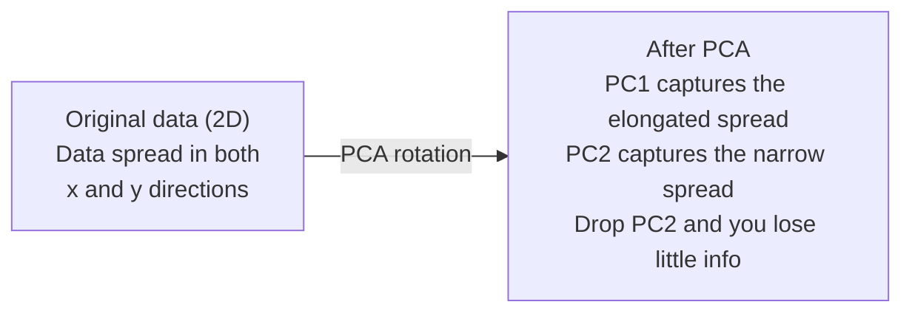

# 降维

> 高维数据有结构。你要从正确的角度观察它，才能找到这种结构。

**类型：** Build
**语言：** Python
**先修要求：** Phase 1, Lessons 01 (Linear Algebra 直觉), 02 (Vectors, Matrices & Operations), 03 (Eigenvalues & Eigenvectors), 06 (Probability & Distributions)
**时间：** ~90 minutes

## 学习目标

- 从零实现 PCA：对数据中心化、计算 covariance matrix、做特征分解，并进行投影
- 使用 explained variance ratio 和 elbow method 选择 principal components 的数量
- 比较 PCA、t-SNE 和 UMAP 在 2D 中可视化 MNIST 数字的效果，并解释它们的权衡
- 使用带 RBF kernel 的 kernel PCA 分离 standard PCA 无法处理的非线性数据结构

## 问题

你有一个每个样本包含 784 个 features 的 dataset。它可能是手写数字的像素值。也可能是基因表达水平。也可能是用户行为信号。你无法可视化 784 维。你无法把它们画出来。你甚至无法真正思考它们。

但这 784 个 features 中的大多数都是冗余的。真正的信息存在于一个小得多的曲面上。一个手写的 “7” 不需要 784 个相互独立的数字来描述。它只需要少数几个：笔画的角度、横杠的长度、倾斜程度。其余都是噪声。

降维会找到那个更小的曲面。它把你的 784 维数据压缩到 2、10 或 50 维，同时保留重要的结构。

## 概念

### 维度灾难

高维空间很反直觉。随着维度增长，有三件事会失效。

**距离变得没有意义。** 在高维中，任意两个随机点之间的距离会收敛到同一个值。如果每个点到其他所有点的距离都差不多，那么 nearest-neighbor search 就会停止有效。

```
Dimension    Avg distance ratio (max/min between random points)
2            ~5.0
10           ~1.8
100          ~1.2
1000         ~1.02
```

**体积集中在角落。** d 维单位 hypercube 有 2^d 个角。在 100 维中，几乎所有体积都在角落里，远离中心。数据点会扩散到边缘，而你的 models 在内部区域得不到足够数据。

**你需要指数级更多数据。** 为了在空间中维持相同的样本密度，从 2D 到 20D 意味着你需要 10^18 倍的数据。你永远没有足够的数据。降低维度会把数据密度带回到可处理的水平。

### PCA：找到重要方向

Principal Component Analysis (PCA) 会找到数据变化最大的轴。它旋转你的坐标系，使第一条轴捕获最多 variance，第二条轴捕获次多 variance，依此类推。

算法：

```
1. Center the data        (subtract the mean from each feature)
2. Compute covariance     (how features move together)
3. Eigendecomposition     (find the principal directions)
4. Sort by eigenvalue     (biggest variance first)
5. Project               (keep top k eigenvectors, drop the rest)
```

为什么要做特征分解？covariance matrix 是对称且 positive semi-definite 的。它的 eigenvectors 是 feature space 中相互正交的方向。eigenvalues 告诉你每个方向捕获了多少 variance。具有最大 eigenvalue 的 eigenvector 指向最大 variance 的方向。



- **PCA 之前：** 数据云沿对角线分布在 x 和 y 两个轴上
- **PCA 之后：** 坐标系被旋转，使 PC1 对齐最大 variance 的方向（拉长的分布），PC2 对齐最小 variance 的方向（狭窄的分布）
- **降维：** 丢弃 PC2 会把数据投影到 PC1 上，只损失很少信息

### Explained variance ratio

每个 principal component 都会捕获总 variance 的一部分。explained variance ratio 告诉你捕获了多少。

```
Component    Eigenvalue    Explained ratio    Cumulative
PC1          4.73          0.473              0.473
PC2          2.51          0.251              0.724
PC3          1.12          0.112              0.836
PC4          0.89          0.089              0.925
...
```

当 cumulative explained variance 达到 0.95 时，你就知道这么多个 components 已经捕获了 95% 的信息。之后的内容大多是噪声。

### 选择 components 数量

三种策略：

1. **Threshold。** 保留足够多的 components 来解释 90-95% 的 variance。
2. **Elbow method。** 绘制每个 component 的 explained variance。寻找明显的下降拐点。
3. **Downstream performance。** 将 PCA 用作 preprocessing。遍历 k 并衡量 model 的 accuracy。最佳 k 是 accuracy 开始进入平台期的位置。

### t-SNE：保留邻域

t-Distributed Stochastic Neighbor Embedding (t-SNE) 是为可视化而设计的。它把高维数据映射到 2D（或 3D），同时保留哪些点彼此接近。

直觉是：在原始空间中，根据点对之间的距离计算一个概率分布。近的点获得高概率。远的点获得低概率。然后找到一个 2D 排布，使同样的概率分布尽可能成立。784 维中的邻居点在 2D 中仍然保持为邻居。

t-SNE 的关键属性：
- 非线性。它可以展开 PCA 无法处理的复杂 manifolds。
- 随机性。不同运行会产生不同布局。
- Perplexity 参数控制要考虑多少个邻居（典型范围：5-50）。
- 输出中 cluster 之间的距离没有意义。只有 cluster 本身有意义。
- 在大型 datasets 上速度慢。默认是 O(n^2)。

### UMAP：更快、更好的全局结构

Uniform Manifold Approximation and Projection (UMAP) 的工作方式类似 t-SNE，但有两个优势：
- 更快。它使用 approximate nearest-neighbor graphs，而不是计算所有成对距离。
- 更好的全局结构。输出中 clusters 的相对位置通常比 t-SNE 更有意义。

UMAP 在高维空间中构建一个加权 graph（“fuzzy topological representation”），然后寻找一个低维布局，尽可能保留这个 graph。

关键参数：
- `n_neighbors`：多少个邻居定义局部结构（类似 perplexity）。更高的值会保留更多全局结构。
- `min_dist`：输出中点彼此聚集得有多紧。更低的值会创建更密集的 clusters。

### 什么时候使用哪一个

| Method | Use case | Preserves | Speed |
|--------|----------|-----------|-------|
| PCA | 训练前的 preprocessing | Global variance | 快（精确），适用于数百万样本 |
| PCA | 快速探索性可视化 | Linear structure | 快 |
| t-SNE | 可发表质量的 2D 图 | Local neighborhoods | 慢（理想情况下 < 10k 样本） |
| UMAP | 大规模 2D 可视化 | Local + 部分 global structure | 中等（可处理数百万样本） |
| PCA | models 的 feature reduction | 按 variance 排序的 features | 快 |
| t-SNE / UMAP | 理解 cluster structure | Cluster separation | 中等到慢 |

经验法则：使用 PCA 做 preprocessing 和数据压缩。当你需要在 2D 中可视化结构时，使用 t-SNE 或 UMAP。

### Kernel PCA

Standard PCA 寻找 linear subspaces。它旋转你的坐标系并丢弃某些轴。但如果数据位于 nonlinear manifold 上怎么办？2D 中的圆无法被任何直线分开。Standard PCA 帮不上忙。

Kernel PCA 会在由 kernel function 诱导的高维 feature space 中应用 PCA，而不显式计算该空间中的坐标。这就是 kernel trick，也是 SVMs 背后的同一个思想。

算法：
1. 计算 kernel matrix K，其中 K_ij = k(x_i, x_j)
2. 在 feature space 中对 kernel matrix 做中心化
3. 对中心化后的 kernel matrix 做特征分解
4. 顶部 eigenvectors（按 1/sqrt(eigenvalue) 缩放）就是投影

常见 kernel functions：

| Kernel | Formula | Good for |
|--------|---------|----------|
| RBF (Gaussian) | exp(-gamma * \|\|x - y\|\|^2) | 大多数非线性数据、平滑 manifolds |
| Polynomial | (x . y + c)^d | Polynomial relationships |
| Sigmoid | tanh(alpha * x . y + c) | 类似 Neural Network 的映射 |

何时使用 kernel PCA 与 standard PCA：

| Criterion | Standard PCA | Kernel PCA |
|-----------|-------------|------------|
| Data structure | Linear subspace | Nonlinear manifold |
| Speed | O(min(n^2 d, d^2 n)) | O(n^2 d + n^3) |
| Interpretability | Components 是 features 的线性组合 | Components 缺少直接的 feature 解释 |
| Scalability | 适用于数百万样本 | Kernel matrix 是 n x n，受 memory 限制 |
| Reconstruction | 直接 inverse transform | 需要 pre-image approximation |

经典例子：2D 中的同心圆。两圈点，一圈在内，一圈在外。Standard PCA 会把两者投影到同一条线上，对 classification 毫无帮助。带 RBF kernel 的 kernel PCA 会把内圈和外圈映射到不同区域，使它们线性可分。

### Reconstruction Error

你的降维效果有多好？你把 784 维压缩到了 50 维。你丢失了什么？

衡量 reconstruction error：
1. 将数据投影到 k 维：X_reduced = X @ W_k
2. 重建：X_hat = X_reduced @ W_k^T
3. 计算 MSE：mean((X - X_hat)^2)

对于 PCA，reconstruction error 与 explained variance 有清晰关系：

```
Reconstruction error = sum of eigenvalues NOT included
Total variance = sum of ALL eigenvalues
Fraction lost = (sum of dropped eigenvalues) / (sum of all eigenvalues)
```

每个 component 的 explained variance ratio 是：

```
explained_ratio_k = eigenvalue_k / sum(all eigenvalues)
```

绘制 cumulative explained variance 与 components 数量的关系，会得到 “elbow” 曲线。合适的 components 数量位于：
- 曲线变平的位置（收益递减）
- Cumulative variance 跨过你的 threshold 的位置（通常是 0.90 或 0.95）
- Downstream task performance 进入平台期的位置

Reconstruction error 不只适用于选择 k。你还可以把它用于 anomaly detection：reconstruction error 高的样本是 outliers，说明它们不符合学到的 subspace。这是生产系统中基于 PCA 的 anomaly detection 的基础。

## 构建它

### 步骤 1：从零实现 PCA

```python
import numpy as np

class PCA:
    def __init__(self, n_components):
        self.n_components = n_components
        self.components = None
        self.mean = None
        self.eigenvalues = None
        self.explained_variance_ratio_ = None

    def fit(self, X):
        self.mean = np.mean(X, axis=0)
        X_centered = X - self.mean

        cov_matrix = np.cov(X_centered, rowvar=False)

        eigenvalues, eigenvectors = np.linalg.eigh(cov_matrix)

        sorted_idx = np.argsort(eigenvalues)[::-1]
        eigenvalues = eigenvalues[sorted_idx]
        eigenvectors = eigenvectors[:, sorted_idx]

        self.components = eigenvectors[:, :self.n_components].T
        self.eigenvalues = eigenvalues[:self.n_components]
        total_var = np.sum(eigenvalues)
        self.explained_variance_ratio_ = self.eigenvalues / total_var

        return self

    def transform(self, X):
        X_centered = X - self.mean
        return X_centered @ self.components.T

    def fit_transform(self, X):
        self.fit(X)
        return self.transform(X)
```

### 步骤 2：在合成数据上测试

```python
np.random.seed(42)
n_samples = 500

t = np.random.uniform(0, 2 * np.pi, n_samples)
x1 = 3 * np.cos(t) + np.random.normal(0, 0.2, n_samples)
x2 = 3 * np.sin(t) + np.random.normal(0, 0.2, n_samples)
x3 = 0.5 * x1 + 0.3 * x2 + np.random.normal(0, 0.1, n_samples)

X_synthetic = np.column_stack([x1, x2, x3])

pca = PCA(n_components=2)
X_reduced = pca.fit_transform(X_synthetic)

print(f"Original shape: {X_synthetic.shape}")
print(f"Reduced shape:  {X_reduced.shape}")
print(f"Explained variance ratios: {pca.explained_variance_ratio_}")
print(f"Total variance captured: {sum(pca.explained_variance_ratio_):.4f}")
```

### 步骤 3：2D 中的 MNIST 数字

```python
from sklearn.datasets import fetch_openml

mnist = fetch_openml("mnist_784", version=1, as_frame=False, parser="auto")
X_mnist = mnist.data[:5000].astype(float)
y_mnist = mnist.target[:5000].astype(int)

pca_mnist = PCA(n_components=50)
X_pca50 = pca_mnist.fit_transform(X_mnist)
print(f"50 components capture {sum(pca_mnist.explained_variance_ratio_):.2%} of variance")

pca_2d = PCA(n_components=2)
X_pca2d = pca_2d.fit_transform(X_mnist)
print(f"2 components capture {sum(pca_2d.explained_variance_ratio_):.2%} of variance")
```

### 步骤 4：与 sklearn 比较

```python
from sklearn.decomposition import PCA as SklearnPCA
from sklearn.manifold import TSNE

sklearn_pca = SklearnPCA(n_components=2)
X_sklearn_pca = sklearn_pca.fit_transform(X_mnist)

print(f"\nOur PCA explained variance:     {pca_2d.explained_variance_ratio_}")
print(f"Sklearn PCA explained variance: {sklearn_pca.explained_variance_ratio_}")

diff = np.abs(np.abs(X_pca2d) - np.abs(X_sklearn_pca))
print(f"Max absolute difference: {diff.max():.10f}")

tsne = TSNE(n_components=2, perplexity=30, random_state=42)
X_tsne = tsne.fit_transform(X_mnist)
print(f"\nt-SNE output shape: {X_tsne.shape}")
```

### 步骤 5：UMAP 比较

```python
try:
    from umap import UMAP

    reducer = UMAP(n_components=2, n_neighbors=15, min_dist=0.1, random_state=42)
    X_umap = reducer.fit_transform(X_mnist)
    print(f"UMAP output shape: {X_umap.shape}")
except ImportError:
    print("Install umap-learn: pip install umap-learn")
```

## 使用它

将 PCA 用作 classifier 之前的 preprocessing：

```python
from sklearn.decomposition import PCA as SklearnPCA
from sklearn.linear_model import LogisticRegression
from sklearn.model_selection import train_test_split
from sklearn.metrics import accuracy_score

X_train, X_test, y_train, y_test = train_test_split(
    X_mnist, y_mnist, test_size=0.2, random_state=42
)

results = {}
for k in [10, 30, 50, 100, 200]:
    pca_k = SklearnPCA(n_components=k)
    X_tr = pca_k.fit_transform(X_train)
    X_te = pca_k.transform(X_test)

    clf = LogisticRegression(max_iter=1000, random_state=42)
    clf.fit(X_tr, y_train)
    acc = accuracy_score(y_test, clf.predict(X_te))
    var_captured = sum(pca_k.explained_variance_ratio_)
    results[k] = (acc, var_captured)
    print(f"k={k:>3d}  accuracy={acc:.4f}  variance={var_captured:.4f}")
```

Performance 在远低于 784 维时就会进入平台期。那个平台期就是你的运行点。

## 交付它

本课会产出：
- `outputs/skill-dimensionality-reduction.md` - 一个用于为给定任务选择合适降维技术的 skill

## 练习

1. 修改 PCA class 以支持 `inverse_transform`。分别使用 10、50 和 200 个 components 重建 MNIST 数字。打印每种情况下的 reconstruction error（与原始数据的 mean squared difference）。

2. 在同一个 MNIST 子集上运行 t-SNE，perplexity 值分别设置为 5、30 和 100。描述输出如何变化。为什么 perplexity 会影响 cluster tightness？

3. 取一个有 50 个 features、但只有 5 个 informative features 的 dataset（用 `sklearn.datasets.make_classification` 生成）。应用 PCA，并检查 explained variance curve 是否正确识别出数据实际上是 5 维的。

## 关键术语

| Term | 人们通常怎么说 | 它实际意味着什么 |
|------|----------------|----------------------|
| Curse of dimensionality | “features 太多” | 随着维度增长，距离、体积和数据密度都会以反直觉的方式表现。Models 需要指数级更多数据来补偿。 |
| PCA | “降低维度” | 旋转你的坐标系，使轴与最大 variance 的方向对齐，然后丢弃低 variance 的轴。 |
| Principal component | “一个重要方向” | covariance matrix 的 eigenvector。也就是 feature space 中数据变化最大的方向。 |
| Explained variance ratio | “这个 component 有多少信息” | 一个 principal component 捕获的总 variance 比例。对前 k 个 ratios 求和，就能看到 k 个 components 保留了多少信息。 |
| Covariance matrix | “features 如何相关” | 一个对称 Matrix，其中条目 (i,j) 衡量 feature i 和 feature j 如何共同变化。对角线条目是各自的 variances。 |
| t-SNE | “那个 cluster 图” | 一种非线性方法，通过保留成对邻域概率，把高维数据映射到 2D。适合可视化，不适合 preprocessing。 |
| UMAP | “更快的 t-SNE” | 一种基于 topological data analysis 的非线性方法。既保留 local structure，也保留部分 global structure。比 t-SNE 更容易扩展。 |
| Perplexity | “一个 t-SNE 旋钮” | 控制每个点考虑的有效邻居数量。低 perplexity 关注非常局部的结构。高 perplexity 捕获更宽泛的模式。 |
| Manifold | “数据所在的曲面” | Embedding在更高维空间中的低维曲面。一张在 3D 中被揉皱的纸是一个 2D manifold。 |

## 延伸阅读

- [Principal Component Analysis 教程](https://arxiv.org/abs/1404.1100) (Shlens) - 从基础出发清晰推导 PCA
- [如何有效使用 t-SNE](https://distill.pub/2016/misread-tsne/) (Wattenberg et al.) - 关于 t-SNE 陷阱和参数选择的交互式指南
- [UMAP documentation](https://umap-learn.readthedocs.io/) - 来自 UMAP 作者的理论与实践指南
