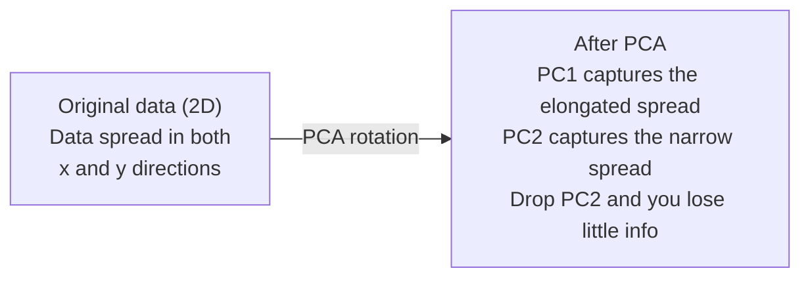

# Dimensionality Reduction

> 高维数据有结构。你要从正确的角度观察它。

**Type:** Build
**Language:** Python
**Prerequisites:** Phase 1, Lessons 01（Linear Algebra Intuition）、02（Vectors, Matrices & Operations）、03（Eigenvalues & Eigenvectors）、06（Probability & Distributions）
**Time:** ~90 分钟

## Learning Objectives

- 从零实现 PCA：center data、计算 covariance matrix、eigendecompose，并进行 project
- 使用 explained variance ratio 和 elbow method 选择 principal components 的数量
- 比较 PCA、t-SNE 和 UMAP 在 2D 中可视化 MNIST digits 的效果，并解释它们的权衡
- 使用带 RBF kernel 的 kernel PCA 分离标准 PCA 无法处理的 nonlinear data structures

## The Problem

你有一个每个样本包含 784 个 features 的 dataset。也许它是手写数字的 pixel values。也许它是 gene expression levels。也许它是 user behavior signals。你无法可视化 784 个维度。你无法绘制它们。你甚至无法思考它们。

但这 784 个 features 中大多数是冗余的。真正的信息存在于一个小得多的表面上。一个手写的 "7" 不需要 784 个相互独立的数字来描述。它只需要少数几个：笔画角度、横线长度、倾斜程度。其余都是噪声。

Dimensionality reduction 会找到那个更小的表面。它把你的 784-dimensional data 压缩到 2、10 或 50 个维度，同时保留重要的结构。

## The Concept

### The curse of dimensionality

高维空间不符合直觉。随着维度增长，有三件事会失效。

**距离变得没有意义。** 在高维中，任意两个随机点之间的距离会收敛到同一个值。如果每个点到其他每个点的距离都差不多，nearest-neighbor search 就会失效。

```
Dimension    Avg distance ratio (max/min between random points)
2            ~5.0
10           ~1.8
100          ~1.2
1000         ~1.02
```

**体积集中在角落。** d 维 unit hypercube 有 2^d 个角。在 100 维中，几乎所有体积都在角落里，远离中心。Data points 会扩散到边缘，而你的 models 在内部区域会缺少数据。

**你需要指数级更多的数据。** 为了在一个空间中保持相同的样本密度，从 2D 到 20D 意味着你需要 10^18 倍的数据。你永远都不会有足够的数据。降低维度会把数据密度带回可处理的范围。

### PCA: find the directions that matter

Principal Component Analysis (PCA) 会找到数据变化最大的轴。它旋转你的坐标系，使第一条轴捕获最多 variance，第二条轴捕获次多 variance，依此类推。

算法：

```
1. Center the data        (subtract the mean from each feature)
2. Compute covariance     (how features move together)
3. Eigendecomposition     (find the principal directions)
4. Sort by eigenvalue     (biggest variance first)
5. Project               (keep top k eigenvectors, drop the rest)
```

为什么使用 eigendecomposition？Covariance matrix 是 symmetric 且 positive semi-definite 的。它的 eigenvectors 是 feature space 中的 orthogonal directions。Eigenvalues 告诉你每个方向捕获了多少 variance。具有最大 eigenvalue 的 eigenvector 指向 maximum variance 的方向。



- **Before PCA:** Data cloud 沿 x 和 y 两个轴呈对角线扩散
- **After PCA:** 坐标系被旋转，使 PC1 对齐 maximum variance 的方向（elongated spread），PC2 对齐 minimum variance 的方向（narrow spread）
- **Dimensionality reduction:** 丢弃 PC2 会把数据投影到 PC1 上，只损失很少的信息

### Explained variance ratio

每个 principal component 都捕获 total variance 的一部分。Explained variance ratio 告诉你具体是多少。

```
Component    Eigenvalue    Explained ratio    Cumulative
PC1          4.73          0.473              0.473
PC2          2.51          0.251              0.724
PC3          1.12          0.112              0.836
PC4          0.89          0.089              0.925
...
```

当 cumulative explained variance 达到 0.95 时，你就知道这些 components 捕获了 95% 的信息。之后的内容大多是噪声。

### Choosing the number of components

三种策略：

1. **Threshold.** 保留足够多的 components，以解释 90-95% 的 variance。
2. **Elbow method.** 绘制每个 component 的 explained variance。寻找明显的快速下降点。
3. **Downstream performance.** 将 PCA 用作 preprocessing。扫描 k，并测量 model 的 accuracy。最佳 k 是 accuracy 进入平台期的位置。

### t-SNE: preserve neighborhoods

t-Distributed Stochastic Neighbor Embedding (t-SNE) 是为可视化设计的。它把高维数据映射到 2D（或 3D），同时保留哪些点彼此接近。

直觉是：在原始空间中，根据点对之间的距离计算一个 probability distribution。近点得到高 probability。远点得到低 probability。然后找到一个 2D 排布，使同样的 probability distribution 成立。在 784 维中是邻居的点，在 2D 中仍保持为邻居。

t-SNE 的关键性质：
- Non-linear。它可以展开 PCA 无法处理的 complex manifolds。
- Stochastic。不同运行会产生不同 layout。
- Perplexity 参数控制考虑多少邻居（典型范围：5-50）。
- 输出中 clusters 之间的距离没有意义。只有 clusters 本身有意义。
- 在大型 datasets 上很慢。默认是 O(n^2)。

### UMAP: faster, better global structure

Uniform Manifold Approximation and Projection (UMAP) 的工作方式与 t-SNE 类似，但有两个优势：
- 更快。它使用 approximate nearest-neighbor graphs，而不是计算所有 pairwise distances。
- 更好的 global structure。输出中 clusters 的相对位置往往比 t-SNE 更有意义。

UMAP 在高维空间中构建一个 weighted graph（"fuzzy topological representation"），然后寻找一个低维 layout，尽可能保留这个 graph。

关键参数：
- `n_neighbors`：多少邻居定义 local structure（类似 perplexity）。更高的值会保留更多 global structure。
- `min_dist`：输出中点聚集得多紧。更低的值会产生更密集的 clusters。

### When to use which

| Method | Use case | Preserves | Speed |
|--------|----------|-----------|-------|
| PCA | Preprocessing before training | Global variance | Fast (exact), works on millions of samples |
| PCA | Quick exploratory visualization | Linear structure | Fast |
| t-SNE | Publication-quality 2D plots | Local neighborhoods | Slow (< 10k samples ideal) |
| UMAP | 2D visualization at scale | Local + some global structure | Medium (handles millions) |
| PCA | Feature reduction for models | Variance-ranked features | Fast |
| t-SNE / UMAP | Understanding cluster structure | Cluster separation | Medium to slow |

经验法则：用 PCA 做 preprocessing 和 data compression。当你需要在 2D 中可视化结构时，使用 t-SNE 或 UMAP。

### Kernel PCA

标准 PCA 会找到 linear subspaces。它旋转你的坐标系并丢弃轴。但如果数据位于 nonlinear manifold 上怎么办？2D 中的一个圆无法被任何直线分离。标准 PCA 不会有帮助。

Kernel PCA 在由 kernel function 诱导出的高维 feature space 中应用 PCA，而不显式计算该空间中的坐标。这就是 kernel trick，也就是 SVMs 背后的同一个思想。

算法：
1. 计算 kernel matrix K，其中 K_ij = k(x_i, x_j)
2. 在 feature space 中 center kernel matrix
3. 对 centered kernel matrix 做 eigendecompose
4. 顶部 eigenvectors（按 1/sqrt(eigenvalue) 缩放）就是 projections

常见 kernel functions：

| Kernel | Formula | Good for |
|--------|---------|----------|
| RBF (Gaussian) | exp(-gamma * \|\|x - y\|\|^2) | 大多数 nonlinear data、smooth manifolds |
| Polynomial | (x . y + c)^d | Polynomial relationships |
| Sigmoid | tanh(alpha * x . y + c) | Neural network-like mappings |

何时使用 kernel PCA 而不是 standard PCA：

| Criterion | Standard PCA | Kernel PCA |
|-----------|-------------|------------|
| Data structure | Linear subspace | Nonlinear manifold |
| Speed | O(min(n^2 d, d^2 n)) | O(n^2 d + n^3) |
| Interpretability | Components are linear combinations of features | Components lack direct feature interpretation |
| Scalability | Works on millions of samples | Kernel matrix is n x n, memory-limited |
| Reconstruction | Direct inverse transform | Requires pre-image approximation |

经典例子：2D 中的 concentric circles。两圈点，一圈在另一圈内部。标准 PCA 会把两者投影到同一条线上，这对 classification 没用。带 RBF kernel 的 Kernel PCA 会把内圈和外圈映射到不同区域，使它们 linearly separable。

### Reconstruction Error

你的 dimensionality reduction 有多好？你把 784 维压缩到了 50 维。你丢失了什么？

测量 reconstruction error：
1. 将数据投影到 k 维：X_reduced = X @ W_k
2. 重建：X_hat = X_reduced @ W_k^T
3. 计算 MSE：mean((X - X_hat)^2)

对于 PCA，reconstruction error 与 explained variance 有清晰关系：

```
Reconstruction error = sum of eigenvalues NOT included
Total variance = sum of ALL eigenvalues
Fraction lost = (sum of dropped eigenvalues) / (sum of all eigenvalues)
```

每个 component 的 explained variance ratio 是：

```
explained_ratio_k = eigenvalue_k / sum(all eigenvalues)
```

把 cumulative explained variance 对 components 数量作图，会得到 "elbow" curve。合适的 components 数量位于：
- 曲线变平的位置（收益递减）
- Cumulative variance 跨过你的 threshold 的位置（通常是 0.90 或 0.95）
- Downstream task performance 进入平台期的位置

Reconstruction error 不只用于选择 k。你可以把它用于 anomaly detection：reconstruction error 高的样本是 outliers，它们不符合学习到的 subspace。这是 production systems 中基于 PCA 的 anomaly detection 的基础。


```figure
pca-axes
```

## Build It

### Step 1: PCA from scratch

```python
import numpy as np

class PCA:
    def __init__(self, n_components):
        self.n_components = n_components
        self.components = None
        self.mean = None
        self.eigenvalues = None
        self.explained_variance_ratio_ = None

    def fit(self, X):
        self.mean = np.mean(X, axis=0)
        X_centered = X - self.mean

        cov_matrix = np.cov(X_centered, rowvar=False)

        eigenvalues, eigenvectors = np.linalg.eigh(cov_matrix)

        sorted_idx = np.argsort(eigenvalues)[::-1]
        eigenvalues = eigenvalues[sorted_idx]
        eigenvectors = eigenvectors[:, sorted_idx]

        self.components = eigenvectors[:, :self.n_components].T
        self.eigenvalues = eigenvalues[:self.n_components]
        total_var = np.sum(eigenvalues)
        self.explained_variance_ratio_ = self.eigenvalues / total_var

        return self

    def transform(self, X):
        X_centered = X - self.mean
        return X_centered @ self.components.T

    def fit_transform(self, X):
        self.fit(X)
        return self.transform(X)
```

### Step 2: Test on synthetic data

```python
np.random.seed(42)
n_samples = 500

t = np.random.uniform(0, 2 * np.pi, n_samples)
x1 = 3 * np.cos(t) + np.random.normal(0, 0.2, n_samples)
x2 = 3 * np.sin(t) + np.random.normal(0, 0.2, n_samples)
x3 = 0.5 * x1 + 0.3 * x2 + np.random.normal(0, 0.1, n_samples)

X_synthetic = np.column_stack([x1, x2, x3])

pca = PCA(n_components=2)
X_reduced = pca.fit_transform(X_synthetic)

print(f"Original shape: {X_synthetic.shape}")
print(f"Reduced shape:  {X_reduced.shape}")
print(f"Explained variance ratios: {pca.explained_variance_ratio_}")
print(f"Total variance captured: {sum(pca.explained_variance_ratio_):.4f}")
```

### Step 3: MNIST digits in 2D

```python
from sklearn.datasets import fetch_openml

mnist = fetch_openml("mnist_784", version=1, as_frame=False, parser="auto")
X_mnist = mnist.data[:5000].astype(float)
y_mnist = mnist.target[:5000].astype(int)

pca_mnist = PCA(n_components=50)
X_pca50 = pca_mnist.fit_transform(X_mnist)
print(f"50 components capture {sum(pca_mnist.explained_variance_ratio_):.2%} of variance")

pca_2d = PCA(n_components=2)
X_pca2d = pca_2d.fit_transform(X_mnist)
print(f"2 components capture {sum(pca_2d.explained_variance_ratio_):.2%} of variance")
```

### Step 4: Compare with sklearn

```python
from sklearn.decomposition import PCA as SklearnPCA
from sklearn.manifold import TSNE

sklearn_pca = SklearnPCA(n_components=2)
X_sklearn_pca = sklearn_pca.fit_transform(X_mnist)

print(f"\nOur PCA explained variance:     {pca_2d.explained_variance_ratio_}")
print(f"Sklearn PCA explained variance: {sklearn_pca.explained_variance_ratio_}")

diff = np.abs(np.abs(X_pca2d) - np.abs(X_sklearn_pca))
print(f"Max absolute difference: {diff.max():.10f}")

tsne = TSNE(n_components=2, perplexity=30, random_state=42)
X_tsne = tsne.fit_transform(X_mnist)
print(f"\nt-SNE output shape: {X_tsne.shape}")
```

### Step 5: UMAP comparison

```python
try:
    from umap import UMAP

    reducer = UMAP(n_components=2, n_neighbors=15, min_dist=0.1, random_state=42)
    X_umap = reducer.fit_transform(X_mnist)
    print(f"UMAP output shape: {X_umap.shape}")
except ImportError:
    print("Install umap-learn: pip install umap-learn")
```

## Use It

把 PCA 用作 classifier 之前的 preprocessing：

```python
from sklearn.decomposition import PCA as SklearnPCA
from sklearn.linear_model import LogisticRegression
from sklearn.model_selection import train_test_split
from sklearn.metrics import accuracy_score

X_train, X_test, y_train, y_test = train_test_split(
    X_mnist, y_mnist, test_size=0.2, random_state=42
)

results = {}
for k in [10, 30, 50, 100, 200]:
    pca_k = SklearnPCA(n_components=k)
    X_tr = pca_k.fit_transform(X_train)
    X_te = pca_k.transform(X_test)

    clf = LogisticRegression(max_iter=1000, random_state=42)
    clf.fit(X_tr, y_train)
    acc = accuracy_score(y_test, clf.predict(X_te))
    var_captured = sum(pca_k.explained_variance_ratio_)
    results[k] = (acc, var_captured)
    print(f"k={k:>3d}  accuracy={acc:.4f}  variance={var_captured:.4f}")
```

Performance 会在远小于 784 维时进入平台期。这个平台期就是你的 operating point。

## Ship It

本课会产出：
- `outputs/skill-dimensionality-reduction.md` - 一个用于为给定任务选择合适 dimensionality reduction 技术的 skill

## Exercises

1. 修改 PCA class 以支持 `inverse_transform`。用 10、50 和 200 个 components 重建 MNIST digits。分别打印 reconstruction error（相对于原始数据的 mean squared difference）。

2. 在同一个 MNIST subset 上运行 t-SNE，perplexity 值分别为 5、30 和 100。描述输出如何变化。为什么 perplexity 会影响 cluster tightness？

3. 取一个有 50 个 features、但只有 5 个 informative features 的 dataset（用 `sklearn.datasets.make_classification` 生成）。应用 PCA，并检查 explained variance curve 是否正确识别出数据实际上是 5-dimensional。

## Key Terms

| Term | What people say | What it actually means |
|------|----------------|----------------------|
| Curse of dimensionality | "Too many features" | 随着维度增长，距离、体积和数据密度都会表现得反直觉。Models 需要指数级更多的数据来补偿。 |
| PCA | "Reduce dimensions" | 旋转你的坐标系，使各轴与 maximum variance 的方向对齐，然后丢弃 low-variance axes。 |
| Principal component | "An important direction" | Covariance matrix 的一个 eigenvector。Feature space 中数据变化最大的方向。 |
| Explained variance ratio | "How much info this component has" | 一个 principal component 捕获的 total variance 比例。对前 k 个 ratios 求和，就能看到 k 个 components 保留了多少信息。 |
| Covariance matrix | "How features correlate" | 一个 symmetric matrix，其中 entry (i,j) 衡量 feature i 和 feature j 如何共同变化。Diagonal entries 是各自的 variances。 |
| t-SNE | "That cluster plot" | 一种 nonlinear 方法，通过保留 pairwise neighborhood probabilities 将高维数据映射到 2D。适合可视化，不适合 preprocessing。 |
| UMAP | "Faster t-SNE" | 一种基于 topological data analysis 的 nonlinear 方法。既保留 local structure，也保留部分 global structure。比 t-SNE 更容易扩展。 |
| Perplexity | "A t-SNE knob" | 控制每个点考虑的有效邻居数量。低 perplexity 聚焦非常 local 的结构。高 perplexity 捕获更宽泛的模式。 |
| Manifold | "The surface the data lives on" | Embedding在更高维空间中的低维表面。一张在 3D 中揉皱的纸是一个 2D manifold。 |

## Further Reading

- [A Tutorial on Principal Component Analysis](https://arxiv.org/abs/1404.1100) (Shlens) - 从零开始清晰推导 PCA
- [How to Use t-SNE Effectively](https://distill.pub/2016/misread-tsne/) (Wattenberg et al.) - 关于 t-SNE 陷阱和参数选择的交互式指南
- [UMAP documentation](https://umap-learn.readthedocs.io/) - 来自 UMAP 作者的理论和实践指导
