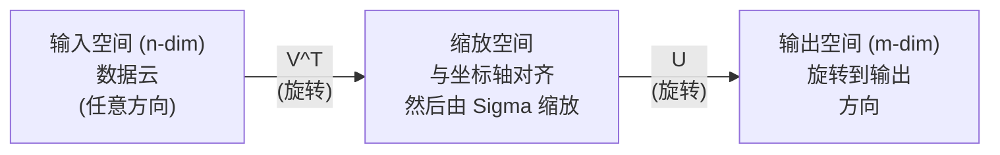
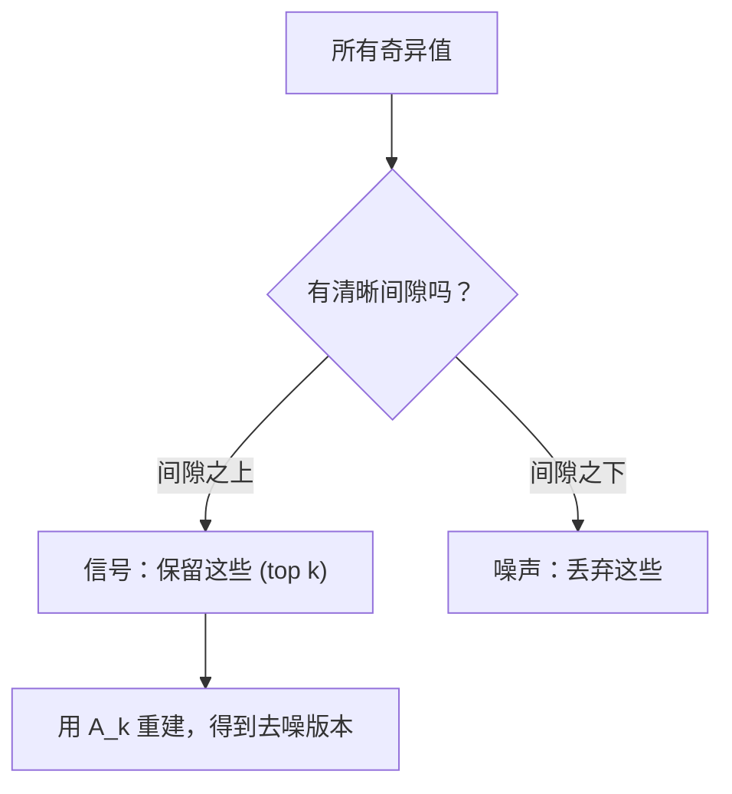

# Singular Value Decomposition

> SVD 是线性代数中的瑞士军刀。每个 Matrix 都有 SVD。每个数据科学家都需要 SVD。

**Type:** Build
**Languages:** Python, Julia
**Prerequisites:** Phase 1，Lessons 01 (Linear Algebra Intuition)、02 (Vectors & Matrices Operations)、03 (Matrix Transformations)
**Time:** ~120 minutes

## 学习目标
- 通过 power iteration 实现 SVD，并解释 U、Sigma 和 V^T 的几何含义
- 应用 truncated SVD 进行图像压缩，并衡量压缩率与重建误差之间的关系
- 通过 SVD 计算 Moore-Penrose pseudoinverse，以求解超定 least-squares 系统
- 将 SVD 与 PCA、推荐系统（latent factors）以及 NLP 中的 Latent Semantic Analysis 联系起来

## 问题
你有一个 1000x2000 的 Matrix。它可能是用户-电影评分。可能是文档-词项频率表。也可能是一张图像的像素值。你需要压缩它、去噪、发现其中的隐藏结构，或者用它求解一个 least-squares 系统。Eigendecomposition 只适用于方阵。即使如此，它还要求 Matrix 拥有一整组线性无关的 eigenvectors。

SVD 适用于任何 Matrix。任意形状。任意 rank。没有条件限制。它把 Matrix 分解为三个因子，揭示该 Matrix 对空间所做变换的几何结构。它是整个线性代数中最通用、最有用的 factorization。

## 概念
### SVD 在几何上做什么

每个 Matrix，无论形状如何，都会按顺序执行三个操作：旋转、缩放、旋转。SVD 将这种分解显式表示出来。

```
A = U * Sigma * V^T

      m x n     m x m    m x n    n x n
     (任意)    (旋转)   (缩放)   (旋转)
```

给定任意 Matrix A，SVD 将其分解为：
- V^T 旋转输入空间（n 维）中的 Vector
- Sigma 沿每个轴进行缩放（拉伸或压缩）
- U 将结果旋转到输出空间（m 维）



可以这样理解。你把一个 Matrix 交给 SVD。它会告诉你：“这个 Matrix 会先用 V^T 旋转输入球体，然后用 Sigma 将其拉伸成椭球，最后用 U 旋转这个椭球。”奇异值就是这个椭球各个轴的长度。

### The full decomposition

对于形状为 m x n 的 Matrix A：

```
A = U * Sigma * V^T

其中：
  U     是 m x m，正交 (U^T U = I)
  Sigma 是 m x n，对角（奇异值位于对角线上）
  V     是 n x n，正交 (V^T V = I)

奇异值 sigma_1 >= sigma_2 >= ... >= sigma_r > 0
其中 r = rank(A)
```

U 的列称为左奇异Vector。V 的列称为右奇异Vector。Sigma 的对角元素称为奇异值。它们总是非负的，并且按照惯例以降序排列。

### Left singular vectors、singular values、right singular vectors

SVD 的每个组成部分都有不同的几何含义。

**Right singular vectors（V 的列）：** 它们为输入空间（R^n）构成一组 orthonormal basis。它们是输入空间中的方向，Matrix 会把这些方向映射到输出空间中的正交方向。可以把它们看作 domain 的自然坐标系。

**Singular values（Sigma 的对角线）：** 它们是缩放因子。第 i 个奇异值告诉你，Matrix 沿第 i 个右奇异Vector 方向会把 Vector 拉伸多少。奇异值为零意味着 Matrix 会把该方向完全压扁。

**Left singular vectors（U 的列）：** 它们为输出空间（R^m）构成一组 orthonormal basis。第 i 个左奇异Vector 是第 i 个右奇异Vector 经过缩放后在输出空间中落到的方向。

它们之间的关系：

```
A * v_i = sigma_i * u_i

Matrix A 接收第 i 个右奇异Vector v_i，
用 sigma_i 对其缩放，并将其映射到第 i 个左奇异Vector u_i。
```

这给出了任意 Matrix 做什么的逐坐标图像。

### Outer product form

SVD 可以写成 rank-1 Matrix 的和：

```
A = sigma_1 * u_1 * v_1^T + sigma_2 * u_2 * v_2^T + ... + sigma_r * u_r * v_r^T

每一项 sigma_i * u_i * v_i^T 都是一个 rank-1 Matrix（一个 outer product）。
完整 Matrix 是 r 个这类 Matrix 的和，其中 r 是 rank。
```

这种形式是 low-rank approximation 的基础。每一项都添加一层结构。第一项捕获最重要的单一模式。第二项捕获次重要的模式。依此类推。截断这个求和可以在任意给定 rank 下得到最佳近似。

```
Rank-1 approx:    A_1 = sigma_1 * u_1 * v_1^T
                  (捕获主导模式)

Rank-2 approx:    A_2 = sigma_1 * u_1 * v_1^T + sigma_2 * u_2 * v_2^T
                  (捕获两个最重要的模式)

Rank-k approx:    A_k = top k 项之和
                  (根据 Eckart-Young theorem，这是最优的)
```

### Relationship to eigendecomposition

SVD 和 eigendecomposition 有很深的联系。A 的奇异值和奇异Vector 直接来自 A^T A 和 A A^T 的 eigenvalues 与 eigenvectors。

```
A^T A = V * Sigma^T * U^T * U * Sigma * V^T
      = V * Sigma^T * Sigma * V^T
      = V * D * V^T

其中 D = Sigma^T * Sigma 是一个对角 Matrix，其对角线上为 sigma_i^2。

因此：
- 右奇异Vector (V) 是 A^T A 的 eigenvectors
- 奇异值的平方 (sigma_i^2) 是 A^T A 的 eigenvalues

类似地：
A A^T = U * Sigma * V^T * V * Sigma^T * U^T
      = U * Sigma * Sigma^T * U^T

因此：
- 左奇异Vector (U) 是 A A^T 的 eigenvectors
- A A^T 的 eigenvalues 也都是 sigma_i^2
```

这个联系告诉你三件事：
1. 奇异值总是实数且非负（它们是 positive semi-definite Matrix 的 eigenvalues 的平方根）。
2. 你可以通过对 A^T A 做 eigendecomposition 来计算 SVD，但这会平方 condition number 并损失数值精度。专用 SVD 算法会避免这一点。
3. 当 A 是方阵且为 symmetric positive semi-definite 时，SVD 和 eigendecomposition 是同一件事。

### Truncated SVD：low-rank approximation

Eckart-Young-Mirsky theorem 表明，A 的最佳 rank-k 近似（在 Frobenius norm 和 spectral norm 下）可以通过只保留 top k 个奇异值及其对应 Vector 得到：

```
A_k = U_k * Sigma_k * V_k^T

其中：
  U_k     是 m x k  (U 的前 k 列)
  Sigma_k 是 k x k  (Sigma 的左上 k x k 块)
  V_k     是 n x k  (V 的前 k 列)

近似误差 = sigma_{k+1}  (在 spectral norm 下)
         = sqrt(sigma_{k+1}^2 + ... + sigma_r^2)  (在 Frobenius norm 下)
```

这不仅仅是“一个好的”近似。它是可证明的最佳 rank k 近似。没有其他 rank-k Matrix 能更接近 A。

| Component | Relative magnitude | Kept in rank-3 approx? |
|-----------|-------------------|------------------------|
| sigma_1 | 最大 | 是 |
| sigma_2 | 大 | 是 |
| sigma_3 | 中等偏大 | 是 |
| sigma_4 | 中等 | 否（误差） |
| sigma_5 | 中等偏小 | 否（误差） |
| sigma_6 | 小 | 否（误差） |
| sigma_7 | 很小 | 否（误差） |
| sigma_8 | 极小 | 否（误差） |

保留 top 3：A_3 捕获三个最大的奇异值。误差 = 剩余值（sigma_4 到 sigma_8）。

如果奇异值衰减很快，一个很小的 k 就能捕获 Matrix 的大部分信息。如果衰减很慢，这个 Matrix 就没有 low-rank 结构。

### 使用 SVD 进行图像压缩

灰度图像是像素强度组成的 Matrix。一张 800x600 图像有 480,000 个值。SVD 让你可以用少得多的值来近似它。

```
原始图像：800 x 600 = 480,000 个值

rank k 的 SVD：
  U_k:      800 x k 个值
  Sigma_k:  k 个值
  V_k:      600 x k 个值
  总计:     k * (800 + 600 + 1) = k * 1401 个值

  k=10:   14,010 个值   (原始的 2.9%)
  k=50:   70,050 个值  (原始的 14.6%)
  k=100: 140,100 个值  (原始的 29.2%)

  k 越小，压缩率越好，
  但视觉质量会下降。
```

关键洞察：自然图像的奇异值会快速衰减。前几个奇异值捕获大尺度结构（形状、渐变）。后面的奇异值捕获细节和噪声。截断到 rank 50 通常能产生一张看起来几乎与原图相同的图像，同时节省 85% 的存储。

### SVD 用于推荐系统

Netflix Prize 让这一点广为人知。你有一个用户-电影评分 Matrix，其中大多数条目是缺失的。

```
             Movie1  Movie2  Movie3  Movie4  Movie5
  User1      [  5      ?       3       ?       1  ]
  User2      [  ?      4       ?       2       ?  ]
  User3      [  3      ?       5       ?       ?  ]
  User4      [  ?      ?       ?       4       3  ]

  ? = 未知评分
```

核心想法：这个评分 Matrix 具有 low rank。用户的品味并不是完全独立的。有少数几个 latent factors（动作 vs. 剧情、旧 vs. 新、理性 vs. 感官）能够解释大多数偏好。

对（填充后的）评分 Matrix 做 SVD，会将其分解为：
- U：latent factor space 中的用户 profile
- Sigma：每个 latent factor 的重要性
- V^T：latent factor space 中的电影 profile

用户对某部电影的预测评分，就是该用户 profile 与电影 profile 的 dot product（由奇异值加权）。low-rank approximation 会填补缺失条目。

实践中，你会使用 Simon Funk 的 incremental SVD 或 ALS（alternating least squares）这类能直接处理缺失数据的变体。但核心想法相同：通过 SVD 做 latent factor decomposition。

### NLP 中的 SVD：Latent Semantic Analysis

Latent Semantic Analysis (LSA)，也称为 Latent Semantic Indexing (LSI)，会将 SVD 应用于 term-document Matrix。

```
             Doc1   Doc2   Doc3   Doc4
  "cat"      [  3      0      1      0  ]
  "dog"      [  2      0      0      1  ]
  "fish"     [  0      4      1      0  ]
  "pet"      [  1      1      1      1  ]
  "ocean"    [  0      3      0      0  ]

rank k=2 的 SVD 之后：

  每个文档变成 2D “概念空间”中的一个点。
  每个词项变成同一个 2D 空间中的一个点。
  主题相似的文档会聚在一起。
  含义相似的词项会聚在一起。

  "cat" 和 "dog" 最终会靠近彼此（陆地宠物）。
  "fish" 和 "ocean" 最终会靠近彼此（水相关概念）。
  如果 Doc1 和 Doc3 共享相似主题，它们会聚在一起。
```

LSA 是最早成功从原始文本中捕获语义相似性的方法之一。它之所以有效，是因为同义词往往出现在相似文档中，因此 SVD 会把它们归入相同的 latent dimensions。现代 word embeddings（Word2Vec、GloVe）可以看作这一思想的后继。

### SVD for noise reduction

有噪声的数据通常把信号集中在 top 奇异值中，而噪声分散在所有奇异值上。截断可以移除噪声底。

**干净信号的奇异值：**

| Component | Magnitude | Type |
|-----------|-----------|------|
| sigma_1 | 非常大 | 信号 |
| sigma_2 | 大 | 信号 |
| sigma_3 | 中等 | 信号 |
| sigma_4 | 接近零 | 可忽略 |
| sigma_5 | 接近零 | 可忽略 |

**有噪声信号的奇异值（噪声会加到所有分量上）：**

| Component | Magnitude | Type |
|-----------|-----------|------|
| sigma_1 | 非常大 | 信号 |
| sigma_2 | 大 | 信号 |
| sigma_3 | 中等 | 信号 |
| sigma_4 | 小 | 噪声 |
| sigma_5 | 小 | 噪声 |
| sigma_6 | 小 | 噪声 |
| sigma_7 | 小 | 噪声 |



这用于信号处理、科学测量和数据清洗。任何时候，只要你的 Matrix 被加性噪声污染，truncated SVD 都是一种有原则的信噪分离方法。

### Pseudoinverse via SVD

Moore-Penrose pseudoinverse A+ 将 Matrix inversion 推广到非方阵和奇异 Matrix。SVD 让它的计算变得非常简单。

```
如果 A = U * Sigma * V^T，那么：

A+ = V * Sigma+ * U^T

其中 Sigma+ 的构造方式为：
  1. 转置 Sigma（交换行和列）
  2. 将每个非零对角元素 sigma_i 替换为 1/sigma_i
  3. 零保持为零

对于 A (m x n)：      A+ 是 (n x m)
对于 Sigma (m x n)：  Sigma+ 是 (n x m)
```

pseudoinverse 可以求解 least-squares 问题。如果 Ax = b 没有精确解（超定系统），那么 x = A+ b 就是 least-squares 解（最小化 ||Ax - b||）。

```
超定系统（方程数多于未知数）：

  [1  1]         [3]
  [2  1] x   =   [5]       不存在精确解。
  [3  1]         [6]

  x_ls = A+ b = V * Sigma+ * U^T * b

  这给出了使残差平方和最小的 x。
  结果与 normal equations (A^T A)^(-1) A^T b 相同，
  但数值上更稳定。
```

### Numerical stability 优势

计算 A^T A 的 eigendecomposition 会平方奇异值（A^T A 的 eigenvalues 是 sigma_i^2）。这会平方 condition number，从而放大数值误差。

```
示例：
  A 的奇异值为 [1000, 1, 0.001]
  A 的 condition number：1000 / 0.001 = 10^6

  A^T A 的 eigenvalues 为 [10^6, 1, 10^{-6}]
  A^T A 的 condition number：10^6 / 10^{-6} = 10^{12}

  直接计算 SVD：使用 condition number 10^6
  通过 A^T A 计算：使用 condition number 10^{12}
                   （额外损失 6 位精度）
```

现代 SVD 算法（Golub-Kahan bidiagonalization）直接在 A 上工作，从不构造 A^T A。这就是为什么你应该始终优先使用 `np.linalg.svd(A)`，而不是 `np.linalg.eig(A.T @ A)`。

### Connection to PCA

PCA 就是对中心化数据做 SVD。这不是类比。它字面上就是同一个计算。

```
给定数据 Matrix X (n_samples x n_features)，已中心化（减去均值）：

Covariance Matrix: C = (1/(n-1)) * X^T X

PCA 寻找 C 的 eigenvectors。但：

  X = U * Sigma * V^T    (X 的 SVD)

  X^T X = V * Sigma^2 * V^T

  C = (1/(n-1)) * V * Sigma^2 * V^T

所以 principal components 恰好就是右奇异Vector V。
每个 component 的 explained variance 是 sigma_i^2 / (n-1)。

在 sklearn 中，PCA 使用 SVD 实现，而不是 eigendecomposition。
它更快，数值上也更稳定。
```

这意味着你在 Lesson 10 中学到的关于 dimensionality reduction 的一切，底层都是 SVD。PCA 是 SVD 在 ML 中最常见的应用。

## 构建它
### 步骤 1： SVD from scratch using power iteration

思路：要找到最大的奇异值及其 Vector，可以对 A^T A（或 A A^T）使用 power iteration。然后对 Matrix 做 deflation，并重复寻找下一个奇异值。

```python
import numpy as np

def power_iteration(M, num_iters=100):
    n = M.shape[1]
    v = np.random.randn(n)
    v = v / np.linalg.norm(v)

    for _ in range(num_iters):
        Mv = M @ v
        v = Mv / np.linalg.norm(Mv)

    eigenvalue = v @ M @ v
    return eigenvalue, v

def svd_from_scratch(A, k=None):
    m, n = A.shape
    if k is None:
        k = min(m, n)

    sigmas = []
    us = []
    vs = []

    A_residual = A.copy().astype(float)

    for _ in range(k):
        AtA = A_residual.T @ A_residual
        eigenvalue, v = power_iteration(AtA, num_iters=200)

        if eigenvalue < 1e-10:
            break

        sigma = np.sqrt(eigenvalue)
        u = A_residual @ v / sigma

        sigmas.append(sigma)
        us.append(u)
        vs.append(v)

        A_residual = A_residual - sigma * np.outer(u, v)

    U = np.column_stack(us) if us else np.empty((m, 0))
    S = np.array(sigmas)
    V = np.column_stack(vs) if vs else np.empty((n, 0))

    return U, S, V
```

### 步骤 2： Test and compare with NumPy

```python
np.random.seed(42)
A = np.random.randn(5, 4)

U_ours, S_ours, V_ours = svd_from_scratch(A)
U_np, S_np, Vt_np = np.linalg.svd(A, full_matrices=False)

print("Our singular values:", np.round(S_ours, 4))
print("NumPy singular values:", np.round(S_np, 4))

A_reconstructed = U_ours @ np.diag(S_ours) @ V_ours.T
print(f"Reconstruction error: {np.linalg.norm(A - A_reconstructed):.8f}")
```

### 步骤 3： Image compression demo

```python
def compress_image_svd(image_matrix, k):
    U, S, Vt = np.linalg.svd(image_matrix, full_matrices=False)
    compressed = U[:, :k] @ np.diag(S[:k]) @ Vt[:k, :]
    return compressed

image = np.random.seed(42)
rows, cols = 200, 300
image = np.random.randn(rows, cols)

for k in [1, 5, 10, 20, 50]:
    compressed = compress_image_svd(image, k)
    error = np.linalg.norm(image - compressed) / np.linalg.norm(image)
    original_size = rows * cols
    compressed_size = k * (rows + cols + 1)
    ratio = compressed_size / original_size
    print(f"k={k:>3d}  error={error:.4f}  storage={ratio:.1%}")
```

### 步骤 4： Noise reduction

```python
np.random.seed(42)
clean = np.outer(np.sin(np.linspace(0, 4*np.pi, 100)),
                 np.cos(np.linspace(0, 2*np.pi, 80)))
noise = 0.3 * np.random.randn(100, 80)
noisy = clean + noise

U, S, Vt = np.linalg.svd(noisy, full_matrices=False)
denoised = U[:, :5] @ np.diag(S[:5]) @ Vt[:5, :]

print(f"Noisy error:    {np.linalg.norm(noisy - clean):.4f}")
print(f"Denoised error: {np.linalg.norm(denoised - clean):.4f}")
print(f"Improvement:    {(1 - np.linalg.norm(denoised - clean) / np.linalg.norm(noisy - clean)):.1%}")
```

### 步骤 5： Pseudoinverse

```python
A = np.array([[1, 1], [2, 1], [3, 1]], dtype=float)
b = np.array([3, 5, 6], dtype=float)

U, S, Vt = np.linalg.svd(A, full_matrices=False)
S_inv = np.diag(1.0 / S)
A_pinv = Vt.T @ S_inv @ U.T

x_svd = A_pinv @ b
x_lstsq = np.linalg.lstsq(A, b, rcond=None)[0]
x_pinv = np.linalg.pinv(A) @ b

print(f"SVD pseudoinverse solution:  {x_svd}")
print(f"np.linalg.lstsq solution:   {x_lstsq}")
print(f"np.linalg.pinv solution:    {x_pinv}")
```

## 使用它
完整可运行 demo 位于 `code/svd.py`。运行它可以看到 SVD 应用于图像压缩、推荐系统、latent semantic analysis 和噪声降低。

```bash
python svd.py
```

`code/svd.jl` 中的 Julia 版本使用 Julia 原生的 `svd()` 函数和 `LinearAlgebra` package 演示相同概念。

```bash
julia svd.jl
```

## 交付它
本课会产出：
- `outputs/skill-svd.md` - 一个用于理解何时以及如何在真实项目中应用 SVD 的 skill

## 练习
1. 从零实现完整 SVD，不使用 power iteration。改为计算 A^T A 的 eigendecomposition 来得到 V 和奇异值，然后计算 U = A V Sigma^{-1}。将数值精度与你的 power iteration 版本以及 NumPy 进行比较。

2. 加载一张真实灰度图像（或将一张图像转换为灰度）。在 ranks 1、5、10、25、50、100 下压缩它。对每个 rank，计算压缩率和相对误差。找出图像在视觉上变得可接受的 rank。

3. 构建一个微型推荐系统。创建一个 10x8 的用户-电影评分 Matrix，其中包含一些已知条目。用行均值填充缺失条目。计算 SVD 并重建 rank-3 近似。使用重建 Matrix 预测缺失评分。验证预测结果是合理的。

4. 创建一个 100x50 的 document-term Matrix，包含 3 个合成主题。每个主题有 5 个关联词项。添加噪声。应用 SVD，并验证 top 3 个奇异值明显大于其余奇异值。将文档投影到 3D latent space，并检查来自相同主题的文档是否聚集在一起。

5. 生成一个干净的 low-rank Matrix（rank 3，大小 50x40），并在不同水平下添加 Gaussian noise（sigma = 0.1、0.5、1.0、2.0）。对每个噪声水平，通过从 k=1 到 40 扫描并测量相对于干净 Matrix 的重建误差，找到最优截断 rank。绘制最优 k 如何随噪声水平变化。

## 关键术语
| Term | What people say | What it actually means |
|------|----------------|----------------------|
| SVD | “Factor 任意 Matrix” | 将 A 分解为 U Sigma V^T，其中 U 和 V 是正交的，Sigma 是具有非负元素的对角 Matrix。适用于任意形状的任意 Matrix。 |
| Singular value | “这个 component 有多重要” | Sigma 的第 i 个对角元素。衡量 Matrix 沿第 i 个 principal direction 拉伸的程度。总是非负，并按降序排列。 |
| Left singular vector | “输出方向” | U 的一列。第 i 个右奇异Vector 经过 sigma_i 缩放后映射到的输出空间方向。 |
| Right singular vector | “输入方向” | V 的一列。输入空间中的一个方向，Matrix 会将其映射到第 i 个左奇异Vector（经过 sigma_i 缩放后）。 |
| Truncated SVD | “Low-rank approximation” | 只保留 top k 个奇异值及其 Vector。生成原始 Matrix 的可证明最佳 rank-k 近似（Eckart-Young theorem）。 |
| Rank | “真实维度” | 非零奇异值的数量。告诉你 Matrix 实际使用了多少个独立方向。 |
| Pseudoinverse | “广义逆” | V Sigma+ U^T。对非零奇异值取倒数，零保持为零。为非方阵或奇异 Matrix 求解 least-squares 问题。 |
| Condition number | “对误差有多敏感” | sigma_max / sigma_min。大的 condition number 意味着很小的输入变化会造成很大的输出变化。SVD 直接揭示这一点。 |
| Latent factor | “隐藏变量” | SVD 发现的 low-rank space 中的一个维度。在推荐中，latent factor 可能对应类型偏好。在 NLP 中，它可能对应一个主题。 |
| Frobenius norm | “Matrix 的总大小” | 所有元素平方和的平方根。等于所有奇异值平方和的平方根。用于衡量近似误差。 |
| Eckart-Young theorem | “SVD 给出最佳压缩” | 对任意目标 rank k，truncated SVD 会在所有可能的 rank-k Matrix 中最小化近似误差。 |
| Power iteration | “找到最大的 eigenvector” | 反复用 Matrix 乘以一个随机 Vector 并归一化。会收敛到具有最大 eigenvalue 的 eigenvector。它是许多 SVD 算法的构建模块。 |

## 延伸阅读
- [Gilbert Strang: Linear Algebra and Its Applications, Chapter 7](https://math.mit.edu/~gs/linearalgebra/) - 对 SVD 及其应用的深入讲解
- [3Blue1Brown: But what is the SVD?](https://www.youtube.com/watch?v=vSczTbgc8Rc) - SVD 的几何直觉
- [We Recommend a Singular Value Decomposition](https://www.ams.org/publicoutreach/feature-column/fcarc-svd) - American Mathematical Society 提供的易懂概览
- [Netflix Prize and Matrix Factorization](https://sifter.org/~simon/journal/20061211.html) - Simon Funk 关于将 SVD 用于推荐的原始博客文章
- [Latent Semantic Analysis](https://en.wikipedia.org/wiki/Latent_semantic_analysis) - SVD 在 NLP 中的早期应用
- [Numerical Linear Algebra by Trefethen and Bau](https://people.maths.ox.ac.uk/trefethen/text.html) - 理解 SVD 算法及其数值性质的权威资料
